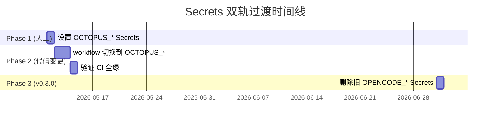

# P5 设计：CI/CD 发布管线 — OpenCode → Octopus 品牌迁移

> **版本**: v0.1.0 | **作者**: platform agent | **日期**: 2026-05-11
> **上游**: P3 分析 `.octopus/research/opencode-to-octopus-rebrand.md` §4 + §5.3
> **范围**: Issue #8 (CI/CD & 脚本 URL 更新) + 按依赖扩至 Docker/Nix/Secrets

---

## 目录

1. [设计概要](#1-设计概要)
2. [GitHub Actions 变更](#2-github-actions-变更)
3. [Secrets 双轨过渡计划](#3-secrets-双轨过渡计划)
4. [发布管线设计](#4-发布管线设计)
5. [Docker 变更](#5-docker-变更)
6. [Nix 变更](#6-nix-变更)
7. [构建产物重命名](#7-构建产物重命名)
8. [执行计划](#8-执行计划)

---

## 1. 设计概要

### 1.1 现状

现有 CI/CD 体系包含 **27 个 GitHub Actions workflow**，3 个直接受品牌迁移影响（`opencode.yml`、`publish.yml`、`stats.yml`），其他 24 个间接受 Secrets 和 Action 引用变化影响。

发布管线覆盖 8 个分发渠道：
| 渠道 | 当前名称 | 目标名称 |
|------|---------|---------|
| npm | `opencode-ai` / `@opencode-ai/*` | `@octopus-ai/octopus` / `@octopus-ai/*` |
| AUR | `opencode-bin` | `octopus-bin` |
| Homebrew | `opencode` | `octopus` |
| Docker | `ghcr.io/anomalyco/opencode` | `ghcr.io/anomalyco/octopus` |
| VS Code 扩展 | `opencode` | `octopus` |
| Zed 扩展 | `opencode` | `octopus` |
| GitHub Action | `anomalyco/opencode/github@latest` | `anomalyco/octopus/github@latest` |
| Chocolatey | 尚未发布 | `octopus` |

### 1.2 设计原则

1. **双轨过渡**: Secrets 和环境变量新旧并存，CI 绿色优先
2. **自底向上发布**: 按依赖拓扑顺序发布 npm 包（core → sdk → ui → plugin → app → octopus）
3. **向后兼容**: 保留旧渠道的 deprecation 消息，引导用户迁移
4. **自动化验证**: 每个阶段有验证门控，防止遗漏

---

## 2. GitHub Actions 变更

### 2.1 文件重命名

| 当前文件名     | 新文件名      | 理由               |
| -------------- | ------------- | ------------------ |
| `opencode.yml` | `octopus.yml` | 文件名含品牌名     |
| 其余 26 个文件 | 保持不变      | 文件名不包含品牌名 |

### 2.2 仓库路径引用变更

所有 `anomalyco/opencode` 引用在 3 个 workflow 中出现 7 处：

**`opencode.yml`** (重命名为 `octopus.yml`):

```yaml
# 变更前
uses: anomalyco/opencode/github@latest
OPENCODE_API_KEY: ${{ secrets.OPENCODE_API_KEY }}

# 变更后
uses: anomalyco/octopus/github@latest
OCTOPUS_API_KEY: ${{ secrets.OCTOPUS_API_KEY }}
```

**`publish.yml`** (4 处):

```yaml
# 变更前
if: github.repository == 'anomalyco/opencode'
GH_REPO: ${{ (github.ref_name == 'beta' && 'anomalyco/opencode-beta') || github.repository }}

# 变更后
if: github.repository == 'anomalyco/octopus'
GH_REPO: ${{ (github.ref_name == 'beta' && 'anomalyco/octopus-beta') || github.repository }}
```

**`stats.yml`** (1 处):

```yaml
# 变更前
if: github.repository == 'anomalyco/opencode'

# 变更后
if: github.repository == 'anomalyco/octopus'
```

### 2.3 Action 引用变更

**`docs-update.yml`**:

```yaml
# 变更前
uses: sst/opencode/github@latest

# 变更后
uses: anomalyco/octopus/github@latest
```

### 2.4 邮件地址变更

3 个 workflow 中涉及 git config email:

| 文件                            | 变更前             | 变更后            |
| ------------------------------- | ------------------ | ----------------- |
| `publish.yml` L476              | `opencode@sst.dev` | `octopus@sst.dev` |
| `release-github-action.yml` L27 | `opencode@sst.dev` | `octopus@sst.dev` |
| `publish-github-action.yml` L27 | `opencode@sst.dev` | `octopus@sst.dev` |

### 2.5 env 变量引用变更

**`publish.yml`** build-electron job:

```yaml
# 变更前
OPENCODE_CLI_ARTIFACT: ${{ (runner.os == 'Windows' && 'opencode-cli-windows') || 'opencode-cli' }}
# 变更后
OCTOPUS_CLI_ARTIFACT: ${{ (runner.os == 'Windows' && 'octopus-cli-windows') || 'octopus-cli' }}
```

### 2.6 CI 触发保护

重命名 `opencode.yml` → `octopus.yml` 后需确认：

1. **`on.issue_comment` 触发器**: 不依赖文件名，不受影响
2. **`on.pull_request_review_comment` 触发器**: 同上，不受影响
3. **共享 action 引用**: 其他 workflow 未通过 `uses: ./path/to/workflow` 方式引用此文件

结论：**文件重命名安全**，无外部引用依赖此文件名。

### 2.7 变更清单总表

| #   | Workflow                    | 变更类型      | 变更内容                               |
| --- | --------------------------- | ------------- | -------------------------------------- |
| 1   | `opencode.yml`              | 重命名 + 内容 | → `octopus.yml`, action URL, secrets   |
| 2   | `publish.yml`               | 内容          | repo 检查, email, artifact 名, secrets |
| 3   | `stats.yml`                 | 内容          | repo 检查                              |
| 4   | `docs-update.yml`           | 内容          | action URL, secrets                    |
| 5   | `docs-locale-sync.yml`      | 内容          | secrets (间接)                         |
| 6   | `review.yml`                | 内容          | secrets (间接)                         |
| 7   | `duplicate-issues.yml`      | 内容          | secrets (间接)                         |
| 8   | `triage.yml`                | 内容          | secrets (间接)                         |
| 9   | `beta.yml`                  | 内容          | secrets (间接)                         |
| 10  | `release-github-action.yml` | 内容          | email                                  |
| 11  | `publish-github-action.yml` | 内容          | email                                  |
| 12  | `generate.yml`              | 内容          | setup-git-committer inputs (间接)      |
| 13  | `sync-zed-extension.yml`    | 内容          | setup-git-committer inputs (间接)      |
| 14  | `nix-hashes.yml`            | 内容          | setup-git-committer inputs (间接)      |

---

## 3. Secrets 双轨过渡计划

### 3.1 涉及 Secrets/Variables 清单

#### GitHub Secrets （加密值）

| 当前名                               | 新名                 | 使用 Workflow                                                                            |
| ------------------------------------ | -------------------- | ---------------------------------------------------------------------------------------- |
| `OPENCODE_API_KEY`                   | `OCTOPUS_API_KEY`    | opencode, publish, docs-update, review, duplicate-issues, triage, beta, docs-locale-sync |
| `OPENCODE_APP_SECRET`                | `OCTOPUS_APP_SECRET` | publish, generate, beta, sync-zed, docs-locale-sync, nix-hashes                          |
| `VSCE_PAT`                           | 不变                 | publish-vscode                                                                           |
| `OPENVSX_TOKEN`                      | 不变                 | publish-vscode                                                                           |
| `AZURE_CLIENT_ID`                    | 不变                 | publish                                                                                  |
| `AZURE_TENANT_ID`                    | 不变                 | publish                                                                                  |
| `AZURE_SUBSCRIPTION_ID`              | 不变                 | publish                                                                                  |
| `AZURE_TRUSTED_SIGNING_*`            | 不变                 | publish                                                                                  |
| `APPLE_CERTIFICATE`                  | 不变                 | publish                                                                                  |
| `APPLE_CERTIFICATE_PASSWORD`         | 不变                 | publish                                                                                  |
| `APPLE_API_KEY`                      | 不变                 | publish                                                                                  |
| `APPLE_API_KEY_PATH`                 | 不变                 | publish                                                                                  |
| `APPLE_API_ISSUER`                   | 不变                 | publish                                                                                  |
| `AUR_KEY`                            | 不变                 | publish                                                                                  |
| `TAURI_SIGNING_PRIVATE_KEY`          | 不变                 | publish                                                                                  |
| `TAURI_SIGNING_PRIVATE_KEY_PASSWORD` | 不变                 | publish                                                                                  |
| `CLOUDFLARE_API_TOKEN`               | 不变                 | deploy                                                                                   |
| `PLANETSCALE_SERVICE_TOKEN`          | 不变                 | deploy                                                                                   |
| `STRIPE_SECRET_KEY_*`                | 不变                 | deploy                                                                                   |
| `HONEYCOMB_API_KEY`                  | 不变                 | deploy                                                                                   |
| `SENTRY_AUTH_TOKEN`                  | 不变                 | publish, deploy                                                                          |
| `DISCORD_WEBHOOK`                    | 不变                 | notify-discord                                                                           |
| `ZED_EXTENSIONS_PAT`                 | 不变                 | sync-zed-extension                                                                       |
| `ZED_PR_PAT`                         | 不变                 | sync-zed-extension                                                                       |
| `POSTHOG_KEY`                        | 不变                 | stats                                                                                    |
| `GITHUB_TOKEN`                       | 不变（内置）         | 所有                                                                                     |

#### GitHub Variables （非加密值）

| 当前名                 | 新名             | 使用 Workflow                                                   |
| ---------------------- | ---------------- | --------------------------------------------------------------- |
| `OPENCODE_APP_ID`      | `OCTOPUS_APP_ID` | publish, generate, beta, sync-zed, docs-locale-sync, nix-hashes |
| `SENTRY_ORG`           | 不变             | publish, deploy                                                 |
| `SENTRY_PROJECT`       | 不变             | publish, deploy (web)                                           |
| `WEB_SENTRY_*`         | 不变             | publish, deploy                                                 |
| 其余 OpenCode 相关变量 | 不变             | —                                                               |

### 3.2 双轨过渡方案

**Phase 1 — 设置新 Secrets（v0.1.0 发布前，人工操作）**：

1. 在 GitHub repo Settings → Secrets and variables → Actions 中：
   - 添加 `OCTOPUS_API_KEY`，值与 `OPENCODE_API_KEY` 相同
   - 添加 `OCTOPUS_APP_ID`，值与 `OPENCODE_APP_ID` 相同
   - 添加 `OCTOPUS_APP_SECRET`，值与 `OPENCODE_APP_SECRET` 相同
2. 保留所有 `OPENCODE_*` Secrets 不变

**Phase 2 — 代码切换到新名（v0.1.0 代码变更）**：

所有 workflow 中的 `secrets.OPENCODE_*` 引用改为 `secrets.OCTOPUS_*`，`vars.OPENCODE_*` 改为 `vars.OCTOPUS_*`。

**Phase 3 — 清理旧 Secrets（v0.3.0）**：

2 个 minor 版本后，确认双读兼容层已移除，删除所有 `OPENCODE_*` Secrets。

### 3.3 setup-git-committer Action 升级

`setup-git-committer` action 的 inputs 名称需要更新以反映新品牌：

```yaml
# action.yml inputs - 变更前
opencode-app-id:
  description: "OpenCode GitHub App ID"
opencode-app-secret:
  description: "OpenCode GitHub App private key"

# action.yml inputs - 变更后
octopus-app-id:
  description: "Octopus GitHub App ID"
octopus-app-secret:
  description: "Octopus GitHub App private key"
```

所有调用此 action 的 workflow 需同步更新 inputs 名称。

### 3.4 过渡期间 CI 绿色保障



**关键规则**:

- Phase 1 (设置新 Secrets) **必须先于** Phase 2 (代码变更) 完成
- 新旧 Secrets 在 Phase 2 期间**同时有效**
- 验证 CI 绿色后才能合并 PR

---

## 4. 发布管线设计

### 4.1 发布拓扑

```
npm 包发布顺序（自底向上）:
  @octopus-ai/script ──→ @octopus-ai/core ──→ @octopus-ai/sdk/js
                                                   ├── @octopus-ai/ui
                                                   ├── @octopus-ai/plugin
                                                   └── @octopus-ai/app
                                                          │
                                                  ┌───────┘
                                                  ↓
                                            @octopus-ai/octopus (主 CLI)
                                                  │
                                     ┌────────────┼────────────┐
                                     ↓            ↓            ↓
                                   Docker      AUR/Homebrew  Zed 扩展
                                                  ↓
                                            VS Code 扩展
```

### 4.2 主发布管线 (`publish.yml` → `release.yml`)

**建议重命名**: `publish.yml` → `release.yml`（可选，当前文件名无品牌名，可保留）

**流程设计**:

```
Job: version
  ├─ 版本号计算 (./script/version.ts)
  ├─ 创建 GitHub Release (draft)
  └─ 输出: version, tag, release_id, repo

Job: build-cli
  ├─ 依赖: version
  ├─ 执行: ./packages/octopus/script/build.ts
  ├─ 产物: octopus-cli (linux/darwin), octopus-cli-windows
  └─ upload-artifact: octopus-cli / octopus-cli-windows

Job: sign-cli-windows
  ├─ 依赖: build-cli, version
  ├─ Azure 签名 + 重新打包 zip
  └─ upload-artifact: octopus-cli-signed-windows

Job: build-electron
  ├─ 依赖: build-cli, version
  ├─ 矩阵: 6 平台 (mac x64/arm64, win x64/arm64, linux x64/arm64)
  ├─ electron-builder 打包
  └─ upload-artifact: octopus-desktop-{target}

Job: publish (final)
  ├─ 依赖: version, build-cli, sign-cli-windows, build-electron
  ├─ 步骤:
  │   1. npm publish @octopus-ai/core, sdk, ui, plugin, app
  │   2. npm publish @octopus-ai/octopus
  │   3. Docker build & push ghcr.io/anomalyco/octopus
  │   4. AUR push octopus-bin (via SSH)
  │   5. Homebrew bump octopus formula (via anomalyco/homebrew-tap)
  │   6. 上传 release assets (CLI 二进制)
  │   7. 发布 GitHub Release (draft → public)
  └─ 通知: Discord webhook
```

### 4.3 npm 发布策略

| 包名                  | 当前 scope     | 新 scope              | 发布方式             |
| --------------------- | -------------- | --------------------- | -------------------- |
| `@opencode-ai/script` | `@opencode-ai` | `@octopus-ai/script`  | 自底向上，按依赖顺序 |
| `@opencode-ai/core`   | `@opencode-ai` | `@octopus-ai/core`    | 依赖 script          |
| `@opencode-ai/sdk`    | `@opencode-ai` | `@octopus-ai/sdk`     | 依赖 core            |
| `@opencode-ai/ui`     | `@opencode-ai` | `@octopus-ai/ui`      | 依赖 sdk             |
| `@opencode-ai/plugin` | `@opencode-ai` | `@octopus-ai/plugin`  | 依赖 sdk             |
| `@opencode-ai/app`    | `@opencode-ai` | `@octopus-ai/app`     | 依赖 sdk             |
| `opencode` (CLI)      | —              | `@octopus-ai/octopus` | 依赖以上所有         |

**过渡发布**:

- 在旧包 `@opencode-ai/*` 上发布 deprecation 版本
- `npm deprecate @opencode-ai/core@"<2.0.0" "@opencode-ai/core is now @octopus-ai/core"`

### 4.4 各渠道发布命令变更

**Docker** (`packages/octopus/script/publish.ts`):

```typescript
// 变更前
const image = "ghcr.io/anomalyco/opencode"
// 变更后
const image = "ghcr.io/anomalyco/octopus"
```

**AUR** (同上文件):

```typescript
// 变更前
pkgname = "opencode-bin"
// 变更后
pkgname = "octopus-bin"

// 变更前
source_aarch64 = ".../opencode-linux-arm64.tar.gz"
// 变更后
source_aarch64 = ".../octopus-linux-arm64.tar.gz"

// 变更前
provides = "opencode"
conflicts = "opencode"
// 变更后
provides = "octopus"
conflicts = "octopus"
```

**Homebrew** (同上文件):

```ruby
# 变更前
class Opencode < Formula
  url "https://github.com/anomalyco/opencode/releases/download/v${Script.version}/opencode-darwin-x64.zip"
# 变更后
class Octopus < Formula
  url "https://github.com/anomalyco/octopus/releases/download/v${Script.version}/octopus-darwin-x64.zip"
```

### 4.5 VS Code 扩展发布

`sdks/vscode/script/publish`:

```bash
# 变更前
vsce package ... -o dist/opencode.vsix "$version"
# 变更后
vsce package ... -o dist/octopus.vsix "$version"
```

### 4.6 Zed 扩展发布

`sync-zed-extension.yml` 中的 `./script/sync-zed.ts` 将在其自身的 rebrand (Issue #7) 中处理 extension.toml 变更。CI 方面只需确保：

- 发布触发器（`release: [published]`）正常工作
- Secrets（`ZED_EXTENSIONS_PAT`, `ZED_PR_PAT`）不变

### 4.7 GitHub Action 发布

`release-github-action.yml` 和 `publish-github-action.yml` 需要：

1. 更新 git config email → `octopus@sst.dev`
2. `github/` 目录下的 action 代码在 Issue #1 (scope) 中处理品牌引用
3. `github/script/publish` 本身无品牌引用，只需确保 tag 命名一致

### 4.8 Chocolatey 发布（新增）

根据 P3 分析的发布清单，Chocolatey `octopus` 包尚不存在。此版本暂不启用 Chocolatey 发布，留待 v0.2.0 增设。

---

## 5. Docker 变更

### 5.1 CLI Dockerfile (`packages/octopus/Dockerfile`)

```dockerfile
# 变更前
COPY dist/opencode-linux-x64-baseline-musl/bin/opencode /usr/local/bin/opencode
COPY dist/opencode-linux-arm64-musl/bin/opencode /usr/local/bin/opencode
RUN opencode --version
ENTRYPOINT ["opencode"]

# 变更后
COPY dist/octopus-linux-x64-baseline-musl/bin/octopus /usr/local/bin/octopus
COPY dist/octopus-linux-arm64-musl/bin/octopus /usr/local/bin/octopus
RUN octopus --version
ENTRYPOINT ["octopus"]
```

### 5.2 Container 构建脚本 (`packages/containers/script/build.ts`)

```typescript
// 变更前
const reg = process.env.REGISTRY ?? "ghcr.io/anomalyco"
const list = await $`docker buildx ls`.text()
if (list.includes("opencode")) {
  await $`docker buildx use opencode`
  return
}
await $`docker buildx create --name opencode --use`

// 变更后
const reg = process.env.REGISTRY ?? "ghcr.io/anomalyco"
const list = await $`docker buildx ls`.text()
if (list.includes("octopus")) {
  await $`docker buildx use octopus`
  return
}
await $`docker buildx create --name octopus --use`
```

### 5.3 Container Dockerfiles

`packages/containers/*/Dockerfile` 文件内容无品牌引用，不需修改。它们只是构建环境的 base image 定义。

### 5.4 Docker 镜像清单

| 镜像        | 当前名                                | 新名                        | 修改位置                                         |
| ----------- | ------------------------------------- | --------------------------- | ------------------------------------------------ |
| CLI         | `ghcr.io/anomalyco/opencode`          | `ghcr.io/anomalyco/octopus` | `packages/octopus/script/publish.ts`             |
| base        | `ghcr.io/anomalyco/build/base`        | 不变                        | `packages/containers/script/build.ts` (registry) |
| bun-node    | `ghcr.io/anomalyco/build/bun-node`    | 不变                        | 同上                                             |
| rust        | `ghcr.io/anomalyco/build/rust`        | 不变                        | 同上                                             |
| tauri-linux | `ghcr.io/anomalyco/build/tauri-linux` | 不变                        | 同上                                             |
| publish     | `ghcr.io/anomalyco/build/publish`     | 不变                        | 同上                                             |

> 容器构建镜像（`build/` 子命名空间）属于内部 CI 基础设施，不对外发布，不需要重命名。

---

## 6. Nix 变更

### 6.1 `flake.nix`

```nix
# 变更前
description = "OpenCode development flake";
opencode = final.callPackage ./nix/opencode.nix { ... };
desktop = final.callPackage ./nix/desktop.nix { inherit opencode; };
inherit opencode;
opencode-desktop = desktop;
default = opencode;

# 变更后
description = "Octopus development flake";
octopus = final.callPackage ./nix/octopus.nix { ... };
desktop = final.callPackage ./nix/desktop.nix { inherit octopus; };
inherit octopus;
octopus-desktop = desktop;
default = octopus;
```

### 6.2 `nix/opencode.nix` → `nix/octopus.nix`

**文件重命名**: `nix/opencode.nix` → `nix/octopus.nix`

```nix
# 变更前
pname = "opencode";
mainProgram = "opencode";
homepage = "https://opencode.ai/";
env.OPENCODE_DISABLE_MODELS_FETCH = true;
env.OPENCODE_VERSION = finalAttrs.version;
env.OPENCODE_CHANNEL = "local";
bun --bun ./script/build.ts --single --skip-install
outfile: `dist/${name}/bin/opencode`,
install -Dm755 dist/opencode-*/bin/opencode $out/bin/opencode
install -Dm644 schema.json $out/share/opencode/schema.json
installShellCompletion --cmd opencode \
  --bash <($out/bin/opencode completion) \
  --zsh <(SHELL=/bin/zsh $out/bin/opencode completion)

# 变更后
pname = "octopus";
mainProgram = "octopus";
homepage = "https://octopus.ai/";
env.OCTOPUS_DISABLE_MODELS_FETCH = true;
env.OCTOPUS_VERSION = finalAttrs.version;
env.OCTOPUS_CHANNEL = "local";
bun --bun ./script/build.ts --single --skip-install
outfile: `dist/${name}/bin/octopus`,
install -Dm755 dist/octopus-*/bin/octopus $out/bin/octopus
install -Dm644 schema.json $out/share/octopus/schema.json
installShellCompletion --cmd octopus \
  --bash <($out/bin/octopus completion) \
  --zsh <(SHELL=/bin/zsh $out/bin/octopus completion)
```

### 6.3 `nix/desktop.nix`

```nix
# 变更前
pname = "opencode-desktop";
inherit (opencode) version src node_modules ...;
cp ${opencode}/bin/opencode packages/desktop/src-tauri/sidecars/opencode-cli-${rustTarget}
mv $out/bin/OpenCode $out/bin/opencode-desktop
sed -i 's|^Exec=OpenCode$|Exec=opencode-desktop|' $out/share/applications/OpenCode.desktop
homepage = "https://opencode.ai";
mainProgram = "opencode-desktop";

# 变更后
pname = "octopus-desktop";
inherit (octopus) version src node_modules ...;
cp ${octopus}/bin/octopus packages/desktop/src-tauri/sidecars/octopus-cli-${rustTarget}
mv $out/bin/OpenCode $out/bin/octopus-desktop
sed -i 's|^Exec=OpenCode$|Exec=octopus-desktop|' $out/share/applications/OpenCode.desktop
homepage = "https://octopus.ai";
mainProgram = "octopus-desktop";
```

### 6.4 `nix/node_modules.nix`

```nix
# 变更前
pname = "opencode-node_modules";
../packages/octopus/package.json
../.github/TEAM_MEMBERS # required by @opencode-ai/script

# 变更后
pname = "octopus-node_modules";
../packages/octopus/package.json
../.github/TEAM_MEMBERS # required by @octopus-ai/script
```

### 6.5 `nix-eval.yml` workflow 更新

```yaml
# 变更前
PACKAGES="opencode"
OPTIONAL_PACKAGES="desktop"

# 变更后
PACKAGES="octopus"
OPTIONAL_PACKAGES="desktop"
```

### 6.6 Nix 变更文件总表

| 文件                   | 变更类型                              | 关键变更                    |
| ---------------------- | ------------------------------------- | --------------------------- |
| `flake.nix`            | 内容                                  | description, package 属性名 |
| `nix/opencode.nix`     | **重命名** → `nix/octopus.nix` + 内容 | pname, env vars, paths      |
| `nix/desktop.nix`      | 内容                                  | pname, binary refs          |
| `nix/node_modules.nix` | 内容                                  | pname, package.json path    |

---

## 7. 构建产物重命名

### 7.1 自动推导的产物名

`packages/octopus/script/build.ts` 中的产物名由 `pkg.name` (package.json 中的 `"name"` 字段) 自动推导：

```typescript
const name = [
  pkg.name, // ← "opencode" → "octopus" (after package.json rename)
  item.os === "win32" ? "windows" : item.os,
  item.arch,
  item.avx2 === false ? "baseline" : undefined,
  item.abi === undefined ? undefined : item.abi,
]
  .filter(Boolean)
  .join("-")
```

当 `packages/octopus/package.json` 中的 `"name"` 字段从 `"opencode"` 改为 `"octopus"` (Issue #1)，所有产物名称自动生效：

| 平台             | 旧名                               | 新名                              |
| ---------------- | ---------------------------------- | --------------------------------- |
| macOS x64        | `opencode-darwin-x64.zip`          | `octopus-darwin-x64.zip`          |
| macOS arm64      | `opencode-darwin-arm64.zip`        | `octopus-darwin-arm64.zip`        |
| Linux x64        | `opencode-linux-x64.tar.gz`        | `octopus-linux-x64.tar.gz`        |
| Linux arm64      | `opencode-linux-arm64.tar.gz`      | `octopus-linux-arm64.tar.gz`      |
| Linux x64 musl   | `opencode-linux-x64-musl.tar.gz`   | `octopus-linux-x64-musl.tar.gz`   |
| Linux arm64 musl | `opencode-linux-arm64-musl.tar.gz` | `octopus-linux-arm64-musl.tar.gz` |
| Windows x64      | `opencode-windows-x64.zip`         | `octopus-windows-x64.zip`         |
| Windows arm64    | `opencode-windows-arm64.zip`       | `octopus-windows-arm64.zip`       |

### 7.2 手动设置的产物名

**`publish.yml`** 中的 upload-artifact 名称需要手动更新：

| 当前 artifact name            | 新 artifact name             |
| ----------------------------- | ---------------------------- |
| `opencode-cli`                | `octopus-cli`                |
| `opencode-cli-windows`        | `octopus-cli-windows`        |
| `opencode-cli-signed-windows` | `octopus-cli-signed-windows` |
| `opencode-desktop-{target}`   | `octopus-desktop-{target}`   |
| `latest-yml-{target}`         | `latest-yml-{target}` (不变) |

**`publish.yml` sign-cli-windows 步骤**中的文件名：

```powershell
# 变更前
Compress-Archive -Path "opencode-windows-arm64\bin\*" -DestinationPath "opencode-windows-arm64.zip"
# 变更后
Compress-Archive -Path "octopus-windows-arm64\bin\*" -DestinationPath "octopus-windows-arm64.zip"
```

### 7.3 electron-builder 产物

`publish.yml` build-electron 步骤中的 `.app.tar.gz`:

```bash
# 变更前
OUT_NAME="opencode-desktop-mac-x64.app.tar.gz"
OUT_NAME="opencode-desktop-mac-arm64.app.tar.gz"
# 变更后
OUT_NAME="octopus-desktop-mac-x64.app.tar.gz"
OUT_NAME="octopus-desktop-mac-arm64.app.tar.gz"
```

### 7.4 `gh release upload` 命令

`packages/octopus/script/build.ts` 中的 release upload 由于使用 glob `./dist/*.zip ./dist/*.tar.gz`，在产物名自动变更后无需修改 glob。

### 7.5 二进制产物内 Binary 名

`packages/octopus/script/build.ts` 中的二进制输出名称是硬编码的：

```typescript
// 变更前
outfile: `dist/${name}/bin/opencode`,
execArgv: [`--user-agent=opencode/${Script.version}`, ...],
define: { OPENCODE_VERSION: ..., OPENCODE_CHANNEL: ... }

// 变更后
outfile: `dist/${name}/bin/octopus`,
execArgv: [`--user-agent=octopus/${Script.version}`, ...],
define: { OCTOPUS_VERSION: ..., OCTOPUS_CHANNEL: ... }
```

### 7.6 Smoke test binary path

```typescript
// 变更前
const binaryPath = `dist/${name}/bin/opencode`
// 变更后
const binaryPath = `dist/${name}/bin/octopus`
```

### 7.7 产物重命名变更总表

| 位置                           | 变更前                   | 变更后                  |     自动/手动      |
| ------------------------------ | ------------------------ | ----------------------- | :----------------: |
| build.ts (目录/archive)        | `pkg.name` → `opencode`  | `pkg.name` → `octopus`  | **自动** (依赖 #1) |
| build.ts (outfile)             | `bin/opencode`           | `bin/octopus`           |        手动        |
| build.ts (execArgv)            | `opencode/${version}`    | `octopus/${version}`    |        手动        |
| build.ts (define)              | `OPENCODE_*`             | `OCTOPUS_*`             |        手动        |
| build.ts (smoke test)          | `bin/opencode`           | `bin/octopus`           |        手动        |
| publish.yml (artifact upload)  | `opencode-cli`           | `octopus-cli`           |        手动        |
| publish.yml (artifact upload)  | `opencode-desktop-*`     | `octopus-desktop-*`     |        手动        |
| publish.yml (compress-archive) | `opencode-windows-*`     | `octopus-windows-*`     |        手动        |
| publish.yml (desktop tar.gz)   | `opencode-desktop-mac-*` | `octopus-desktop-mac-*` |        手动        |
| publish.yml (env var)          | `OPENCODE_CLI_ARTIFACT`  | `OCTOPUS_CLI_ARTIFACT`  |        手动        |

---

## 8. 执行计划

### 8.1 依赖关系

```
#1 (npm scope) ──→ #2 (dir rename) ──→ #8 (CI/CD)
                                              │
                     ┌────────────────────────┤
                     ↓                        ↓
               workflow 变更          脚本/产物/Docker/Nix
               (可并行)               (可并行)
```

**关键**: Issue #1 (npm scope rename) 和 Issue #2 (dir rename) 必须先于 #8 完成。

### 8.2 执行序列

```
Phase 1: 基础依赖
  1.1 [core-dev] Issue #1 — npm scope @opencode-ai → @octopus-ai
  1.2 [core-dev] Issue #2 — packages/opencode → packages/octopus
  ─── 门控: bun install + typecheck 通过 ───

Phase 2: CI/CD 变更 (Group 2C, platform agent)
  2.1 Secrets 设置（人工）
      - 在 GitHub Settings 添加 OCTOPUS_API_KEY, OCTOPUS_APP_ID, OCTOPUS_APP_SECRET
      - 保留 OPENCODE_* 暂不删除
  2.2 Workflow 文件变更 (13 个文件内容 + 1 个重命名)
  2.3 发布脚本更新 (script/publish.ts, packages/octopus/script/publish.ts)
  2.4 构建脚本更新 (packages/octopus/script/build.ts)
  2.5 Docker 文件更新 (Dockerfile, containers/script/build.ts)
  2.6 Nix 文件更新 (flake.nix, nix/opencode.nix, nix/desktop.nix, nix/node_modules.nix)
  2.7 产物名统一 (artifact upload, compress-archive, electron tar.gz)
  ─── 门控: CI 全绿 + grep 'opencode' .github/ 零结果 ───
```

### 8.3 验证门控

执行 `script/verify-rebrand.ts` 的 Issue #8 验证项：

| 验证项          | 命令                                                         | 预期   |
| --------------- | ------------------------------------------------------------ | ------ |
| CI 仓库引用残留 | `grep 'anomalyco/opencode' .github/`                         | 零结果 |
| 产物名残留      | `rg 'opencode-darwin' packages/octopus/script/`              | 零结果 |
| 二进制名残留    | `rg '/bin/opencode' packages/octopus/script/build.ts`        | 零结果 |
| email 残留      | `rg 'opencode@sst.dev' .github/`                             | 零结果 |
| Docker 镜像名   | `rg 'anomalyco/opencode' packages/octopus/script/publish.ts` | 零结果 |
| Nix pname       | `rg 'pname = "opencode"' nix/`                               | 零结果 |

### 8.4 回退方案

若 CI 在 Phase 2 后出现红色：

1. 检查 Secrets 是否已设置（最常见的失败原因）
2. 检查 `OCTOPUS_*` env var 是否在 workflow 中正确传递
3. 检查 setup-git-committer inputs 名是否与 action.yml 一致
4. 如无法快速修复，可临时回退到 `OPENCODE_*` 引用（保留双轨）

---

## 附录 A: 变更文件完整清单

| #   | 文件                                             |    状态    | 主要变更                                     |
| --- | ------------------------------------------------ | :--------: | -------------------------------------------- |
| 1   | `.github/workflows/opencode.yml`                 | **重命名** | → `octopus.yml`; action URL, secrets         |
| 2   | `.github/workflows/publish.yml`                  |    内容    | repo check, email, artifact names            |
| 3   | `.github/workflows/stats.yml`                    |    内容    | repo check                                   |
| 4   | `.github/workflows/docs-update.yml`              |    内容    | action URL, secrets                          |
| 5   | `.github/workflows/beta.yml`                     |    内容    | setup-git-committer inputs                   |
| 6   | `.github/workflows/generate.yml`                 |    内容    | setup-git-committer inputs                   |
| 7   | `.github/workflows/sync-zed-extension.yml`       |    内容    | setup-git-committer inputs                   |
| 8   | `.github/workflows/docs-locale-sync.yml`         |    内容    | setup-git-committer inputs                   |
| 9   | `.github/workflows/release-github-action.yml`    |    内容    | email                                        |
| 10  | `.github/workflows/publish-github-action.yml`    |    内容    | email                                        |
| 11  | `.github/workflows/review.yml`                   |    内容    | secrets (间接)                               |
| 12  | `.github/workflows/duplicate-issues.yml`         |    内容    | secrets (间接)                               |
| 13  | `.github/workflows/triage.yml`                   |    内容    | secrets (间接)                               |
| 14  | `.github/actions/setup-git-committer/action.yml` |    内容    | inputs rename                                |
| 15  | `script/publish.ts`                              |    内容    | `@opencode-ai/script` → `@octopus-ai/script` |
| 16  | `script/version.ts`                              |    内容    | `@opencode-ai/script`, release notes file    |
| 17  | `packages/octopus/script/build.ts`               |    内容    | binary name, env flags                       |
| 18  | `packages/octopus/script/publish.ts`             |    内容    | Docker image, AUR, Homebrew                  |
| 19  | `packages/octopus/Dockerfile`                    |    内容    | binary path, entrypoint                      |
| 20  | `packages/containers/script/build.ts`            |    内容    | buildx builder name                          |
| 21  | `sdks/vscode/script/publish`                     |    内容    | vsix filename                                |
| 22  | `flake.nix`                                      |    内容    | description, package names                   |
| 23  | `nix/opencode.nix`                               | **重命名** | → `nix/octopus.nix`; pname, env, paths       |
| 24  | `nix/desktop.nix`                                |    内容    | pname, binary refs                           |
| 25  | `nix/node_modules.nix`                           |    内容    | pname, package.json path                     |
| 26  | `.github/workflows/nix-eval.yml`                 |    内容    | package names                                |
| 27  | `.github/workflows/nix-hashes.yml`               |    内容    | setup-git-committer inputs                   |

**总计**: 27 个文件变更 (2 个重命名 + 25 个内容更新)

## 附录 B: Secrets 完整映射

| 当前                  | 新                   |   类型   | 使用范围                          |
| --------------------- | -------------------- | :------: | --------------------------------- |
| `OPENCODE_API_KEY`    | `OCTOPUS_API_KEY`    |  Secret  | 所有 AI agent workflow            |
| `OPENCODE_APP_ID`     | `OCTOPUS_APP_ID`     | Variable | setup-git-committer (all callers) |
| `OPENCODE_APP_SECRET` | `OCTOPUS_APP_SECRET` |  Secret  | setup-git-committer (all callers) |

## 附录 C: 保留不变的项目

以下 CI/CD 相关项明确保留、不做修改：

1. **外部 URL**: `https://opencode.ai/install`, `https://discord.gg/opencode` — 外部服务
2. **Model ID 字符串**: `opencode/claude-opus-4-5`, `opencode/gpt-5.2` — 外部模型路由
3. **第三方前缀**: `@opentui/*`, `OTEL_*`, `@openauthjs/*`
4. **Chocolatey**: 当前无发布配置，暂不新增
5. **Sentry 配置**: `SENTRY_ORG`, `SENTRY_PROJECT`, `SENTRY_*` — 非品牌相关
6. **Azure signing**: `AZURE_*` secrets — 非品牌相关
7. **Apple signing**: `APPLE_*` secrets — 非品牌相关
