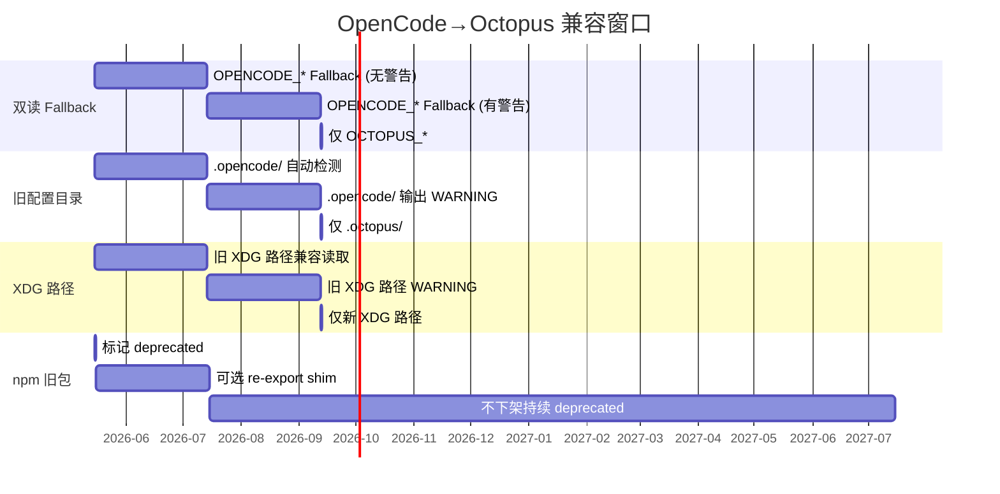

# P5 兼容策略设计：OpenCode → Octopus 品牌迁移

> **版本**: v0.1.0 | **变更级别**: XL | **日期**: 2026-05-11
> **上游**: `.octopus/research/opencode-to-octopus-rebrand.md` §5.3
> **版本计划**: `.octopus/version-plans/v0.1.0.md`
> **实现**: P6 (compat) | **验证**: P7 (compat + qa)

---

## 目录

1. [环境变量双读 Fallback](#1-环境变量双读-fallback)
2. [`octopus migrate` 命令](#2-octopus-migrate-命令)
3. [CLI Alias 策略](#3-cli-alias-策略)
4. [npm Deprecation 计划](#4-npm-deprecation-计划)
5. [XDG 配置检测与迁移](#5-xdg-配置检测与迁移)
6. [兼容窗口时间线](#6-兼容窗口时间线)

---

## 1. 环境变量双读 Fallback

### 1.1 设计目标

所有 `OPENCODE_*` 环境变量在 `v0.1.0`–`v0.2.0` 期间仍然生效，用户无需立即修改 shell profile / CI secrets / `.env` 文件。读取时优先检查 `OCTOPUS_*`，不存在则回退到 `OPENCODE_*`，同时输出一次 deprecation WARNING。

### 1.2 变量映射表

以下映射覆盖 `packages/core/src/flag/flag.ts` 中全部 ~50 个 `OPENCODE_*` 变量。排除了内部运行时变量（`OPENCODE_PID`, `OPENCODE` 等直接 `process.env` 设置项）和 `OTEL_*` 前缀变量。

```typescript
// packages/core/src/flag/env-map.ts
// Mapping table: OCTOPUS_* → OPENCODE_* fallback
export const ENV_MAP: Record<string, string | undefined> = {
  OCTOPUS_AUTO_SHARE: "OPENCODE_AUTO_SHARE",
  OCTOPUS_AUTO_HEAP_SNAPSHOT: "OPENCODE_AUTO_HEAP_SNAPSHOT",
  OCTOPUS_GIT_BASH_PATH: "OPENCODE_GIT_BASH_PATH",
  OCTOPUS_CONFIG: "OPENCODE_CONFIG",
  OCTOPUS_CONFIG_CONTENT: "OPENCODE_CONFIG_CONTENT",
  OCTOPUS_DISABLE_AUTOUPDATE: "OPENCODE_DISABLE_AUTOUPDATE",
  OCTOPUS_ALWAYS_NOTIFY_UPDATE: "OPENCODE_ALWAYS_NOTIFY_UPDATE",
  OCTOPUS_DISABLE_PRUNE: "OPENCODE_DISABLE_PRUNE",
  OCTOPUS_DISABLE_TERMINAL_TITLE: "OPENCODE_DISABLE_TERMINAL_TITLE",
  OCTOPUS_SHOW_TTFD: "OPENCODE_SHOW_TTFD",
  OCTOPUS_PERMISSION: "OPENCODE_PERMISSION",
  OCTOPUS_DISABLE_DEFAULT_PLUGINS: "OPENCODE_DISABLE_DEFAULT_PLUGINS",
  OCTOPUS_DISABLE_LSP_DOWNLOAD: "OPENCODE_DISABLE_LSP_DOWNLOAD",
  OCTOPUS_ENABLE_EXPERIMENTAL_MODELS: "OPENCODE_ENABLE_EXPERIMENTAL_MODELS",
  OCTOPUS_DISABLE_AUTOCOMPACT: "OPENCODE_DISABLE_AUTOCOMPACT",
  OCTOPUS_DISABLE_MODELS_FETCH: "OPENCODE_DISABLE_MODELS_FETCH",
  OCTOPUS_DISABLE_MOUSE: "OPENCODE_DISABLE_MOUSE",
  OCTOPUS_DISABLE_CLAUDE_CODE: "OPENCODE_DISABLE_CLAUDE_CODE",
  OCTOPUS_DISABLE_CLAUDE_CODE_PROMPT: "OPENCODE_DISABLE_CLAUDE_CODE_PROMPT",
  OCTOPUS_DISABLE_CLAUDE_CODE_SKILLS: "OPENCODE_DISABLE_CLAUDE_CODE_SKILLS",
  OCTOPUS_DISABLE_EXTERNAL_SKILLS: "OPENCODE_DISABLE_EXTERNAL_SKILLS",
  OCTOPUS_EXPERIMENTAL_CUSTOMIZE_SKILL: "OPENCODE_EXPERIMENTAL_CUSTOMIZE_SKILL",
  OCTOPUS_FAKE_VCS: "OPENCODE_FAKE_VCS",
  OCTOPUS_SERVER_PASSWORD: "OPENCODE_SERVER_PASSWORD",
  OCTOPUS_SERVER_USERNAME: "OPENCODE_SERVER_USERNAME",
  OCTOPUS_ENABLE_QUESTION_TOOL: "OPENCODE_ENABLE_QUESTION_TOOL",
  OCTOPUS_EXPERIMENTAL: "OPENCODE_EXPERIMENTAL",
  OCTOPUS_EXPERIMENTAL_FILEWATCHER: "OPENCODE_EXPERIMENTAL_FILEWATCHER",
  OCTOPUS_EXPERIMENTAL_DISABLE_FILEWATCHER: "OPENCODE_EXPERIMENTAL_DISABLE_FILEWATCHER",
  OCTOPUS_EXPERIMENTAL_ICON_DISCOVERY: "OPENCODE_EXPERIMENTAL_ICON_DISCOVERY",
  OCTOPUS_EXPERIMENTAL_DISABLE_COPY_ON_SELECT: "OPENCODE_EXPERIMENTAL_DISABLE_COPY_ON_SELECT",
  OCTOPUS_ENABLE_EXA: "OPENCODE_ENABLE_EXA",
  OCTOPUS_EXPERIMENTAL_BASH_DEFAULT_TIMEOUT_MS: "OPENCODE_EXPERIMENTAL_BASH_DEFAULT_TIMEOUT_MS",
  OCTOPUS_EXPERIMENTAL_OUTPUT_TOKEN_MAX: "OPENCODE_EXPERIMENTAL_OUTPUT_TOKEN_MAX",
  OCTOPUS_EXPERIMENTAL_OXFMT: "OPENCODE_EXPERIMENTAL_OXFMT",
  OCTOPUS_EXPERIMENTAL_LSP_TY: "OPENCODE_EXPERIMENTAL_LSP_TY",
  OCTOPUS_EXPERIMENTAL_LSP_TOOL: "OPENCODE_EXPERIMENTAL_LSP_TOOL",
  OCTOPUS_EXPERIMENTAL_PLAN_MODE: "OPENCODE_EXPERIMENTAL_PLAN_MODE",
  OCTOPUS_EXPERIMENTAL_SCOUT: "OPENCODE_EXPERIMENTAL_SCOUT",
  OCTOPUS_EXPERIMENTAL_MARKDOWN: "OPENCODE_EXPERIMENTAL_MARKDOWN",
  OCTOPUS_ENABLE_PARALLEL: "OPENCODE_ENABLE_PARALLEL",
  OCTOPUS_MODELS_URL: "OPENCODE_MODELS_URL",
  OCTOPUS_MODELS_PATH: "OPENCODE_MODELS_PATH",
  OCTOPUS_DISABLE_EMBEDDED_WEB_UI: "OPENCODE_DISABLE_EMBEDDED_WEB_UI",
  OCTOPUS_DB: "OPENCODE_DB",
  OCTOPUS_DISABLE_CHANNEL_DB: "OPENCODE_DISABLE_CHANNEL_DB",
  OCTOPUS_SKIP_MIGRATIONS: "OPENCODE_SKIP_MIGRATIONS",
  OCTOPUS_STRICT_CONFIG_DEPS: "OPENCODE_STRICT_CONFIG_DEPS",
  OCTOPUS_WORKSPACE_ID: "OPENCODE_WORKSPACE_ID",
  OCTOPUS_EXPERIMENTAL_WORKSPACES: "OPENCODE_EXPERIMENTAL_WORKSPACES",
  OCTOPUS_EXPERIMENTAL_EVENT_SYSTEM: "OPENCODE_EXPERIMENTAL_EVENT_SYSTEM",
  OCTOPUS_DISABLE_PROJECT_CONFIG: "OPENCODE_DISABLE_PROJECT_CONFIG",
  OCTOPUS_TUI_CONFIG: "OPENCODE_TUI_CONFIG",
  OCTOPUS_CONFIG_DIR: "OPENCODE_CONFIG_DIR",
  OCTOPUS_PURE: "OPENCODE_PURE",
  OCTOPUS_PLUGIN_META_FILE: "OPENCODE_PLUGIN_META_FILE",
  OCTOPUS_CLIENT: "OPENCODE_CLIENT",
  OCTOPUS_TEST_HOME: "OPENCODE_TEST_HOME",
}
```

### 1.3 `readFromEnv` 辅助函数（核心实现）

`packages/core/src/flag/flag.ts` 中新增 `readFromEnv`，替换所有直接的 `process.env["OPENCODE_*"]` 引用模式。

```typescript
// packages/core/src/flag/flag.ts  — 新增代码块

// ---------------------------------------------------------------------------
// 环境变量双读 Fallback 逻辑
// 优先读 OCTOPUS_*，不存在则回退到 OPENCODE_*，输出一次 deprecation WARNING。
// 警告用 WeakSet 去重，同一变量只警告一次（防止循环读取时刷屏）。
// ---------------------------------------------------------------------------
const warnedDeprecations = new WeakSet<object>()

/**
 * 读取环境变量，OCTOPUS_* 优先，OPENCODE_* 兜底。
 *
 * @param octopusKey - 新环境变量全名（如 "OCTOPUS_CONFIG"）
 * @returns 环境变量值，若两个 key 都不存在则返回 undefined
 */
function readFromEnv(octopusKey: string): string | undefined {
  const value = process.env[octopusKey]
  if (value !== undefined) return value

  const opencodeKey = ENV_MAP[octopusKey]
  if (!opencodeKey) return undefined

  const fallback = process.env[opencodeKey]
  if (fallback !== undefined) {
    // 使用 Symbol 做 key 在环境变量维度去重
    const warnKey = { [opencodeKey]: true }
    if (!warnedDeprecations.has(warnKey)) {
      warnedDeprecations.add(warnKey)
      console.warn(
        `[DEPRECATED] ${opencodeKey} is deprecated. Use ${octopusKey} instead. ` +
        `Support for ${opencodeKey} will be removed in v0.3.0.`
      )
    }
  }
  return fallback
}

/**
 * 读取布尔型环境变量（OCTOPUS_* 优先）。
 * "true" / "1" → true，其他 falsy。
 */
function readTruthyFromEnv(octopusKey: string): boolean {
  const value = readFromEnv(octopusKey)
  return value?.toLowerCase() === "true" || value === "1"
}

/**
 * 读取布尔型环境变量（OCTOPUS_* 优先）。
 * "false" / "0" → false，其他 truthy。
 */
function readFalsyFromEnv(octopusKey: string): boolean {
  const value = readFromEnv(octopusKey)
  return value?.toLowerCase() === "false" || value === "0"
}

/**
 * 读取数值型环境变量（OCTOPUS_* 优先）。
 */
function readNumberFromEnv(octopusKey: string): number | undefined {
  const value = readFromEnv(octopusKey)
  if (!value) return undefined
  const parsed = Number(value)
  return Number.isInteger(parsed) && parsed > 0 ? parsed : undefined
}
```

### 1.4 Flag 对象改造方案

将 `Flag.OPENCODE_*` 属性替换为 `Flag.OCTOPUS_*`，内部使用新的 `readFromEnv` 系列函数。

```typescript
// packages/core/src/flag/flag.ts — 改造后的 Flag 对象（节选）

const UNSTABLE_CHANNELS = new Set(["dev", "beta", "local"])
function unstableDefault(octopusKey: string) {
  return readTruthyFromEnv(octopusKey) || (!readFalsyFromEnv(octopusKey) && UNSTABLE_CHANNELS.has(InstallationChannel))
}

export const Flag = {
  // OTEL_* 前缀变量不变（非品牌相关）
  OTEL_EXPORTER_OTLP_ENDPOINT: process.env["OTEL_EXPORTER_OTLP_ENDPOINT"],
  OTEL_EXPORTER_OTLP_HEADERS: process.env["OTEL_EXPORTER_OTLP_HEADERS"],

  // ---- 品牌迁移后的新属性名 ----
  OCTOPUS_AUTO_SHARE: readTruthyFromEnv("OCTOPUS_AUTO_SHARE"),
  OCTOPUS_AUTO_HEAP_SNAPSHOT: readTruthyFromEnv("OCTOPUS_AUTO_HEAP_SNAPSHOT"),
  OCTOPUS_GIT_BASH_PATH: readFromEnv("OCTOPUS_GIT_BASH_PATH"),
  OCTOPUS_CONFIG: readFromEnv("OCTOPUS_CONFIG"),
  OCTOPUS_CONFIG_CONTENT: readFromEnv("OCTOPUS_CONFIG_CONTENT"),
  OCTOPUS_DISABLE_AUTOUPDATE: readTruthyFromEnv("OCTOPUS_DISABLE_AUTOUPDATE"),
  OCTOPUS_ALWAYS_NOTIFY_UPDATE: readTruthyFromEnv("OCTOPUS_ALWAYS_NOTIFY_UPDATE"),
  OCTOPUS_DISABLE_PRUNE: readTruthyFromEnv("OCTOPUS_DISABLE_PRUNE"),
  OCTOPUS_DISABLE_TERMINAL_TITLE: readTruthyFromEnv("OCTOPUS_DISABLE_TERMINAL_TITLE"),
  OCTOPUS_SHOW_TTFD: readTruthyFromEnv("OCTOPUS_SHOW_TTFD"),
  OCTOPUS_PERMISSION: readFromEnv("OCTOPUS_PERMISSION"),
  OCTOPUS_DISABLE_DEFAULT_PLUGINS: readTruthyFromEnv("OCTOPUS_DISABLE_DEFAULT_PLUGINS"),
  OCTOPUS_DISABLE_LSP_DOWNLOAD: readTruthyFromEnv("OCTOPUS_DISABLE_LSP_DOWNLOAD"),
  OCTOPUS_ENABLE_EXPERIMENTAL_MODELS: readTruthyFromEnv("OCTOPUS_ENABLE_EXPERIMENTAL_MODELS"),
  OCTOPUS_DISABLE_AUTOCOMPACT: readTruthyFromEnv("OCTOPUS_DISABLE_AUTOCOMPACT"),
  OCTOPUS_DISABLE_MODELS_FETCH: readTruthyFromEnv("OCTOPUS_DISABLE_MODELS_FETCH"),
  OCTOPUS_DISABLE_MOUSE: readTruthyFromEnv("OCTOPUS_DISABLE_MOUSE"),

  // 有相互依赖的变量保持逻辑一致
  OCTOPUS_DISABLE_CLAUDE_CODE: readTruthyFromEnv("OCTOPUS_DISABLE_CLAUDE_CODE"),
  OCTOPUS_DISABLE_CLAUDE_CODE_PROMPT:
    Flag.OCTOPUS_DISABLE_CLAUDE_CODE || readTruthyFromEnv("OCTOPUS_DISABLE_CLAUDE_CODE_PROMPT"),
  OCTOPUS_DISABLE_CLAUDE_CODE_SKILLS:
    Flag.OCTOPUS_DISABLE_CLAUDE_CODE || readTruthyFromEnv("OCTOPUS_DISABLE_CLAUDE_CODE_SKILLS"),
  OCTOPUS_DISABLE_EXTERNAL_SKILLS: readTruthyFromEnv("OCTOPUS_DISABLE_EXTERNAL_SKILLS"),

  OCTOPUS_EXPERIMENTAL_CUSTOMIZE_SKILL: unstableDefault("OCTOPUS_EXPERIMENTAL_CUSTOMIZE_SKILL"),
  OCTOPUS_FAKE_VCS: readFromEnv("OCTOPUS_FAKE_VCS"),
  OCTOPUS_SERVER_PASSWORD: readFromEnv("OCTOPUS_SERVER_PASSWORD"),
  OCTOPUS_SERVER_USERNAME: readFromEnv("OCTOPUS_SERVER_USERNAME"),
  OCTOPUS_ENABLE_QUESTION_TOOL: readTruthyFromEnv("OCTOPUS_ENABLE_QUESTION_TOOL"),

  // Experimental
  OCTOPUS_EXPERIMENTAL: readTruthyFromEnv("OCTOPUS_EXPERIMENTAL"),
  OCTOPUS_EXPERIMENTAL_FILEWATCHER: Config.boolean("OCTOPUS_EXPERIMENTAL_FILEWATCHER").pipe(
    Config.withDefault(false),
  ),
  OCTOPUS_EXPERIMENTAL_DISABLE_FILEWATCHER: Config.boolean("OCTOPUS_EXPERIMENTAL_DISABLE_FILEWATCHER").pipe(
    Config.withDefault(false),
  ),

  // ... 其余所有 OCTOPUS_* 属性同理

  // 运行时内部变量 —— 仍直接读 process.env（不双读、不废弃警告）
  get OCTOPUS_DISABLE_PROJECT_CONFIG() {
    return readTruthyFromEnv("OCTOPUS_DISABLE_PROJECT_CONFIG")
  },
  get OCTOPUS_TUI_CONFIG() {
    return readFromEnv("OCTOPUS_TUI_CONFIG")
  },
  get OCTOPUS_CONFIG_DIR() {
    return readFromEnv("OCTOPUS_CONFIG_DIR")
  },
  get OCTOPUS_PURE() {
    return readTruthyFromEnv("OCTOPUS_PURE")
  },
  get OCTOPUS_PLUGIN_META_FILE() {
    return readFromEnv("OCTOPUS_PLUGIN_META_FILE")
  },
  get OCTOPUS_CLIENT() {
    return readFromEnv("OCTOPUS_CLIENT") ?? "cli"
  },
}
```

### 1.5 旧属性名兼容导出

为减少 Issue #3（API 标识符）的改动范围，`Flag` 对象同时保留旧属性名为 deprecated getter：

```typescript
// Flag 对象末尾 — 兼容 getter
// 这些 getter 在 v0.2.0 开始输出 deprecation 警告
// 在 v0.3.0 移除
get OPENCODE_CONFIG()       { return Flag.OCTOPUS_CONFIG }
get OPENCODE_CONFIG_DIR()   { return Flag.OCTOPUS_CONFIG_DIR }
// ... 可选：如果需要逐步迁移调用方代码
```

> **决策**: 不在 Flag 对象上保留旧 `OPENCODE_*` getter。所有消费方代码在 P6 阶段直接改为 `Flag.OCTOPUS_*`。双读 fallback 只在 `process.env` 层面，不在 JS 属性层面。这样避免 `Flag.OPENCODE_*` 在代码库中残留，使 `grep 'Flag\.OPENCODE_'` 可验证零残留。

### 1.6 内部运行时变量（不双读）

以下变量是 CLI 启动时由代码内部设置的，不是用户配置。它们不需要双读 fallback：

| 变量 | 设置位置 | 说明 |
|------|---------|------|
| `process.env.OPENCODE = "1"` | `index.ts:108` | 标记进程身份，改为 `OCTOPUS` |
| `process.env.OPENCODE_PID` | `index.ts:109` | 进程 PID，改为 `OCTOPUS_PID` |
| `process.env.AGENT = "1"` | `index.ts:107` | 不变，非品牌相关 |

```typescript
// packages/octopus/src/index.ts — 启动时设置
process.env.AGENT = "1"
process.env.OCTOPUS = "1"
process.env.OCTOPUS_PID = String(process.pid)
```

### 1.7 Config.boolean() 的 Effect 双读

`packages/core/src/flag/flag.ts` 中有 2 个 `Config.boolean("OPENCODE_*")` 的 Effect 层配置（`OPENCODE_EXPERIMENTAL_FILEWATCHER`, `OPENCODE_EXPERIMENTAL_DISABLE_FILEWATCHER`）。这些不能直接用 `readTruthyFromEnv` 替代，因为它们使用 Effect `Config` 模块。

方案：将 string literal 从 `"OPENCODE_*"` 改为 `"OCTOPUS_*"`。同时通过 Effect Layer 注入双读 fallback：

```typescript
// 改造后
OCTOPUS_EXPERIMENTAL_FILEWATCHER: Config.boolean("OCTOPUS_EXPERIMENTAL_FILEWATCHER").pipe(
  Config.withDefault(false),
),
```

`Config` 的读取不直接走 `process.env`，而是通过 Effect ConfigProvider。默认的 `ConfigProvider.fromEnv()` 读 `process.env`。因此不会自动获得双读 fallback。解决方案：

```typescript
// 在 AppRuntime 的 Layer 中注入自定义 ConfigProvider
// packages/octopus/src/effect/app-runtime.ts
import { ConfigProvider } from "effect"

const DualReadConfigProvider = ConfigProvider.fromEnv().pipe(
  ConfigProvider.mapInput((env) => {
    // 对每个 env key: 如果 OCTOPUS_* 不存在但 OPENCODE_* 存在，映射过来
    for (const [octopusKey, opencodeKey] of Object.entries(ENV_MAP)) {
      if (env[octopusKey] === undefined && env[opencodeKey] !== undefined) {
        env[octopusKey] = env[opencodeKey]
      }
    }
    return env
  }),
)

// 在全局 layer 中使用:
// Layer.setConfigProvider(DualReadConfigProvider)
```

### 1.8 测试策略

```typescript
// packages/core/test/flag/flag.test.ts
import { describe, it, expect } from "bun:test"

describe("readFromEnv dual-read fallback", () => {
  it("reads OCTOPUS_* when set", () => {
    process.env["OCTOPUS_CONFIG"] = "/new/path"
    process.env["OPENCODE_CONFIG"] = "/old/path"
    expect(Flag.OCTOPUS_CONFIG).toBe("/new/path")
  })

  it("falls back to OPENCODE_* when OCTOPUS_* is not set", () => {
    delete process.env["OCTOPUS_CONFIG"]
    process.env["OPENCODE_CONFIG"] = "/old/path"
    expect(Flag.OCTOPUS_CONFIG).toBe("/old/path")
  })

  it("returns undefined when neither is set", () => {
    delete process.env["OCTOPUS_CONFIG"]
    delete process.env["OPENCODE_CONFIG"]
    expect(Flag.OCTOPUS_CONFIG).toBeUndefined()
  })

  it("prefers OCTOPUS_* even when OPENCODE_* is also set", () => {
    process.env["OCTOPUS_DB"] = "octopus.db"
    process.env["OPENCODE_DB"] = "opencode.db"
    expect(Flag.OCTOPUS_DB).toBe("octopus.db")
  })
})
```

---

## 2. `octopus migrate` 命令

### 2.1 命令概述

新增 CLI 命令 `octopus migrate`（和别名 `octopus migration`），负责将用户工作区从旧 OpenCode 品牌自动迁移到 Octopus 品牌。该命令不需要项目实例（`instance: false`），可以在任何目录下执行。

### 2.2 命令注册

```typescript
// packages/octopus/src/cli/cmd/migrate.ts

import { Effect } from "effect"
import { effectCmd, fail } from "@/cli/effect-cmd"
import { MigrateService } from "./migrate/migrate-service"

export const MigrateCommand = effectCmd({
  command: "migrate",
  aliases: ["migration"],
  describe: "Migrate projects and config from OpenCode to Octopus",
  instance: false,
  builder: (yargs) =>
    yargs
      .option("dry-run", {
        type: "boolean",
        describe: "Show what would be migrated without making changes",
        default: false,
      })
      .option("project", {
        type: "string",
        describe: "Path to a specific project directory (default: cwd)",
      })
      .option("all", {
        type: "boolean",
        describe: "Scan and migrate all known config locations",
        default: false,
      })
      .option("yes", {
        type: "boolean",
        describe: "Skip confirmation prompts",
        default: false,
      }),
  handler: (args) =>
    Effect.fn("Cli.migrate")(function* () {
      const dryRun = args.dryRun
      const projectDir = args.project ?? process.cwd()

      // Step 1: Migrate project config directory (.opencode/ → .octopus/)
      yield* MigrateService.migrateProjectConfig({
        directory: projectDir,
        dryRun,
      })

      // Step 2: Migrate XDG config (~/.config/opencode/ → ~/.config/octopus/)
      if (args.all) {
        yield* MigrateService.migrateXdgConfigs({ dryRun })
      }

      // Step 3: Migrate opencode.jsonc → octopus.jsonc
      yield* MigrateService.renameConfigFiles({
        directory: projectDir,
        dryRun,
      })
    }),
})
```

### 2.3 注册到 CLI

```typescript
// packages/octopus/src/index.ts — 添加 MigrateCommand
import { MigrateCommand } from "./cli/cmd/migrate"

// 在 .command() 链中添加
cli
  .command(MigrateCommand)
  // ... 其他命令保持不变
```

### 2.4 迁移服务实现

```typescript
// packages/octopus/src/cli/cmd/migrate/migrate-service.ts
import path from "path"
import fs from "fs/promises"
import { existsSync } from "fs"
import { Effect } from "effect"
import { fail } from "@/cli/effect-cmd"

interface MigrateOpts {
  directory: string
  dryRun: boolean
}

interface XdgMigrateOpts {
  dryRun: boolean
}

export const MigrateService = {
  /**
   * 将 .opencode/ → .octopus/ 迁移
   * 检测条件: .opencode/ 存在且 .octopus/ 不存在
   */
  migrateProjectConfig: Effect.fn("MigrateService.migrateProjectConfig")(function* (opts: MigrateOpts) {
    const oldDir = path.join(opts.directory, ".opencode")
    const newDir = path.join(opts.directory, ".octopus")

    if (!existsSync(oldDir)) {
      return // 没有需要迁移的旧目录
    }
    if (existsSync(newDir)) {
      return // 新目录已存在，跳过
    }

    if (opts.dryRun) {
      console.log(`[dry-run] Would rename: ${oldDir} → ${newDir}`)
      return
    }

    // 执行迁移
    await fs.rename(oldDir, newDir)
    console.log(`Migrated: ${oldDir} → ${newDir}`)

    // 创建迁移标记文件
    const markerDir = path.join(opts.directory, ".opencode")
    await fs.mkdir(markerDir, { recursive: true })
    await fs.writeFile(
      path.join(markerDir, ".migrated-to-octopus"),
      JSON.stringify({
        migratedAt: new Date().toISOString(),
        version: "v0.1.0",
        from: ".opencode/",
        to: ".octopus/",
      }, null, 2),
    )
  }),

  /**
   * 将 opencode.jsonc → octopus.jsonc 重命名
   * 在项目目录和 XDG config 目录下查找
   */
  renameConfigFiles: Effect.fn("MigrateService.renameConfigFiles")(function* (opts: MigrateOpts) {
    const patterns = [
      { old: "opencode.jsonc", new: "octopus.jsonc" },
      { old: "opencode.json", new: "octopus.json" },
    ]

    // 扫描项目目录
    if (opts.dryRun) {
      for (const { old: oldName, new: newName } of patterns) {
        const oldFile = path.join(opts.directory, oldName)
        if (existsSync(oldFile)) {
          console.log(`[dry-run] Would rename: ${oldFile} → ${path.join(opts.directory, newName)}`)
        }
      }
    }
    // 实际重命名同理...
  }),

  /**
   * 迁移 XDG 配置目录:
   * - ~/.config/opencode/  → ~/.config/octopus/
   * - ~/.local/share/opencode/ → ~/.local/share/octopus/
   * - ~/.local/state/opencode/ → ~/.local/state/octopus/
   */
  migrateXdgConfigs: Effect.fn("MigrateService.migrateXdgConfigs")(function* (opts: XdgMigrateOpts) {
    const { xdgConfig, xdgData, xdgState } = yield* getXdgPaths()

    const dirs = [
      { old: path.join(xdgConfig, "opencode"), new: path.join(xdgConfig, "octopus") },
      { old: path.join(xdgData, "opencode"), new: path.join(xdgData, "octopus") },
      { old: path.join(xdgState, "opencode"), new: path.join(xdgState, "octopus") },
    ]

    for (const { old: oldDir, new: newDir } of dirs) {
      if (!existsSync(oldDir)) continue
      if (existsSync(newDir)) {
        console.warn(`Skipping ${oldDir} → ${newDir}: target already exists`)
        continue
      }
      if (opts.dryRun) {
        console.log(`[dry-run] Would rename: ${oldDir} → ${newDir}`)
        continue
      }
      await fs.rename(oldDir, newDir)
      console.log(`Migrated: ${oldDir} → ${newDir}`)
    }
  }),
}

async function getXdgPaths() {
  const { default: xdg } = await import("xdg-basedir")
  return {
    xdgConfig: xdg.xdgConfig ?? path.join(process.env.HOME || "/tmp", ".config"),
    xdgData: xdg.xdgData ?? path.join(process.env.HOME || "/tmp", ".local", "share"),
    xdgState: xdg.xdgState ?? path.join(process.env.HOME || "/tmp", ".local", "state"),
  }
}
```

### 2.5 启动时静默检测

在 CLI 启动时（`index.ts` middlewares 中），添加静默检测逻辑：

```typescript
// packages/octopus/src/index.ts — middleware 中增加
.middleware(async () => {
  // ... 现有逻辑 ...

  // 检测旧配置目录（仅首次、静默）
  if (!Flag.OCTOPUS_DISABLE_MIGRATE_CHECK) {
    await detectAndWarnOldConfig(process.cwd())
  }
})

async function detectAndWarnOldConfig(directory: string) {
  const oldDir = path.join(directory, ".opencode")
  const newDir = path.join(directory, ".octopus")
  if (existsSync(oldDir) && !existsSync(newDir)) {
    console.warn(
      `\n⚠️  Detected legacy .opencode/ directory in ${directory}.\n` +
      `   Run 'octopus migrate' to automatically migrate to .octopus/.\n`
    )
  }
}
```

### 2.6 命令输出示例

```
$ octopus migrate --dry-run
[dry-run] Would rename: /home/user/project/.opencode/ → /home/user/project/.octopus/
[dry-run] Would rename: /home/user/project/opencode.jsonc → /home/user/project/octopus.jsonc
[dry-run] Would rename: ~/.config/opencode/ → ~/.config/octopus/
[dry-run] Would rename: ~/.local/share/opencode/ → ~/.local/share/octopus/

$ octopus migrate --yes
Migrated: /home/user/project/.opencode/ → /home/user/project/.octopus/
Migrated: /home/user/project/opencode.jsonc → /home/user/project/octopus.jsonc
Migrated: ~/.config/opencode/ → ~/.config/octopus/
✅ Migration complete. You can now run 'octopus' instead of 'opencode'.
```

---

## 3. CLI Alias 策略

### 3.1 方案选择

| 方案 | 自动程度 | 风险 | 选择 |
|------|---------|------|:---:|
| 安装脚本注入 shell profile | 全自动 | 可能污染用户 shell 配置，部分用户反感 | ✗ |
| 首次运行检测 argv[0] 并提示 | 半自动，用户可控 | 非侵入式，尊重用户选择 | **✓ 主方案** |
| 在 `octopus migrate` 中可选安装 | 手动 | 用户需主动执行 | **✓ 补充方案** |
| 发行版 package 自动创建 symlink | 自动 | Homebrew/AUR 可管理 | **✓ 包管理器方案** |

### 3.2 主方案：首次运行检测 + 提示

```typescript
// packages/octopus/src/cli/alias.ts
import path from "path"
import fs from "fs"
import os from "os"
import { EOL } from "os"

/**
 * 检测用户是否通过旧命令名调用。
 * 如果是，输出迁移提示并提供 alias 安装建议。
 */
export function checkOpencodeAlias() {
  const argv0 = process.argv[1] ?? ""
  const basename = path.basename(argv0)

  // 通过旧命令名直接调用（如 opencode -> octopus 的 symlink 场景）
  if (basename === "opencode" || basename === "opencode.js") {
    console.warn(
      `\nℹ️  OpenCode has been renamed to Octopus.\n` +
      `   The command is now 'octopus'. The 'opencode' binary will be removed in a future version.\n`
    )
    return
  }

  // 非交互环境（CI、pipe）不弹提示
  if (!process.stdout.isTTY) return
}

/**
 * 可选：将 alias 写入 shell profile。
 * 仅在用户主动请求时执行（如 `octopus migrate --install-alias`）。
 */
export async function installShellAlias(dryRun = false): Promise<string | null> {
  const shell = path.basename(process.env.SHELL ?? "bash")
  const rcFiles: Record<string, string> = {
    bash: "~/.bashrc",
    zsh: "~/.zshrc",
    fish: "~/.config/fish/config.fish",
  }
  const rcFile = rcFiles[shell] ?? "~/.bashrc"
  const expanded = rcFile.replace("~", os.homedir())
  const aliasLine = shell === "fish"
    ? "alias opencode=octopus"
    : "alias opencode=octopus  # opencode → octopus (migrated)"

  if (dryRun) {
    console.log(`[dry-run] Would add to ${expanded}:`)
    console.log(`  ${aliasLine}`)
    return null
  }

  // 检查是否已存在别名
  const content = fs.readFileSync(expanded, "utf-8")
  if (content.includes("# opencode → octopus")) {
    console.log(`Alias already exists in ${expanded}`)
    return null
  }

  fs.appendFileSync(expanded, EOL + aliasLine + EOL)
  console.log(`Added alias to ${expanded}`)
  console.log(`Run 'source ${expanded}' or restart your shell to activate.`)
  return expanded
}
```

### 3.3 发行版包管理方案

各包管理器自动处理 symlink 或别名：

| 包管理器 | 实现方式 |
|---------|---------|
| **Homebrew** | `brew install octopus` 同时创建 `opencode` → `octopus` symlink (使用 `bin.install_symlink`) |
| **AUR** | `PKGBUILD` 中 `provides=('opencode')` + `conflicts=('opencode')` |
| **Chocolatey** | package 自动安装 `opencode` shim 到 `octopus` |
| **npm** | `postinstall` 脚本创建 symlink: `ln -sf octopus opencode` |

Homebrew 示例 (`packages/octopus/script/homebrew.rb`):
```ruby
class Octopus < Formula
  # ...
  def install
    # ... 安装 octopus 二进制 ...
    bin.install_symlink "octopus" => "opencode"  # 过渡期兼容
  end
end
```

### 3.4 不采用的方案

- **全局 npm 包 shim**: 额外维护一个 `opencode` npm 包，仅 re-export `@octopus-ai/octopus`。此方案增加发布复杂度，收益有限（已有 alias）。
- **Docker ENTRYPOINT 包装**: Docker 镜像直接使用 `octopus` 命令，旧名不再维护。

---

## 4. npm Deprecation 计划

### 4.1 涉及包列表

| 旧包名 | 新包名 | 消费者影响 |
|--------|--------|----------|
| `@opencode-ai/core` | `@octopus-ai/core` | SDK 消费者 import 路径变 |
| `@opencode-ai/sdk` | `@octopus-ai/sdk` | SDK 消费者 |
| `@opencode-ai/app` | `@octopus-ai/app` | Console/app 消费者 |
| `@opencode-ai/ui` | `@octopus-ai/ui` | UI 组件消费者 |
| `@opencode-ai/plugin` | `@octopus-ai/plugin` | 插件开发者 |
| `opencode` | `@octopus-ai/octopus` | CLI 消费者 |

### 4.2 第一阶段：Deprecation Message（v0.1.0 发布时）

对每个旧包发布最后一个版本（版本号与新包初始版本一致），标记为 deprecated：

```bash
# 对每个旧包执行
npm deprecate @opencode-ai/core@"<0.2.0" \
  "⚠️ @opencode-ai/core is now @octopus-ai/core. Update your package.json: @octopus-ai/core@^0.1.0"

npm deprecate opencode@"<0.2.0" \
  "⚠️ opencode is now @octopus-ai/octopus. Update: npm install @octopus-ai/octopus"
```

deprecation 消息模板：

```
⚠️  <旧包名> is now <新包名>.

The OpenCode project has been renamed to Octopus.

To update:
  1. Uninstall the old package:  npm uninstall <旧包名>
  2. Install the new package:     npm install <新包名>
  3. Update all imports:          <旧 scope> → <新 scope>

See https://octopus.ai/docs/migration for the full migration guide. 
Support for @opencode-ai/* will be removed on 2026-08-01.
```

### 4.3 第二阶段（可选）：Re-export Shim

如果旧包的下载量较大，可在旧包下发布 re-export 垫片版本，降低消费者摩擦：

```typescript
// @opencode-ai/core 的 re-export shim (package.json)
{
  "name": "@opencode-ai/core",
  "version": "0.1.0-shim.1",
  "deprecated": "This package is now @octopus-ai/core. Please migrate.",
  "main": "node_modules/@octopus-ai/core/dist/index.js",
  "dependencies": {
    "@octopus-ai/core": "^0.1.0"
  },
  // 所有 export 路径作为 peerDependencies 重新暴露
}
```

> **决策**: 初始版本**不发布 re-export shim**。因为：
> 1. monorepo 中有 20+ 包，维护 shim 版本矩阵成本高
> 2. npm deprecation message 已提供明确迁移指引
> 3. 消费者只需 `s/@opencode-ai/@octopus-ai/g` 即可完成迁移
>
> 如果 v0.2.0 时旧包仍有大量下载，可考虑为使用量 Top-3 的包（`@opencode-ai/core`, `@opencode-ai/sdk`, `opencode`）添加 shim。

### 4.4 Deprecation 窗口

```
v0.1.0 发布日: 所有旧包标记 deprecated
v0.2.0 发布日: 可选加入 Top-3 re-export shim
v0.3.0 发布日: 旧包从 npm 设置为 "unpublished" 或继续 deprecated（不下架，防止依赖断裂）
```

---

## 5. XDG 配置检测与迁移

### 5.1 XDG 路径双读 — 核心设计方案

在 `packages/core/src/global.ts` 中，`const app = "opencode"` 决定了所有 XDG 路径。改为 `"octopus"` 后，读取路径和写入路径分离：

```typescript
// packages/core/src/global.ts — 改造后

const app = "octopus"        // 新目录名
const app_legacy = "opencode" // 旧目录名（仅用于检测）

const data = path.join(xdgData!, app)
const cache = path.join(xdgCache!, app)
const config = path.join(xdgConfig!, app)
const state = path.join(xdgState!, app)
const tmp = path.join(os.tmpdir(), app)

// 旧路径（用于 fallback 检测）
const data_legacy = path.join(xdgData!, app_legacy)
const config_legacy = path.join(xdgConfig!, app_legacy)
const state_legacy = path.join(xdgState!, app_legacy)

const paths = {
  get home() {
    return process.env.OCTOPUS_TEST_HOME ?? process.env.OPENCODE_TEST_HOME ?? os.homedir()
  },
  data,
  bin: path.join(cache, "bin"),
  log: path.join(data, "log"),
  repos: path.join(data, "repos"),
  cache,
  config,
  state,
  tmp,
}
```

### 5.2 启动时旧 XDG 路径检测

```typescript
// packages/core/src/global.ts — 末尾新增检测函数

// 标记检查，避免每次启动都重复警告
const XDG_MARKER = ".migrated-xdg"

/**
 * 检测旧的 XDG 配置/数据/状态目录是否存在
 * 仅在新目录不存在、旧目录存在时输出迁移提示
 */
export async function detectLegacyXdgPaths(): Promise<void> {
  const markerFile = path.join(config, XDG_MARKER)

  // 如果新目录已有有效数据（标记文件存在），跳过
  if (existsSync(markerFile)) return

  const legacyDirs = [
    { old: config_legacy, name: "config (~/.config/opencode/)" },
    { old: data_legacy, name: "data (~/.local/share/opencode/)" },
    { old: state_legacy, name: "state (~/.local/state/opencode/)" },
  ]

  const found = legacyDirs.filter(({ old }) => existsSync(old) && old !== config && old !== data && old !== state)
  if (found.length === 0) {
    // 新目录已存在且无旧目录，写入标记避免重复检查
    await fs.writeFile(markerFile, new Date().toISOString(), "utf-8").catch(() => {})
    return
  }

  const dirNames = found.map((d) => d.name).join(", ")
  console.warn(
    `\n⚠️  Detected legacy OpenCode XDG directories: ${dirNames}\n` +
    `   Run 'octopus migrate --all' to migrate them to the new Octopus paths.\n` +
    `   Legacy directories are still readable but will be ignored in v0.3.0.\n`
  )

  // 写入标记（即使未迁移也标记"已提示"）
  await fs.writeFile(markerFile, `prompted at ${new Date().toISOString()}`, "utf-8").catch(() => {})
}
```

### 5.3 旧路径回退读取策略

对于关键文件（数据库、配置），在文件缺失时自动回退到旧路径：

```typescript
// packages/octopus/src/storage/db.ts — 数据库路径检测
function getDbPath(): string {
  const newPath = path.join(Global.Path.data, "octopus.db")
  const oldPath = path.join(data_legacy, "opencode.db")

  if (existsSync(newPath)) return newPath
  if (existsSync(oldPath)) return oldPath
  return newPath // 默认写入新路径
}
```

> **注意**: 这种自动回退只应存在于 `v0.1.0`–`v0.2.0`。`v0.3.0` 移除所有旧路径逻辑。

### 5.4 XDG 迁移服务（被 `octopus migrate --all` 调用）

参见第 2.4 节的 `MigrateService.migrateXdgConfigs()`。该命令负责：

1. 重命名 `~/.config/opencode/` → `~/.config/octopus/`
2. 重命名 `~/.local/share/opencode/` → `~/.local/share/octopus/`
3. 重命名 `~/.local/state/opencode/` → `~/.local/state/octopus/`
4. 在新目录写入标记文件

---

## 6. 兼容窗口时间线

### 6.1 版本对照表

| 版本 | 环境变量 | 配置目录 | `opencode` 命令 | npm 包 | XDG 路径 |
|------|---------|---------|----------------|--------|---------|
| **v0.1.0** (当前) | 双读: `OCTOPUS_*` + `OPENCODE_*` | 新 `.octopus/` + 旧 `.opencode/` 自动检测 | 仍可通过 symlink/alias 使用 | 新 `@octopus-ai/*` deprecate 旧包 | 新路径为主，旧路径自动检测并提示迁移 |
| **v0.2.0** (+2 个月) | 双读 + `OPENCODE_*` 显式 WARNING | 旧目录读取仍支持但输出 WARNING | `opencode` 命令输出 WARNING | 可选 Top-3 re-export shim | 旧路径仍读但输出 WARNING |
| **v0.3.0** (+4 个月) | 仅 `OCTOPUS_*` | 仅 `.octopus/` | `opencode` 不再可用 | 旧包仍 deprecated，不下架 | 仅新路径 |

### 6.2 各版本行为详情

#### v0.1.0（品牌迁移版本）

```
特性:
  ✅ OCTOPUS_* 作为主名称，Flag 属性全部改为 Flag.OCTOPUS_*
  ✅ 双读 Fallback: OPENCODE_* 仍被识别，无警告
  ✅ octopus migrate 命令可用
  ✅ 启动时静默检测 .opencode/ 目录 → 提示执行 migrate
  ✅ 启动时检测旧 XDG 路径 → 提示执行 migrate --all
  ✅ npm 旧包标记 deprecated
  ✅ Homebrew/AUR 等提供 opencode → octopus symlink
  ✅ shell alias 可通过 octopus migrate --install-alias 安装

行为:
  - OPENCODE_* 和 OCTOPUS_* 完全等价（用户无感知）
  - .opencode/ 和 .octopus/ 都会被识别（用户可逐步迁移）
  - 旧 XDG 路径的数据仍可访问（用户数据不丢失）
```

#### v0.2.0（缓冲版本）

```
新增:
  ⚠️ 读取 OPENCODE_* 时输出 deprecation WARNING（stderr）
  ⚠️ 读取 .opencode/ 配置时输出 deprecation WARNING
  ⚠️ 读取旧 XDG 路径时输出 deprecation WARNING
  📦 可选: Top-3 旧包发布 re-export shim

行为:
  - 功能上仍兼容 old paths（但 WARNING 提醒用户迁移）
  - 迁移指引更醒目
```

#### v0.3.0（清理版本）

```
移除:
  ❌ 删除所有 readFromEnv 中的 OPENCODE_* fallback
  ❌ 删除 ConfigProvider 双读映射
  ❌ 删除旧 XDG 路径检测逻辑
  ❌ 删除 .opencode/ 配置目录检测
  ❌ 删除 opencode.jsonc 自动回退加载
  ❌ 删除 process.env.OPENCODE / OPENCODE_PID 设置

保留:
  - npm 旧包仍 deprecated（不下架，防止 CI 断裂）
  - MIGRATION.md 中的历史迁移指引
```

### 6.3 启用/禁用兼容特性的环境变量

```typescript
// 用户可以通过 OCTOPUS_DISABLE_DEPRECATION_WARNINGS 关闭所有废弃警告
// （适用于 CI 环境、自动化脚本）
OCTOPUS_DISABLE_DEPRECATION_WARNINGS: readTruthyFromEnv("OCTOPUS_DISABLE_DEPRECATION_WARNINGS"),

// 用户可以通过 OCTOPUS_DISABLE_MIGRATE_CHECK 关闭启动时的目录检测
OCTOPUS_DISABLE_MIGRATE_CHECK: readTruthyFromEnv("OCTOPUS_DISABLE_MIGRATE_CHECK"),
```

### 6.4 兼容特性移除时间线（内部参考）



---

## 附录 A：文件清单

### 新增文件

| 文件路径 | 说明 |
|---------|------|
| `packages/core/src/flag/env-map.ts` | `OCTOPUS_*` → `OPENCODE_*` 映射表 |
| `packages/octopus/src/cli/cmd/migrate.ts` | `octopus migrate` 命令注册 |
| `packages/octopus/src/cli/cmd/migrate/migrate-service.ts` | 迁移服务实现 |
| `packages/octopus/src/cli/alias.ts` | CLI alias 检测和安装 |

### 修改文件

| 文件路径 | 修改内容 |
|---------|---------|
| `packages/core/src/flag/flag.ts` | 引入 `readFromEnv` 系列函数；`Flag.OCTOPUS_*` 替换 `Flag.OPENCODE_*` |
| `packages/core/src/global.ts` | `app = "octopus"`；新增旧路径检测逻辑；`Path.home` 双读 `OCTOPUS_TEST_HOME` |
| `packages/octopus/src/index.ts` | `.scriptName("octopus")`；注册 `MigrateCommand`；middleware 添加旧配置检测 |
| `packages/octopus/src/config/paths.ts` | 搜索目标从 `.opencode` 改为 `.octopus`，回退搜索 `.opencode` |
| `packages/octopus/src/config/config.ts` | 配置文件加载路径更新，旧名回退 |
| `packages/octopus/src/storage/db.ts` | 数据库路径双读 |

---

## 附录 B：验证清单

| 验证项 | 方法 | 预期 |
|--------|------|------|
| `OCTOPUS_*` 优先于 `OPENCODE_*` | set both, read Flag | 返回 `OCTOPUS_*` 的值 |
| `OPENCODE_*` 回退 | unset `OCTOPUS_*`, set `OPENCODE_*` | 正确读取 `OPENCODE_*` 值 |
| `octopus migrate` 干跑 | `octopus migrate --dry-run` | 显示预期操作，不修改文件 |
| `octopus migrate` 执行 | `octopus migrate --yes` 在含 `.opencode/` 的目录 | `.opencode/` → `.octopus/`，创建标记文件 |
| XDG 迁移 | `octopus migrate --all --dry-run` | 检测旧 XDG 目录并列出 |
| 旧 npm scope import | 检索 `@opencode-ai` 引用 | 零结果 |
| 无双读时正常启动 | 仅设 `OCTOPUS_*` 或不设 | 正常启动，无警告 |
| deprecation 警告 | 仅设 `OPENCODE_*` | 每个变量一次 WARNING（stderr） |

---

## 附录 C：风险与缓解

| 风险 | 等级 | 缓解 |
|------|:---:|------|
| 用户 CI 中使用了 `OPENCODE_*` 但未迁移，v0.3.0 后断裂 | **高** | v0.1.0 + v0.2.0 共 4 个月兼容窗口期；v0.2.0 醒目 WARNING |
| 迁移过程中出现数据丢失（XDG 目录 rename 失败） | **中** | 全部迁移操作支持 `--dry-run`；rename 前检查目标不存在 |
| 用户同时使用新旧两版工具交叉读写同一数据目录 | **中** | 标记文件机制确保双向兼容；旧工具写新目录不会丢失 |
| Config.boolean() Effect 层未获得双读 fallback | **中** | ConfigProvider 层注入双读映射（第 1.7 节） |
| `process.env.OPENCODE` 标记变量被外部脚本依赖 | **低** | 维护双写（`OCTOPUS` + `OPENCODE`）直到 v0.3.0 |
