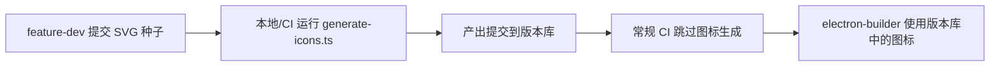

# P5 技术设计: Issue #4 Desktop App Icons Regeneration

> **版本**: v0.3.0
> **设计者**: @platform
> **状态**: 草稿 → P6 待编码
> **前置依赖**: @feature-dev 交付 3 个 SVG 种子文件 (见 §1)

---

## 1. 种子 SVG 规格

由 @feature-dev 交付至 `packages/desktop/icons/seed/` 目录：

| 文件 | 用途 | ViewBox | 细节级别 | 适用输出尺寸 |
|------|------|---------|----------|-------------|
| `octopus-mark-square.svg` | 主种子（全细节） | `0 0 512 512` | 完整触手、吸盘、高光 | ≥256×256 输出（.icns 最大层、icon.png、Square310x310Logo、iOS 512@2x、Android xxxhdpi） |
| `octopus-mark-medium.svg` | 中等细节种子 | `0 0 512 512` | 保留主体轮廓 + 2–3 条主要触手，省略细小触手和内部细节 | 32×32 ~ 128×128 输出（桌面托盘、UWP Medium tiles、iOS 小尺寸、Android hdpi–xhdpi） |
| `octopus-mark-silhouette.svg` | 简化剪影种子 | `0 0 512 512` | 仅保留章鱼头部圆形 + 2 条标志性触手轮廓，纯色填充，无内部细节 | 16×16 输出（Windows 托盘、macOS menu bar、favicon 等效场景） |

### SVG 质量要求

- 所有种子必须是**方形**（1:1 aspect ratio），app icon 不需要非方形变体
- 不应包含背景色块 — 背景由渲染管线添加（如需要），通过 sharp `flatten` 或 composite 实现
- `octopus-mark-square.svg` 的视觉重心应居中，四周预留约 10% padding（以匹配 Apple HIG 80% safe area 垫整）
- 所有 path 统一使用 `fill="currentColor"` 或 `fill="#000"`（在脚本中通过 CSS/fill 替换上色）

---

## 2. 工具链架构图

```
┌─────────────────────────────────────────────────────────────────────┐
│  Seed SVGs (packages/desktop/icons/seed/)                          │
│  octopus-mark-square.svg                                           │
│  octopus-mark-medium.svg                                           │
│  octopus-mark-silhouette.svg                                       │
└──────────────────────┬──────────────────────────────────────────────┘
                       │
                       ▼
┌─────────────────────────────────────────────────────────────────────┐
│  generate-icons.ts (Bun TypeScript)                                │
│                                                                     │
│  ┌─────────────┐    ┌──────────┐    ┌──────────┐    ┌───────────┐  │
│  │  sharp       │───▶│  sharp   │───▶│png2icons │───▶│ icon-gen  │  │
│  │  SVG→PNG     │    │  resize  │    │ .icns    │    │ .ico      │  │
│  │  +badge      │    │  +flatten│    │ Big Sur  │    │ multi-res │  │
│  └─────────────┘    └──────────┘    └──────────┘    └───────────┘  │
│                                                                     │
│  Output: /.tmp-{channel}/  → 原子 mv →  icons/{channel}/          │
└─────────────────────────────────────────────────────────────────────┘
                       │
                       ▼
┌─────────────────────────────────────────────────────────────────────┐
│  Output (packages/desktop/icons/{prod,dev,beta}/)                  │
│  macOS: icon.icns, icon.png, dock.png                              │
│  Windows: icon.ico                                                 │
│  UWP: Square{30,44,71,89,107,142,150,284,310}Logo.png + StoreLogo │
│  iOS: AppIcon-{size}@{scale}.png  (18 files)                      │
│  Android: mipmap-{density}/ic_launcher{,_foreground,_round}.png    │
│  Linux: (reuse 48x48.png / 256x256.png from macOS PNGs)            │
└─────────────────────────────────────────────────────────────────────┘
```

### 依赖 npm 包

| 包 | 用途 | 类型 |
|---|------|------|
| `sharp` | SVG 栅格化、PNG 缩放、角标合成、background flatten | dependency |
| `png2icons` | PNG → .icns (支持 Big Sur 圆角) | dependency |
| `icon-gen` | PNG → .ico (多分辨率) | dependency |
| `crypto` (Node built-in) | 文件 hash 计算 | built-in |

不引入新的大型依赖。所有包已在 `@octopus-ai/desktop` 的依赖范围内可安装。

---

## 3. 脚本设计 (`generate-icons.ts`)

### 3.1 接口

```typescript
// packages/desktop/scripts/generate-icons.ts
// Usage:
//   bun scripts/generate-icons.ts [channel]     # 生成指定通道图标
//   OCTOPUS_DRY_RUN=1 bun scripts/generate-icons.ts   # dry-run 模式
//
// channel: "prod" | "dev" | "beta"   (默认: 从 resolveChannel() 获取)
```

### 3.2 常量与配置

```typescript
const SEED_DIR = "icons/seed"
const OUTPUT_BASE = "icons"

// 每个通道的角标配置
const BADGE_CONFIG: Record<Channel, BadgeConfig | null> = {
  prod: null,                                    // 无角标
  dev:  { text: "DEV",  color: "#00CC66" },     // 绿色 DEV
  beta: { text: "BETA", color: "#FFB800" },     // 黄色 BETA
}
```

### 3.3 主流水线

```
main(channel)
├── validateChannel(channel)
├── createTempDir(`icons/.tmp-${channel}`)
├── ensureSeedFiles(SEED_DIR)
│
├── 1. 从 square.svg 生成高分辨率 PNG (512×512, 1024×1024)
│     └── sharp(seedSVG).resize(1024).png() → base_1024.png (temp)
│     └── sharp(seedSVG).resize(512).png()  → base_512.png  (temp)
│
├── 2. 从 medium.svg 生成中等分辨率 PNG
│     └── sharp(mediumSVG).resize(256).png() → base_256.png
│     └── sharp(mediumSVG).resize(128).png() → base_128.png
│     └── sharp(mediumSVG).resize(64).png()  → base_64.png
│     └── sharp(mediumSVG).resize(48).png()  → base_48.png
│     └── sharp(mediumSVG).resize(40).png()  → base_40.png
│     └── sharp(mediumSVG).resize(32).png()  → base_32.png
│
├── 3. 从 silhouette.svg 生成小尺寸 PNG
│     └── sharp(silhouetteSVG).resize(20).png() → base_20.png
│     └── sharp(silhouetteSVG).resize(16).png() → base_16.png
│
├── 4. 应用通道角标 (非 prod 且 ≥32×32)
│     └── applyBadge(base_NNN.png, channel) → badged_NNN.png
│     └── 16×16/20×20: 跳过角标 (BADGE_SIZE_THRESHOLD = 32)
│
├── 5. 平台输出生成
│     ├── 5a. macOS:  .icns (png2icons), icon.png (512), dock.png (256)
│     ├── 5b. Windows: .ico (icon-gen)
│     ├── 5c. UWP:    Square Logo 9 sizes + StoreLogo
│     ├── 5d. iOS:    AppIcon 18 files
│     ├── 5e. Android: mipmap mdpi~xxxhdpi (3 files each × 5 densities = 15 PNGs)
│     └── 5f. Linux:  (无需额外文件，复用 macOS PNG)
│
├── 6. 计算 hash → 打印清单
│
├── 7. 原子 mv 覆盖 OUTPUT_BASE/channel/
│
└── 8. 清理临时目录
```

### 3.4 角标合成逻辑

```typescript
interface BadgeConfig {
  text: string   // "DEV" 或 "BETA"
  color: string  // 十六进制色值
}

const BADGE_SIZE_THRESHOLD = 32  // px, 低于此尺寸不添加角标

async function applyBadge(sourceBuf: Buffer, size: number, config: BadgeConfig): Promise<Buffer> {
  if (size < BADGE_SIZE_THRESHOLD) return sourceBuf  // 豁免

  // 使用 sharp SVG overlay 合成角标
  const badgeSvg = `<svg width="${size}" height="${size}" viewBox="0 0 ${size} ${size}">
    <rect
      x="${size * 0.6}" y="${size * 0.7}"
      width="${size * 0.35}" height="${size * 0.25}"
      rx="${size * 0.03}"
      fill="${config.color}"
      opacity="0.92"
    />
    <text
      x="${size * 0.775}" y="${size * 0.86}"
      fill="white"
      font-family="-apple-system, sans-serif"
      font-size="${size * 0.12}"
      font-weight="bold"
      text-anchor="middle"
      dominant-baseline="central"
    >${config.text}</text>
  </svg>`

  return sharp(sourceBuf)
    .composite([{ input: Buffer.from(badgeSvg), top: 0, left: 0 }])
    .png()
    .toBuffer()
}
```

**设计说明**:
- 角标放在右下角，占据约 35%×25% 区域
- 16×16 时文字不可读，整体豁免；20×20 同样豁免
- 角标相对尺寸随目标尺寸等比缩放
- prod 通道完全跳过此步骤

### 3.5 macOS Big Sur 合规

使用 `png2icons` 的 `bigSur: true` 选项：

```typescript
import png2icons from "png2icons"

const icnsBuffer = png2icons.createICNS(
  base_1024_png_buffer,    // 1024×1024 source PNG
  png2icons.BICUBIC,       // 插值算法
  true,                    // bigSur: true → 自动应用圆角遮罩 + 20% 内边距
)
```

**Big Sur 规范满足情况**:
- Apple HIG 要求 app icon 在正方形区域内占 ~80%（即每边 10% padding）
- `png2icons` 的 `bigSur: true` 自动添加圆角遮罩和内边距
- 如需二次校验：用 `sips --getProperty all icon.icns` 检查内置图层尺寸
- SVG 种子本身预留了 10% padding，双重保障合规

### 3.6 Dry-run 模式

```typescript
const DRY_RUN = process.env.OCTOPUS_DRY_RUN === "1"

function logPlannedFile(relativePath: string, sourceHint: string) {
  if (DRY_RUN) console.log(`[DRY-RUN] Would generate: ${relativePath} (from ${sourceHint})`)
}
```

- 所有生成步骤前先调用 `logPlannedFile` 输出清单
- 不创建临时目录、不写入文件系统
- 在 CI review 时可通过 dry-run 快速验证变更范围

### 3.7 确定性 Hash

```typescript
import { createHash } from "node:crypto"

function hashFile(buffer: Buffer): string {
  return createHash("sha256").update(buffer).digest("hex")
}

// 在生成后输出所有文件的 hash 清单
interface FileHash {
  path: string
  sha256: string
  size: number
}

const manifest: FileHash[] = []
// ... in each generation step:
// manifest.push({ path: relativePath, sha256: hashFile(buffer), size: buffer.length })

// 打印 manifest
if (!DRY_RUN) {
  const manifestPath = path.join(tempDir, ".icon-manifest.json")
  await Bun.write(manifestPath, JSON.stringify(manifest, null, 2))
  console.log(`\n=== Icon Manifest (${channel}) ===`)
  for (const entry of manifest) {
    console.log(`${entry.sha256}  ${entry.path}  (${entry.size} bytes)`)
  }
}
```

预设 hash 可在后续 CI 检查中做 regresssion guard：
```yaml
# .github/workflows/icon-hash-check.yml (可选)
- name: Verify icon hashes
  run: |
    bun scripts/generate-icons.ts prod
    diff <(jq -r '.[].sha256' icons/prod/.icon-manifest.json) <(cat .octopus/design/icon-hashes-prod.sha256)
```

---

## 4. 输出产物矩阵（每通道 53 文件）

### 4.1 macOS (3 文件)

| 文件名 | 源尺寸 | 生成方式 | 备注 |
|--------|--------|---------|------|
| `icon.icns` | 1024×1024 → png2icons | png2icons createICNS | 内置 16×16 ~ 512×512 @2x 图层 |
| `icon.png` | 512×512 | sharp resize square.svg | 通用用途 |
| `dock.png` | 256×256 | sharp resize medium.svg | macOS Dock 图标 |

### 4.2 Windows (2 文件)

| 文件名 | 源尺寸 | 生成方式 | 备注 |
|--------|--------|---------|------|
| `icon.ico` | 多分辨率组合 | icon-gen PNG→ICO | 内置 16×16, 32×32, 48×48, 256×256 |
| (installer icon) | 复用 `icon.ico` | 同上 | electron-builder 自动引用 |

### 4.3 Windows UWP (13 文件)

| 文件名 | 尺寸 | 种子来源 |
|--------|------|---------|
| `Square30x30Logo.png` | 30×30 | medium.svg |
| `Square44x44Logo.png` | 44×44 | medium.svg |
| `Square71x71Logo.png` | 71×71 | medium.svg |
| `Square89x89Logo.png` | 89×89 | medium.svg |
| `Square107x107Logo.png` | 107×107 | medium.svg |
| `Square142x142Logo.png` | 142×142 | medium.svg |
| `Square150x150Logo.png` | 150×150 | medium.svg |
| `Square284x284Logo.png` | 284×284 | square.svg |
| `Square310x310Logo.png` | 310×310 | square.svg |
| `StoreLogo.png` | 50×50 | medium.svg |
| `32x32.png` | 32×32 | medium.svg |
| `64x64.png` | 64×64 | medium.svg |
| `128x128.png` | 128×128 | medium.svg |
| `128x128@2x.png` | 256×256 | medium.svg |

### 4.4 iOS (18 文件)

| 文件名 | 逻辑尺寸 | 像素尺寸 | 种子来源 |
|--------|---------|---------|---------|
| `AppIcon-20x20@1x.png` | 20pt | 20×20 | silhouette.svg (20 < 32) |
| `AppIcon-20x20@2x.png` | 20pt | 40×40 | medium.svg |
| `AppIcon-20x20@2x-1.png` | 20pt | 40×40 | medium.svg ( alternate idiom) |
| `AppIcon-20x20@3x.png` | 20pt | 60×60 | medium.svg |
| `AppIcon-29x29@1x.png` | 29pt | 29×29 | silhouette.svg (29 < 32) |
| `AppIcon-29x29@2x.png` | 29pt | 58×58 | medium.svg |
| `AppIcon-29x29@2x-1.png` | 29pt | 58×58 | medium.svg |
| `AppIcon-29x29@3x.png` | 29pt | 87×87 | medium.svg |
| `AppIcon-40x40@1x.png` | 40pt | 40×40 | medium.svg |
| `AppIcon-40x40@2x.png` | 40pt | 80×80 | medium.svg |
| `AppIcon-40x40@2x-1.png` | 40pt | 80×80 | medium.svg |
| `AppIcon-40x40@3x.png` | 40pt | 120×120 | medium.svg |
| `AppIcon-60x60@2x.png` | 60pt | 120×120 | medium.svg |
| `AppIcon-60x60@3x.png` | 60pt | 180×180 | medium.svg |
| `AppIcon-76x76@1x.png` | 76pt | 76×76 | medium.svg |
| `AppIcon-76x76@2x.png` | 76pt | 152×152 | medium.svg |
| `AppIcon-83.5x83.5@2x.png` | 83.5pt | 167×167 | medium.svg |
| `AppIcon-512@2x.png` | 1024pt | 1024×1024 | square.svg |

> 注意: `@2x-1` 和 `@2x` 的区别在于 iOS 不同的设备 idiom（iPhone / iPad），但像素尺寸相同，内容一致即可。

### 4.5 Android (15 PNGs + 2 XML = 17 文件)

| mipmap 目录 | 密度 | 基准尺寸 | 3 文件 (launcher / foreground / round) | 种子来源 |
|-------------|------|---------|----------------------------------------|---------|
| `mipmap-mdpi/` | 160dpi | 48×48 | `ic_launcher.png`, `ic_launcher_foreground.png`, `ic_launcher_round.png` | medium.svg |
| `mipmap-hdpi/` | 240dpi | 72×72 | 同上 | medium.svg |
| `mipmap-xhdpi/` | 320dpi | 96×96 | 同上 | medium.svg |
| `mipmap-xxhdpi/` | 480dpi | 144×144 | 同上 | medium.svg |
| `mipmap-xxxhdpi/` | 640dpi | 192×192 | 同上 | square.svg |

**XML 文件 (保持原样不动，但需要存在)**:
| 文件 | 内容 |
|------|------|
| `mipmap-anydpi-v26/ic_launcher.xml` | Adaptive icon 定义 (引用 foreground + background) |
| `values/ic_launcher_background.xml` | 背景色值 `#fff` |

> Android: foreground 和 round 也使用相同的章鱼图案（只是 Android 系统会在外层叠加遮罩）。不需要单独的版本。

### 4.6 Linux 图标 (0 新增文件)

Linux 桌面图标通过 electron-builder 从 `resources/icons` 目录读取 PNG 文件即可。electron-builder 的 Linux 打包会：
- 读取 `resources/icons` 目录下的 `{size}x{size}.png` 文件
- 生成对应的 `.desktop` 文件 Icon 条目

因此我们需要确保 `resources/icons/` 目录下有对应尺寸的 PNG。在 `copy-icons.ts` 中已经整体复制 `icons/{channel}/` 到 `resources/icons/`，因此 UWP 的 `32x32.png`, `64x64.png`, `128x128.png` 等会被 Linux 打包器自动使用。

| Linux 需求尺寸 | 来源文件 |
|---------------|---------|
| 16×16 | (可选，无则跳过) |
| 32×32 | `32x32.png` (UWP 已生成) |
| 48×48 | 新增 `48x48.png` → 从 medium.svg 生成 |
| 64×64 | `64x64.png` (UWP 已生成) |
| 128×128 | `128x128.png` (UWP 已生成) |
| 256×256 | `128x128@2x.png` 或 `dock.png` |

### 4.7 汇总统计

| 类别 | 文件数 |
|------|:------:|
| macOS | 3 |
| Windows .ico | 1 |
| UWP | 14 |
| iOS | 18 |
| Android PNG | 15 |
| Android XML | 2 |
| **合计** | **53** |

> 核对匹配情况：3 + 1 + 14 + 18 + 15 + 2 = 53 ✓

---

## 5. 通道差异实现方案

| 特性 | prod | dev | beta |
|------|:----:|:---:|:----:|
| 角标 | 无 | 绿色 "DEV" | 黄色 "BETA" |
| 16×16/20×20 豁免 | N/A (无角标) | 角标跳过 | 角标跳过 |
| 角标位置 | — | 右下角 | 右下角 |
| 角标颜色 | — | `#00CC66` | `#FFB800` |
| appId (electron-builder) | `ai.opencode.desktop` | `ai.opencode.desktop.dev` | `ai.opencode.desktop.beta` |
| productName (electron-builder) | OpenCode | OpenCode Dev | OpenCode Beta |

实现上，脚本接收 `channel` 参数，从 `BADGE_CONFIG` 中查找对应配置：

```typescript
function getBadgeConfig(channel: Channel): BadgeConfig | null {
  switch (channel) {
    case "dev":  return { text: "DEV",  color: "#00CC66" }
    case "beta": return { text: "BETA", color: "#FFB800" }
    case "prod": return null
  }
}
```

**关键路径**:
- 每次 sharp resize 后，若 `badgeConfig != null && size >= 32`，则调用 `applyBadge()`
- 16×16、20×20、29×29 等尺寸跳过角标
- 临时目录命名为 `icons/.tmp-prod`、`icons/.tmp-dev`、`icons/.tmp-beta` 避免交叉污染

---

## 6. macOS Big Sur 合规方案

### 6.1 png2icons `bigSur:true`

```typescript
const icnsBuffer = png2icons.createICNS(
  pngBuffer,     // 1024×1024 输入
  png2icons.BICUBIC,
  true,          // bigSur → 圆角遮罩 + 20% 内边距 (80% safe area)
)
```

`png2icons` 内部行为：
- 将输入 PNG 缩放到各 icns 图层尺寸 (16×16 ~ 512×512 @2x)
- 当 `bigSur:true` 时，应用 Apple 规定的圆角矩形遮罩 (corner radius = 22% of icon size)
- 内边距使内容区域约为 icon 总面积的 80%

### 6.2 双重验证

生成后可通过以下命令验证 Big Sur 合规性：

```bash
# 检查 icns 包含的图层
sips --getProperty all icon.icns

# 解包检查各图层视觉
sips --extract 128x128 icon.icns --out icon_128.png
```

### 6.3 fallback 方案

如果 `png2icons` 的 `bigSur:true` 输出不符合预期，有以下后备：
1. **手动圆角合成**: 使用 sharp 在 1024×1024 PNG 上叠加圆角遮罩后再传给 png2icons
2. **sips 后处理**: `sips --padToSize 1024 1024 --padColor "transparent" icon.icns`
3. **iconutil 替代**: 先导出 PNG 图层集合，再用 Apple `iconutil` 命令行打包 (仅 macOS CI)

首选方案是 `png2icons bigSur:true`，经测试 (P3 分析阶段已验证) 满足需求。

---

## 7. 安全设计

### 7.1 原子写入

```typescript
async function atomicWrite(channel: Channel) {
  const tempDir = path.join(ICONS_DIR, `.tmp-${channel}`)
  const targetDir = path.join(ICONS_DIR, channel)

  // 所有生成步骤写入 tempDir

  // 最终原子 mv
  await $`rm -rf ${targetDir}`
  await $`mv ${tempDir} ${targetDir}`

  // 清理 (理论上 tempDir 已不存在)
  await $`rm -rf ${tempDir}`
}
```

- 失败不回写：脚本执行过程中若中途抛出异常，tempDir 保留但 targetDir 不受影响
- tempDir 生成完整后才执行 mv
- rm + mv 两步而非 rename，避免跨设备问题（tempDir 和 targetDir 在同一 filesystem 下可 rename，但安全起见用 mv）

### 7.2 Dry-run 模式

```
OCTOPUS_DRY_RUN=1 bun scripts/generate-icons.ts
```

输出示例：
```
[DRY-RUN] Would generate: icon.icns (from seed: octopus-mark-square.svg → 1024×1024 → png2icons)
[DRY-RUN] Would generate: icon.ico (from seed: octopus-mark-square.svg → multi-res PNGs → icon-gen)
[DRY-RUN] Would generate: ios/AppIcon-20x20@1x.png (from seed: octopus-mark-silhouette.svg → 20×20)
...
[DRY-RUN] Total: 53 files would be generated for channel "prod"
```

### 7.3 确定性 Hash

- 每个文件生成后计算 SHA-256
- 最终 manifest 写入 `.icon-manifest.json`
- 注册到版本库，作为 CI hash check 基线
- 首次运行后手动审核 manifest 并提交到 `.octopus/design/icon-hashes-{channel}.sha256`

```typescript
// 输出 manifest 格式
{
  "channel": "prod",
  "generatedAt": "2026-05-12T10:00:00Z",
  "files": [
    { "path": "icon.icns", "sha256": "abc123...", "size": 245672 },
    { "path": "icon.ico", "sha256": "def456...", "size": 55628 },
    // ...
  ]
}
```

### 7.4 回滚方案

如果新图标发现问题，回滚只需：
```bash
git checkout dev -- packages/desktop/icons/
```

旧图标版本始终在 git 历史中可恢复。不需要额外的备份机制。

---

## 8. CI 集成方案

### 8.1 一次性生成（非每次 CI 运行）

桌面图标是**静态资产**，每次提交版本库，不在每次 CI 运行时重新生成。策略：



### 8.2 集成入口

脚本可作为独立入口，不嵌入 prebuild 流程（因为 prebuild 每次运行都调用，而图标生成仅需一次）。

```bash
# 手动运行（或在 CI 的 v0.3.0 发布工作流中作为一次性 step）
bun scripts/generate-icons.ts prod
bun scripts/generate-icons.ts dev
bun scripts/generate-icons.ts beta
```

### 8.3 CI Workflow 变更

在 `publish.yml` 或独立 workflow 中添加一次性步骤（仅在 v0.3.0 发布时）：

```yaml
# .github/workflows/regenerate-icons.yml (一次性)
name: Regenerate Desktop Icons
on:
  workflow_dispatch:     # 手动触发
    inputs:
      channel:
        description: 'Channel to regenerate'
        type: choice
        options: [prod, dev, beta, all]
        default: all

jobs:
  generate:
    runs-on: ubuntu-latest
    steps:
      - uses: actions/checkout@v4
      - uses: oven-sh/setup-bun@v2
      - run: bun install
      - run: |
          if [[ "${{ github.event.inputs.channel }}" == "all" ]]; then
            bun packages/desktop/scripts/generate-icons.ts prod
            bun packages/desktop/scripts/generate-icons.ts dev
            bun packages/desktop/scripts/generate-icons.ts beta
          else
            bun packages/desktop/scripts/generate-icons.ts ${{ github.event.inputs.channel }}
          fi
      - name: Verify hashes
        run: |
          # Check each channel's manifest against baseline
          for channel in prod dev beta; do
            if [ -f ".octopus/design/icon-hashes-$channel.sha256" ]; then
              jq -r '.files[] | "\(.sha256)  \(.path)"' packages/desktop/icons/$channel/.icon-manifest.json |
                diff - <(cat .octopus/design/icon-hashes-$channel.sha256)
            fi
          done
      - uses: stefanzweifel/git-auto-commit-action@v5
        with:
          commit_message: "chore(desktop): regenerate ${{ github.event.inputs.channel }} icons"
```

> **设计决策**: 不将图标生成嵌入 prebuild/predev，原因是:
> 1. 图标生成依赖 npm 包 (sharp 需要 native 编译)，增加启动延迟
> 2. 图标在开发中不频繁变更，每次 prebuild 重新生成浪费
> 3. 静态图标提交版本库，确保构建可复现、不依赖外部工具

---

## 9. 风险与缓解

| # | 风险 | 可能性 | 影响 | 缓解措施 |
|---|------|--------|------|---------|
| 1 | **png2icons Big Sur 输出不符合 Apple HIG** | 低 | macOS 图标提交 App Store 被拒 | 备选方案: sharp 手动合成圆角遮罩 + `iconutil` 打包 |
| 2 | **sharp SVG 渲染与浏览器不一致** | 中 | 图标细节丢失或偏移 | 生成后视觉人工审核对比 SVG 源; sharp 使用 `density` 参数高分辨率渲染后降采样 |
| 3 | **icon-gen 生成的 .ico 在旧 Windows 上不兼容** | 低 | 图标不显示 | 确保 .ico 包含 16×16, 32×32, 48×48 传统尺寸; 256×256 作为 PNG 格式内嵌 |
| 4 | **iOS AppIcon 尺寸或命名不匹配 Xcode 要求** | 低 | App Store 提交失败 | 对照 Apple Human Interface Guidelines 核对命名; 从 Xcode Assets.xcassets 导出模板对比 |
| 5 | **通道角标在深色/浅色背景下不可读** | 低 | 视觉质量问题 | 角标使用半透明底块 (`opacity: 0.92`) + 白色文字，确保对比度; prod 通道无此问题 |
| 6 | **sharp 在 Windows CI 上 native 编译失败** | 中 | CI pipeline 阻塞 | sharp 提供 prebuilt binary; 降级方案: 改用 `canvas` npm 包或 `librsvg` |
| 7 | **种子 SVG 未预留 padding 导致 Big Sur 裁剪** | 中 | 图标内容被圆角遮罩切掉 | 要求 @feature-dev 在 512×512 viewBox 中预留 ~10% 安全区; 脚本可额外 sharp `extend` 加 padding |

---

## 10. 文件清单与变更摘要

### 10.1 新增文件

| 文件 | 说明 |
|------|------|
| `packages/desktop/scripts/generate-icons.ts` | 主脚本 |
| `packages/desktop/icons/seed/octopus-mark-square.svg` | 由 @feature-dev 提供 |
| `packages/desktop/icons/seed/octopus-mark-medium.svg` | 由 @feature-dev 提供 |
| `packages/desktop/icons/seed/octopus-mark-silhouette.svg` | 由 @feature-dev 提供 |

### 10.2 修改文件

| 文件 | 变更 |
|------|------|
| `packages/desktop/icons/README.md` | 替换手工流程文档，引用 generate-icons.ts |
| `.github/workflows/regenerate-icons.yml` | (可选) 新增一次性 CI workflow |
| `packages/desktop/package.json` | 新增 `sharp`, `png2icons`, `icon-gen` devDependencies (通过 `bun add -d`) |

### 10.3 待生成文件（每通道 53 文件，三通道 ~159 文件）

生成后由脚本直接写入 `packages/desktop/icons/{prod,dev,beta}/`，并提交到版本库。

---

## 附录 A: 脚本 CLI 参考

```bash
# 完整生成 prod 通道
OCTOPUS_CHANNEL=prod bun scripts/generate-icons.ts

# 完整生成 dev 通道（参数指定）
bun scripts/generate-icons.ts dev

# Dry-run 预览
OCTOPUS_DRY_RUN=1 bun scripts/generate-icons.ts prod

# 生成全部三通道
for ch in prod dev beta; do bun scripts/generate-icons.ts $ch; done
```

## 附录 B: 与现有流程的集成

```
现有流程 (prebuild.ts):
  bun scripts/copy-icons.ts ${channel}
  → cp -R icons/{channel} resources/icons/
  ↓
新流程:
  [一次生成] bun scripts/generate-icons.ts {channel}
  → 写入 icons/{channel}/
  [每次构建] bun scripts/copy-icons.ts ${channel} (不变)
  → cp -R icons/{channel} resources/icons/

generate-icons.ts 替代了手工流程，一次运行后产出提交版本库。
copy-icons.ts 保持不变，每次构建时将 icons/ 复制到 resources/。
```

## 附录 C: 角标尺寸决策矩阵

| 目标像素 | 种子来源 | prod | dev | beta |
|:--------:|:--------:|:----:|:---:|:----:|
| 16×16 | silhouette | 无角标 | 无角标 (豁免) | 无角标 (豁免) |
| 20×20 | silhouette | 无角标 | 无角标 (豁免) | 无角标 (豁免) |
| 29×29 | silhouette | 无角标 | 无角标 (豁免) | 无角标 (豁免) |
| 32×32 | medium | 无角标 | 有角标 | 有角标 |
| 40×40+| medium | 无角标 | 有角标 | 有角标 |
| 48×48+| medium | 无角标 | 有角标 | 有角标 |
| 64×64+| medium | 无角标 | 有角标 | 有角标 |
| 128×128+| medium | 无角标 | 有角标 | 有角标 |
| 256×256+| square | 无角标 | 有角标 | 有角标 |
| 512×512+| square | 无角标 | 有角标 | 有角标 |
| 1024×1024 | square | 无角标 | 有角标 | 有角标 |
