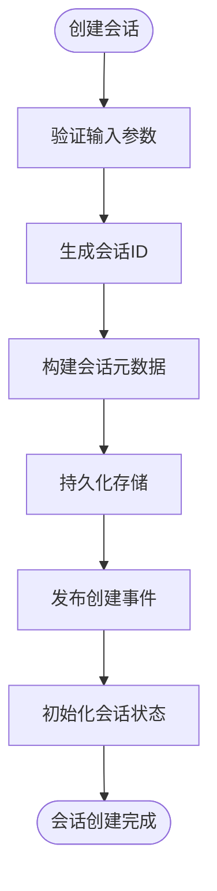

# API参考

<cite>
**本文档中引用的文件**   
- [session/index.ts](file://packages/opencode/src/session/index.ts)
- [file/index.ts](file://packages/opencode/src/file/index.ts)
- [tool/registry.ts](file://packages/opencode/src/tool/registry.ts)
- [agent/agent.ts](file://packages/opencode/src/agent/agent.ts)
- [project/project.ts](file://packages/opencode/src/project/project.ts)
</cite>

## 目录
1. [会话管理API](#会话管理api)
2. [文件操作API](#文件操作api)
3. [工具执行API](#工具执行api)
4. [项目管理API](#项目管理api)
5. [流式API](#流式api)
6. [API版本控制](#api版本控制)

## 会话管理API

会话管理API负责管理AI对话的生命周期，包括创建、获取、更新和删除会话。系统通过事件驱动架构实现会话状态的实时同步和持久化。



**图源**
- [session/index.ts](file://packages/opencode/src/session/index.ts#L1-L348)

### 创建会话

创建新的对话会话，支持父子会话关系。

**HTTP方法**: `POST`  
**URL路径**: `/api/sessions`  
**请求头**: 
- `Authorization: Bearer <token>`
- `Content-Type: application/json`

**请求体JSON Schema**:
```json
{
  "title": "string",
  "parentID": "string",
  "directory": "string"
}
```

**响应体JSON Schema**:
```json
{
  "id": "string",
  "projectID": "string",
  "directory": "string",
  "parentID": "string",
  "title": "string",
  "version": "string",
  "time": {
    "created": "number",
    "updated": "number"
  }
}
```

**curl命令示例**:
```bash
curl -X POST https://api.opencode.com/api/sessions \
  -H "Authorization: Bearer your-token" \
  -H "Content-Type: application/json" \
  -d '{"title": "New Session", "directory": "/path/to/project"}'
```

**JavaScript客户端调用示例**:
```javascript
const response = await fetch('/api/sessions', {
  method: 'POST',
  headers: {
    'Authorization': 'Bearer your-token',
    'Content-Type': 'application/json'
  },
  body: JSON.stringify({
    title: 'New Session',
    directory: '/path/to/project'
  })
});
const session = await response.json();
```

### 获取会话

获取指定会话的详细信息。

**HTTP方法**: `GET`  
**URL路径**: `/api/sessions/{sessionID}`  
**请求头**: 
- `Authorization: Bearer <token>`

**响应体JSON Schema**:
```json
{
  "id": "string",
  "projectID": "string",
  "directory": "string",
  "parentID": "string",
  "title": "string",
  "version": "string",
  "time": {
    "created": "number",
    "updated": "number"
  }
}
```

**curl命令示例**:
```bash
curl -X GET https://api.opencode.com/api/sessions/session_123 \
  -H "Authorization: Bearer your-token"
```

**JavaScript客户端调用示例**:
```javascript
const response = await fetch('/api/sessions/session_123', {
  headers: {
    'Authorization': 'Bearer your-token'
  }
});
const session = await response.json();
```

### 更新会话

更新会话的元数据信息。

**HTTP方法**: `PUT`  
**URL路径**: `/api/sessions/{sessionID}`  
**请求头**: 
- `Authorization: Bearer <token>`
- `Content-Type: application/json`

**请求体JSON Schema**:
```json
{
  "title": "string"
}
```

**响应体JSON Schema**:
```json
{
  "id": "string",
  "projectID": "string",
  "directory": "string",
  "parentID": "string",
  "title": "string",
  "version": "string",
  "time": {
    "created": "number",
    "updated": "number"
  }
}
```

**curl命令示例**:
```bash
curl -X PUT https://api.opencode.com/api/sessions/session_123 \
  -H "Authorization: Bearer your-token" \
  -H "Content-Type: application/json" \
  -d '{"title": "Updated Session"}'
```

**JavaScript客户端调用示例**:
```javascript
const response = await fetch('/api/sessions/session_123', {
  method: 'PUT',
  headers: {
    'Authorization': 'Bearer your-token',
    'Content-Type': 'application/json'
  },
  body: JSON.stringify({ title: 'Updated Session' })
});
const session = await response.json();
```

### 删除会话

删除指定的会话及其所有子会话。

**HTTP方法**: `DELETE`  
**URL路径**: `/api/sessions/{sessionID}`  
**请求头**: 
- `Authorization: Bearer <token>`

**响应状态码**: `204 No Content`

**curl命令示例**:
```bash
curl -X DELETE https://api.opencode.com/api/sessions/session_123 \
  -H "Authorization: Bearer your-token"
```

**JavaScript客户端调用示例**:
```javascript
const response = await fetch('/api/sessions/session_123', {
  method: 'DELETE',
  headers: {
    'Authorization': 'Bearer your-token'
  }
});
if (response.status === 204) {
  console.log('会话已删除');
}
```

**节源**
- [session/index.ts](file://packages/opencode/src/session/index.ts#L1-L348)

## 文件操作API

文件操作API提供对项目文件的读取、写入和搜索功能，支持与版本控制系统集成。

### 读取文件

读取指定文件的内容，并可选择返回与版本控制系统的差异。

**HTTP方法**: `GET`  
**URL路径**: `/api/files/{filePath}`  
**请求头**: 
- `Authorization: Bearer <token>`
- `Accept: application/json`

**查询参数**:
- `diff`: boolean (可选) - 是否返回与git的差异

**响应体JSON Schema**:
```json
{
  "content": "string",
  "diff": "string",
  "patch": {
    "oldFileName": "string",
    "newFileName": "string",
    "hunks": [
      {
        "oldStart": "number",
        "oldLines": "number",
        "newStart": "number",
        "newLines": "number",
        "lines": ["string"]
      }
    ]
  }
}
```

**curl命令示例**:
```bash
curl -X GET https://api.opencode.com/api/files/src/index.ts?diff=true \
  -H "Authorization: Bearer your-token"
```

**JavaScript客户端调用示例**:
```javascript
const response = await fetch('/api/files/src/index.ts?diff=true', {
  headers: {
    'Authorization': 'Bearer your-token'
  }
});
const fileContent = await response.json();
```

### 写入文件

向指定文件写入内容。

**HTTP方法**: `PUT`  
**URL路径**: `/api/files/{filePath}`  
**请求头**: 
- `Authorization: Bearer <token>`
- `Content-Type: application/json`

**请求体JSON Schema**:
```json
{
  "content": "string"
}
```

**响应状态码**: `204 No Content`

**curl命令示例**:
```bash
curl -X PUT https://api.opencode.com/api/files/src/index.ts \
  -H "Authorization: Bearer your-token" \
  -H "Content-Type: application/json" \
  -d '{"content": "new file content"}'
```

**JavaScript客户端调用示例**:
```javascript
const response = await fetch('/api/files/src/index.ts', {
  method: 'PUT',
  headers: {
    'Authorization': 'Bearer your-token',
    'Content-Type': 'application/json'
  },
  body: JSON.stringify({ content: 'new file content' })
});
```

### 搜索文件

在项目中搜索文件和目录。

**HTTP方法**: `GET`  
**URL路径**: `/api/files/search`  
**请求头**: 
- `Authorization: Bearer <token>`

**查询参数**:
- `query`: string (必需) - 搜索关键词
- `limit`: number (可选) - 结果数量限制

**响应体JSON Schema**:
```json
{
  "results": [
    {
      "path": "string",
      "type": "file|directory",
      "ignored": "boolean"
    }
  ]
}
```

**curl命令示例**:
```bash
curl -X GET https://api.opencode.com/api/files/search?query=index&limit=10 \
  -H "Authorization: Bearer your-token"
```

**JavaScript客户端调用示例**:
```javascript
const response = await fetch('/api/files/search?query=index&limit=10', {
  headers: {
    'Authorization': 'Bearer your-token'
  }
});
const searchResults = await response.json();
```

**节源**
- [file/index.ts](file://packages/opencode/src/file/index.ts#L1-L259)

## 工具执行API

工具执行API管理所有可用工具的注册、调用和权限控制，支持内置工具和自定义工具。

### 获取可用工具

获取当前会话中可用的工具列表。

**HTTP方法**: `GET`  
**URL路径**: `/api/tools`  
**请求头**: 
- `Authorization: Bearer <token>`

**响应体JSON Schema**:
```json
{
  "tools": [
    {
      "id": "string",
      "description": "string",
      "parameters": {
        "type": "object",
        "properties": {}
      }
    }
  ]
}
```

**curl命令示例**:
```bash
curl -X GET https://api.opencode.com/api/tools \
  -H "Authorization: Bearer your-token"
```

**JavaScript客户端调用示例**:
```javascript
const response = await fetch('/api/tools', {
  headers: {
    'Authorization': 'Bearer your-token'
  }
});
const tools = await response.json();
```

### 执行工具

执行指定的工具。

**HTTP方法**: `POST`  
**URL路径**: `/api/tools/{toolID}/execute`  
**请求头**: 
- `Authorization: Bearer <token>`
- `Content-Type: application/json`

**请求体JSON Schema**:
```json
{
  "args": {}
}
```

**响应体JSON Schema**:
```json
{
  "title": "string",
  "output": "string",
  "metadata": {}
}
```

**curl命令示例**:
```bash
curl -X POST https://api.opencode.com/api/tools/bash/execute \
  -H "Authorization: Bearer your-token" \
  -H "Content-Type: application/json" \
  -d '{"args": {"command": "ls -la"}}'
```

**JavaScript客户端调用示例**:
```javascript
const response = await fetch('/api/tools/bash/execute', {
  method: 'POST',
  headers: {
    'Authorization': 'Bearer your-token',
    'Content-Type': 'application/json'
  },
  body: JSON.stringify({ args: { command: 'ls -la' } })
});
const result = await response.json();
```

**节源**
- [tool/registry.ts](file://packages/opencode/src/tool/registry.ts#L1-L132)

## 项目管理API

项目管理API处理项目级别的操作，包括项目信息获取和状态管理。

### 获取项目信息

获取当前项目的基本信息。

**HTTP方法**: `GET`  
**URL路径**: `/api/projects/{projectID}`  
**请求头**: 
- `Authorization: Bearer <token>`

**响应体JSON Schema**:
```json
{
  "id": "string",
  "worktree": "string",
  "vcs": "git",
  "time": {
    "created": "number",
    "initialized": "number"
  }
}
```

**curl命令示例**:
```bash
curl -X GET https://api.opencode.com/api/projects/proj_123 \
  -H "Authorization: Bearer your-token"
```

**JavaScript客户端调用示例**:
```javascript
const response = await fetch('/api/projects/proj_123', {
  headers: {
    'Authorization': 'Bearer your-token'
  }
});
const project = await response.json();
```

### 列出所有项目

列出用户有权访问的所有项目。

**HTTP方法**: `GET`  
**URL路径**: `/api/projects`  
**请求头**: 
- `Authorization: Bearer <token>`

**响应体JSON Schema**:
```json
{
  "projects": [
    {
      "id": "string",
      "worktree": "string",
      "vcs": "git",
      "time": {
        "created": "number",
        "initialized": "number"
      }
    }
  ]
}
```

**curl命令示例**:
```bash
curl -X GET https://api.opencode.com/api/projects \
  -H "Authorization: Bearer your-token"
```

**JavaScript客户端调用示例**:
```javascript
const response = await fetch('/api/projects', {
  headers: {
    'Authorization': 'Bearer your-token'
  }
});
const projects = await response.json();
```

**节源**
- [project/project.ts](file://packages/opencode/src/project/project.ts#L1-L93)

## 流式API

流式API使用Server-Sent Events (SSE)实现实时消息流，用于AI响应的流式传输。

### 连接建立

客户端通过HTTP GET请求建立SSE连接。

**HTTP方法**: `GET`  
**URL路径**: `/api/stream`  
**请求头**: 
- `Authorization: Bearer <token>`
- `Accept: text/event-stream`

### 消息格式

流式API发送的事件遵循SSE标准格式，包含以下事件类型：

- `message`: AI生成的文本片段
- `tool-call`: 工具调用开始
- `tool-result`: 工具执行结果
- `error`: 错误信息

**数据结构**:
```json
{
  "type": "message|tool-call|tool-result|error",
  "data": {},
  "id": "string",
  "timestamp": "number"
}
```

### 错误处理机制

流式API实现了完善的错误处理机制：

1. **网络错误**: 客户端自动重连，支持指数退避
2. **认证错误**: 返回401状态码，要求重新认证
3. **服务器错误**: 返回5xx状态码，客户端应停止重连
4. **流中断**: 服务器发送`error`事件，包含错误详情

**JavaScript客户端示例**:
```javascript
const eventSource = new EventSource('/api/stream?sessionID=session_123', {
  headers: {
    'Authorization': 'Bearer your-token'
  }
});

eventSource.onmessage = function(event) {
  const data = JSON.parse(event.data);
  console.log('收到消息:', data);
};

eventSource.addEventListener('tool-call', function(event) {
  const data = JSON.parse(event.data);
  console.log('工具调用:', data);
});

eventSource.onerror = function(event) {
  console.error('流式连接错误:', event);
  eventSource.close();
};
```

**节源**
- [session/index.ts](file://packages/opencode/src/session/index.ts#L1-L348)

## API版本控制

API采用URL路径进行版本控制，当前版本为v1。

### 版本策略

- **主版本号**: 重大变更，不兼容的API修改
- **次版本号**: 向后兼容的功能添加
- **修订号**: 向后兼容的错误修复

### 当前版本

**基础URL**: `https://api.opencode.com/v1`

### 已弃用的端点

无已弃用的端点。

**节源**
- [session/index.ts](file://packages/opencode/src/session/index.ts#L1-L348)