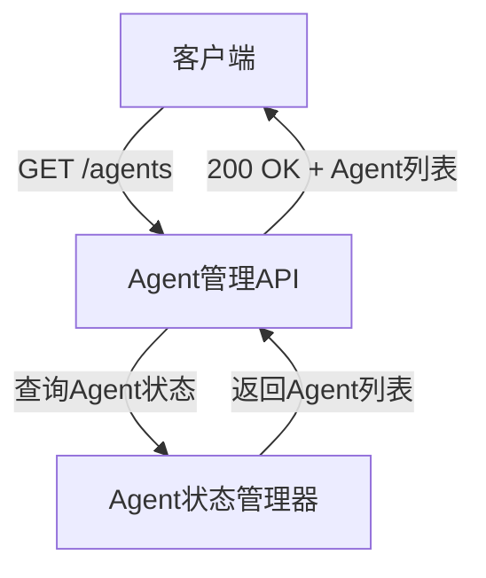
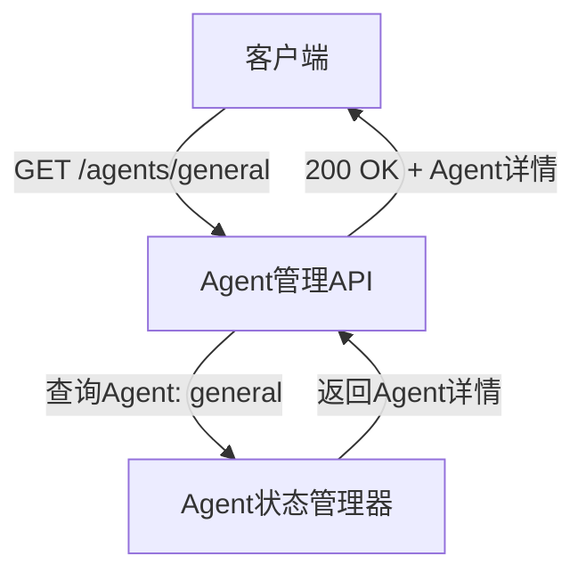
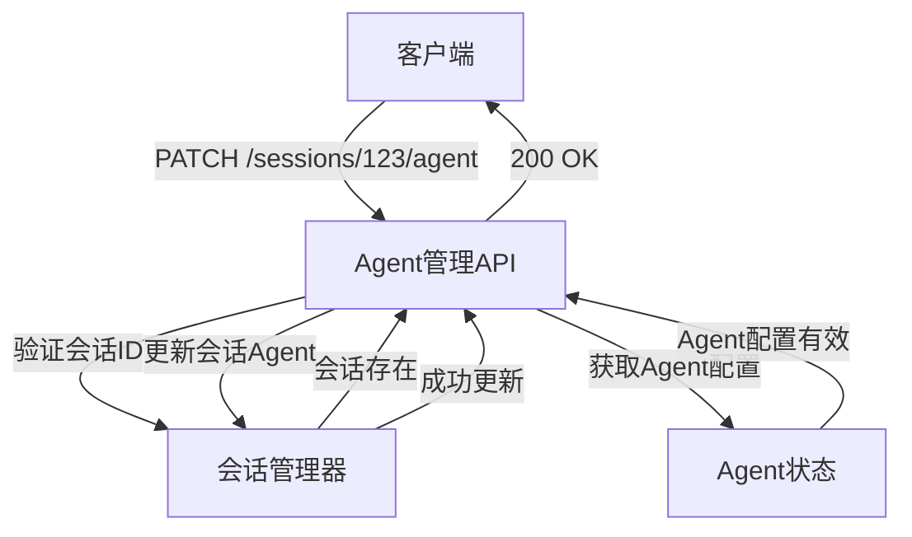
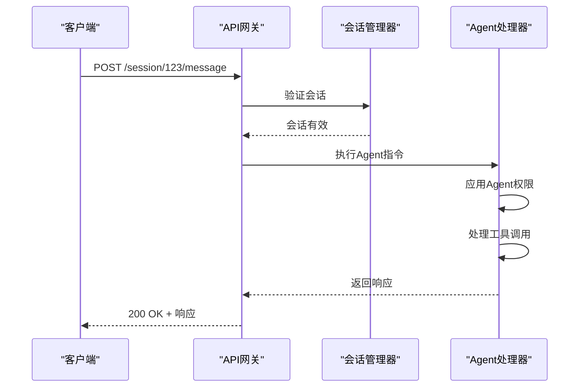
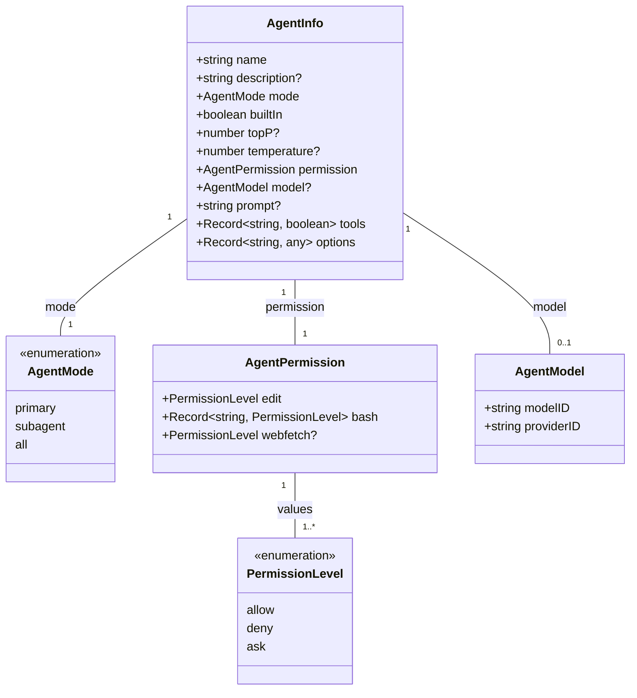
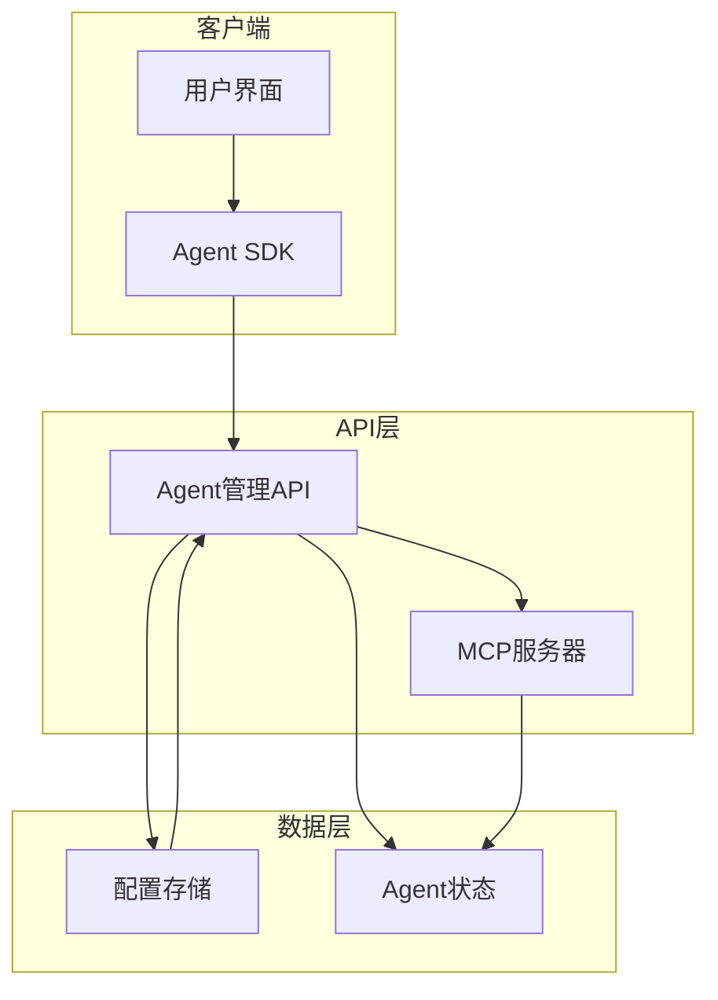

# Agent管理API

<cite>
**本文档引用的文件**
- [agent.ts](file://packages/opencode/src/agent/agent.ts)
- [server.ts](file://packages/opencode/src/server/server.ts)
- [AGENTS.md](file://AGENTS.md)
- [03-agent-management.md](file://doc-agent-context/03-agent-management.md)
</cite>

## 目录
1. [简介](#简介)
2. [核心端点](#核心端点)
3. [Agent元数据响应Schema](#agent元数据响应schema)
4. [Agent能力声明](#agent能力声明)
5. [配置参数](#配置参数)
6. [MCP服务器集成](#mcp服务器集成)
7. [代码示例](#代码示例)
8. [结论](#结论)

## 简介
Agent管理API为opencode系统提供了全面的AI Agent管理功能。该API允许用户发现、配置和与各种AI Agent进行交互，支持动态切换不同的AI模型（如Claude、GPT、Gemini）。系统通过预定义的内置Agent和可配置的自定义Agent，为不同的任务场景提供最佳的AI解决方案。API设计遵循REST原则，提供了清晰的端点来管理Agent生命周期和会话配置。

**Section sources**
- [03-agent-management.md](file://doc-agent-context/03-agent-management.md#L1-L50)

## 核心端点
Agent管理API提供了四个核心端点来管理AI Agent：

### 获取可用Agent列表 (GET /agents)
此端点返回系统中所有可用Agent的列表。响应包含每个Agent的基本信息，如名称、描述和模式。



**Diagram sources**
- [agent.ts](file://packages/opencode/src/agent/agent.ts#L142-L144)

### 获取Agent详情 (GET /agents/{name})
此端点返回指定名称Agent的详细信息，包括其配置、权限和工具设置。



**Diagram sources**
- [agent.ts](file://packages/opencode/src/agent/agent.ts#L138-L140)

### 设置会话的Agent (PATCH /sessions/{id}/agent)
此端点允许为指定会话设置或更改Agent，实现不同AI模型之间的动态切换。



**Diagram sources**
- [server.ts](file://packages/opencode/src/server/server.ts#L284-L335)

### 发送Agent特定指令
通过会话消息端点，可以向特定Agent发送指令，触发其执行相应任务。



**Diagram sources**
- [server.ts](file://packages/opencode/src/server/server.ts#L442-L491)

## Agent元数据响应Schema
Agent元数据响应遵循严格的Schema定义，确保数据的一致性和类型安全。



**Diagram sources**
- [agent.ts](file://packages/opencode/src/agent/agent.ts#L10-L40)

**Section sources**
- [agent.ts](file://packages/opencode/src/agent/agent.ts#L10-L40)

## Agent能力声明
Agent能力声明系统通过权限和工具配置来定义每个Agent的功能范围。

### 能力类型
系统支持以下能力类型：

| 能力类型 | 描述 | 默认值 |
|---------|------|-------|
| **工具调用** | 控制Agent调用特定工具的能力 | 根据Agent类型配置 |
| **流式响应** | 支持流式传输响应数据 | 启用 |
| **编辑权限** | 控制文件编辑权限 | allow/ask/deny |
| **命令执行** | 控制bash命令执行权限 | allow/ask/deny |
| **网络访问** | 控制webfetch工具访问权限 | allow/ask/deny |

### 权限继承机制
系统实现了智能的权限继承和合并机制：

```typescript
function mergeAgentPermissions(basePermission: any, overridePermission: any): Agent.Info["permission"] {
  const merged = mergeDeep(basePermission ?? {}, overridePermission ?? {})
  let mergedBash
  
  if (merged.bash) {
    if (typeof merged.bash === "string") {
      mergedBash = { "*": merged.bash }
    }
    if (typeof merged.bash === "object") {
      mergedBash = mergeDeep({ "*": "ask" }, merged.bash)
    }
  }
  
  return {
    edit: merged.edit ?? "allow",
    webfetch: merged.webfetch ?? "allow",
    bash: mergedBash ?? { "*": "allow" },
  }
}
```

**Section sources**
- [agent.ts](file://packages/opencode/src/agent/agent.ts#L180-L200)

## 配置参数
Agent配置参数允许用户微调AI模型的行为特征。

### 模型参数
| 参数 | 类型 | 描述 | 取值范围 |
|------|------|------|---------|
| **temperature** | number | 控制输出的随机性 | 0.0-2.0 |
| **topP** | number | 核采样参数 | 0.0-1.0 |

### Agent模式参数
| 模式 | 描述 | 使用场景 |
|------|------|---------|
| **primary** | 主要Agent，用于主要工作流 | 核心任务执行 |
| **subagent** | 子Agent，用于特定任务 | 辅助任务、研究 |
| **all** | 通用Agent | 通用场景 |

### 动态配置示例
```json
{
  "general": {
    "name": "general",
    "description": "通用目的Agent，用于研究复杂问题、搜索代码和执行多步任务。",
    "tools": {
      "todoread": false,
      "todowrite": false,
      "...defaultTools": true
    },
    "permission": {
      "edit": "allow",
      "bash": { "*": "allow" },
      "webfetch": "allow"
    },
    "mode": "subagent",
    "builtIn": true
  }
}
```

**Section sources**
- [03-agent-management.md](file://doc-agent-context/03-agent-management.md#L433-L533)

## MCP服务器集成
Agent管理系统与MCP服务器紧密集成，实现分布式Agent管理。

### 集成架构


**Diagram sources**
- [server.ts](file://packages/opencode/src/server/server.ts#L1-L50)

### 集成流程
1. 客户端通过SDK调用Agent管理API
2. API验证请求并转发到MCP服务器
3. MCP服务器处理分布式Agent管理任务
4. 状态更新同步回本地存储
5. 响应返回给客户端

## 代码示例
### curl示例
```bash
# 获取所有可用Agent
curl -X GET http://localhost:3000/agents

# 获取特定Agent详情
curl -X GET http://localhost:3000/agents/general

# 为会话设置Agent
curl -X PATCH http://localhost:3000/sessions/123/agent \
  -H "Content-Type: application/json" \
  -d '{
    "agent": "build",
    "model": {
      "providerID": "anthropic",
      "modelID": "claude-3-opus-20240229"
    },
    "temperature": 0.7,
    "topP": 0.9
  }'
```

### TypeScript示例
```typescript
// Agent配置管理器
class AgentConfigManager {
  private configs = new Map<string, Agent.Info>()
  
  async loadConfig(configPath: string): Promise<void> {
    const configData = await Bun.file(configPath).json()
    const agentConfigs = configData.agent || {}
    
    for (const [name, config] of Object.entries(agentConfigs)) {
      const agentConfig = this.buildAgentConfig(name, config as any)
      this.configs.set(name, agentConfig)
    }
  }
  
  getAgent(name: string): Agent.Info | null {
    return this.configs.get(name) || null
  }
  
  getAllAgents(): Agent.Info[] {
    return Array.from(this.configs.values())
  }
}
```

**Section sources**
- [03-agent-management.md](file://doc-agent-context/03-agent-management.md#L433-L533)

## 结论
Agent管理API为opencode系统提供了强大而灵活的AI Agent管理能力。通过标准化的端点设计和严格的Schema定义，API实现了Agent的发现、配置和交互功能。系统支持动态切换不同AI模型的Agent，满足多样化的任务需求。权限系统和工具集成机制确保了Agent操作的安全性和可控性。通过与MCP服务器的集成，系统实现了分布式Agent管理，为大规模AI应用提供了坚实的基础。