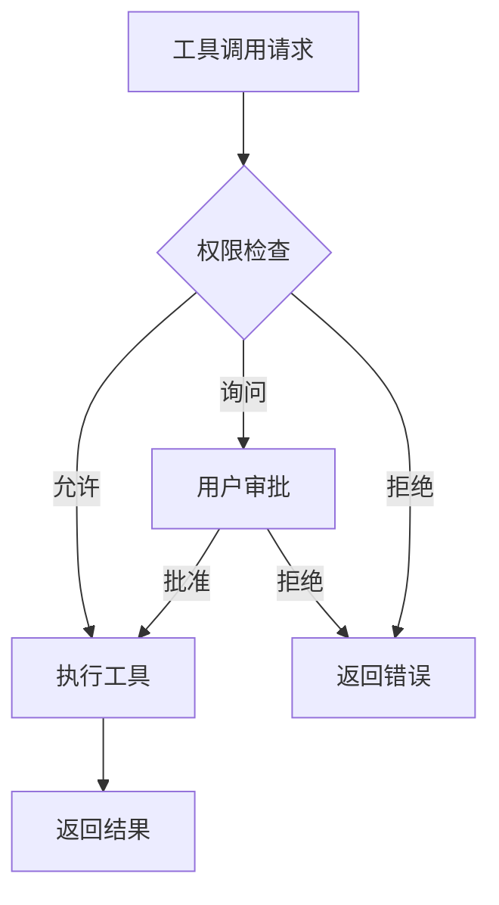
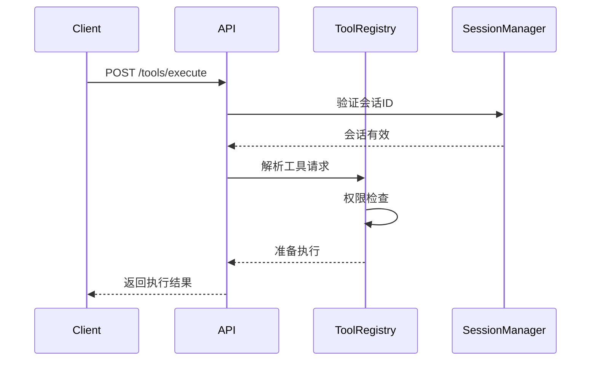

# 工具执行API

<cite>
**本文档引用文件**  
- [bash.ts](file://packages/opencode/src/tool/bash.ts)
- [read.ts](file://packages/opencode/src/tool/read.ts)
- [write.ts](file://packages/opencode/src/tool/write.ts)
- [grep.ts](file://packages/opencode/src/tool/grep.ts)
- [ls.ts](file://packages/opencode/src/tool/ls.ts)
- [webfetch.ts](file://packages/opencode/src/tool/webfetch.ts)
- [patch.ts](file://packages/opencode/src/tool/patch.ts)
- [edit.ts](file://packages/opencode/src/tool/edit.ts)
- [tool.ts](file://packages/opencode/src/tool/tool.ts)
- [registry.ts](file://packages/opencode/src/tool/registry.ts)
- [04-tool-integration.md](file://doc-agent-context/04-tool-integration.md)
- [05-permission-control.md](file://doc-agent-context/05-permission-control.md)
</cite>

## 目录
1. [简介](#简介)
2. [请求体结构](#请求体结构)
3. [执行模式](#执行模式)
4. [可用工具列表](#可用工具列表)
5. [工具沙箱与安全机制](#工具沙箱与安全机制)
6. [错误处理](#错误处理)
7. [会话上下文集成](#会话上下文集成)
8. [使用示例](#使用示例)

## 简介
工具执行API是OpenCode系统的核心功能，允许AI代理安全地执行各种内置工具和MCP（Model Context Protocol）工具。该API通过POST `/tools/execute`端点提供服务，支持对文件操作、命令执行、网络请求等关键功能的调用。系统实现了完整的权限控制、沙箱机制和输出管理，确保工具执行的安全性和可靠性。

**Section sources**
- [04-tool-integration.md](file://doc-agent-context/04-tool-integration.md#L1-L50)
- [05-permission-control.md](file://doc-agent-context/05-permission-control.md#L1-L50)

## 请求体结构
工具执行API的请求体包含以下关键字段：

- **tool**: 工具名称（字符串）
- **parameters**: 工具参数（JSON对象）
- **context**: 执行上下文，包含会话ID、消息ID等信息

请求体示例：
```json
{
  "tool": "bash",
  "parameters": {
    "command": "ls -la",
    "description": "Lists files in current directory"
  },
  "context": {
    "sessionID": "sess_123",
    "messageID": "msg_456"
  }
}
```

**Section sources**
- [tool.ts](file://packages/opencode/src/tool/tool.ts#L1-L45)
- [registry.ts](file://packages/opencode/src/tool/registry.ts#L21-L131)

## 执行模式
系统支持两种执行模式：

### 同步执行
同步执行模式下，API立即返回工具执行结果，包含输出内容和状态码。适用于快速、简单的操作。

响应格式：
```json
{
  "status": "completed",
  "output": "file content or command output",
  "metadata": {
    "exit": 0,
    "description": "command description"
  }
}
```

### 异步执行
异步执行模式下，API返回任务ID，客户端可通过SSE流或轮询方式获取执行结果。适用于耗时较长的操作。

响应格式：
```json
{
  "status": "running",
  "taskID": "task_789"
}
```

**Section sources**
- [04-tool-integration.md](file://doc-agent-context/04-tool-integration.md#L100-L200)
- [registry.ts](file://packages/opencode/src/tool/registry.ts#L100-L131)

## 可用工具列表
系统提供以下内置工具：

### 内置工具
| 工具名称 | 参数Schema | 描述 |
|---------|-----------|------|
| bash | `{command: string, timeout?: number, description: string}` | 执行shell命令 |
| read | `{filePath: string, offset?: number, limit?: number}` | 读取文件内容 |
| write | `{filePath: string, content: string}` | 写入文件内容 |
| grep | `{pattern: string, path?: string, include?: string}` | 搜索文件内容 |
| list | `{path?: string, ignore?: string[]}` | 列出目录内容 |
| webfetch | `{url: string, format: "text"|"markdown"|"html", timeout?: number}` | 获取网页内容 |
| patch | `{patchText: string}` | 应用补丁修改文件 |
| edit | `{filePath: string, oldString: string, newString: string, replaceAll?: boolean}` | 编辑文件内容 |

### MCP工具
通过MCP协议集成的外部工具，支持本地和远程MCP服务器连接。

**Section sources**
- [bash.ts](file://packages/opencode/src/tool/bash.ts#L1-L215)
- [read.ts](file://packages/opencode/src/tool/read.ts#L1-L163)
- [write.ts](file://packages/opencode/src/tool/write.ts#L1-L74)
- [grep.ts](file://packages/opencode/src/tool/grep.ts#L1-L117)
- [ls.ts](file://packages/opencode/src/tool/ls.ts#L1-L111)
- [webfetch.ts](file://packages/opencode/src/tool/webfetch.ts#L1-L188)
- [patch.ts](file://packages/opencode/src/tool/patch.ts#L1-L207)
- [edit.ts](file://packages/opencode/src/tool/edit.ts#L1-L627)

## 工具沙箱与安全机制
系统实施严格的沙箱机制和权限控制，确保工具执行的安全性。

### 沙箱限制
- 所有文件操作限制在项目目录内
- 命令执行限制在安全命令集内
- 网络请求限制在允许的域名范围内
- 输出长度限制为30,000字符

### 权限控制
系统采用基于策略的权限模型，支持细粒度的权限管理：



**Diagram sources**
- [05-permission-control.md](file://doc-agent-context/05-permission-control.md#L100-L200)
- [registry.ts](file://packages/opencode/src/tool/registry.ts#L100-L131)

**Section sources**
- [05-permission-control.md](file://doc-agent-context/05-permission-control.md#L1-L50)
- [registry.ts](file://packages/opencode/src/tool/registry.ts#L100-L131)

## 错误处理
系统提供全面的错误处理机制，涵盖各种异常情况。

### 错误类型
| 错误类型 | 描述 | 解决方案 |
|---------|------|---------|
| 工具未找到 | 指定的工具不存在 | 检查工具名称拼写 |
| 执行失败 | 工具执行过程中出错 | 检查参数和权限 |
| 超时 | 工具执行超过最大时限 | 优化操作或增加超时时间 |
| 权限拒绝 | 用户拒绝执行请求 | 重新请求或调整权限设置 |
| 文件不存在 | 指定的文件路径无效 | 检查文件路径和存在性 |

### 错误响应格式
```json
{
  "error": "Error message",
  "type": "error_type",
  "metadata": {
    "details": "additional information"
  }
}
```

**Section sources**
- [05-permission-control.md](file://doc-agent-context/05-permission-control.md#L500-L600)
- [tool.ts](file://packages/opencode/src/tool/tool.ts#L1-L45)

## 会话上下文集成
工具调用深度集成到会话上下文中，确保操作的连续性和一致性。

### 上下文管理
- 每个工具调用关联到特定会话ID
- 工具执行状态在会话中持久化
- 工具调用历史可追溯和审计
- 上下文感知的权限决策

### 集成流程


**Diagram sources**
- [04-tool-integration.md](file://doc-agent-context/04-tool-integration.md#L200-L300)
- [registry.ts](file://packages/opencode/src/tool/registry.ts#L21-L131)

**Section sources**
- [04-tool-integration.md](file://doc-agent-context/04-tool-integration.md#L1-L50)
- [registry.ts](file://packages/opencode/src/tool/registry.ts#L21-L131)

## 使用示例
以下示例展示如何安全地执行shell命令和文件操作工具。

### curl示例
执行shell命令：
```bash
curl -X POST https://api.opencode.com/tools/execute \
  -H "Content-Type: application/json" \
  -d '{
    "tool": "bash",
    "parameters": {
      "command": "ls -la",
      "description": "Lists files in current directory"
    },
    "context": {
      "sessionID": "sess_123",
      "messageID": "msg_456"
    }
  }'
```

读取文件内容：
```bash
curl -X POST https://api.opencode.com/tools/execute \
  -H "Content-Type: application/json" \
  -d '{
    "tool": "read",
    "parameters": {
      "filePath": "./package.json",
      "limit": 100
    },
    "context": {
      "sessionID": "sess_123",
      "messageID": "msg_456"
    }
  }'
```

### TypeScript代码示例
```typescript
// 工具客户端
class ToolClient {
  private baseUrl = 'https://api.opencode.com';
  
  async execute(tool: string, parameters: any, sessionId: string) {
    const response = await fetch(`${this.baseUrl}/tools/execute`, {
      method: 'POST',
      headers: {
        'Content-Type': 'application/json',
      },
      body: JSON.stringify({
        tool,
        parameters,
        context: {
          sessionID: sessionId,
          messageID: `msg_${Date.now()}`
        }
      })
    });
    
    if (!response.ok) {
      throw new Error(`Tool execution failed: ${await response.text()}`);
    }
    
    return response.json();
  }
  
  // 安全执行shell命令
  async safeBash(command: string, sessionId: string) {
    const description = await this.generateCommandDescription(command);
    return this.execute('bash', {
      command,
      description
    }, sessionId);
  }
  
  // 安全写入文件
  async safeWrite(filePath: string, content: string, sessionId: string) {
    if (!this.isValidFilePath(filePath)) {
      throw new Error('Invalid file path');
    }
    
    return this.execute('write', {
      filePath,
      content
    }, sessionId);
  }
  
  private isValidFilePath(filePath: string): boolean {
    // 验证文件路径安全性
    return !filePath.includes('..') && 
           !filePath.startsWith('/') &&
           filePath.length < 256;
  }
  
  private async generateCommandDescription(command: string): Promise<string> {
    // 生成命令描述
    const descriptions: {[key: string]: string} = {
      'ls': 'Lists files in current directory',
      'git status': 'Shows working tree status',
      'npm install': 'Installs package dependencies'
    };
    
    for (const [cmd, desc] of Object.entries(descriptions)) {
      if (command.startsWith(cmd)) {
        return desc;
      }
    }
    
    return 'Executes a shell command';
  }
}
```

**Section sources**
- [bash.ts](file://packages/opencode/src/tool/bash.ts#L1-L215)
- [read.ts](file://packages/opencode/src/tool/read.ts#L1-L163)
- [write.ts](file://packages/opencode/src/tool/write.ts#L1-L74)