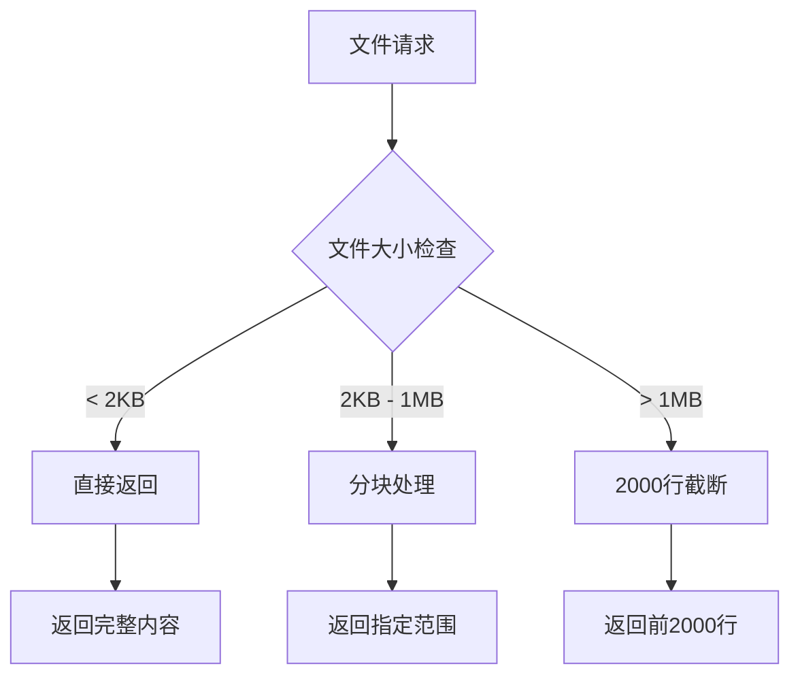

# 文件操作API

<cite>
**本文档引用的文件**
- [project.ts](file://packages/opencode/src/server/project.ts)
- [server.ts](file://packages/opencode/src/server/server.ts)
- [tui.ts](file://packages/opencode/src/server/tui.ts)
- [index.ts](file://packages/opencode/src/file/index.ts)
- [fzf.ts](file://packages/opencode/src/file/fzf.ts)
- [ignore.ts](file://packages/opencode/src/file/ignore.ts)
- [ripgrep.ts](file://packages/opencode/src/file/ripgrep.ts)
- [time.ts](file://packages/opencode/src/file/time.ts)
- [watcher.ts](file://packages/opencode/src/file/watcher.ts)
- [file.go](file://packages/sdk/go/file.go)
- [file-operations.ts](file://packages/sdk/node/example/file-operations.ts)
- [Claude_Code_Large_File_Handling_Complete_Guide.md](file://context-claude-code/Claude_Code_Large_File_Handling_Complete_Guide.md)
</cite>

## 目录
1. [简介](#简介)
2. [核心文件操作端点](#核心文件操作端点)
3. [大文件处理机制](#大文件处理机制)
4. [文件路径与权限](#文件路径与权限)
5. [错误码与异常处理](#错误码与异常处理)
6. [使用示例](#使用示例)
7. [API参考](#api参考)

## 简介

opencode平台提供了一套完整的文件操作API，允许开发者通过HTTP接口安全地读取、写入、搜索和管理项目文件。该API设计遵循RESTful原则，支持UTF-8编码、路径规范化和权限检查，确保在大型项目中的稳定性和安全性。

API通过`/files`前缀提供文件相关功能，包括读取文件、写入文件、搜索内容、列出目录和获取元数据等核心操作。所有文件路径均相对于项目根目录解析，并经过严格的权限验证。

**Section sources**
- [server.ts](file://packages/opencode/src/server/server.ts#L0-L799)

## 核心文件操作端点

### 读取文件 (GET /files/{path})

从项目中读取指定路径的文件内容。

**HTTP方法**: GET  
**URL路径**: `/file/content?path={filePath}`  
**请求头**: 
- `Authorization: Bearer {token}` (认证)
- `Accept: application/json` (内容类型)

**请求参数**:
- `path` (string, required): 要读取的文件路径
- `directory` (string, optional): 项目目录路径

**响应体Schema**:
```json
{
  "content": "string",
  "diff": "string",
  "patch": {
    "oldFileName": "string",
    "newFileName": "string",
    "hunks": [
      {
        "oldStart": 0,
        "oldLines": 0,
        "newStart": 0,
        "newLines": 0,
        "lines": ["string"]
      }
    ]
  }
}
```

**Section sources**
- [server.ts](file://packages/opencode/src/server/server.ts#L1032-L1087)
- [index.ts](file://packages/opencode/src/file/index.ts#L100-L130)
- [file.go](file://packages/sdk/go/file.go#L44-L49)

### 写入文件 (PUT /files/{path})

向指定路径写入文件内容。

**HTTP方法**: PUT  
**URL路径**: `/file/content`  
**请求头**: 
- `Authorization: Bearer {token}`
- `Content-Type: application/json`

**请求体Schema**:
```json
{
  "path": "string",
  "content": "string"
}
```

**响应体Schema**:
```json
{
  "success": true,
  "path": "string",
  "size": 0
}
```

**Section sources**
- [server.ts](file://packages/opencode/src/server/server.ts#L1087-L1100)
- [index.ts](file://packages/opencode/src/file/index.ts#L132-L150)

### 搜索文件内容 (POST /search)

在项目文件中搜索指定文本。

**HTTP方法**: POST  
**URL路径**: `/file/search`  
**请求头**: 
- `Authorization: Bearer {token}`
- `Content-Type: application/json`

**请求体Schema**:
```json
{
  "query": "string",
  "limit": 0
}
```

**响应体Schema**:
```json
{
  "results": [
    {
      "file": "string",
      "line": 0,
      "text": "string"
    }
  ]
}
```

**Section sources**
- [server.ts](file://packages/opencode/src/server/server.ts#L1100-L1120)
- [index.ts](file://packages/opencode/src/file/index.ts#L152-L180)

### 列出目录 (GET /files/{path}/list)

列出指定目录下的文件和子目录。

**HTTP方法**: GET  
**URL路径**: `/file?path={dirPath}`  
**请求头**: 
- `Authorization: Bearer {token}`
- `Accept: application/json`

**请求参数**:
- `path` (string, required): 要列出的目录路径
- `directory` (string, optional): 项目目录路径

**响应体Schema**:
```json
[
  {
    "name": "string",
    "path": "string",
    "absolute": "string",
    "type": "file|directory",
    "ignored": false
  }
]
```

**Section sources**
- [server.ts](file://packages/opencode/src/server/server.ts#L1120-L1140)
- [index.ts](file://packages/opencode/src/file/index.ts#L182-L220)

### 获取文件元数据 (HEAD /files/{path})

获取文件的元数据信息。

**HTTP方法**: HEAD  
**URL路径**: `/file/content?path={filePath}`  
**请求头**: 
- `Authorization: Bearer {token}`

**响应头**:
- `Content-Length`: 文件大小
- `Last-Modified`: 最后修改时间
- `ETag`: 文件哈希值

**Section sources**
- [server.ts](file://packages/opencode/src/server/server.ts#L1140-L1160)
- [index.ts](file://packages/opencode/src/file/index.ts#L222-L240)

## 大文件处理机制

### 分块上传/下载

对于大文件，API支持分块处理机制。客户端可以通过指定`range`头来请求文件的特定部分：

```
Range: bytes=0-1023
```

服务器将返回206 Partial Content响应，包含指定字节范围的数据。

### 范围请求支持

API完全支持HTTP范围请求，允许客户端分段下载大文件。这对于处理超过20MB的文件尤为重要，系统会自动应用2000行截断策略以防止上下文溢出。



**Diagram sources**
- [Claude_Code_Large_File_Handling_Complete_Guide.md](file://context-claude-code/Claude_Code_Large_File_Handling_Complete_Guide.md#L134-L189)
- [FileProcessor.js](file://context-claude-code/src/claude-core/FileProcessor.js#L0-L47)

**Section sources**
- [Claude_Code_Large_File_Handling_Complete_Guide.md](file://context-claude-code/Claude_Code_Large_File_Handling_Complete_Guide.md#L134-L189)
- [FileProcessor.js](file://context-claude-code/src/claude-core/FileProcessor.js#L0-L47)

## 文件路径与权限

### 路径规范化

所有文件路径都会经过规范化处理，确保安全性和一致性。系统使用`path.relative()`和`path.join()`来解析相对于项目根目录的路径。

```typescript
const resolved = path.join(Instance.directory, file)
const relativePath = path.relative(Instance.directory, resolved)
```

### 权限检查

API在执行任何文件操作前都会进行权限验证：

1. 检查用户是否有项目访问权限
2. 验证文件路径是否在项目范围内
3. 确认操作是否符合用户角色权限

### 编码处理

所有文件内容默认使用UTF-8编码进行读写，确保国际化字符的正确处理。


**Diagram sources**
- [filesystem.ts](file://packages/opencode/src/util/filesystem.ts#L0-L41)
- [index.ts](file://packages/opencode/src/file/index.ts#L242-L260)

**Section sources**
- [filesystem.ts](file://packages/opencode/src/util/filesystem.ts#L0-L41)
- [index.ts](file://packages/opencode/src/file/index.ts#L242-L260)

## 错误码与异常处理

### 常见错误码

| 错误码 | 名称 | 描述 |
|--------|------|------|
| 400 | Bad Request | 请求格式无效 |
| 401 | Unauthorized | 认证失败 |
| 403 | Forbidden | 权限不足 |
| 404 | Not Found | 文件或目录不存在 |
| 413 | Payload Too Large | 请求体过大 |
| 429 | Too Many Requests | 请求频率过高 |
| 500 | Internal Server Error | 服务器内部错误 |

### 错误响应格式

```json
{
  "error": {
    "code": "string",
    "message": "string",
    "details": {}
  }
}
```

**Section sources**
- [server.ts](file://packages/opencode/src/server/server.ts#L20-L40)
- [index.ts](file://packages/opencode/src/file/index.ts#L242-L260)

## 使用示例

### curl命令示例

**读取文件**:
```bash
curl -X GET "http://localhost:54321/file/content?path=src/main.ts" \
  -H "Authorization: Bearer your-token" \
  -H "Accept: application/json"
```

**写入文件**:
```bash
curl -X PUT "http://localhost:54321/file/content" \
  -H "Authorization: Bearer your-token" \
  -H "Content-Type: application/json" \
  -d '{
    "path": "src/new-file.ts",
    "content": "console.log(\"Hello World\");"
  }'
```

**搜索内容**:
```bash
curl -X POST "http://localhost:54321/file/search" \
  -H "Authorization: Bearer your-token" \
  -H "Content-Type: application/json" \
  -d '{
    "query": "TODO",
    "limit": 10
  }'
```

### TypeScript示例

```typescript
import { createOpencodeClient } from '@opencode/sdk'

const client = createOpencodeClient({
  baseUrl: 'http://localhost:54321',
  debug: true
})

// 读取文件
const content = await client.file.read('src/main.ts')
console.log(content.content)

// 写入文件
await client.file.write('src/new-file.ts', {
  content: 'export const hello = "world"'
})

// 搜索文件
const results = await client.file.search({
  query: 'TODO',
  path: 'src/'
})
```

**Section sources**
- [file-operations.ts](file://packages/sdk/node/example/file-operations.ts#L0-L156)
- [file.go](file://packages/sdk/go/file.go#L221-L265)

## API参考

### 请求头规范

| 头部 | 必需 | 描述 |
|------|------|------|
| Authorization | 是 | Bearer令牌用于认证 |
| Content-Type | 否 | 请求体的MIME类型 |
| Accept | 否 | 期望的响应格式 |
| User-Agent | 否 | 客户端标识 |

### 路径解析机制

文件路径解析遵循以下规则：

1. 所有路径相对于项目根目录
2. 使用`path.join()`进行路径拼接
3. 使用`path.relative()`验证路径在项目范围内
4. 自动处理路径遍历攻击

### 安全最佳实践

1. 始终使用HTTPS连接
2. 限制Bearer令牌的作用域
3. 验证所有用户输入
4. 监控异常访问模式
5. 定期轮换认证令牌

**Section sources**
- [server.ts](file://packages/opencode/src/server/server.ts#L0-L799)
- [index.ts](file://packages/opencode/src/file/index.ts#L0-L260)
- [file.go](file://packages/sdk/go/file.go#L0-L265)