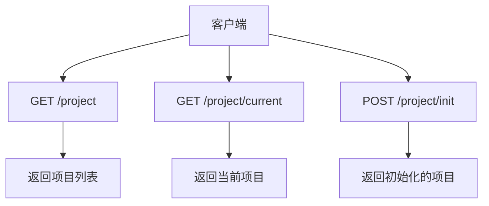
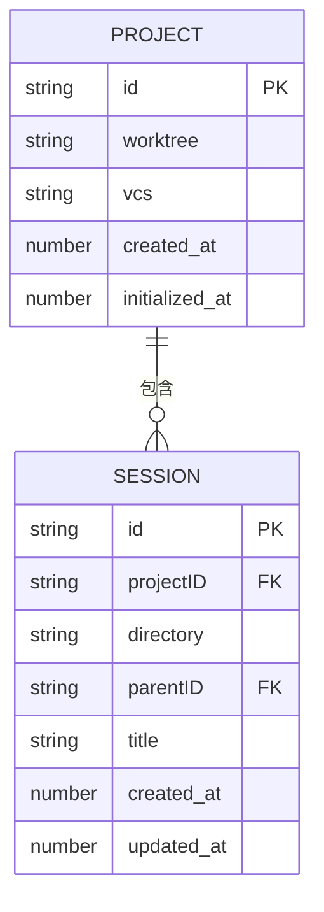

# 项目管理API

<cite>
**本文档中引用的文件**  
- [project.ts](file://packages/opencode/src/project/project.ts)
- [project.md](file://specs/project.md)
- [config.ts](file://packages/opencode/src/config/config.ts)
- [server.ts](file://packages/opencode/src/server/server.ts)
- [session.ts](file://packages/opencode/src/session/index.ts)
</cite>

## 目录
1. [简介](#简介)
2. [项目管理API端点](#项目管理api端点)
3. [项目配置与加载](#项目配置与加载)
4. [项目与会话关系](#项目与会话关系)
5. [权限与设置](#权限与设置)
6. [API使用示例](#api使用示例)
7. [多根工作区支持](#多根工作区支持)

## 简介
项目管理API为opencode平台提供了核心的项目生命周期管理功能。该API允许用户通过HTTP端点管理代码项目，包括项目初始化、状态查询和文件树刷新等操作。系统支持单个实例同时管理多个项目，并为每个项目维护独立的会话环境。项目信息包括唯一标识符、工作树路径、版本控制系统信息以及创建和初始化时间戳。

**Section sources**
- [project.md](file://specs/project.md#L0-L65)

## 项目管理API端点
项目管理API提供了一系列RESTful端点来管理代码项目。核心端点包括获取项目列表、获取当前项目信息以及项目初始化。



**Diagram sources**
- [project.ts](file://packages/opencode/src/project/project.ts#L0-L93)
- [server.ts](file://packages/opencode/src/server/server.ts#L106-L156)

### 获取项目列表
`GET /project` 端点返回系统中所有项目的列表。每个项目包含以下信息：
- **id**: 项目的唯一标识符
- **worktree**: 项目的工作树路径
- **vcs**: 版本控制系统类型（目前仅支持git）
- **time**: 时间戳对象，包含创建时间和可选的初始化时间

该端点通过`Project.list()`方法实现，该方法从存储中读取所有项目信息并返回。

### 获取当前项目
`GET /current` 端点返回当前活动项目的信息。此信息存储在`Instance.project`中，代表当前工作会话所关联的项目。该端点对于需要了解当前上下文环境的客户端非常有用。

### 项目初始化
项目初始化通过`fromDirectory`函数实现，该函数分析指定目录以确定项目属性。如果目录包含.git文件夹，则使用git仓库的根哈希作为项目ID；否则创建一个全局项目。初始化过程还包括将项目信息写入存储系统。

**Section sources**
- [project.ts](file://packages/opencode/src/project/project.ts#L0-L93)

## 项目配置与加载
项目配置系统支持多层级配置加载，允许在不同层级覆盖设置。配置可以来自多个来源，包括全局配置、项目级配置文件和环境变量。

### 配置加载顺序
配置加载遵循特定的优先级顺序：
1. 全局配置（~/.config/opencode/config.json）
2. 项目级配置（项目根目录下的opencode.jsonc或opencode.json）
3. 自定义配置文件（通过OPENCODE_CONFIG环境变量指定）
4. 目录级配置（.opencode目录中的配置文件）


**Diagram sources**
- [config.ts](file://packages/opencode/src/config/config.ts#L0-L726)

### .opencode配置文件
`.opencode`目录用于存储项目级别的配置，支持以下子目录：
- **agent**: 存储代理配置
- **command**: 存储命令配置
- **mode**: 存储模式配置
- **plugin**: 存储插件脚本
- **tool**: 存储工具配置
- **themes**: 存储主题文件

配置文件使用Markdown格式，前端YAML元数据块包含配置选项，正文部分包含提示模板。

**Section sources**
- [config.ts](file://packages/opencode/src/config/config.ts#L0-L726)

## 项目与会话关系
在opencode系统中，项目与会话之间存在一对多的关系。单个项目可以拥有多个会话，每个会话代表一个独立的工作环境。

### 会话生命周期
会话的生命周期由以下关键组件管理：
- **Session.create**: 创建新会话
- **Session.get**: 获取现有会话
- **Session.remove**: 删除会话及其子会话
- **Session.share**: 共享会话
- **Session.unshare**: 取消共享会话

每个会话都有唯一的ID、创建时间、更新时间以及可选的压缩时间戳。会话可以有父会话，形成会话树结构。



**Diagram sources**
- [session.ts](file://packages/opencode/src/session/index.ts#L0-L348)
- [project.ts](file://packages/opencode/src/project/project.ts#L0-L93)

## 权限与设置
项目级别的权限和设置直接影响会话行为和工具执行。权限系统控制对敏感操作的访问，如文件编辑、bash命令执行和网络获取。

### 权限模型
权限可以设置为以下值之一：
- **ask**: 每次执行前询问用户
- **allow**: 无条件允许执行
- **deny**: 禁止执行

权限可以全局设置，也可以针对特定工具或命令进行细化。例如，可以允许所有bash命令，但禁止特定危险命令。

### 设置继承
项目设置会继承到其所有会话中。当创建新会话时，会话会继承项目当前的配置，包括：
- 代理配置
- 命令配置
- 插件列表
- LSP服务器配置
- 格式化工具配置

这确保了在项目上下文中的一致行为。

**Section sources**
- [config.ts](file://packages/opencode/src/config/config.ts#L0-L726)
- [session.ts](file://packages/opencode/src/session/index.ts#L0-L348)

## API使用示例
以下示例展示了如何使用项目管理API初始化项目环境。

### curl示例
```bash
# 获取所有项目
curl -X GET http://localhost:54321/project

# 获取当前项目
curl -X GET http://localhost:54321/project/current

# 获取项目配置
curl -X GET http://localhost:54321/config
```

### TypeScript示例
```typescript
import { createOpencodeClient } from '@opencode/sdk'

async function initializeProjectEnvironment() {
  const client = createOpencodeClient({
    baseUrl: 'http://localhost:54321'
  })

  // 获取当前项目
  const project = await client.project.getCurrent()
  console.log(`当前项目: ${project.worktree}`)

  // 获取项目配置
  const config = await client.config.get()
  console.log(`使用模型: ${config.model}`)
  
  // 创建新会话
  const session = await client.session.create({
    directory: project.worktree
  })
  
  return { project, config, session }
}
```

**Section sources**
- [session.ts](file://packages/opencode/src/session/index.ts#L0-L348)
- [config.ts](file://packages/opencode/src/config/config.ts#L0-L726)

## 多根工作区支持
系统支持多根工作区，允许单个实例管理多个独立的项目。每个项目都有自己的工作树和配置，确保项目间的隔离性。

当在不同项目目录间切换时，系统会自动检测并加载相应的项目配置。这种设计使得开发者可以在同一工具实例中高效地在多个项目间切换，而无需重新启动应用或手动调整配置。

**Section sources**
- [project.md](file://specs/project.md#L0-L65)
- [project.ts](file://packages/opencode/src/project/project.ts#L0-L93)