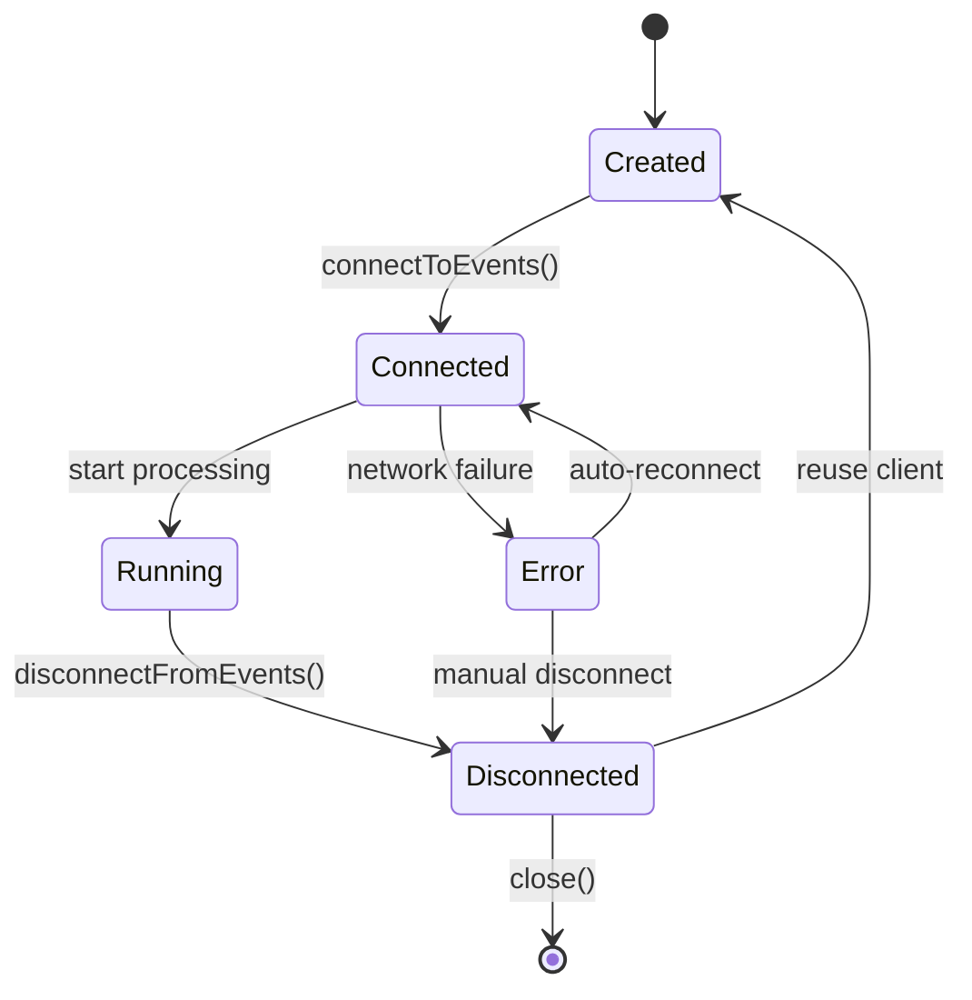
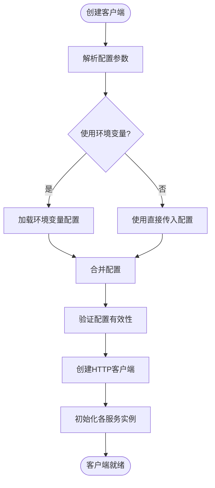
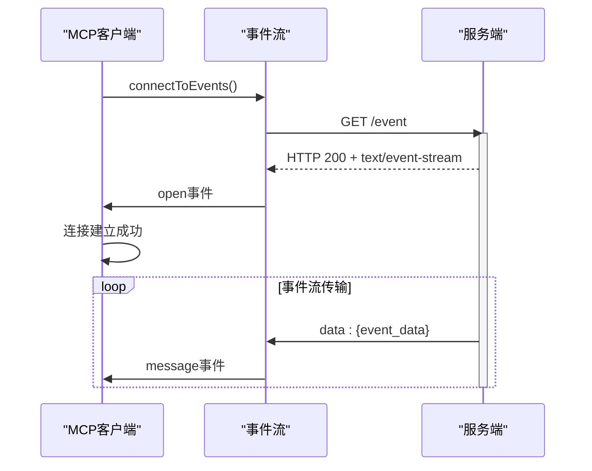
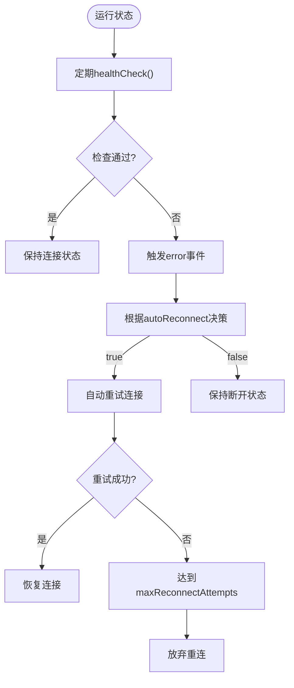
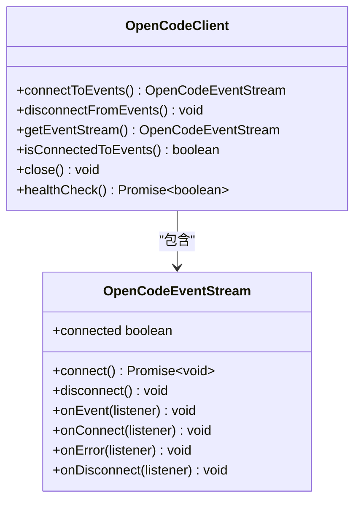
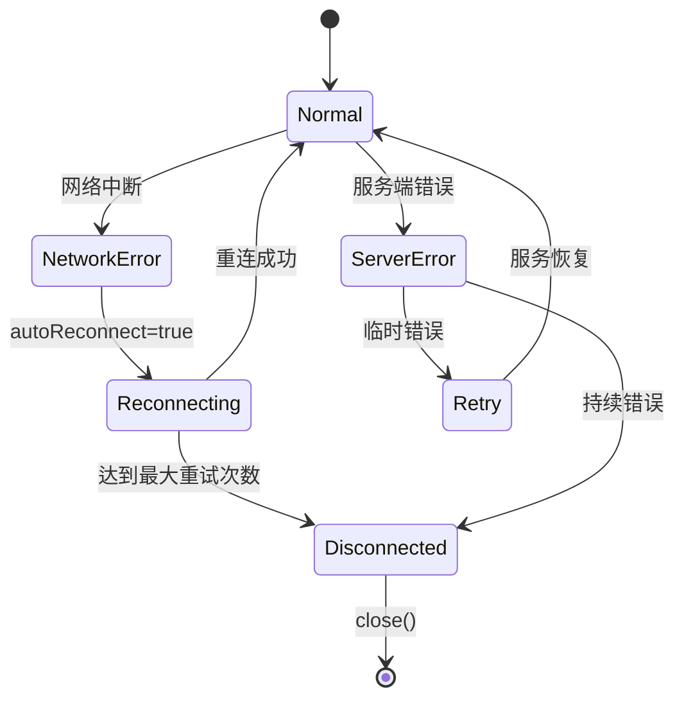
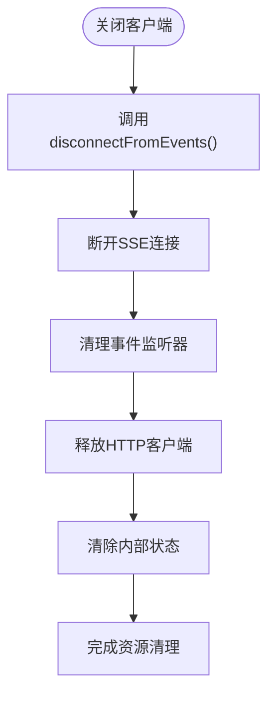

# MCP客户端生命周期管理

<cite>
**本文档引用的文件**  
- [client.ts](file://packages/sdk/node/src/client.ts)
- [sse.ts](file://packages/sdk/node/src/streaming/sse.ts)
- [index.ts](file://packages/sdk/node/src/index.ts)
</cite>

## 目录
1. [简介](#简介)
2. [生命周期概述](#生命周期概述)
3. [客户端创建与初始化](#客户端创建与初始化)
4. [连接建立与认证](#连接建立与认证)
5. [运行时状态监控](#运行时状态监控)
6. [API控制操作](#api控制操作)
7. [异常场景下的状态迁移](#异常场景下的状态迁移)
8. [资源清理与销毁](#资源清理与销毁)
9. [总结](#总结)

## 简介
本文档详细阐述MCP客户端从创建、连接、运行到销毁的完整生命周期。重点分析客户端在不同阶段的行为机制，包括初始化配置、连接建立、状态监控、异常处理和资源管理等方面，为开发者提供全面的生命周期管理指导。

## 生命周期概述
MCP客户端的生命周期可分为四个主要阶段：创建、连接、运行和销毁。每个阶段都有明确的状态和行为特征，客户端通过事件驱动机制在不同状态间迁移，确保稳定性和可靠性。

**图示来源**
- [client.ts](file://packages/sdk/node/src/client.ts#L30-L201)
- [sse.ts](file://packages/sdk/node/src/streaming/sse.ts#L30-L203)

## 客户端创建与初始化
客户端创建通过`OpenCodeClient`构造函数完成，支持配置参数传入和环境变量加载两种方式。初始化过程包括配置解析、HTTP客户端创建和服务实例化。

配置参数设置支持以下关键选项：
- `baseUrl`: 服务端基础URL
- `apiKey`: 认证密钥
- `validateConfig`: 是否验证配置
- `useEnvConfig`: 是否使用环境变量

**图示来源**
- [client.ts](file://packages/sdk/node/src/client.ts#L60-L95)
- [index.ts](file://packages/sdk/node/src/index.ts#L71-L73)

**本节来源**
- [client.ts](file://packages/sdk/node/src/client.ts#L30-L201)
- [index.ts](file://packages/sdk/node/src/index.ts#L71-L73)

## 连接建立与认证
连接建立通过`connectToEvents()`方法触发，采用Server-Sent Events (SSE)协议实现双向通信。连接过程中包含握手协议和基于Bearer Token的认证机制。

连接流程如下：
1. 创建`OpenCodeEventStream`实例
2. 设置认证头信息
3. 发起SSE连接请求
4. 处理连接响应
5. 建立事件监听

认证机制通过在请求头中添加`Authorization: Bearer <token>`实现，其中token来源于客户端配置的`apiKey`。

**图示来源**
- [client.ts](file://packages/sdk/node/src/client.ts#L130-L150)
- [sse.ts](file://packages/sdk/node/src/streaming/sse.ts#L48-L133)

**本节来源**
- [client.ts](file://packages/sdk/node/src/client.ts#L130-L150)
- [sse.ts](file://packages/sdk/node/src/streaming/sse.ts#L48-L133)

## 运行时状态监控
客户端运行时通过多种机制监控连接健康状态，包括心跳检测、连接状态检查和自动重连策略。

状态监控主要特性：
- **心跳检测**: 通过持续的SSE连接保持活动状态
- **连接健康检查**: 提供`healthCheck()`方法验证服务可达性
- **自动重连**: 配置`autoReconnect`选项实现断线重连
- **事件监听**: 支持连接、消息、错误和断开事件的监听

**图示来源**
- [client.ts](file://packages/sdk/node/src/client.ts#L180-L195)
- [sse.ts](file://packages/sdk/node/src/streaming/sse.ts#L30-L203)

**本节来源**
- [client.ts](file://packages/sdk/node/src/client.ts#L180-L195)
- [sse.ts](file://packages/sdk/node/src/streaming/sse.ts#L30-L203)

## API控制操作
客户端提供一系列API方法用于控制生命周期，包括启动、暂停、重启和关闭操作。

主要控制API：
- `connectToEvents()`: 建立事件连接
- `disconnectFromEvents()`: 断开事件连接
- `getEventStream()`: 获取事件流实例
- `isConnectedToEvents()`: 检查连接状态
- `close()`: 关闭客户端并清理资源

**图示来源**
- [client.ts](file://packages/sdk/node/src/client.ts#L130-L170)
- [sse.ts](file://packages/sdk/node/src/streaming/sse.ts#L215-L317)

**本节来源**
- [client.ts](file://packages/sdk/node/src/client.ts#L130-L170)
- [sse.ts](file://packages/sdk/node/src/streaming/sse.ts#L215-L317)

## 异常场景下的状态迁移
在不同异常场景下，客户端表现出特定的状态迁移行为，确保系统的健壮性。

### 网络中断场景
当发生网络中断时：
1. SSE连接断开，触发`error`事件
2. 如果`autoReconnect`为true，开始重试连接
3. 重试次数达到`maxReconnectAttempts`后停止
4. 应用程序可监听错误事件进行相应处理

### 服务端崩溃场景
当服务端崩溃时：
1. 连接超时或返回错误状态码
2. 客户端进入错误状态
3. 根据配置决定是否自动重连
4. 提供健康检查接口验证服务恢复

**图示来源**
- [client.ts](file://packages/sdk/node/src/client.ts#L150-L170)
- [sse.ts](file://packages/sdk/node/src/streaming/sse.ts#L48-L133)

**本节来源**
- [client.ts](file://packages/sdk/node/src/client.ts#L150-L170)
- [sse.ts](file://packages/sdk/node/src/streaming/sse.ts#L48-L133)

## 资源清理与销毁
客户端提供完善的资源清理机制，防止内存泄漏和其他资源泄露问题。

资源清理包括：
- 断开所有活动连接
- 清理事件监听器
- 释放HTTP客户端资源
- 清除内部缓存数据

销毁流程通过`close()`方法触发，该方法会：
1. 调用`disconnectFromEvents()`断开事件流
2. 清理事件流引用
3. 确保所有异步操作被取消
4. 释放相关资源

**图示来源**
- [client.ts](file://packages/sdk/node/src/client.ts#L190-L200)
- [sse.ts](file://packages/sdk/node/src/streaming/sse.ts#L138-L145)

**本节来源**
- [client.ts](file://packages/sdk/node/src/client.ts#L190-L200)
- [sse.ts](file://packages/sdk/node/src/streaming/sse.ts#L138-L145)

## 总结
MCP客户端的生命周期管理设计充分考虑了稳定性、可靠性和易用性。通过清晰的状态划分和完善的事件机制，客户端能够在各种正常和异常场景下正确处理状态迁移。配置灵活性和丰富的API支持使得开发者能够根据具体需求定制客户端行为。资源清理机制有效防止了内存泄漏问题，确保长期运行的稳定性。