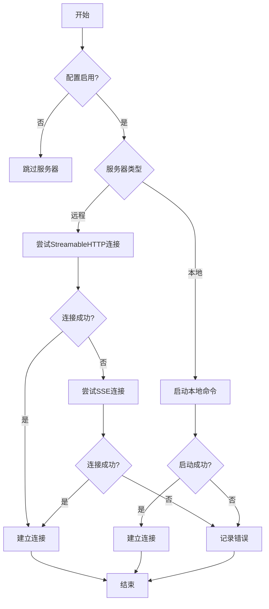
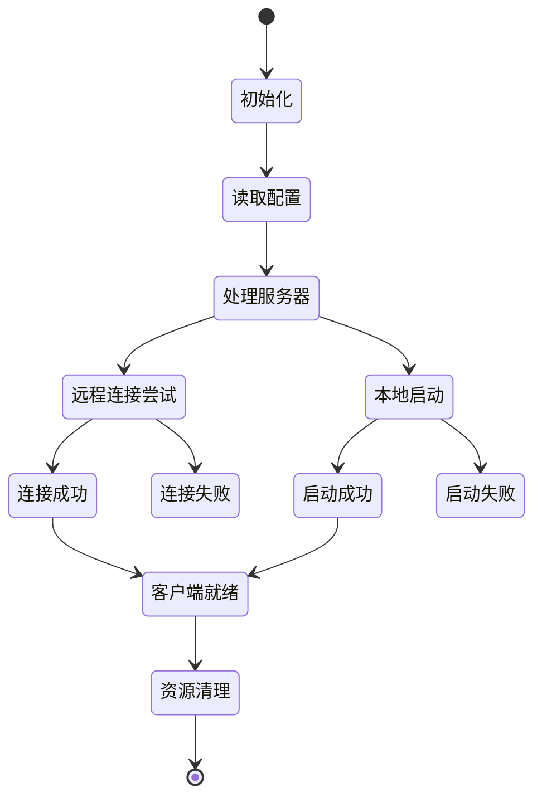
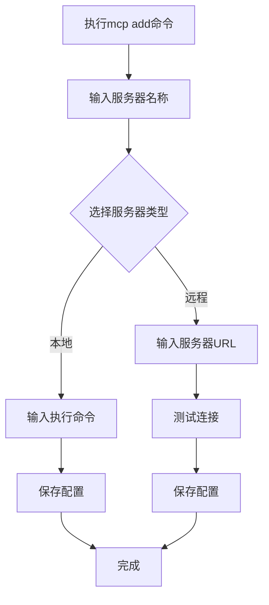
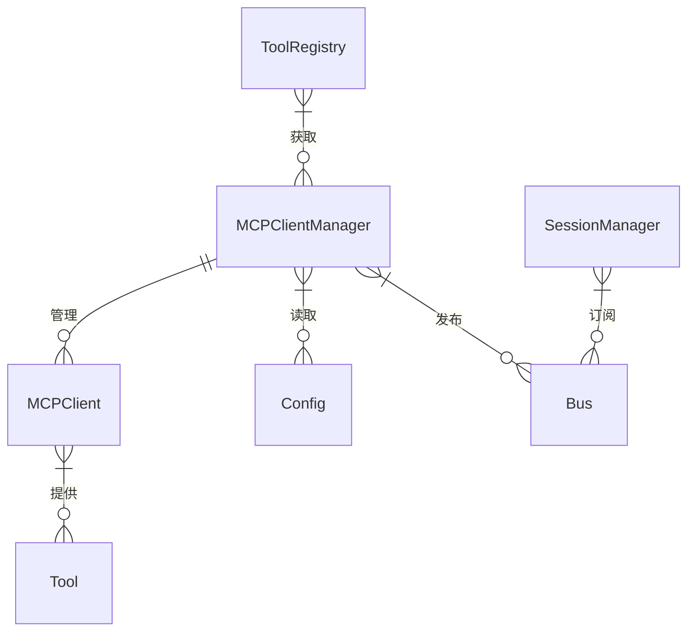

# MCP客户端管理

<cite>
**本文档引用的文件**
- [mcp/index.ts](file://packages/opencode/src/mcp/index.ts)
- [config/config.ts](file://packages/opencode/src/config/config.ts)
- [cli/cmd/mcp.ts](file://packages/opencode/src/cli/cmd/mcp.ts)
- [04-tool-integration.md](file://doc-agent-context/04-tool-integration.md)
</cite>

## 目录
1. [MCP客户端管理器设计与实现](#mcp客户端管理器设计与实现)
2. [生命周期管理](#生命周期管理)
3. [并发连接与负载均衡](#并发连接与负载均衡)
4. [API使用示例](#api使用示例)
5. [事件监听机制](#事件监听机制)
6. [系统集成](#系统集成)

## MCP客户端管理器设计与实现

MCP客户端管理器负责协调本地和远程MCP服务器的连接与通信。管理器通过配置文件中的`mcp`字段定义服务器配置，支持本地和远程两种连接类型。

对于远程MCP服务器，管理器尝试使用多种传输协议进行连接，包括StreamableHTTP和SSE。系统会依次尝试这些传输方式，并在成功建立连接后停止尝试。连接过程中会记录详细的日志信息，包括连接成功或失败的状态。

对于本地MCP服务器，管理器通过StdioClientTransport启动指定命令来创建连接。在启动过程中，会设置必要的环境变量，包括为特定命令设置`BUN_BE_BUN=1`环境变量。

**图表来源**
- [mcp/index.ts](file://packages/opencode/src/mcp/index.ts#L22-L139)

**本节来源**
- [mcp/index.ts](file://packages/opencode/src/mcp/index.ts#L22-L139)
- [config/config.ts](file://packages/opencode/src/config/config.ts#L247-L278)

## 生命周期管理

MCP客户端管理器实现了完整的生命周期管理，包括连接建立、状态监控和资源清理。

连接建立过程在`Instance.state`的初始化函数中完成，该函数会读取配置并为每个启用的MCP服务器创建客户端实例。系统使用异步方式处理连接过程，确保不会阻塞主程序执行。

状态监控通过日志系统实现，记录连接过程中的关键事件，包括：
- 服务器发现
- 传输协议连接尝试
- 连接成功或失败
- 客户端关闭

资源清理在`Instance.state`的清理函数中实现，当实例被销毁时，会自动关闭所有MCP客户端连接，确保资源得到正确释放。

**图表来源**
- [mcp/index.ts](file://packages/opencode/src/mcp/index.ts#L22-L139)

**本节来源**
- [mcp/index.ts](file://packages/opencode/src/mcp/index.ts#L22-L139)

## 并发连接与负载均衡

MCP客户端管理器支持同时管理多个MCP服务器实例的并发连接。系统通过配置文件中的`mcp`对象，可以定义多个服务器配置，每个配置都有唯一的键名标识。

对于远程服务器，系统实现了故障转移策略。当首选的StreamableHTTP传输失败时，会自动尝试SSE传输作为备用方案。这种多传输协议支持提高了连接的可靠性。

虽然当前实现没有明确的负载均衡策略，但通过`tools()`函数将所有客户端的工具合并到一个统一的工具集合中，实现了工具级别的负载分发。当AI模型选择工具时，可以根据工具的特性和性能特征间接实现负载均衡。

错误处理机制确保了连接的稳定性。对于远程连接失败，系统会发布错误事件到事件总线，通知相关组件。对于本地服务器启动失败，同样会记录错误日志并通知用户。

**本节来源**
- [mcp/index.ts](file://packages/opencode/src/mcp/index.ts#L22-L139)
- [04-tool-integration.md](file://doc-agent-context/04-tool-integration.md#L509-L571)

## API使用示例

通过CLI命令可以创建和管理MCP客户端实例。`mcp add`命令提供了交互式界面，让用户可以添加新的MCP服务器配置。

**图表来源**
- [cli/cmd/mcp.ts](file://packages/opencode/src/cli/cmd/mcp.ts#L0-L79)

**本节来源**
- [cli/cmd/mcp.ts](file://packages/opencode/src/cli/cmd/mcp.ts#L0-L79)

## 事件监听机制

MCP客户端管理器通过事件总线机制实现事件监听。当连接出现问题时，系统会发布错误事件到`Bus`，其他组件可以订阅这些事件并做出相应处理。

错误事件包含详细的错误信息，包括：
- 错误类型
- 服务器名称
- 错误消息
- 连接URL（远程服务器）
- 执行命令（本地服务器）

这种事件驱动的架构使得系统各组件之间保持松耦合，提高了系统的可维护性和扩展性。

**本节来源**
- [mcp/index.ts](file://packages/opencode/src/mcp/index.ts#L59-L88)
- [mcp/index.ts](file://packages/opencode/src/mcp/index.ts#L90-L139)

## 系统集成

MCP客户端管理器与核心系统其他组件紧密集成，特别是工具注册表和会话管理器。

与工具注册表的集成通过`tools()`函数实现，该函数将所有MCP客户端的工具转换为系统可用的工具格式，并进行名称规范化处理，避免命名冲突。

与会话管理器的集成通过事件总线实现。当MCP连接出现问题时，会通过`Bus.publish(Session.Event.Error, ...)`通知会话管理器，确保用户能够及时了解连接状态。

配置系统为MCP客户端管理器提供了灵活的配置能力。通过`Config.get()`获取配置，支持多种配置文件格式和位置，包括项目根目录和用户配置目录。

**图表来源**
- [mcp/index.ts](file://packages/opencode/src/mcp/index.ts#L22-L139)
- [04-tool-integration.md](file://doc-agent-context/04-tool-integration.md#L223-L333)

**本节来源**
- [mcp/index.ts](file://packages/opencode/src/mcp/index.ts#L22-L139)
- [04-tool-integration.md](file://doc-agent-context/04-tool-integration.md#L223-L333)
- [config/config.ts](file://packages/opencode/src/config/config.ts#L247-L278)