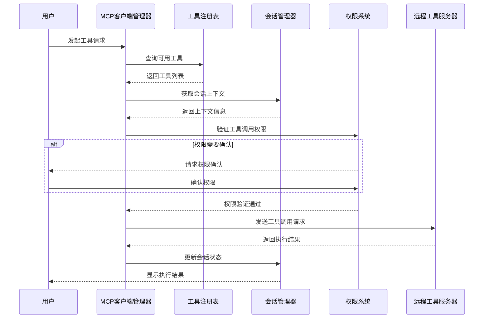

# 与核心系统的集成机制

<cite>
**本文档中引用的文件**  
- [registry.ts](file://packages/opencode/src/tool/registry.ts)
- [mcp/index.ts](file://packages/opencode/src/mcp/index.ts)
- [session/index.ts](file://packages/opencode/src/session/index.ts)
- [permission/index.ts](file://packages/opencode/src/permission/index.ts)
- [doc-agent-context/04-tool-integration.md](file://doc-agent-context/04-tool-integration.md)
- [doc-agent-context/02-session-management.md](file://doc-agent-context/02-session-management.md)
- [doc-agent-context/07-context-compaction.md](file://doc-agent-context/07-context-compaction.md)
- [doc-agent-context/05-permission-control.md](file://doc-agent-context/05-permission-control.md)
</cite>

## 目录
1. [MCP客户端管理器与工具注册表集成](#mcp客户端管理器与工具注册表集成)
2. [会话管理器与上下文系统集成](#会话管理器与上下文系统集成)
3. [权限验证机制](#权限验证机制)
4. [上下文压缩与敏感信息过滤](#上下文压缩与敏感信息过滤)
5. [集成时序图](#集成时序图)

## MCP客户端管理器与工具注册表集成

MCP客户端管理器通过`MCP`命名空间实现与工具注册表的深度集成。在客户端启动时，系统会自动连接配置的MCP服务器（包括本地和远程），并从服务器获取可用工具列表。这些工具通过`tools()`函数进行注册，工具ID会根据客户端名称和工具名称进行规范化处理，确保唯一性。

当连接断开或应用关闭时，`state`的清理函数会自动执行，调用所有客户端的`close()`方法，实现优雅的注销机制。这种基于`Instance.state`的状态管理确保了资源的正确释放。

工具注册表通过`ToolRegistry`命名空间管理所有工具，包括内置工具、自定义工具和MCP工具。`tools()`函数会合并所有来源的工具，并通过`enabled()`函数根据Agent的权限配置动态启用或禁用特定工具。

**本节来源**
- [mcp/index.ts](file://packages/opencode/src/mcp/index.ts#L1-L157)
- [registry.ts](file://packages/opencode/src/tool/registry.ts#L21-L131)
- [doc-agent-context/04-tool-integration.md](file://doc-agent-context/04-tool-integration.md#L183-L213)

## 会话管理器与上下文系统集成

会话管理器通过`Session`命名空间实现与上下文系统的深度集成。每个会话都有唯一的ID和生命周期，通过`create()`和`createNext()`函数创建。会话状态通过`Instance.state`进行持久化管理，确保在应用重启后仍能恢复。

上下文系统通过消息机制传递会话上下文。每个消息包含多个部分（`Part`），如文本、推理、文件、工具调用等。当需要执行工具调用时，会话管理器会将当前上下文（包括会话ID、消息ID等）传递给工具执行环境，支持上下文感知的工具调用。

会话状态变更通过事件总线（`Bus`）进行通知，实现了松耦合的组件通信。`Event.Updated`事件会在会话更新时发布，其他组件可以订阅这些事件以响应会话状态变化。

**本节来源**
- [session/index.ts](file://packages/opencode/src/session/index.ts#L0-L348)
- [doc-agent-context/02-session-management.md](file://doc-agent-context/02-session-management.md#L0-L799)

## 权限验证机制

权限验证机制通过`Permission`命名空间实现，采用基于策略的权限模型。系统支持三种权限级别：`allow`（允许）、`ask`（询问）、`deny`（拒绝）。权限检查在工具调用前执行，通过`ask()`函数发起权限请求。

当需要用户确认时，系统会创建一个权限请求对象，包含请求类型、会话ID、消息ID等信息，并通过事件总线发布`Event.Updated`事件。用户可以通过`respond()`函数进行响应，选择"一次允许"、"始终允许"或"拒绝"。

权限状态通过`state`进行管理，包括待处理的请求（`pending`）和已批准的权限（`approved`）。已批准的权限会根据模式匹配（`Wildcard.match`）进行检查，避免重复询问。

**本节来源**
- [permission/index.ts](file://packages/opencode/src/permission/index.ts#L0-L181)
- [doc-agent-context/05-permission-control.md](file://doc-agent-context/05-permission-control.md#L0-L799)

## 上下文压缩与敏感信息过滤

上下文压缩机制在`doc-agent-context/07-context-compaction.md`中有详细描述。当上下文超过模型限制时，系统会自动触发压缩。压缩策略包括清理旧的工具调用输出和生成会话摘要。

敏感信息过滤主要通过权限控制实现。在工具执行前，系统会检查相关权限，阻止潜在的危险操作。例如，`bash`工具会检查命令是否包含危险操作（如`rm -rf`），`edit`工具会检查文件路径是否受保护。

上下文压缩还涉及信息密度优化，通过AI驱动的摘要生成保留关键信息，同时移除冗余内容。这确保了在有限的上下文窗口内，AI模型仍能获得足够的上下文信息。

**本节来源**
- [doc-agent-context/07-context-compaction.md](file://doc-agent-context/07-context-compaction.md#L0-L799)
- [doc-agent-context/05-permission-control.md](file://doc-agent-context/05-permission-control.md#L0-L799)

## 集成时序图

**图表来源**
- [mcp/index.ts](file://packages/opencode/src/mcp/index.ts#L1-L157)
- [registry.ts](file://packages/opencode/src/tool/registry.ts#L21-L131)
- [session/index.ts](file://packages/opencode/src/session/index.ts#L0-L348)
- [permission/index.ts](file://packages/opencode/src/permission/index.ts#L0-L181)