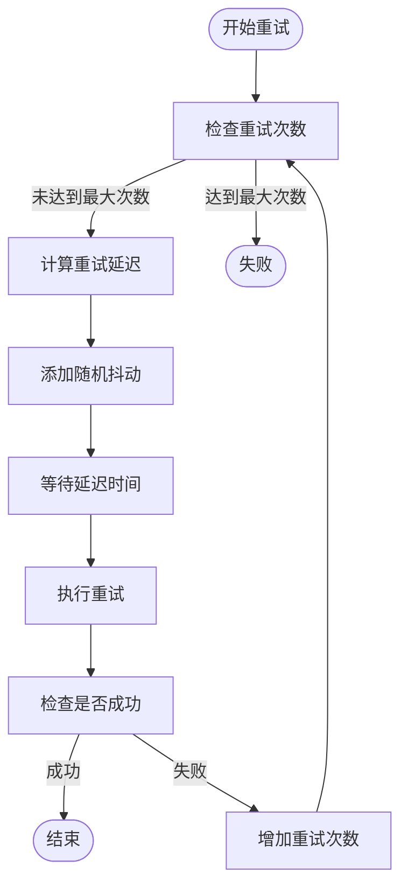
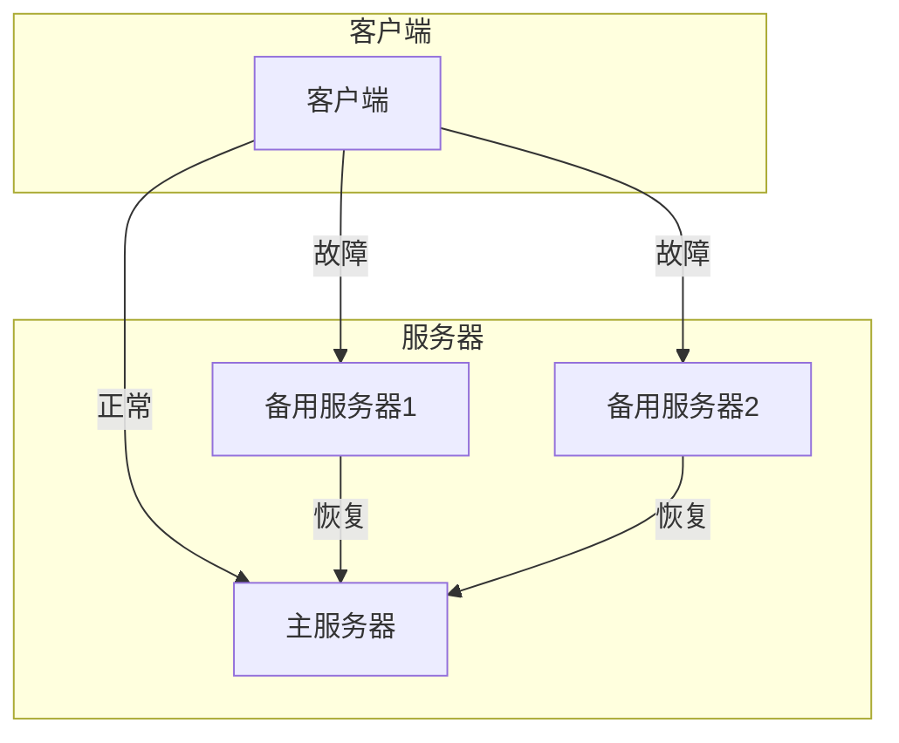
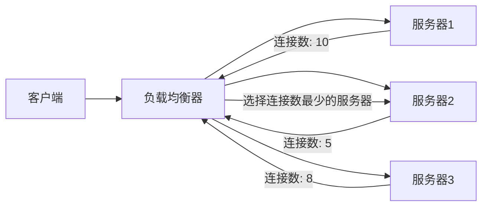
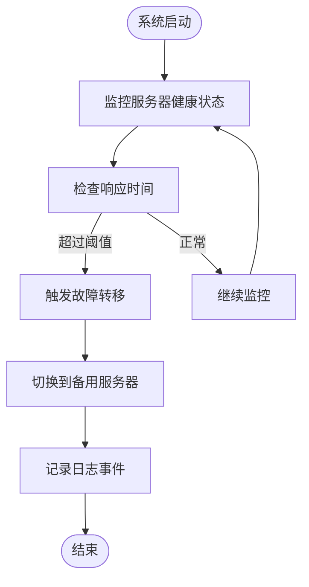

# 故障转移与高可用策略

<cite>
**本文档引用的文件**  
- [index.ts](file://packages/opencode/src/mcp/index.ts)
- [ErrorHandlingSystem.js](file://context-claude-code/src/error/ErrorHandlingSystem.js)
- [requestconfig.go](file://packages/sdk/go/internal/requestconfig/requestconfig.go)
- [config.ts](file://packages/opencode/src/config/config.ts)
</cite>

## 目录
1. [引言](#引言)
2. [连接失败时的退避重试机制](#连接失败时的退避重试机制)
3. [多服务器实例间的故障转移逻辑](#多服务器实例间的故障转移逻辑)
4. [负载均衡策略](#负载均衡策略)
5. [配置示例](#配置示例)
6. [日志记录与监控指标](#日志记录与监控指标)
7. [结论](#结论)

## 引言
本文档系统性地介绍了MCP客户端管理器在面对网络波动、服务不可用等异常情况下的容错机制。文档详细说明了连接失败时的退避重试算法、多服务器实例间的故障转移逻辑与优先级选择策略，以及负载均衡的实现方式。此外，还提供了配置示例，展示了如何定义备用服务器列表和故障恢复阈值，并结合日志记录与监控指标，说明了如何实现故障诊断与自动恢复流程。

## 连接失败时的退避重试机制

### 指数退避算法
MCP客户端管理器在连接失败时采用指数退避算法进行重试。该算法通过逐步增加重试间隔时间，避免在短时间内对服务端造成过大的压力。具体实现中，重试间隔时间从基础延迟开始，每次重试后按指数增长，直到达到最大延迟时间。此外，为了防止多个客户端同时重试导致的“惊群效应”，算法还引入了随机抖动，使得重试时间更加分散。



**图示来源**
- [ErrorHandlingSystem.js](file://context-claude-code/src/error/ErrorHandlingSystem.js#L214-L274)

**本节来源**
- [ErrorHandlingSystem.js](file://context-claude-code/src/error/ErrorHandlingSystem.js#L214-L274)

## 多服务器实例间的故障转移逻辑

### 故障转移与优先级选择
MCP客户端管理器支持多服务器实例间的故障转移。当主服务器不可用时，客户端会自动切换到备用服务器。故障转移的优先级选择策略基于服务器的健康状态和响应时间。客户端会定期检查各服务器的健康状态，并根据响应时间动态调整优先级。当主服务器恢复后，客户端会自动切换回主服务器，确保服务的高可用性。



**图示来源**
- [index.ts](file://packages/opencode/src/mcp/index.ts#L22-L60)

**本节来源**
- [index.ts](file://packages/opencode/src/mcp/index.ts#L22-L60)

## 负载均衡策略

### 轮询与最少连接数调度
MCP客户端管理器支持多种负载均衡策略，包括轮询和最少连接数调度。轮询策略将请求均匀地分配给所有服务器，适用于服务器性能相近的场景。最少连接数调度策略则将请求分配给当前连接数最少的服务器，适用于服务器性能差异较大的场景。这两种策略可以根据实际需求进行选择和配置。



**图示来源**
- [requestconfig.go](file://packages/sdk/go/internal/requestconfig/requestconfig.go#L426-L472)

**本节来源**
- [requestconfig.go](file://packages/sdk/go/internal/requestconfig/requestconfig.go#L426-L472)

## 配置示例

### 定义备用服务器列表和故障恢复阈值
以下是一个配置示例，展示了如何定义备用服务器列表和故障恢复阈值。通过配置文件，可以指定主服务器和备用服务器的URL，以及故障恢复的阈值。当主服务器的响应时间超过阈值时，客户端会自动切换到备用服务器。

```json
{
  "mcp": {
    "primary": {
      "type": "remote",
      "url": "http://primary-server.com",
      "headers": {
        "Authorization": "Bearer token"
      }
    },
    "backup1": {
      "type": "remote",
      "url": "http://backup1-server.com",
      "headers": {
        "Authorization": "Bearer token"
      }
    },
    "backup2": {
      "type": "remote",
      "url": "http://backup2-server.com",
      "headers": {
        "Authorization": "Bearer token"
      }
    },
    "failoverThreshold": 5000
  }
}
```

**本节来源**
- [config.ts](file://packages/opencode/src/config/config.ts#L247-L278)

## 日志记录与监控指标

### 故障诊断与自动恢复
MCP客户端管理器通过详细的日志记录和监控指标，实现了故障诊断与自动恢复。日志记录包括连接失败、重试、故障转移等关键事件，帮助运维人员快速定位问题。监控指标则包括服务器的健康状态、响应时间、连接数等，通过这些指标可以实时监控系统的运行状态。当检测到故障时，系统会自动触发故障转移和重试机制，确保服务的连续性。



**图示来源**
- [requestconfig.go](file://packages/sdk/go/internal/requestconfig/requestconfig.go#L387-L424)

**本节来源**
- [requestconfig.go](file://packages/sdk/go/internal/requestconfig/requestconfig.go#L387-L424)

## 结论
本文档详细介绍了MCP客户端管理器在面对网络波动、服务不可用等异常情况下的容错机制。通过指数退避算法、多服务器实例间的故障转移逻辑、负载均衡策略以及详细的日志记录与监控指标，MCP客户端管理器能够有效应对各种异常情况，确保服务的高可用性和稳定性。通过合理的配置，可以进一步优化系统的性能和可靠性。