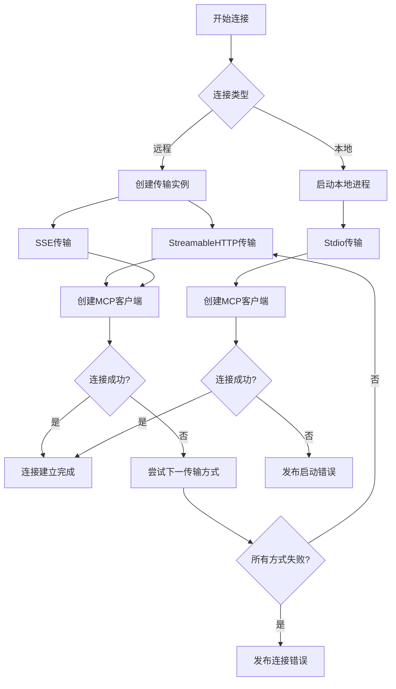
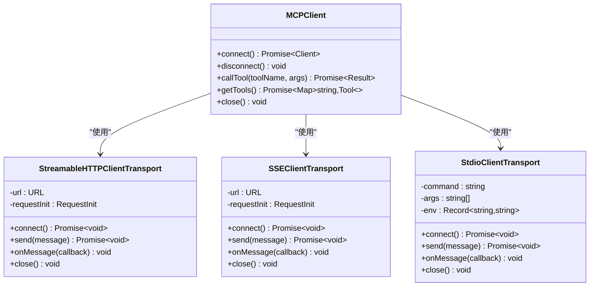
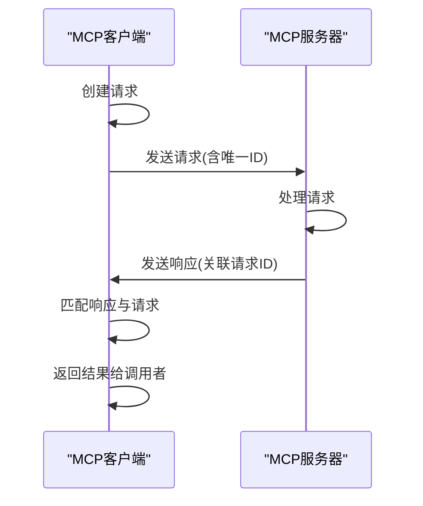
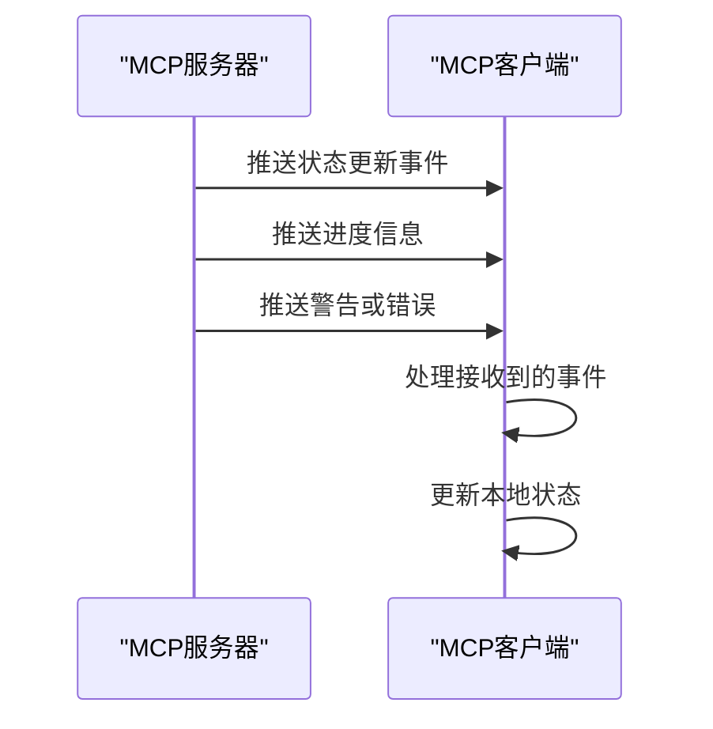
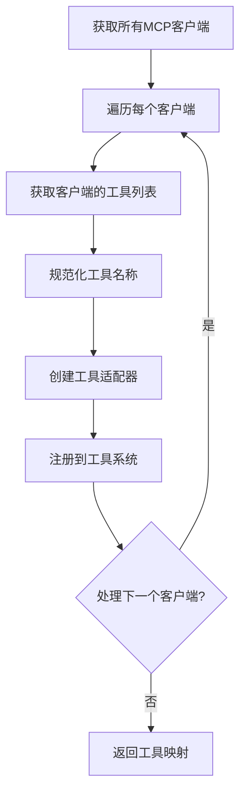
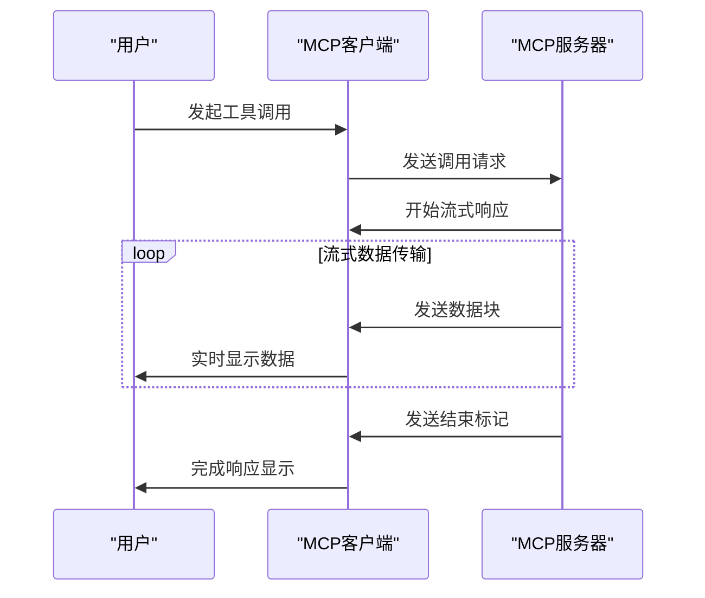
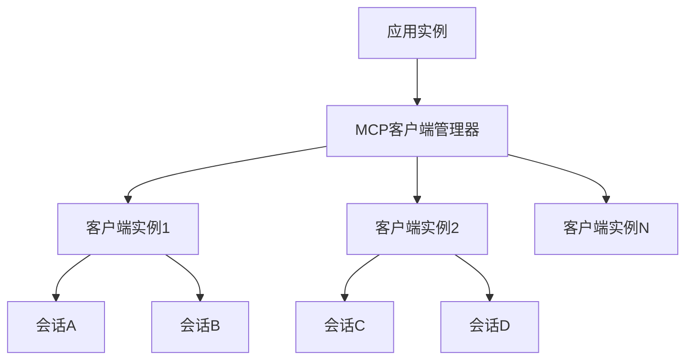
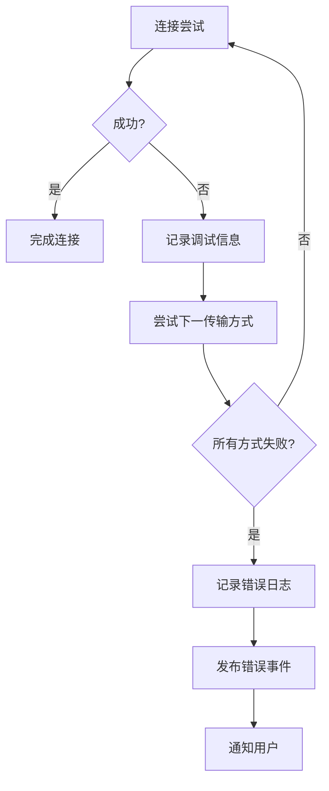
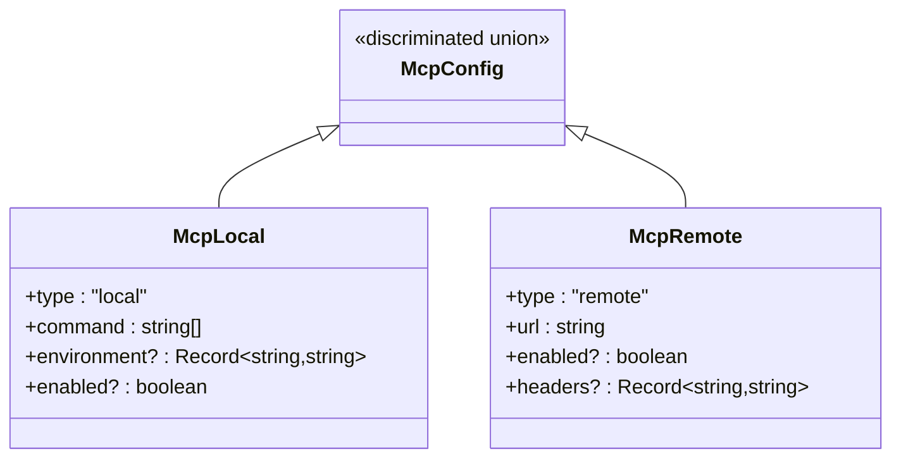

# 连接管理与通信协议

<cite>
**本文档中引用的文件**  
- [index.ts](file://packages/opencode/src/mcp/index.ts)
- [config.ts](file://packages/opencode/src/config/config.ts)
- [mcp.ts](file://packages/opencode/src/cli/cmd/mcp.ts)
</cite>

## 目录
1. [引言](#引言)
2. [连接建立机制](#连接建立机制)
3. [通信协议实现](#通信协议实现)
4. [消息处理流程](#消息处理流程)
5. [工具调用与响应处理](#工具调用与响应处理)
6. [多路复用连接管理](#多路复用连接管理)
7. [错误处理与重试策略](#错误处理与重试策略)
8. [配置与管理](#配置与管理)

## 引言
本文档深入解析MCP（Model Context Protocol）客户端与服务器之间的连接建立过程和通信协议实现。系统支持本地和远程MCP服务器的连接，通过多种传输机制确保通信的可靠性和灵活性。文档详细说明了基于HTTP流和SSE的连接机制、消息序列化格式以及请求-响应模式的处理流程。

## 连接建立机制

系统实现了灵活的MCP客户端连接机制，支持远程和本地两种连接类型。对于远程MCP服务器，系统尝试多种传输方式以确保连接成功。



**Diagram sources**
- [index.ts](file://packages/opencode/src/mcp/index.ts#L22-L60)
- [index.ts](file://packages/opencode/src/mcp/index.ts#L90-L139)

**Section sources**
- [index.ts](file://packages/opencode/src/mcp/index.ts#L1-L157)

## 通信协议实现

MCP通信协议基于标准化的消息格式和传输层封装，支持JSON-RPC风格的请求-响应模式。系统使用Model Context Protocol SDK提供的传输层实现，确保跨平台兼容性。

### 传输层实现
系统支持多种传输协议，按优先级顺序尝试连接：

1. **StreamableHTTP**: 基于HTTP流的双向通信
2. **SSE (Server-Sent Events)**: 服务器推送事件流
3. **Stdio**: 标准输入输出流（用于本地进程）

每种传输方式都封装在相应的Transport类中，提供统一的API接口。

### 消息序列化
所有MCP通信都使用JSON格式进行序列化，遵循以下结构：
- 请求消息包含操作类型、参数和唯一标识符
- 响应消息包含结果数据、状态码和关联的请求ID
- 错误消息包含错误类型、消息和堆栈信息



**Diagram sources**
- [index.ts](file://packages/opencode/src/mcp/index.ts#L5-L10)
- [index.ts](file://packages/opencode/src/mcp/index.ts#L22-L60)

**Section sources**
- [index.ts](file://packages/opencode/src/mcp/index.ts#L1-L157)

## 消息处理流程

系统实现了完整的请求-响应处理流程，包括消息ID跟踪、超时控制和异步处理机制。

### 请求-响应模式


### 服务端推送事件
系统支持服务端主动推送事件，用于实时通知和状态更新：



**Diagram sources**
- [index.ts](file://packages/opencode/src/mcp/index.ts#L59-L88)
- [index.ts](file://packages/opencode/src/mcp/index.ts#L90-L139)

**Section sources**
- [index.ts](file://packages/opencode/src/mcp/index.ts#L1-L157)

## 工具调用与响应处理

系统提供了统一的工具调用接口，将MCP服务器的工具集成到本地工具系统中。

### 工具调用流程


### 流式响应处理
系统支持流式响应处理，能够处理大体积或持续生成的数据：



**Diagram sources**
- [index.ts](file://packages/opencode/src/mcp/index.ts#L140-L157)
- [index.ts](file://packages/opencode/src/mcp/index.ts#L22-L60)

**Section sources**
- [index.ts](file://packages/opencode/src/mcp/index.ts#L1-L157)

## 多路复用连接管理

系统通过Instance.state机制管理MCP客户端的生命周期，实现连接的多路复用和资源优化。

### 连接管理策略
- **连接池化**: 复用已建立的连接，减少连接开销
- **按需连接**: 只在需要时建立连接，节省资源
- **自动清理**: 在应用关闭时自动关闭所有连接
- **错误恢复**: 连接失败后自动尝试备用传输方式

### 会话隔离
不同会话的通信数据通过客户端实例进行隔离，确保数据安全和上下文独立：



**Diagram sources**
- [index.ts](file://packages/opencode/src/mcp/index.ts#L22-L139)

**Section sources**
- [index.ts](file://packages/opencode/src/mcp/index.ts#L1-L157)

## 错误处理与重试策略

系统实现了全面的错误处理机制，确保连接的可靠性和用户体验。

### 错误处理流程


### 重试策略
- **传输方式重试**: 按优先级顺序尝试不同的传输协议
- **自动恢复**: 在配置允许的情况下自动重试连接
- **错误传播**: 将底层错误信息转换为用户友好的提示
- **降级处理**: 当主要连接方式失败时使用备用方案

**Section sources**
- [index.ts](file://packages/opencode/src/mcp/index.ts#L59-L88)
- [index.ts](file://packages/opencode/src/mcp/index.ts#L90-L139)

## 配置与管理

系统通过配置文件灵活管理MCP服务器的连接参数和行为。

### 配置结构
```json
{
  "mcp": {
    "server-name": {
      "type": "remote|local",
      "url": "https://example.com",
      "command": ["bun", "start", "mcp-server"],
      "headers": {
        "Authorization": "Bearer token"
      },
      "environment": {
        "VAR_NAME": "value"
      },
      "enabled": true
    }
  }
}
```

### 配置类型
系统使用zod库定义了严格的配置类型验证：



**Diagram sources**
- [config.ts](file://packages/opencode/src/config/config.ts#L247-L278)
- [index.ts](file://packages/opencode/src/mcp/index.ts#L22-L60)

**Section sources**
- [config.ts](file://packages/opencode/src/config/config.ts#L247-L278)
- [index.ts](file://packages/opencode/src/mcp/index.ts#L1-L157)