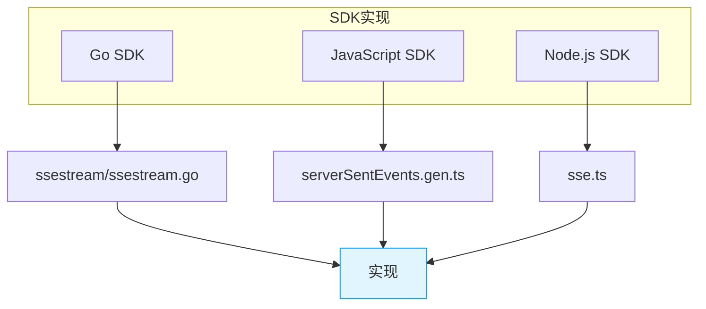
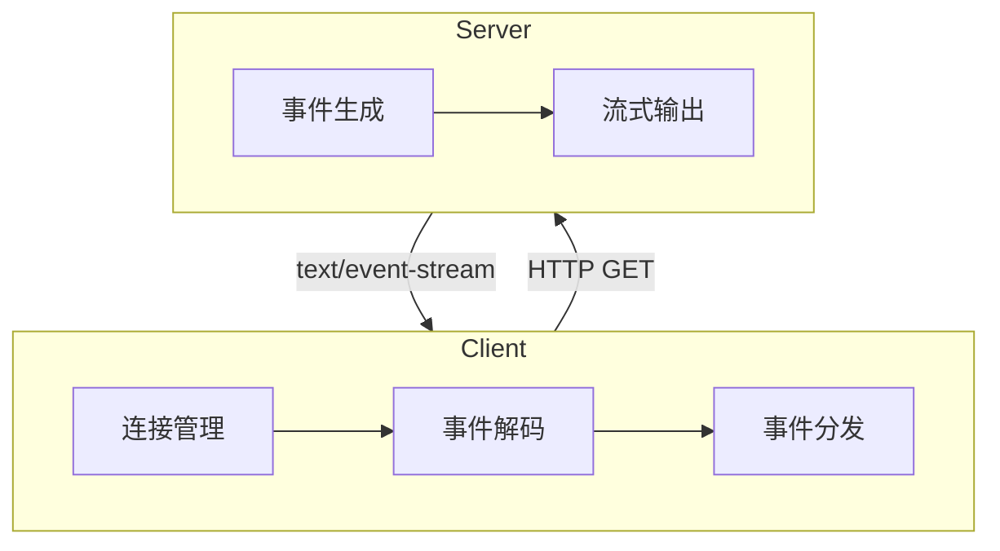
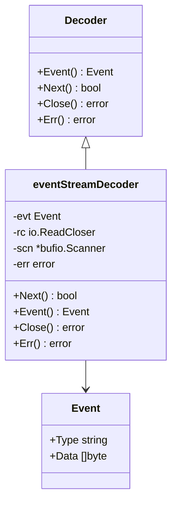
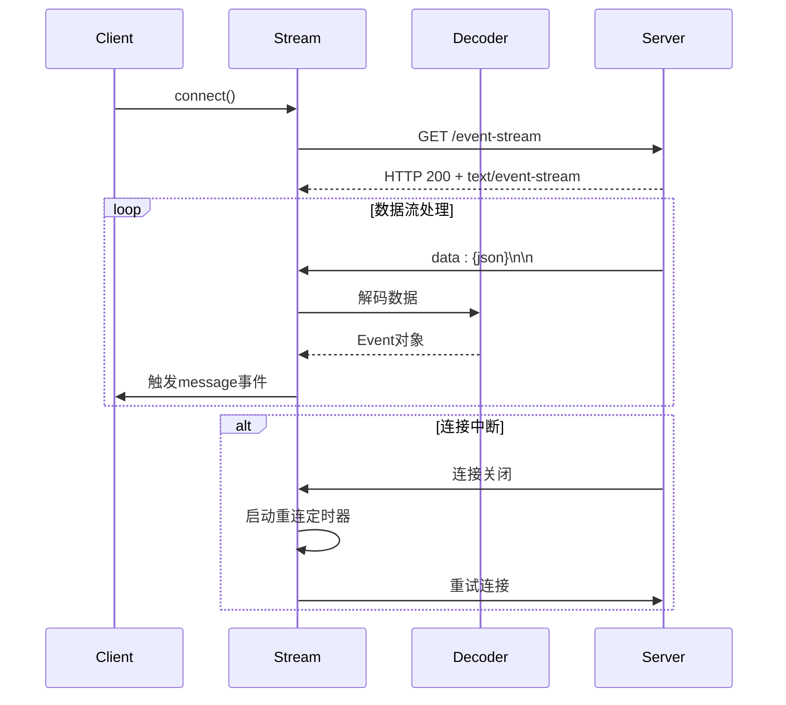
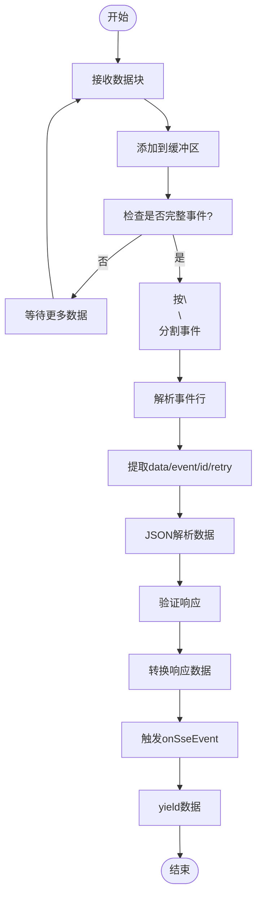
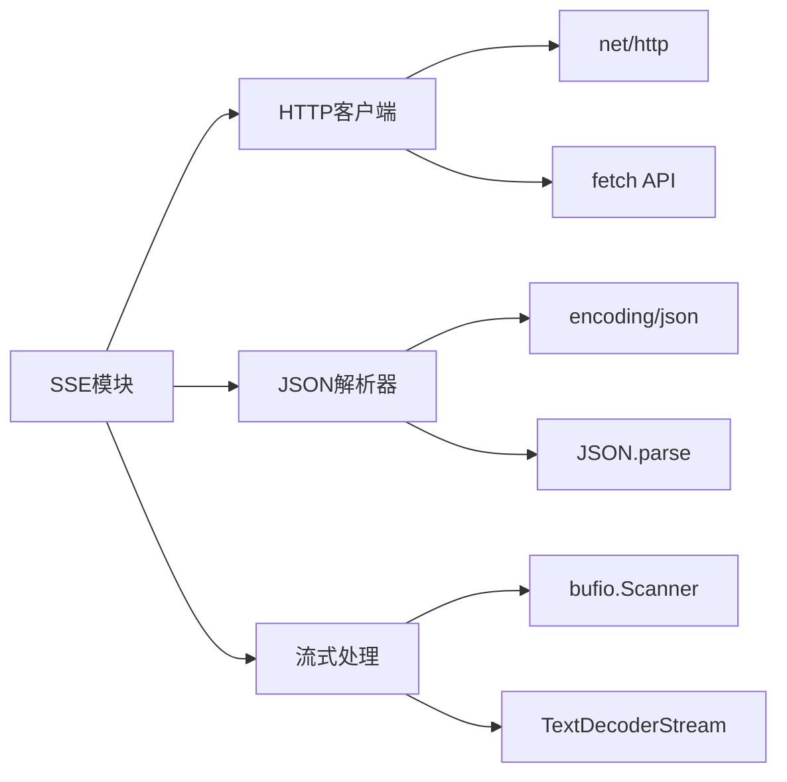

# SSE传输实现

<cite>
**本文档中引用的文件**  
- [ssestream.go](file://packages/sdk/go/packages/ssestream/ssestream.go)
- [serverSentEvents.gen.ts](file://packages/sdk/js/src/gen/core/serverSentEvents.gen.ts)
- [sse.ts](file://packages/sdk/node/src/streaming/sse.ts)
- [client.go](file://packages/sdk/go/client.go)
- [client.ts](file://packages/sdk/node/src/client.ts)
</cite>

## 目录
1. [引言](#引言)
2. [项目结构](#项目结构)
3. [核心组件](#核心组件)
4. [架构概述](#架构概述)
5. [详细组件分析](#详细组件分析)
6. [依赖分析](#依赖分析)
7. [性能考虑](#性能考虑)
8. [故障排除指南](#故障排除指南)
9. [结论](#结论)

## 引言
本文档深入解析SSE（Server-Sent Events）传输协议的实现机制，重点描述事件流的建立过程、消息格式规范、心跳检测和自动重连策略。详细说明如何通过HTTP长轮询建立持久连接，处理text/event-stream内容类型的数据流。解释事件ID机制、重连间隔控制和断点续传功能的实现原理。提供性能优化建议，包括如何配置心跳间隔、最大重试次数和缓冲区管理，确保在高延迟网络环境下的可靠消息传递。

## 项目结构
SSE功能主要分布在SDK的多个语言实现中，包括Go、JavaScript和Node.js版本。核心SSE逻辑位于各SDK的流式处理模块中，通过统一的接口对外提供服务。

**Diagram sources**
- [ssestream.go](file://packages/sdk/go/packages/ssestream/ssestream.go)
- [serverSentEvents.gen.ts](file://packages/sdk/js/src/gen/core/serverSentEvents.gen.ts)
- [sse.ts](file://packages/sdk/node/src/streaming/sse.ts)

**Section sources**
- [ssestream.go](file://packages/sdk/go/packages/ssestream/ssestream.go)
- [serverSentEvents.gen.ts](file://packages/sdk/js/src/gen/core/serverSentEvents.gen.ts)
- [sse.ts](file://packages/sdk/node/src/streaming/sse.ts)

## 核心组件
SSE实现包含三个主要组件：解码器（Decoder）、流管理器（Stream）和事件处理器（Event Handler）。解码器负责解析text/event-stream格式的数据流；流管理器管理连接状态和重试逻辑；事件处理器负责分发接收到的事件。

**Section sources**
- [ssestream.go](file://packages/sdk/go/packages/ssestream/ssestream.go#L20-L35)
- [serverSentEvents.gen.ts](file://packages/sdk/js/src/gen/core/serverSentEvents.gen.ts#L65-L209)
- [sse.ts](file://packages/sdk/node/src/streaming/sse.ts#L30-L203)

## 架构概述
SSE架构采用分层设计，底层为HTTP连接管理，中间层为事件流解码，上层为事件分发和应用逻辑。客户端通过Accept: text/event-stream头建立持久连接，服务器以特定格式发送事件数据。

**Diagram sources**
- [ssestream.go](file://packages/sdk/go/packages/ssestream/ssestream.go)
- [serverSentEvents.gen.ts](file://packages/sdk/js/src/gen/core/serverSentEvents.gen.ts)

## 详细组件分析

### 解码器组件分析
解码器组件负责将原始的event stream数据解析为结构化的事件对象。支持标准的SSE字段解析，包括data、event、id和retry。

**Diagram sources**
- [ssestream.go](file://packages/sdk/go/packages/ssestream/ssestream.go)

**Section sources**
- [ssestream.go](file://packages/sdk/go/packages/ssestream/ssestream.go#L20-L35)

### 流管理组件分析
流管理组件负责连接的建立、维护和重连策略的执行。包含自动重连、错误处理和连接状态管理功能。

**Diagram sources**
- [serverSentEvents.gen.ts](file://packages/sdk/js/src/gen/core/serverSentEvents.gen.ts#L65-L209)
- [sse.ts](file://packages/sdk/node/src/streaming/sse.ts#L30-L203)

**Section sources**
- [serverSentEvents.gen.ts](file://packages/sdk/js/src/gen/core/serverSentEvents.gen.ts#L65-L209)
- [sse.ts](file://packages/sdk/node/src/streaming/sse.ts#L30-L203)

### 事件处理流程
事件处理流程展示了从原始数据到应用事件的完整转换过程，包括缓冲、解析和分发。

**Diagram sources**
- [serverSentEvents.gen.ts](file://packages/sdk/js/src/gen/core/serverSentEvents.gen.ts#L65-L209)

**Section sources**
- [serverSentEvents.gen.ts](file://packages/sdk/js/src/gen/core/serverSentEvents.gen.ts#L65-L209)

## 依赖分析
SSE实现依赖于HTTP客户端、JSON解析器和流式处理工具。Go版本依赖net/http和encoding/json包；JavaScript版本依赖fetch API和TextDecoderStream。

**Diagram sources**
- [client.go](file://packages/sdk/go/client.go)
- [client.ts](file://packages/sdk/node/src/client.ts)

**Section sources**
- [client.go](file://packages/sdk/go/client.go)
- [client.ts](file://packages/sdk/node/src/client.ts)

## 性能考虑
SSE实现考虑了多种性能优化策略，包括大缓冲区设置、流式解码和指数退避重连。建议根据网络状况调整重试参数，避免过度重试导致服务器压力。

## 故障排除指南
常见问题包括连接超时、数据解析错误和重连失败。检查网络连接、验证服务器端点可用性，并确保正确处理各种事件类型。

**Section sources**
- [ssestream.go](file://packages/sdk/go/packages/ssestream/ssestream.go)
- [serverSentEvents.gen.ts](file://packages/sdk/js/src/gen/core/serverSentEvents.gen.ts)

## 结论
SSE实现提供了可靠的服务器推送机制，通过标准化的事件流格式和健壮的重连策略，确保了消息传递的可靠性。各语言SDK保持了API一致性，便于跨平台开发。