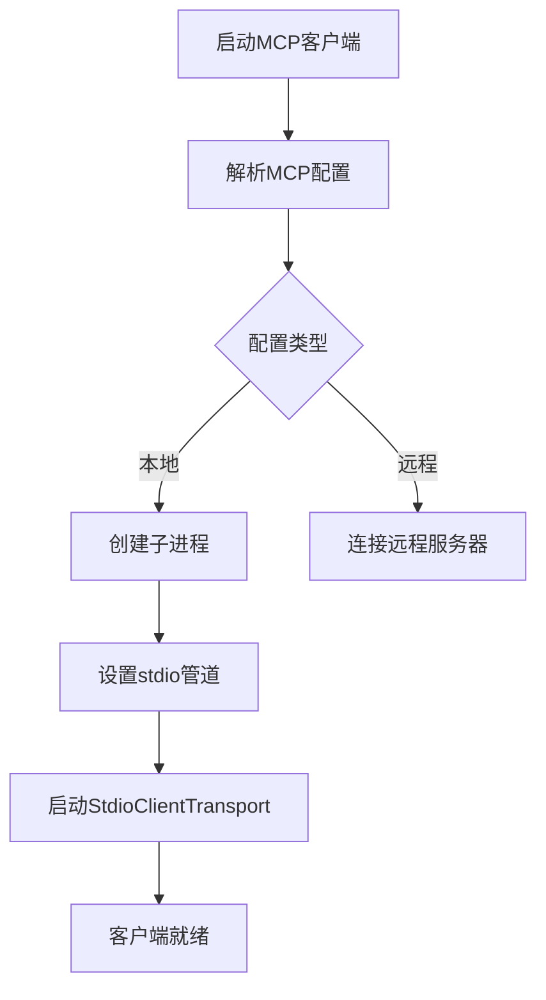
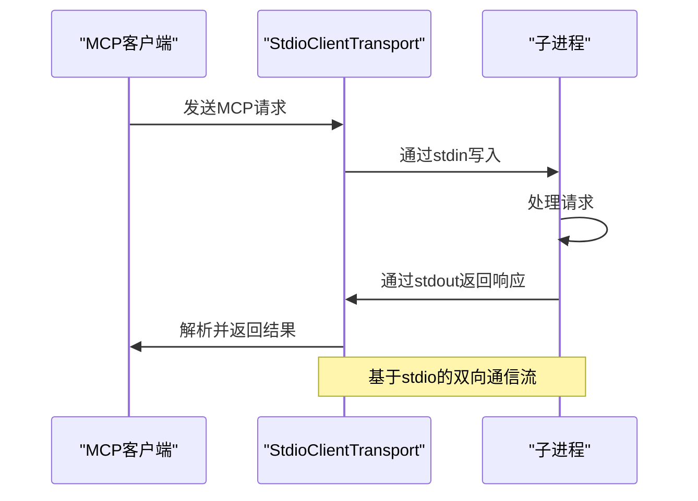
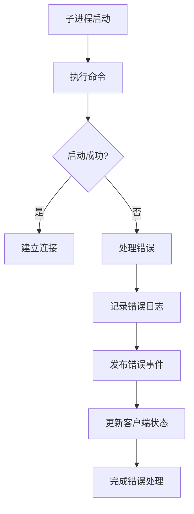

# StdioClientTransport实现

<cite>
**本文档引用的文件**   
- [index.ts](file://packages/opencode/src/mcp/index.ts)
- [config.ts](file://packages/opencode/src/config/config.ts)
- [04-tool-integration.md](file://doc-agent-context/04-tool-integration.md)
</cite>

## 目录
1. [简介](#简介)
2. [进程创建与启动](#进程创建与启动)
3. [标准输入输出流通信](#标准输入输出流通信)
4. [消息序列化与反序列化](#消息序列化与反序列化)
5. [错误处理机制](#错误处理机制)
6. [配置示例](#配置示例)
7. [应用场景与性能特征](#应用场景与性能特征)

## 简介
StdioClientTransport是OpenCode系统中用于本地MCP（Model Context Protocol）服务器通信的核心传输机制。该机制通过子进程方式启动本地命令（如bun x my-mcp-command），并建立标准输入输出流进行双向通信。本文档详细描述了其实现机制、错误处理策略和配置方法。

**Section sources**
- [index.ts](file://packages/opencode/src/mcp/index.ts#L0-L20)

## 进程创建与启动
StdioClientTransport通过Node.js的子进程模块创建和管理本地MCP服务器进程。系统根据配置中的命令数组启动相应的子进程，并建立stdio管道连接。

当配置为本地MCP服务器时，系统会解析配置中的命令和参数，使用`experimental_createMCPClient`创建客户端实例，并通过`StdioClientTransport`建立通信通道。在启动过程中，系统会继承当前进程的环境变量，并根据需要添加特定的环境配置。



**Diagram sources **
- [index.ts](file://packages/opencode/src/mcp/index.ts#L90-L139)
- [config.ts](file://packages/opencode/src/config/config.ts#L247-L278)

**Section sources**
- [index.ts](file://packages/opencode/src/mcp/index.ts#L90-L139)

## 标准输入输出流通信
StdioClientTransport通过标准输入（stdin）和标准输出（stdout）流与子进程进行双向通信。系统将MCP协议消息通过stdin发送到子进程，并从stdout读取响应。

通信过程中，stderr输出可以被配置为忽略或重定向，以避免错误信息干扰正常通信流程。这种基于stdio的通信方式确保了与子进程的可靠数据交换，同时保持了跨平台兼容性。



**Diagram sources **
- [index.ts](file://packages/opencode/src/mcp/index.ts#L90-L139)

**Section sources**
- [index.ts](file://packages/opencode/src/mcp/index.ts#L90-L139)

## 消息序列化与反序列化
StdioClientTransport在通信过程中负责MCP协议消息的序列化与反序列化。所有发送到子进程的消息都会被序列化为JSON格式并通过stdin传输，从stdout接收到的响应数据则会被反序列化为JavaScript对象。

这种序列化机制确保了数据在父子进程间的正确传输和解析，同时支持MCP协议定义的完整消息格式，包括工具调用、响应、错误等各类消息类型。

**Section sources**
- [index.ts](file://packages/opencode/src/mcp/index.ts#L90-L139)

## 错误处理机制
StdioClientTransport实现了完善的错误处理机制，能够应对子进程崩溃、管道中断等各种异常情况。

当子进程启动失败时，系统会捕获异常并记录详细的错误信息，包括失败的命令和具体的错误消息。同时，通过事件总线发布错误事件，通知上层系统进行相应处理。对于已经建立连接的客户端，系统会在应用关闭时自动调用close方法，确保资源的正确释放。

在错误恢复策略方面，系统采用优雅降级的方式：当本地MCP服务器无法启动时，相关功能将被禁用，但不影响其他系统的正常运行。这种设计保证了系统的整体稳定性和可用性。



**Diagram sources **
- [index.ts](file://packages/opencode/src/mcp/index.ts#L90-L139)

**Section sources**
- [index.ts](file://packages/opencode/src/mcp/index.ts#L90-L139)

## 配置示例
StdioClientTransport的配置通过MCP配置对象进行，支持设置环境变量、工作目录和启动参数。以下是一个典型的配置示例：

```json
{
  "mcp": {
    "my-local-mcp-server": {
      "type": "local",
      "command": ["bun", "x", "my-mcp-command"],
      "enabled": true,
      "environment": {
        "MY_ENV_VAR": "my_env_var_value",
        "BUN_BE_BUN": "1"
      }
    }
  }
}
```

配置参数说明：
- **type**: 设置为"local"表示使用本地进程模式
- **command**: 命令数组，包含执行命令及其参数
- **environment**: 环境变量对象，将在子进程启动时设置
- **enabled**: 是否启用该MCP服务器

特别地，当主命令为"opencode"时，系统会自动设置`BUN_BE_BUN`环境变量，确保在Bun运行时环境中正确执行。

**Section sources**
- [config.ts](file://packages/opencode/src/config/config.ts#L247-L278)
- [04-tool-integration.md](file://doc-agent-context/04-tool-integration.md#L799-L882)

## 应用场景与性能特征
StdioClientTransport特别适用于本地工具集成场景，具有以下优势：

1. **低延迟通信**: 通过stdio管道进行进程间通信，避免了网络开销，提供了极低的通信延迟。

2. **高安全性**: 本地进程运行在相同的执行环境中，无需暴露网络端口，减少了安全风险。

3. **易于调试**: 子进程的输出可以直接重定向到父进程的控制台，便于开发和调试。

4. **资源效率**: 避免了网络协议栈的开销，减少了内存和CPU资源的使用。

5. **跨平台兼容**: 基于标准输入输出流的通信机制在不同操作系统上具有一致的行为。

性能特征方面，StdioClientTransport在典型工作负载下表现出优异的性能，消息往返延迟通常在毫秒级别。由于避免了网络序列化和传输开销，其吞吐量远高于基于HTTP或WebSocket的远程通信方式。

该传输方式最适合于需要频繁交互、对延迟敏感的本地工具集成场景，如代码分析工具、文件系统操作工具等。

**Section sources**
- [04-tool-integration.md](file://doc-agent-context/04-tool-integration.md#L799-L882)