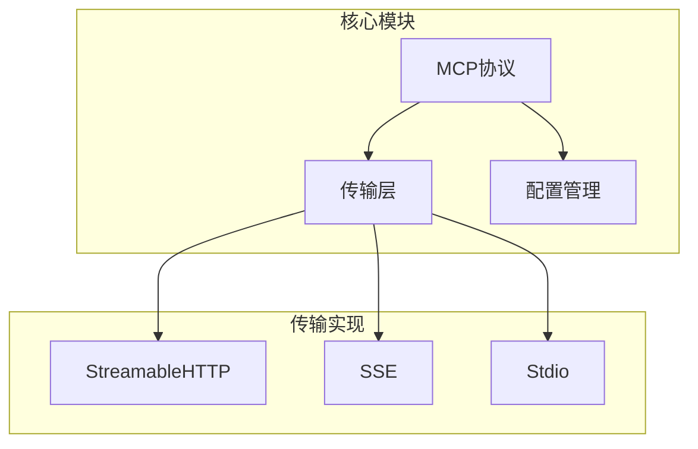
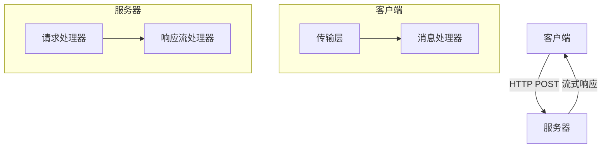
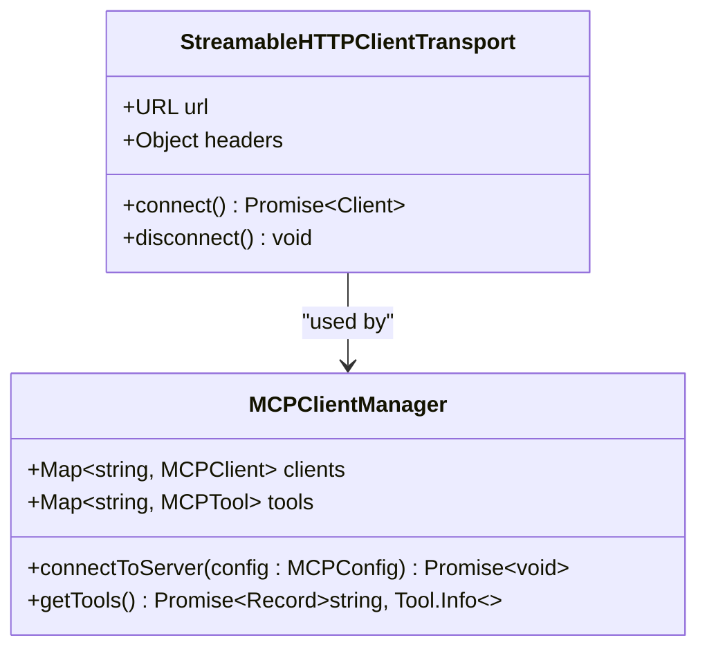
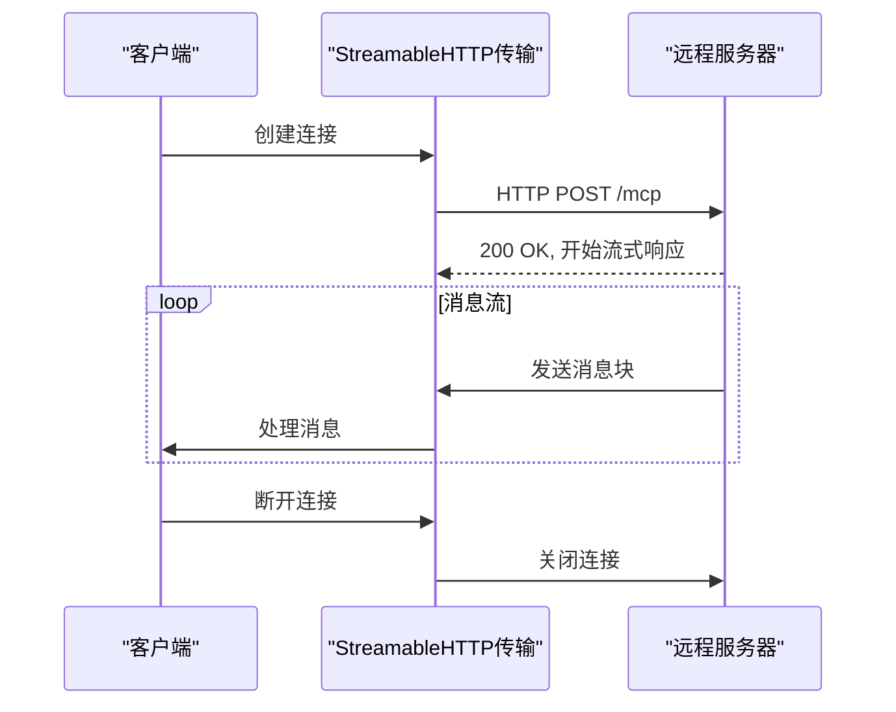
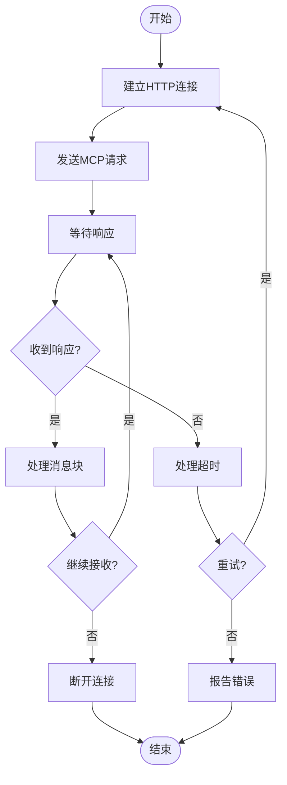
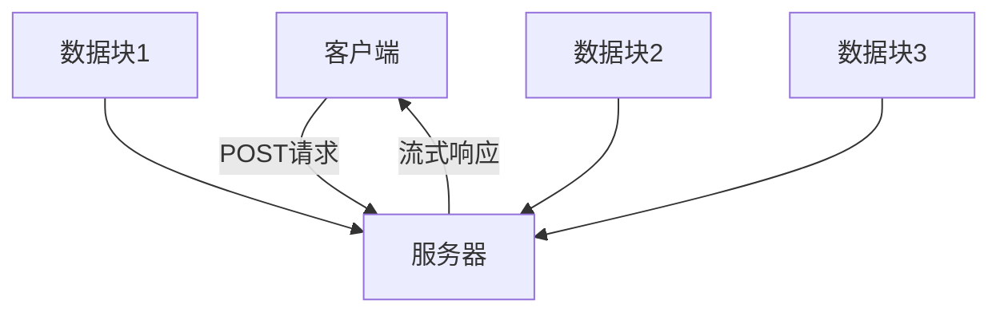
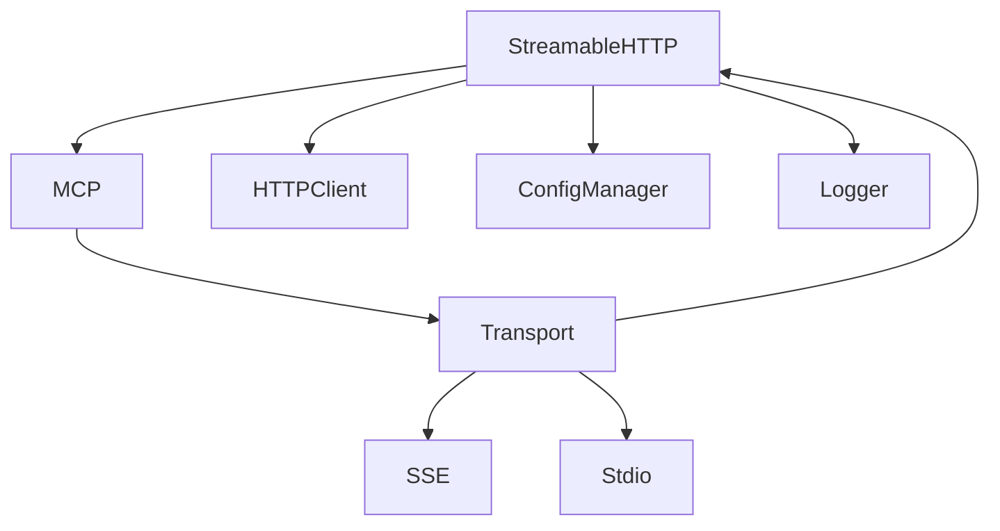

# StreamableHTTP传输实现

<cite>
**本文档引用的文件**
- [index.ts](file://packages/opencode/src/mcp/index.ts)
- [streamableHttp.js](file://packages/sdk/node/src/streaming/sse.ts)
- [config.go](file://packages/sdk/go/config.go)
- [client.go](file://packages/sdk/go/client.go)
- [sse.ts](file://packages/sdk/node/src/streaming/sse.ts)
</cite>

## 目录
1. [简介](#简介)
2. [项目结构](#项目结构)
3. [核心组件](#核心组件)
4. [架构概述](#架构概述)
5. [详细组件分析](#详细组件分析)
6. [依赖分析](#依赖分析)
7. [性能考虑](#性能考虑)
8. [故障排除指南](#故障排除指南)
9. [结论](#结论)
10. [附录](#附录)（如有必要）

## 简介
本文档全面记录了StreamableHTTP传输协议的实现细节，重点描述HTTP长连接的建立过程、请求/响应消息帧格式、超时控制机制。解释如何通过HTTP POST请求发送MCP请求并保持连接流式传输响应。详细说明消息分块传输（chunked transfer encoding）的处理逻辑、连接保持策略和错误重试机制。提供实际配置示例，展示如何调整连接超时、读写超时和缓冲区大小等关键参数，以适应不同网络环境下的稳定通信需求。

## 项目结构
项目结构显示了StreamableHTTP传输协议在整体架构中的位置，主要位于`packages/opencode/src/mcp/`目录下，作为MCP（Model Context Protocol）协议的传输层实现。该协议支持远程和本地MCP服务器的连接，通过多种传输方式（包括StreamableHTTP和SSE）实现与服务器的通信。



**图示来源**
- [index.ts](file://packages/opencode/src/mcp/index.ts#L22-L60)
- [config.go](file://packages/sdk/go/config.go#L1-L50)

**章节来源**
- [index.ts](file://packages/opencode/src/mcp/index.ts#L1-L158)
- [config.go](file://packages/sdk/go/config.go#L1-L50)

## 核心组件
StreamableHTTP传输协议的核心组件包括传输客户端、连接管理器和消息处理器。这些组件协同工作，确保HTTP长连接的稳定性和可靠性。传输客户端负责建立和维护与远程服务器的连接，连接管理器处理连接的生命周期，消息处理器负责解析和处理流式传输的消息。

**章节来源**
- [index.ts](file://packages/opencode/src/mcp/index.ts#L22-L60)
- [streamableHttp.js](file://packages/sdk/node/src/streaming/sse.ts#L1-L50)

## 架构概述
StreamableHTTP传输协议的架构设计旨在提供高效、可靠的流式数据传输。该架构基于HTTP长连接，通过POST请求发送MCP请求，并保持连接以流式传输响应。协议支持多种传输方式，包括StreamableHTTP和SSE，以适应不同的网络环境和需求。



**图示来源**
- [index.ts](file://packages/opencode/src/mcp/index.ts#L22-L60)
- [streamableHttp.js](file://packages/sdk/node/src/streaming/sse.ts#L1-L50)

## 详细组件分析
### StreamableHTTP客户端分析
StreamableHTTP客户端是MCP协议的核心传输组件之一，负责与远程MCP服务器建立和维护HTTP长连接。客户端通过POST请求发送MCP请求，并保持连接以接收流式响应。客户端支持多种配置选项，包括连接超时、读写超时和缓冲区大小，以适应不同的网络环境。

#### 对象导向组件


**图示来源**
- [index.ts](file://packages/opencode/src/mcp/index.ts#L22-L60)
- [streamableHttp.js](file://packages/sdk/node/src/streaming/sse.ts#L1-L50)

#### API/服务组件


**图示来源**
- [index.ts](file://packages/opencode/src/mcp/index.ts#L22-L60)
- [streamableHttp.js](file://packages/sdk/node/src/streaming/sse.ts#L1-L50)

#### 复杂逻辑组件


**图示来源**
- [index.ts](file://packages/opencode/src/mcp/index.ts#L22-L60)
- [streamableHttp.js](file://packages/sdk/node/src/streaming/sse.ts#L1-L50)

**章节来源**
- [index.ts](file://packages/opencode/src/mcp/index.ts#L1-L158)
- [streamableHttp.js](file://packages/sdk/node/src/streaming/sse.ts#L1-L318)

### 概念概述
StreamableHTTP传输协议通过HTTP长连接实现流式数据传输，允许客户端通过POST请求发送MCP请求，并保持连接以接收服务器的流式响应。这种设计使得数据可以实时传输，提高了通信效率和用户体验。



## 依赖分析
StreamableHTTP传输协议依赖于多个核心组件和外部库，包括MCP协议、HTTP客户端、配置管理器和日志记录器。这些依赖关系确保了协议的稳定性和可扩展性。



**图示来源**
- [index.ts](file://packages/opencode/src/mcp/index.ts#L22-L60)
- [client.go](file://packages/sdk/go/client.go#L1-L50)

**章节来源**
- [index.ts](file://packages/opencode/src/mcp/index.ts#L1-L158)
- [client.go](file://packages/sdk/go/client.go#L1-L134)

## 性能考虑
StreamableHTTP传输协议在设计时充分考虑了性能因素，包括连接超时、读写超时和缓冲区大小的配置。这些参数可以根据网络环境进行调整，以优化通信性能。此外，协议支持自动重连机制，确保在网络不稳定的情况下仍能保持连接。

## 故障排除指南
在使用StreamableHTTP传输协议时，可能会遇到连接失败、超时或数据丢失等问题。以下是一些常见的故障排除步骤：
- 检查网络连接是否稳定
- 验证服务器URL和端口是否正确
- 检查防火墙设置，确保端口未被阻止
- 调整连接超时和读写超时参数
- 查看日志文件，获取详细的错误信息

**章节来源**
- [index.ts](file://packages/opencode/src/mcp/index.ts#L22-L60)
- [streamableHttp.js](file://packages/sdk/node/src/streaming/sse.ts#L1-L50)

## 结论
StreamableHTTP传输协议为MCP协议提供了一种高效、可靠的流式数据传输方式。通过HTTP长连接和POST请求，客户端可以实时接收服务器的响应，提高了通信效率和用户体验。协议支持多种配置选项和传输方式，适应不同的网络环境和需求。

## 附录
### 配置示例
```json
{
  "mcp": {
    "remote": {
      "url": "http://localhost:8080",
      "headers": {
        "Authorization": "Bearer your-token"
      },
      "requestInit": {
        "timeout": 30000,
        "readTimeout": 60000,
        "writeTimeout": 60000,
        "bufferSize": 8192
      }
    }
  }
}
```

### 错误代码
| 错误代码 | 描述 |
| --- | --- |
| 400 | 请求无效 |
| 401 | 未授权 |
| 404 | 资源未找到 |
| 500 | 服务器内部错误 |
| 503 | 服务不可用 |