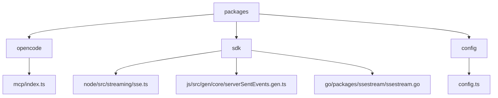
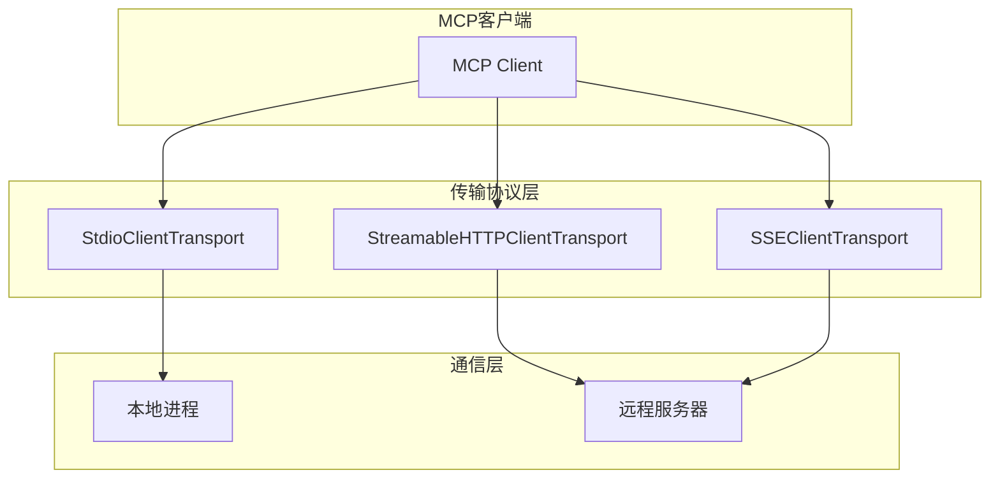
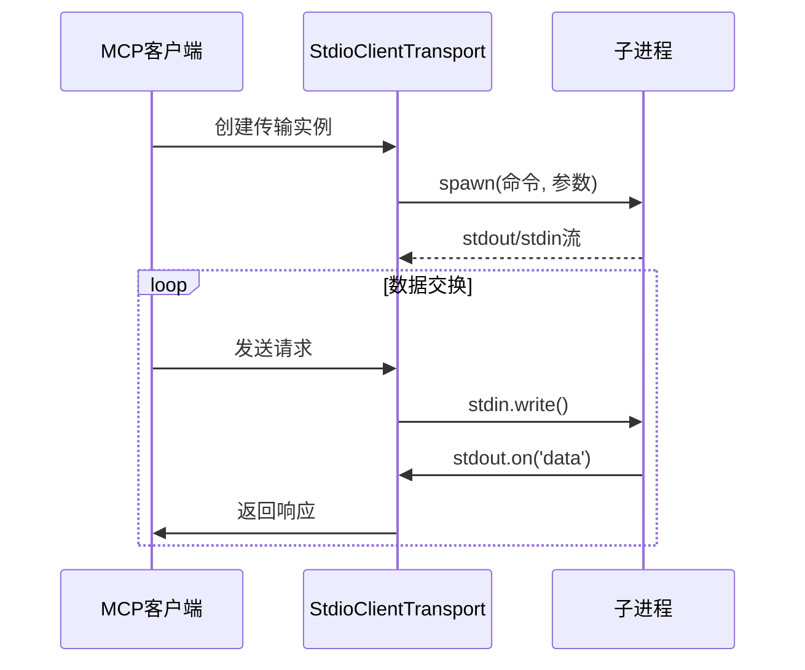
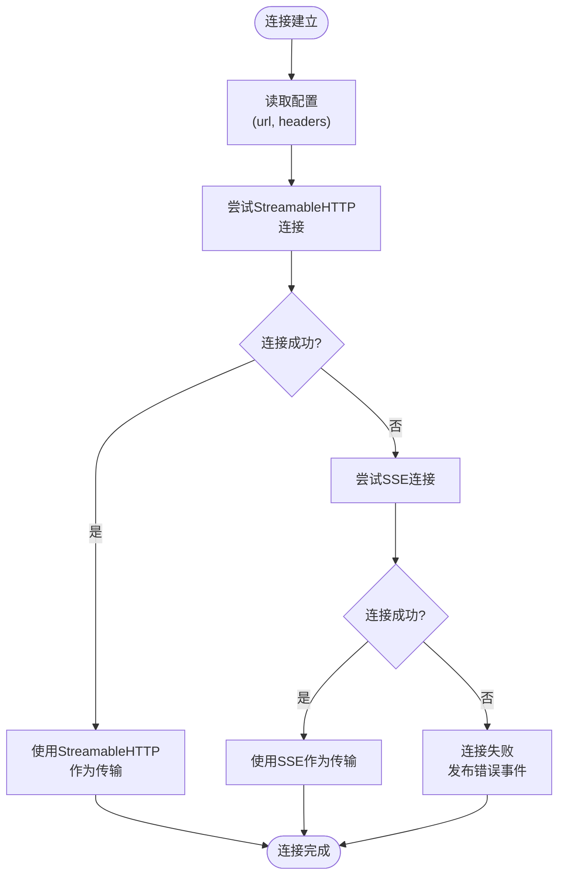
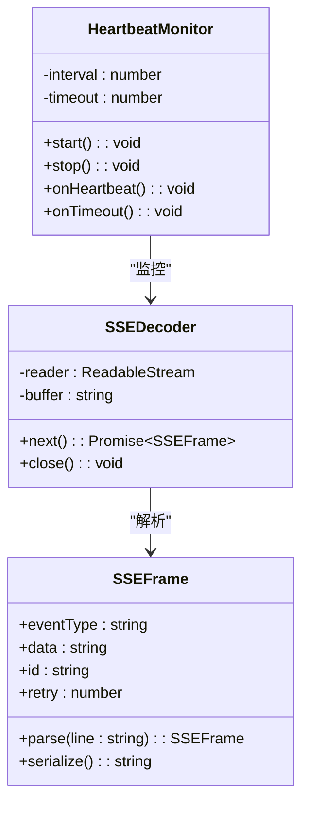
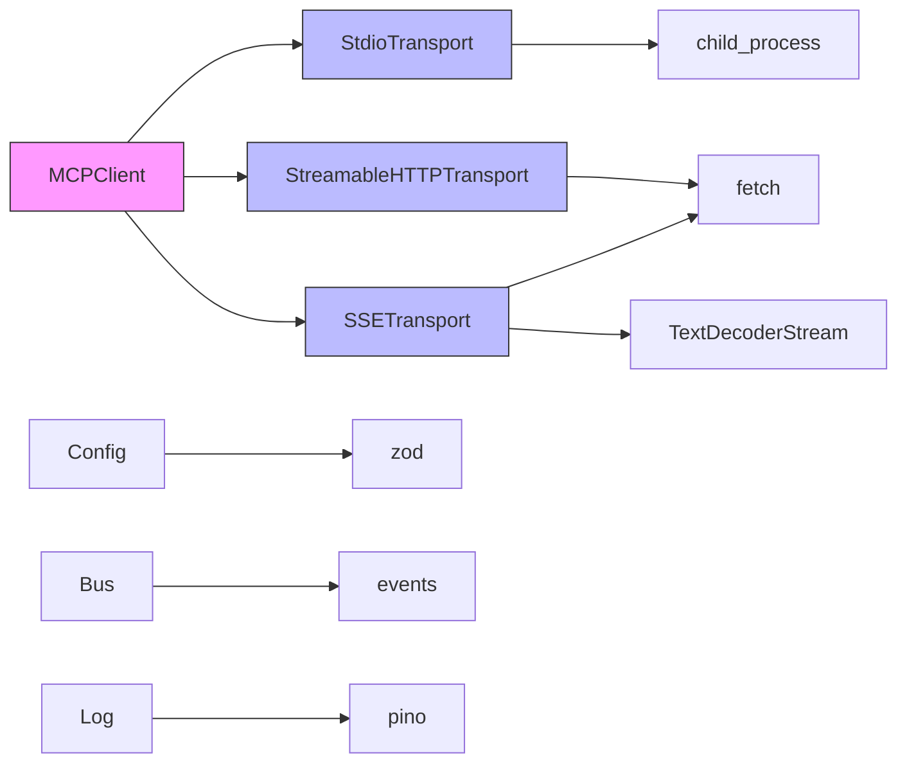

# 传输协议实现

<cite>
**本文档中引用的文件**  
- [index.ts](file://packages/opencode/src/mcp/index.ts)
- [config.ts](file://packages/opencode/src/config/config.ts)
- [sse.ts](file://packages/sdk/node/src/streaming/sse.ts)
- [ssestream.go](file://packages/sdk/go/packages/ssestream/ssestream.go)
- [serverSentEvents.gen.ts](file://packages/sdk/js/src/gen/core/serverSentEvents.gen.ts)
</cite>

## 目录
1. [引言](#引言)
2. [项目结构](#项目结构)
3. [核心组件](#核心组件)
4. [架构概述](#架构概述)
5. [详细组件分析](#详细组件分析)
6. [依赖分析](#依赖分析)
7. [性能考虑](#性能考虑)
8. [故障排除指南](#故障排除指南)
9. [结论](#结论)

## 引言
本文档全面记录了MCP协议支持的传输层实现，重点描述StdioClientTransport、StreamableHTTP和SSE三种传输协议的技术细节。文档详细说明了每种传输协议的实现机制、性能特征和配置方法，为开发者提供选择和配置传输协议的指导。

## 项目结构
项目结构显示了MCP协议实现的相关文件分布在多个包中，主要集中在opencode、sdk和config模块中。这些文件共同构成了MCP传输协议的完整实现。

**Diagram sources**
- [index.ts](file://packages/opencode/src/mcp/index.ts)
- [config.ts](file://packages/opencode/src/config/config.ts)
- [sse.ts](file://packages/sdk/node/src/streaming/sse.ts)

**Section sources**
- [index.ts](file://packages/opencode/src/mcp/index.ts)
- [config.ts](file://packages/opencode/src/config/config.ts)

## 核心组件
MCP协议的传输层实现包含三个核心组件：StdioClientTransport用于本地命令执行，StreamableHTTP和SSE用于远程服务器通信。这些组件通过统一的MCP客户端接口提供服务。

**Section sources**
- [index.ts](file://packages/opencode/src/mcp/index.ts)
- [config.ts](file://packages/opencode/src/config/config.ts)

## 架构概述
MCP传输协议架构采用分层设计，上层为MCP客户端，中层为传输协议实现，底层为网络通信。架构支持本地和远程两种连接模式，通过配置灵活切换。

**Diagram sources**
- [index.ts](file://packages/opencode/src/mcp/index.ts)
- [sse.ts](file://packages/sdk/node/src/streaming/sse.ts)

## 详细组件分析
### StdioClientTransport 分析
StdioClientTransport组件负责通过标准输入输出流与本地MCP命令进行通信。它通过子进程启动指定命令，并建立双向通信通道。

**Diagram sources**
- [index.ts](file://packages/opencode/src/mcp/index.ts#L90-L139)

**Section sources**
- [index.ts](file://packages/opencode/src/mcp/index.ts#L90-L139)

### StreamableHTTP 和 SSE 分析
StreamableHTTP和SSE组件负责与远程MCP服务器建立长连接，支持消息帧传输、心跳检测和自动重连功能。

**Diagram sources**
- [index.ts](file://packages/opencode/src/mcp/index.ts#L22-L60)
- [sse.ts](file://packages/sdk/node/src/streaming/sse.ts#L0-L61)

**Section sources**
- [index.ts](file://packages/opencode/src/mcp/index.ts#L22-L88)
- [sse.ts](file://packages/sdk/node/src/streaming/sse.ts#L0-L217)

### 消息帧格式与心跳机制
SSE协议的消息帧格式遵循标准的text/event-stream格式，包含事件类型、数据、ID和重试间隔等字段。

**Diagram sources**
- [serverSentEvents.gen.ts](file://packages/sdk/js/src/gen/core/serverSentEvents.gen.ts#L54-L103)
- [ssestream.go](file://packages/sdk/go/packages/ssestream/ssestream.go#L0-L74)

**Section sources**
- [serverSentEvents.gen.ts](file://packages/sdk/js/src/gen/core/serverSentEvents.gen.ts#L54-L178)
- [ssestream.go](file://packages/sdk/go/packages/ssestream/ssestream.go#L0-L74)

## 依赖分析
MCP传输协议实现依赖于多个外部库和内部模块，形成了复杂的依赖关系网络。

**Diagram sources**
- [index.ts](file://packages/opencode/src/mcp/index.ts#L0-L20)
- [config.ts](file://packages/opencode/src/config/config.ts#L247-L278)

**Section sources**
- [index.ts](file://packages/opencode/src/mcp/index.ts#L0-L20)
- [config.ts](file://packages/opencode/src/config/config.ts#L247-L278)

## 性能考虑
不同传输协议具有不同的性能特征，选择合适的协议对系统性能至关重要。

| 传输协议 | 延迟 | 吞吐量 | 资源消耗 | 适用场景 |
|---------|------|--------|----------|----------|
| StdioClientTransport | 低 | 高 | 低 | 本地命令执行 |
| StreamableHTTP | 中 | 中 | 中 | 实时性要求不高的远程通信 |
| SSE | 低 | 高 | 中高 | 高频实时通信 |

**Section sources**
- [index.ts](file://packages/opencode/src/mcp/index.ts)
- [sse.ts](file://packages/sdk/node/src/streaming/sse.ts)

## 故障排除指南
当MCP传输协议出现问题时，可以通过以下步骤进行排查：

1. 检查配置文件中的MCP服务器配置是否正确
2. 验证本地命令是否可执行或远程URL是否可达
3. 检查网络连接和防火墙设置
4. 查看日志中的错误信息

**Section sources**
- [index.ts](file://packages/opencode/src/mcp/index.ts#L59-L88)
- [sse.ts](file://packages/sdk/node/src/streaming/sse.ts#L103-L155)

## 结论
MCP协议的传输层实现提供了灵活可靠的通信机制，支持本地和远程两种模式。StdioClientTransport适合本地命令执行，而StreamableHTTP和SSE适合远程服务器通信。开发者应根据具体场景选择合适的传输协议，并合理配置相关参数以优化性能。