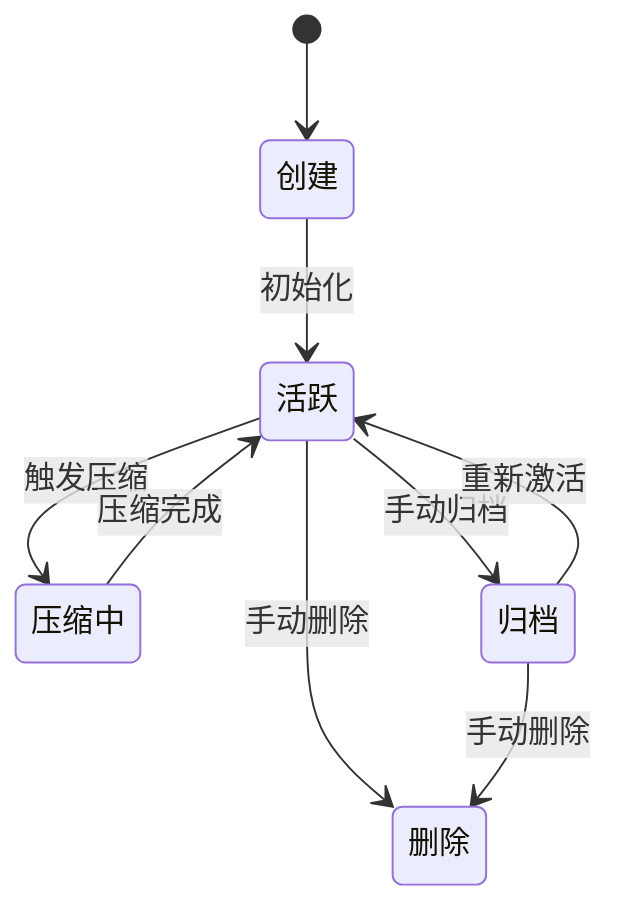
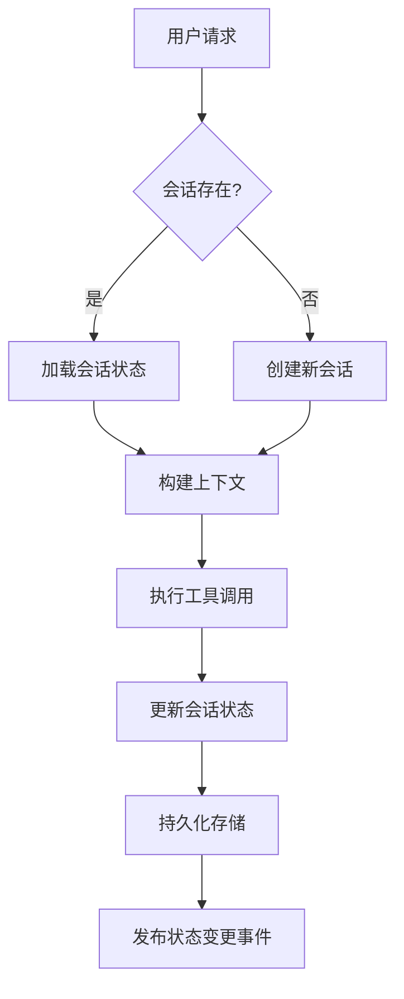
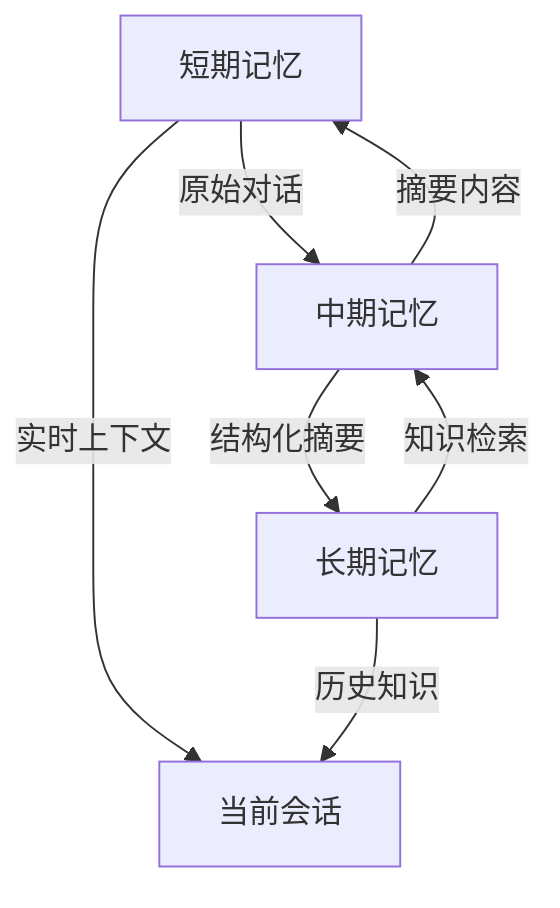
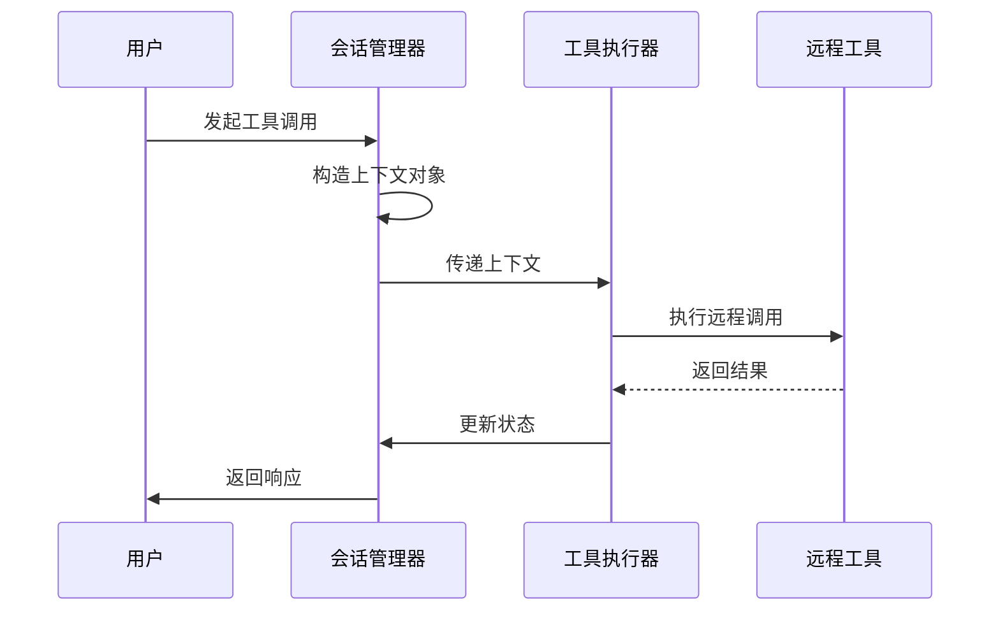
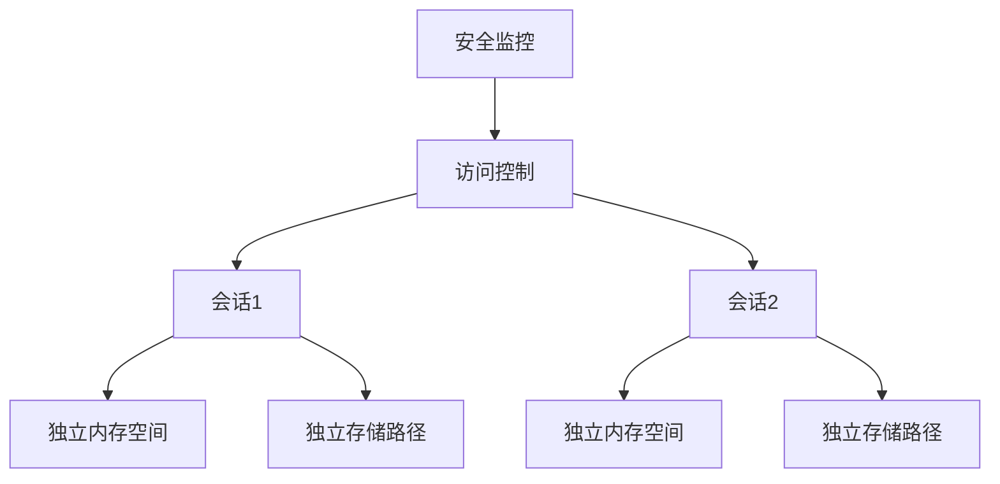
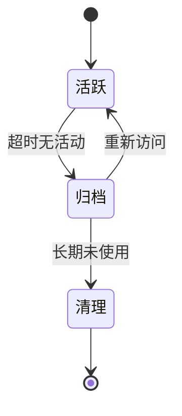

# 上下文传递与状态管理

<cite>
**本文档引用文件**   
- [ClaudeContextManager.js](file://context-claude-code/src/claude-core/ClaudeContextManager.js)
- [02-session-management.md](file://doc-agent-context/02-session-management.md)
- [index.ts](file://packages/opencode/src/session/index.ts)
- [tool.ts](file://packages/opencode/src/tool/tool.ts)
- [MemoryManager.js](file://context-claude-code/src/memory/MemoryManager.js)
- [ShortTermMemory.js](file://context-claude-code/src/memory/ShortTermMemory.js)
- [MidTermMemory.js](file://context-claude-code/src/memory/MidTermMemory.js)
- [LongTermMemory.js](file://context-claude-code/src/memory/LongTermMemory.js)
- [message-v2.ts](file://packages/opencode/src/session/message-v2.ts)
</cite>

## 目录
1. [引言](#引言)
2. [会话生命周期管理](#会话生命周期管理)
3. [上下文传递机制](#上下文传递机制)
4. [三层记忆架构](#三层记忆架构)
5. [工具调用上下文](#工具调用上下文)
6. [上下文隔离策略](#上下文隔离策略)
7. [上下文超时与生命周期管理](#上下文超时与生命周期管理)
8. [上下文序列化与还原](#上下文序列化与还原)
9. [结论](#结论)

## 引言

上下文传递与状态管理是AI代理系统的核心机制，确保在复杂的多轮对话和工具调用过程中，关键信息能够安全、高效地在不同组件和执行环境之间传递。本系统通过会话管理、三层记忆架构和上下文隔离等机制，实现了对会话ID、用户身份、项目状态等关键数据的精确控制。

系统采用事件驱动架构和状态机模式，确保会话状态转换的合法性和一致性。通过分层存储机制，会话数据在内存和持久化存储之间高效同步，支持跨会话的知识积累和长期记忆管理。

**重要说明**：本文档详细阐述了上下文信息在MCP工具调用过程中的传递机制，包括会话ID、用户身份、当前项目状态等关键数据如何安全地传递至远程工具执行环境。同时，文档解释了上下文隔离策略以防止不同会话间的数据泄露，并说明了上下文超时与生命周期管理机制，确保临时状态能够及时清理。

## 会话生命周期管理

会话管理系统采用状态机模式管理会话的完整生命周期，确保状态转换的合法性和一致性。会话状态包括创建、活跃、压缩中、归档和删除等阶段，每个状态都有明确的转换规则。

会话创建采用工厂模式和建造者模式，通过多步骤流程确保会话对象的完整性和一致性。系统使用降序ID生成器保证会话ID的唯一性，并通过事务性机制确保创建过程的原子性。会话元数据包含项目ID、目录路径、父会话ID、标题、版本和时间戳等关键信息。

**图示来源**
- [02-session-management.md](file://doc-agent-context/02-session-management.md#L1-L1325)

**本节来源**
- [02-session-management.md](file://doc-agent-context/02-session-management.md#L1-L1325)
- [index.ts](file://packages/opencode/src/session/index.ts#L1-L349)

## 上下文传递机制

上下文传递机制通过会话ID作为核心标识符，将用户身份、项目状态和对话历史等关键数据安全地传递至远程工具执行环境。系统采用Instance.state机制实现状态的持久化管理和自动同步，支持状态的版本管理、变更追踪和自动恢复。

会话状态管理器通过事件监听器实现状态变更的实时通知，确保所有相关组件能够及时响应状态变化。状态持久化机制将状态数据存储在分层存储系统中，支持不同的存储后端，包括文件系统和远程存储。

消息系统采用类型安全的联合类型和模式匹配，通过Zod的discriminated union实现运行时类型验证。系统支持多种消息类型，包括文本消息、推理过程、文件内容、工具调用、步骤开始、步骤结束、快照、补丁和Agent调用等。

**图示来源**
- [index.ts](file://packages/opencode/src/session/index.ts#L1-L349)
- [message-v2.ts](file://packages/opencode/src/session/message-v2.ts#L1-L582)

**本节来源**
- [index.ts](file://packages/opencode/src/session/index.ts#L1-L349)
- [message-v2.ts](file://packages/opencode/src/session/message-v2.ts#L1-L582)

## 三层记忆架构

系统采用三层记忆架构，包括短期记忆、中期记忆和长期记忆，分别对应不同的存储特性和访问模式。这种分层设计优化了性能、成本和持久性之间的平衡。

短期记忆层作为高速工作区，类似CPU的L1缓存，提供O(1)访问效率。它负责存储最近的对话消息，使用反向遍历算法快速计算token使用量，并通过缓存机制优化性能。

中期记忆层作为智能蒸馏器，负责将短期记忆的对话历史压缩为结构化摘要。它使用wU2压缩器对消息列表进行压缩，生成高质量的摘要内容，并评估摘要的价值以决定是否保存到长期记忆。

长期记忆层作为持久化知识库，支持跨会话的知识存储和向量化搜索。它将有价值的摘要持久化存储在磁盘上，并通过关键词索引和向量索引实现高效的搜索能力。

**图示来源**
- [MemoryManager.js](file://context-claude-code/src/memory/MemoryManager.js#L1-L366)
- [ShortTermMemory.js](file://context-claude-code/src/memory/ShortTermMemory.js#L1-L335)
- [MidTermMemory.js](file://context-claude-code/src/memory/MidTermMemory.js#L1-L412)
- [LongTermMemory.js](file://context-claude-code/src/memory/LongTermMemory.js#L1-L628)

**本节来源**
- [MemoryManager.js](file://context-claude-code/src/memory/MemoryManager.js#L1-L366)
- [ShortTermMemory.js](file://context-claude-code/src/memory/ShortTermMemory.js#L1-L335)
- [MidTermMemory.js](file://context-claude-code/src/memory/MidTermMemory.js#L1-L412)
- [LongTermMemory.js](file://context-claude-code/src/memory/LongTermMemory.js#L1-L628)

## 工具调用上下文

工具调用上下文通过Tool.Context接口定义，包含会话ID、消息ID、代理标识、中止信号、调用ID和元数据等关键信息。这种设计确保了工具执行环境能够访问必要的上下文信息，同时保持了良好的隔离性。

上下文对象的构造过程遵循严格的类型安全原则，使用Zod模式进行运行时验证。元数据字段允许传递额外的上下文信息，如操作标题和自定义元数据，为工具提供丰富的上下文支持。

工具执行过程中，系统通过事件总线发布状态变更事件，实现异步通信和状态同步。每个工具调用都有明确的状态转换规则，包括待处理、运行中、已完成和错误等状态，确保调用过程的可追踪性和可靠性。

**图示来源**
- [tool.ts](file://packages/opencode/src/tool/tool.ts#L1-L45)
- [index.ts](file://packages/opencode/src/session/index.ts#L1-L349)

**本节来源**
- [tool.ts](file://packages/opencode/src/tool/tool.ts#L1-L45)
- [index.ts](file://packages/opencode/src/session/index.ts#L1-L349)

## 上下文隔离策略

上下文隔离策略通过会话ID作为隔离边界，确保不同会话之间的数据完全隔离。每个会话都有独立的内存空间和存储路径，防止数据泄露和状态污染。

系统采用命名空间机制，将会话相关的数据存储在以会话ID为前缀的独立命名空间中。这种设计确保了即使在高并发环境下，不同会话的数据也不会相互干扰。

安全系统监控所有跨会话的数据访问尝试，对异常访问行为进行告警和阻断。权限控制系统确保只有授权的组件才能访问特定会话的上下文数据，实现了细粒度的访问控制。

**图示来源**
- [ClaudeContextManager.js](file://context-claude-code/src/claude-core/ClaudeContextManager.js#L1-L789)
- [MemoryManager.js](file://context-claude-code/src/memory/MemoryManager.js#L1-L366)

**本节来源**
- [ClaudeContextManager.js](file://context-claude-code/src/claude-core/ClaudeContextManager.js#L1-L789)
- [MemoryManager.js](file://context-claude-code/src/memory/MemoryManager.js#L1-L366)

## 上下文超时与生命周期管理

上下文超时与生命周期管理机制确保临时状态能够及时清理，防止资源泄漏。系统为每个会话设置活跃超时时间，当会话在指定时间内无活动时，自动进入归档状态。

归档会话的内存占用被优化，非关键数据被清理，但核心对话历史和重要文件上下文被保留。系统定期检查归档会话的访问频率，对长期未使用的会话进行最终清理。

状态同步器采用队列机制处理状态同步操作，支持重试和错误处理。当同步失败时，操作会被重新加入队列，最多重试三次，确保状态数据的最终一致性。

**图示来源**
- [index.ts](file://packages/opencode/src/session/index.ts#L1-L349)
- [MemoryManager.js](file://context-claude-code/src/memory/MemoryManager.js#L1-L366)

**本节来源**
- [index.ts](file://packages/opencode/src/session/index.ts#L1-L349)
- [MemoryManager.js](file://context-claude-code/src/memory/MemoryManager.js#L1-L366)

## 上下文序列化与还原

上下文序列化与还原过程通过exportState和importState方法实现，确保上下文状态能够在不同环境之间安全传输。序列化状态包含配置、运行时状态、消息历史、压缩历史和文件操作记录等完整信息。

序列化过程采用深度克隆技术，确保原始数据不被修改。敏感信息如API密钥在序列化时被过滤，防止安全风险。还原过程进行严格的验证，确保导入的状态数据符合预期格式和约束。

系统支持增量序列化，只传输变化的部分，减少网络传输开销。版本控制系统确保不同版本的上下文状态能够正确兼容，支持向前和向后兼容性。

**图示来源**
- [ClaudeContextManager.js](file://context-claude-code/src/claude-core/ClaudeContextManager.js#L1-L789)
- [MemoryManager.js](file://context-claude-code/src/memory/MemoryManager.js#L1-L366)

**本节来源**
- [ClaudeContextManager.js](file://context-claude-code/src/claude-core/ClaudeContextManager.js#L1-L789)
- [MemoryManager.js](file://context-claude-code/src/memory/MemoryManager.js#L1-L366)

## 结论

上下文传递与状态管理系统通过会话管理、三层记忆架构和上下文隔离等机制，实现了对关键数据的安全、高效管理。系统采用事件驱动架构和状态机模式，确保状态转换的合法性和一致性。

三层记忆架构优化了性能、成本和持久性之间的平衡，短期记忆提供高速访问，中期记忆实现智能压缩，长期记忆支持知识积累。上下文隔离策略通过会话ID作为隔离边界，防止不同会话间的数据泄露。

上下文超时与生命周期管理机制确保临时状态能够及时清理，防止资源泄漏。序列化与还原过程支持上下文状态在不同环境之间的安全传输，为系统扩展和迁移提供了便利。

该系统设计充分考虑了安全性、可靠性和可扩展性，为AI代理的复杂应用场景提供了坚实的基础支撑。