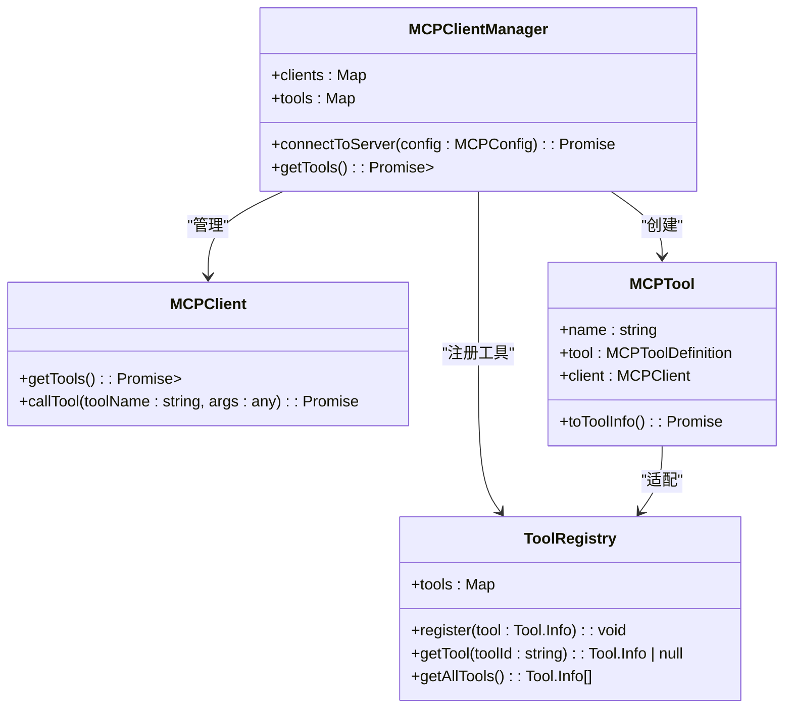
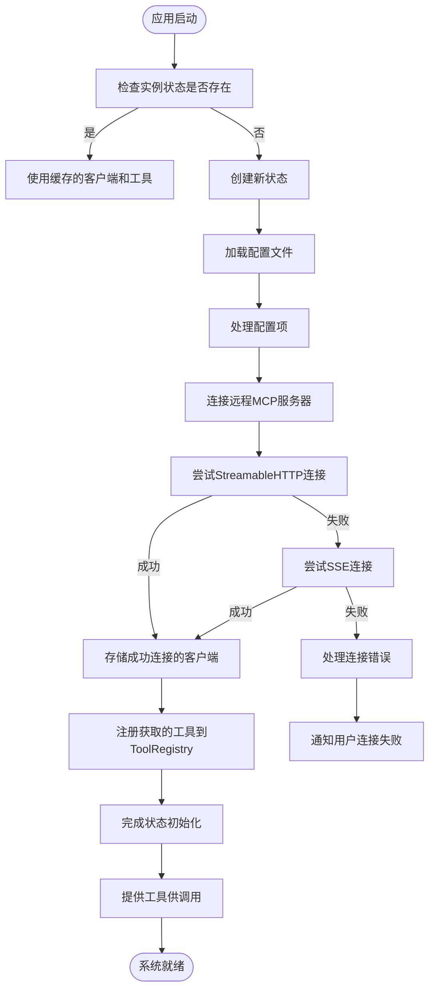
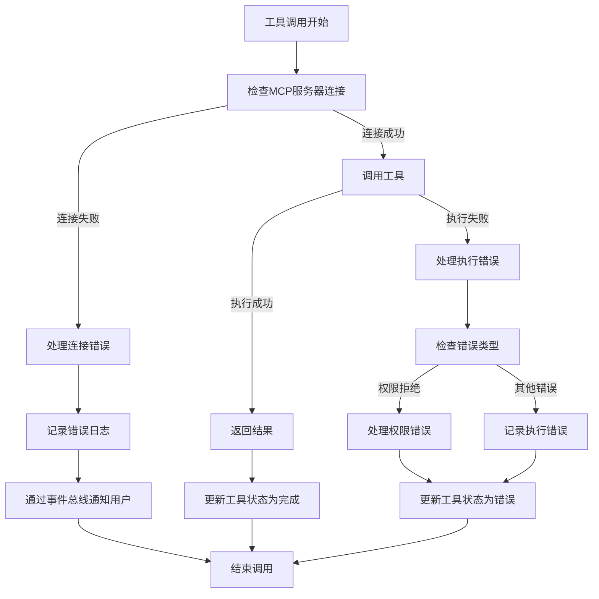

# 工具发现与元数据解析

<cite>
**本文档引用的文件**
- [index.ts](file://packages/opencode/src/mcp/index.ts)
- [registry.ts](file://packages/opencode/src/tool/registry.ts)
- [tool.ts](file://packages/opencode/src/tool/tool.ts)
- [config.ts](file://packages/opencode/src/config/config.ts)
- [04-tool-integration.md](file://doc-agent-context/04-tool-integration.md)
</cite>

## 目录
1. [引言](#引言)
2. [MCP工具发现机制](#mcp工具发现机制)
3. [工具元数据获取流程](#工具元数据获取流程)
4. [工具描述文档解析](#工具描述文档解析)
5. [元数据缓存策略](#元数据缓存策略)
6. [错误处理机制](#错误处理机制)
7. [总结](#总结)

## 引言
本文档详细说明了MCP（Model Context Protocol）工具发现机制，包括系统如何通过服务发现协议或配置文件定位远程MCP服务器。文档阐述了工具元数据的获取流程，解析工具描述文档的过程，以及提取工具ID、名称、描述、参数签名、输入输出类型等关键信息的方法。同时，文档解释了元数据缓存策略以提升后续调用性能，并结合代码示例展示从HTTP请求获取元数据到本地注册表更新的完整链路，以及错误处理机制。

## MCP工具发现机制

系统通过MCP协议实现标准化的工具集成，支持本地和远程MCP服务器的连接。MCP客户端管理器负责管理所有MCP客户端和工具。



**图示来源**
- [index.ts](file://packages/opencode/src/mcp/index.ts#L1-L157)
- [04-tool-integration.md](file://doc-agent-context/04-tool-integration.md#L223-L333)

**本节来源**
- [index.ts](file://packages/opencode/src/mcp/index.ts#L1-L157)
- [04-tool-integration.md](file://doc-agent-context/04-tool-integration.md#L223-L333)

## 工具元数据获取流程

系统通过MCP客户端管理器连接到MCP服务器并获取工具元数据。对于远程服务器，系统尝试多种传输协议（StreamableHTTP和SSE）以确保连接成功。

```mermaid
sequenceDiagram
participant Client as "客户端"
participant Manager as "MCPClientManager"
participant Server as "MCP服务器"
participant Registry as "ToolRegistry"
Client->>Manager : connectToServer(config)
Manager->>Manager : createClient(config)
alt 本地服务器
Manager->>Manager : createLocalClient(config)
Manager->>Manager : StdioClientTransport启动进程
else 远程服务器
Manager->>Manager : createRemoteClient(config)
loop 尝试每种传输协议
Manager->>Server : StreamableHTTPClientTransport连接
alt 连接失败
Manager->>Manager : 记录错误，尝试下一种协议
else 连接成功
Manager->>Manager : 使用成功连接的传输协议
break
end
end
end
Manager->>Server : client.getTools()
Server-->>Manager : 返回工具定义
Manager->>Manager : 创建MCPTool实例
Manager->>Registry : 注册工具到ToolRegistry
Registry-->>Manager : 确认注册
Manager-->>Client : 连接完成
```

**图示来源**
- [index.ts](file://packages/opencode/src/mcp/index.ts#L1-L157)
- [04-tool-integration.md](file://doc-agent-context/04-tool-integration.md#L223-L333)

**本节来源**
- [index.ts](file://packages/opencode/src/mcp/index.ts#L1-L157)
- [04-tool-integration.md](file://doc-agent-context/04-tool-integration.md#L223-L333)

## 工具描述文档解析

系统解析工具描述文档以提取工具ID、名称、描述、参数签名、输入输出类型等关键信息。工具定义结构包含参数模式、描述和执行函数。

```mermaid
classDiagram
class ToolDefinition {
+args : Record<string, any>
+description : string
+execute : (args : any, ctx : ToolContext) => Promise<any>
}
class ToolInfo {
+id : string
+init : () => Promise<{
parameters : ZodSchema
description : string
execute : (args : any, ctx : ToolContext) => Promise<ToolResult>
}>
}
class ToolContext {
+sessionID : string
+messageID : string
+agent : string
+abort : AbortSignal
+callID? : string
+extra? : { [key : string] : any }
+metadata(input : { title? : string; metadata? : M }) : void
}
ToolRegistry --> ToolInfo : "包含"
ToolInfo --> ToolDefinition : "初始化"
ToolInfo --> ToolContext : "执行时使用"
```

**图示来源**
- [tool.ts](file://packages/opencode/src/tool/tool.ts#L1-L44)
- [registry.ts](file://packages/opencode/src/tool/registry.ts#L1-L132)
- [04-tool-integration.md](file://doc-agent-context/04-tool-integration.md#L183-L213)

**本节来源**
- [tool.ts](file://packages/opencode/src/tool/tool.ts#L1-L44)
- [registry.ts](file://packages/opencode/src/tool/registry.ts#L1-L132)
- [04-tool-integration.md](file://doc-agent-context/04-tool-integration.md#L183-L213)

## 元数据缓存策略

系统采用实例状态管理器（Instance.state）来缓存MCP客户端和工具元数据，避免重复连接和获取元数据，从而提升后续调用性能。



**图示来源**
- [index.ts](file://packages/opencode/src/mcp/index.ts#L1-L157)
- [registry.ts](file://packages/opencode/src/tool/registry.ts#L1-L132)

**本节来源**
- [index.ts](file://packages/opencode/src/mcp/index.ts#L1-L157)
- [registry.ts](file://packages/opencode/src/tool/registry.ts#L1-L132)

## 错误处理机制

系统实现了全面的错误处理机制，包括网络超时、格式解析失败等情况的应对策略。错误信息会被记录并通知用户。



**图示来源**
- [index.ts](file://packages/opencode/src/mcp/index.ts#L1-L157)
- [04-tool-integration.md](file://doc-agent-context/04-tool-integration.md#L650-L750)

**本节来源**
- [index.ts](file://packages/opencode/src/mcp/index.ts#L1-L157)
- [04-tool-integration.md](file://doc-agent-context/04-tool-integration.md#L650-L750)

## 总结
本文档详细介绍了MCP工具发现机制和元数据解析流程。系统通过MCP协议支持本地和远程服务器的连接，采用多种传输协议确保连接成功率。工具元数据通过标准化的描述文档进行定义和解析，关键信息包括工具ID、名称、描述、参数签名等。系统利用实例状态管理器实现元数据缓存，提升性能。全面的错误处理机制确保了系统的稳定性和用户体验。