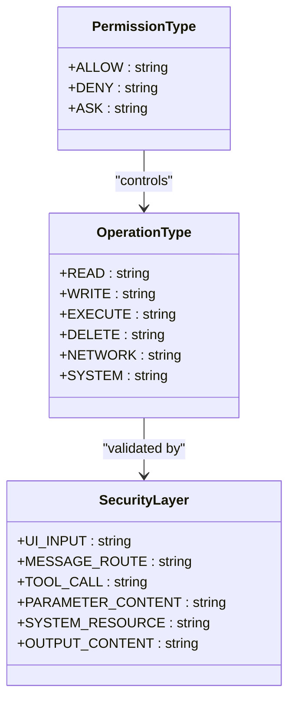
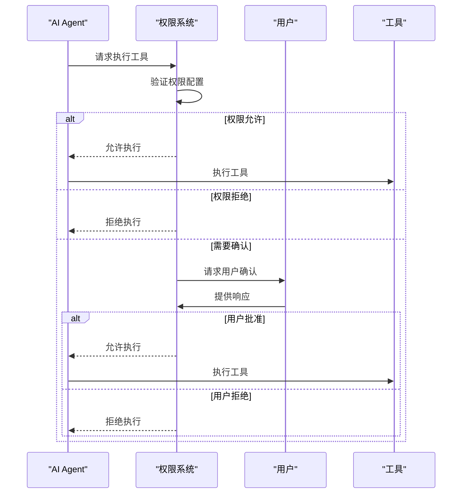
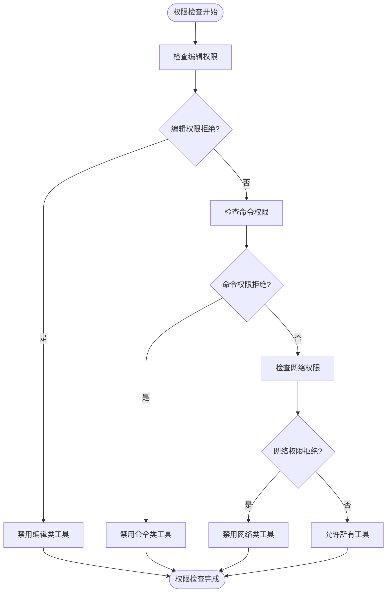
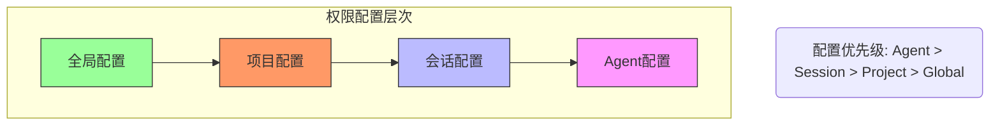
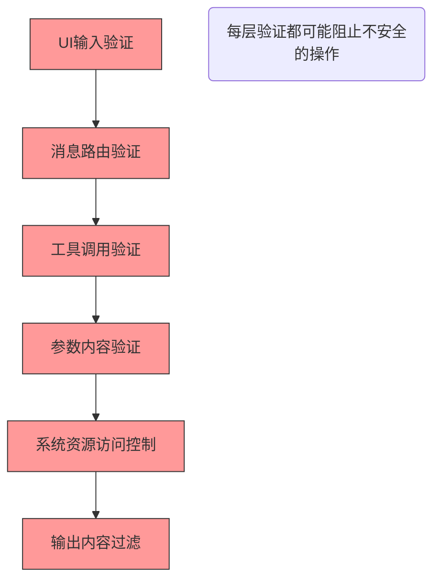

# 工具权限与安全控制

<cite>
**本文档引用的文件**  
- [05-permission-control.md](file://doc-agent-context/05-permission-control.md)
- [SecuritySystem.js](file://context-claude-code/src/security/SecuritySystem.js)
- [index.ts](file://packages/opencode/src/permission/index.ts)
- [registry.ts](file://packages/opencode/src/tool/registry.ts)
</cite>

## 目录
1. [权限管理体系概述](#权限管理体系概述)
2. [工具权限声明机制](#工具权限声明机制)
3. [权限检查执行流程](#权限检查执行流程)
4. [最小权限原则实现](#最小权限原则实现)
5. [权限配置示例](#权限配置示例)
6. [权限冲突处理](#权限冲突处理)
7. [安全验证体系](#安全验证体系)

## 权限管理体系概述

权限控制系统是OpenCode安全机制的核心，负责管理AI agent对各种操作的访问权限。系统实现了细粒度的权限控制、审批流程、权限合并等机制，确保AI agent在安全的范围内执行操作。

### 系统核心价值

OpenCode的权限控制系统解决了传统AI系统中的几个关键安全问题：

1. **安全风险控制**: AI Agent可能执行危险操作，系统通过细粒度的权限控制确保操作安全。

2. **权限管理复杂性**: 不同场景需要不同的权限策略，系统通过分层权限模型实现了灵活的权限管理。

3. **用户控制需求**: 用户需要控制AI Agent的行为，系统通过审批流程和权限配置实现了用户控制。

4. **审计和合规需求**: 企业环境需要权限审计，系统通过完整的审计机制实现了合规要求。

**Section sources**
- [05-permission-control.md](file://doc-agent-context/05-permission-control.md#L1-L100)

## 工具权限声明机制

### 权限类型定义

系统定义了三种核心权限类型：

```typescript
export const Permission = z.enum(["allow", "ask", "deny"])
export type Permission = z.infer<typeof Permission>
```

- **allow**: 允许操作，无需用户确认
- **ask**: 需要用户确认，等待用户审批
- **deny**: 拒绝操作，完全禁止

### 工具类别权限

系统根据工具功能划分了不同的权限类别：

- **文件操作权限**: 控制文件读写、编辑等操作
- **网络访问权限**: 控制网络请求、数据抓取等操作
- **系统命令权限**: 控制命令执行、进程管理等操作



**Diagram sources**
- [SecuritySystem.js](file://context-claude-code/src/security/SecuritySystem.js#L10-L50)

**Section sources**
- [index.ts](file://packages/opencode/src/permission/index.ts#L1-L50)
- [SecuritySystem.js](file://context-claude-code/src/security/SecuritySystem.js#L10-L50)

## 权限检查执行流程

### 执行时机

权限检查在工具调用前进行验证，确保在操作执行前完成安全检查。系统采用六层安全验证机制：

1. **UI输入验证**: 验证输入格式和基本参数
2. **消息路由验证**: 检查会话状态和操作权限
3. **工具调用验证**: 验证具体工具调用权限
4. **参数内容验证**: 验证参数大小和内容
5. **系统资源访问控制**: 控制资源分配和使用
6. **输出内容过滤**: 过滤敏感信息和恶意内容

### 拒绝策略

当权限检查失败时，系统执行相应的拒绝策略：

- **直接拒绝**: 对于明确禁止的操作，立即拒绝并返回错误
- **用户确认**: 对于需要确认的操作，等待用户审批
- **记录审计**: 记录所有权限检查结果用于审计



**Diagram sources**
- [SecuritySystem.js](file://context-claude-code/src/security/SecuritySystem.js#L558-L845)
- [index.ts](file://packages/opencode/src/permission/index.ts#L50-L100)

**Section sources**
- [SecuritySystem.js](file://context-claude-code/src/security/SecuritySystem.js#L558-L845)
- [index.ts](file://packages/opencode/src/permission/index.ts#L50-L100)

## 最小权限原则实现

### 权限合并机制

系统实现了智能的权限合并算法，支持多层级权限配置：

```typescript
function mergeAgentPermissions(basePermission: any, overridePermission: any): Agent.Info["permission"] {
  const merged = mergeDeep(basePermission ?? {}, overridePermission ?? {})
  let mergedBash
  
  if (merged.bash) {
    if (typeof merged.bash === "string") {
      mergedBash = { "*": merged.bash }
    }
    if (typeof merged.bash === "object") {
      mergedBash = mergeDeep({ "*": "ask" }, merged.bash)
    }
  }

  return {
    edit: merged.edit ?? "allow",
    webfetch: merged.webfetch ?? "allow",
    bash: mergedBash ?? { "*": "allow" },
  }
}
```

### 默认权限配置

```typescript
const defaultPermission: Info["permission"] = {
  edit: "allow",
  bash: { "*": "allow" },
  webfetch: "allow",
}
```

### 工具权限检查

```typescript
export async function enabled(
  _providerID: string,
  _modelID: string,
  agent: Agent.Info,
): Promise<Record<string, boolean>> {
  const result: Record<string, boolean> = {}
  result["patch"] = false

  if (agent.permission.edit === "deny") {
    result["edit"] = false
    result["patch"] = false
    result["write"] = false
  }
  if (agent.permission.bash["*"] === "deny" && Object.keys(agent.permission.bash).length === 1) {
    result["bash"] = false
  }
  if (agent.permission.webfetch === "deny") {
    result["webfetch"] = false
  }

  return result
}
```



**Diagram sources**
- [registry.ts](file://packages/opencode/src/tool/registry.ts#L100-L130)
- [SecuritySystem.js](file://context-claude-code/src/security/SecuritySystem.js#L100-L150)

**Section sources**
- [registry.ts](file://packages/opencode/src/tool/registry.ts#L100-L130)
- [SecuritySystem.js](file://context-claude-code/src/security/SecuritySystem.js#L100-L150)

## 权限配置示例

### 全局权限配置

```json
{
  "permission": {
    "edit": "ask",
    "bash": "allow",
    "webfetch": "deny"
  }
}
```

### Agent特定权限配置

```json
{
  "agent": {
    "readonly": {
      "permission": {
        "edit": "deny",
        "bash": "deny",
        "webfetch": "allow"
      }
    },
    "developer": {
      "permission": {
        "edit": "allow",
        "bash": {
          "*": "allow",
          "rm": "ask",
          "sudo": "deny"
        },
        "webfetch": "allow"
      }
    }
  }
}
```

### 命令模式匹配

```json
{
  "permission": {
    "bash": {
      "*": "allow",
      "rm -rf": "ask",
      "sudo": "deny",
      "git push": "ask"
    }
  }
}
```

**Section sources**
- [05-permission-control.md](file://doc-agent-context/05-permission-control.md#L626-L699)

## 权限冲突处理

### 冲突解决策略

当存在多个权限配置时，系统采用以下策略解决冲突：

1. **优先级规则**: 特定配置优先于全局配置
2. **合并规则**: 合并不同层级的权限设置
3. **默认拒绝**: 无法确定时默认拒绝操作

### 实际场景示例

在开发环境中，可能需要同时满足安全性和灵活性的需求：

- **开发Agent**: 允许大部分操作，但对危险命令需要确认
- **只读Agent**: 禁止所有修改操作，仅允许读取和网络访问
- **生产Agent**: 严格限制所有操作，需要明确授权



**Diagram sources**
- [05-permission-control.md](file://doc-agent-context/05-permission-control.md#L1-L100)
- [index.ts](file://packages/opencode/src/permission/index.ts#L1-L50)

**Section sources**
- [05-permission-control.md](file://doc-agent-context/05-permission-control.md#L1-L100)
- [index.ts](file://packages/opencode/src/permission/index.ts#L1-L50)

## 安全验证体系

### 六层安全验证

系统实现了六层安全验证机制，确保每个操作都经过严格的安全检查：



### 敏感路径保护

系统定义了敏感文件路径模式，防止访问重要系统文件：

```typescript
const SENSITIVE_PATHS = [
  /\.env$/,
  /config\.(json|yaml|yml|toml)$/i,
  /private/i,
  /secret/i,
  /key/i,
  /password/i,
  /token/i,
  /credential/i,
  /\/etc\//,
  /\/system\//,
  /\/windows\//i,
  /\/users\/[^\/]+\/\.ssh\//i
];
```

### 危险命令检测

系统识别并阻止危险命令的执行：

```typescript
const DANGEROUS_COMMANDS = [
  /rm\s+-rf/i,
  /dd\s+if=/i,
  /mkfs/i,
  /format/i,
  /shutdown/i,
  /reboot/i,
  /sudo\s+su/i,
  /chmod\s+777/i,
  /wget.*\|.*sh/i,
  /curl.*\|.*bash/i,
  />\s*\/dev\/null/i,
  /rm\s+\/\//i
];
```

**Section sources**
- [SecuritySystem.js](file://context-claude-code/src/security/SecuritySystem.js#L50-L100)