# 工具注册与调用

<cite>
**本文档引用的文件**  
- [registry.ts](file://packages/opencode/src/tool/registry.ts)
- [tool.ts](file://packages/opencode/src/tool/tool.ts)
- [mcp/index.ts](file://packages/opencode/src/mcp/index.ts)
- [config.ts](file://packages/opencode/src/config/config.ts)
- [04-tool-integration.md](file://doc-agent-context/04-tool-integration.md)
- [01-architecture-overview.md](file://doc-agent-context/01-architecture-overview.md)
</cite>

## 目录
1. [引言](#引言)
2. [MCP工具注册机制](#mcp工具注册机制)
3. [工具元数据获取与解析](#工具元数据获取与解析)
4. [统一工具调用接口](#统一工具调用接口)
5. [工具调用流程](#工具调用流程)
6. [上下文传递机制](#上下文传递机制)
7. [权限控制与安全](#权限控制与安全)
8. [错误处理与状态管理](#错误处理与状态管理)
9. [总结](#总结)

## 引言

OpenCode系统通过Model Context Protocol (MCP)实现了强大的工具集成能力，支持本地和远程MCP服务器的工具发现、注册和调用。系统采用注册表模式管理所有可用工具，包括内置工具、自定义工具和MCP协议工具，为AI agent提供统一的工具使用接口。本文档深入解析MCP工具注册与调用机制，详细说明系统如何发现远程MCP服务器提供的工具并将其动态注册到本地工具注册表中。

## MCP工具注册机制

### MCP客户端管理

系统通过`MCP`命名空间管理所有MCP客户端连接，支持本地和远程两种连接方式。在系统启动时，会根据配置自动连接到指定的MCP服务器：

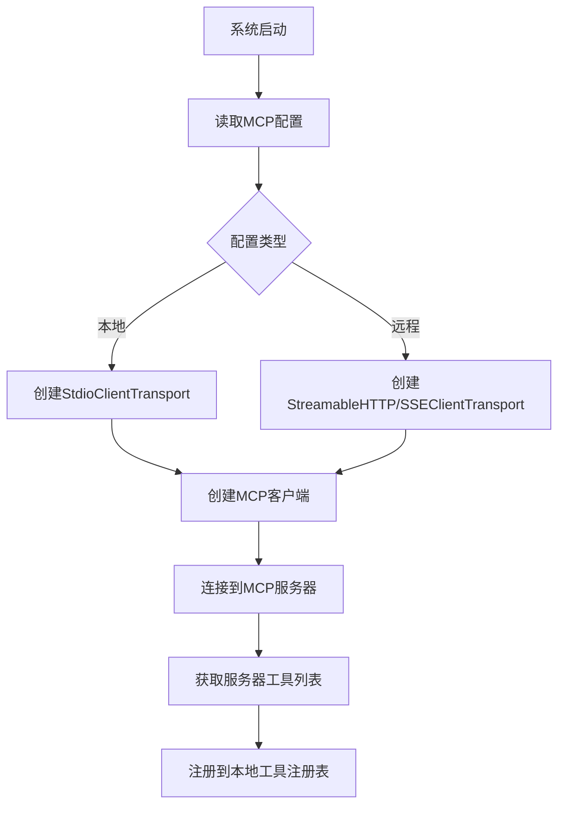

**图示来源**  
- [mcp/index.ts](file://packages/opencode/src/mcp/index.ts#L21-L157)

**本节来源**  
- [mcp/index.ts](file://packages/opencode/src/mcp/index.ts#L21-L157)
- [04-tool-integration.md](file://doc-agent-context/04-tool-integration.md#L223-L333)

### 工具发现与注册流程

系统通过`Instance.state`实现MCP客户端的生命周期管理，在初始化阶段自动发现和注册MCP工具：

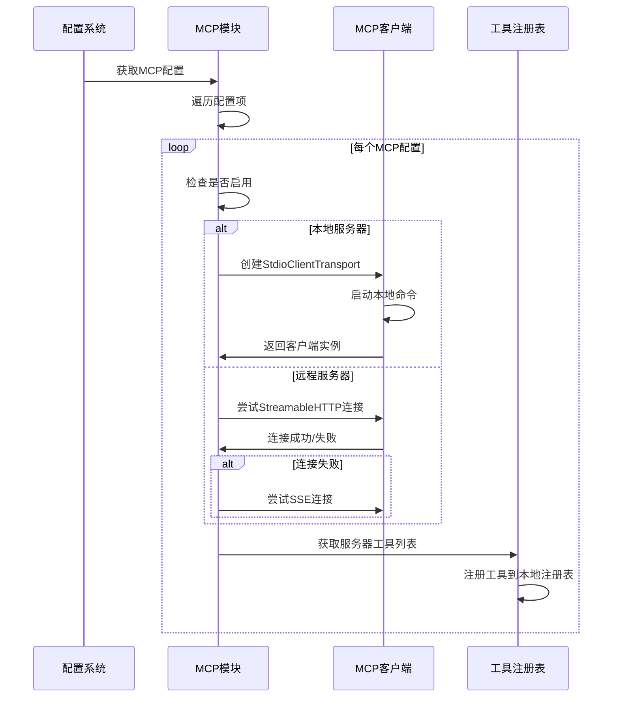

**图示来源**  
- [mcp/index.ts](file://packages/opencode/src/mcp/index.ts#L21-L157)

**本节来源**  
- [mcp/index.ts](file://packages/opencode/src/mcp/index.ts#L21-L157)
- [01-architecture-overview.md](file://doc-agent-context/01-architecture-overview.md#L653-L696)

## 工具元数据获取与解析

### 工具元数据结构

系统定义了统一的工具信息接口`Tool.Info`，用于描述工具的元数据：

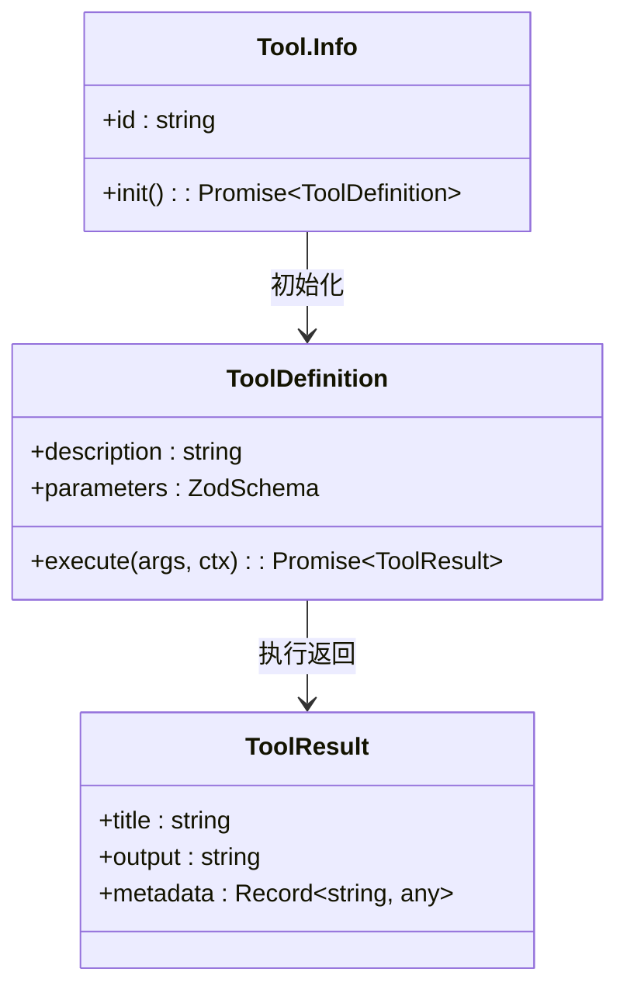

**图示来源**  
- [tool.ts](file://packages/opencode/src/tool/tool.ts#L1-L44)

**本节来源**  
- [tool.ts](file://packages/opencode/src/tool/tool.ts#L1-L44)
- [04-tool-integration.md](file://doc-agent-context/04-tool-integration.md#L509-L571)

### 元数据解析过程

当从MCP服务器获取工具时，系统会进行元数据解析和转换：

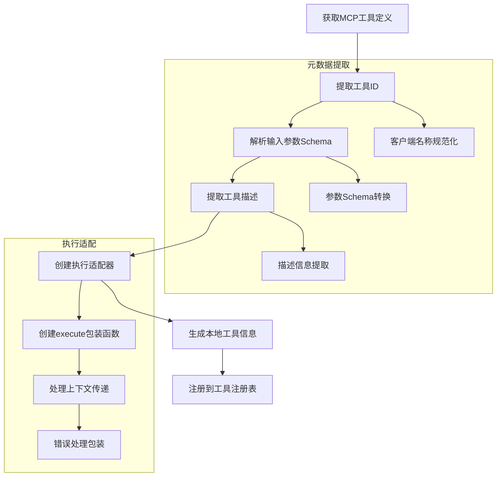

**图示来源**  
- [mcp/index.ts](file://packages/opencode/src/mcp/index.ts#L120-L138)

**本节来源**  
- [mcp/index.ts](file://packages/opencode/src/mcp/index.ts#L120-L138)
- [04-tool-integration.md](file://doc-agent-context/04-tool-integration.md#L223-L333)

## 统一工具调用接口

### 工具调用抽象

系统通过`ToolRegistry`提供统一的工具调用接口，抽象了本地和远程工具的差异：

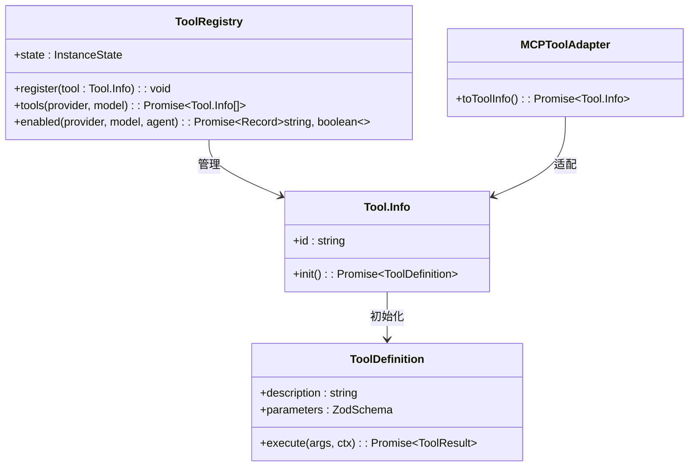

**图示来源**  
- [registry.ts](file://packages/opencode/src/tool/registry.ts#L21-L131)

**本节来源**  
- [registry.ts](file://packages/opencode/src/tool/registry.ts#L21-L131)
- [01-architecture-overview.md](file://doc-agent-context/01-architecture-overview.md#L183-L213)

### 接口设计特点

统一工具调用接口具有以下设计特点：

- **异步初始化**: 工具通过`init()`方法异步初始化，支持延迟加载和动态配置
- **参数验证**: 使用Zod库进行参数验证，确保输入符合预期格式
- **执行隔离**: 每个工具执行都在独立的上下文中运行，避免状态污染
- **结果标准化**: 所有工具返回标准化的结果格式，便于统一处理

```typescript
// 工具定义示例
export interface Tool.Info {
  id: string
  init: () => Promise<{
    description: string
    parameters: ZodSchema
    execute: (args: any, ctx: Tool.Context) => Promise<ToolResult>
  }>
}
```

**本节来源**  
- [tool.ts](file://packages/opencode/src/tool/tool.ts#L1-L44)
- [registry.ts](file://packages/opencode/src/tool/registry.ts#L21-L131)

## 工具调用流程

### 完整调用流程

工具调用的完整流程包括参数验证、权限检查、执行和结果返回：

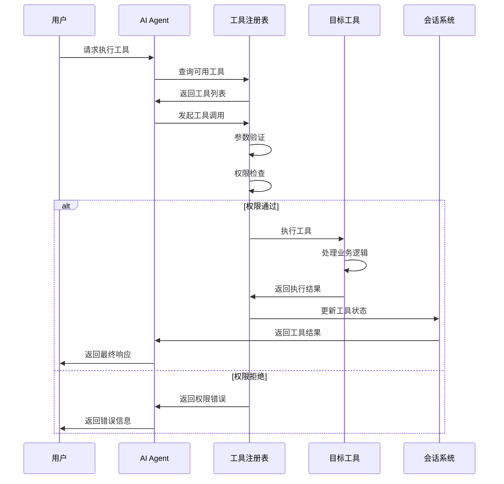

**图示来源**  
- [registry.ts](file://packages/opencode/src/tool/registry.ts#L21-L131)

**本节来源**  
- [registry.ts](file://packages/opencode/src/tool/registry.ts#L21-L131)
- [04-tool-integration.md](file://doc-agent-context/04-tool-integration.md#L799-L882)

### 状态管理

系统实现了完整的工具调用状态管理，跟踪工具执行的各个阶段：

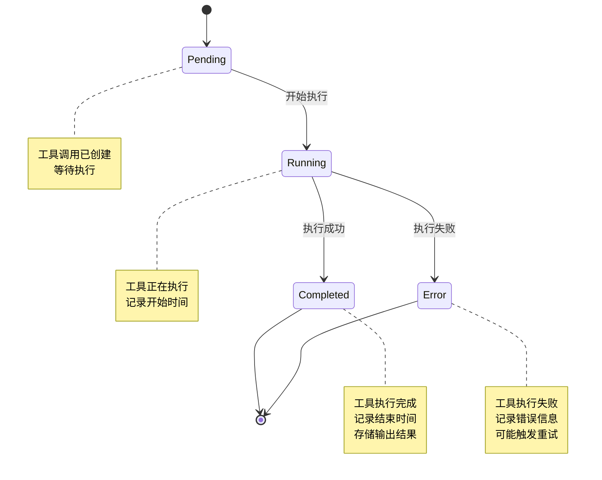

**图示来源**  
- [04-tool-integration.md](file://doc-agent-context/04-tool-integration.md#L799-L882)

**本节来源**  
- [04-tool-integration.md](file://doc-agent-context/04-tool-integration.md#L799-L882)
- [registry.ts](file://packages/opencode/src/tool/registry.ts#L21-L131)

## 上下文传递机制

### 上下文数据结构

系统通过`Tool.Context`接口传递执行上下文，确保工具能够访问必要的会话状态：

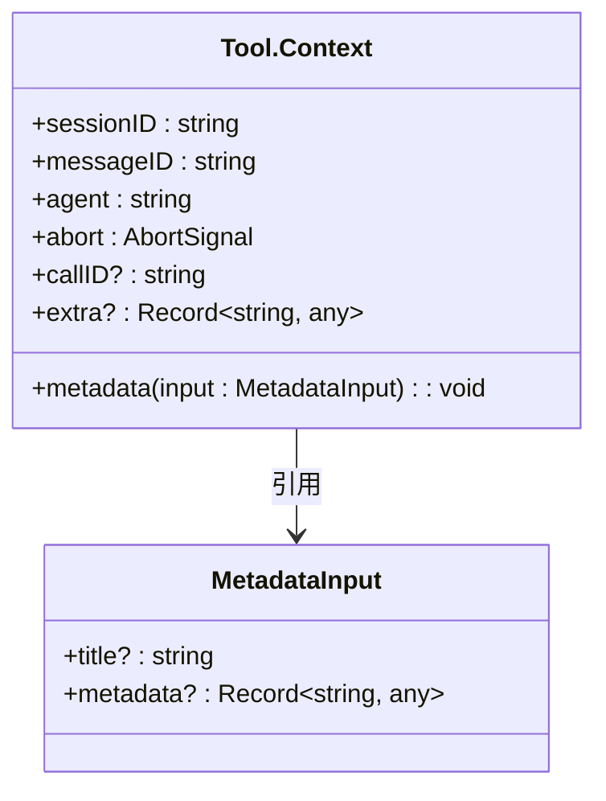

**图示来源**  
- [tool.ts](file://packages/opencode/src/tool/tool.ts#L5-L25)

**本节来源**  
- [tool.ts](file://packages/opencode/src/tool/tool.ts#L5-L25)
- [04-tool-integration.md](file://doc-agent-context/04-tool-integration.md#L799-L882)

### 上下文传递流程

上下文信息在工具调用过程中被完整传递：

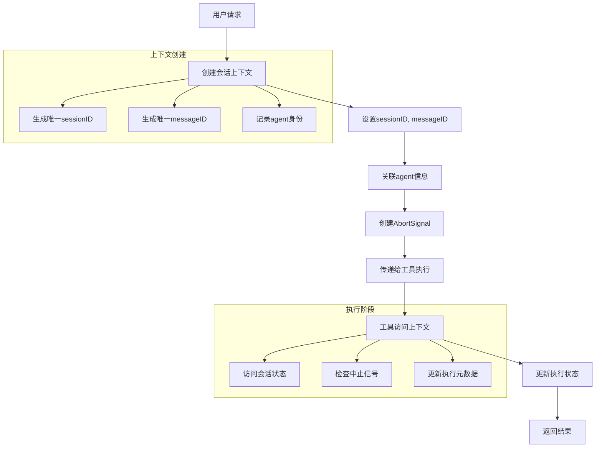

**图示来源**  
- [tool.ts](file://packages/opencode/src/tool/tool.ts#L5-L25)

**本节来源**  
- [tool.ts](file://packages/opencode/src/tool/tool.ts#L5-L25)
- [registry.ts](file://packages/opencode/src/tool/registry.ts#L21-L131)

## 权限控制与安全

### 权限检查机制

系统实现了细粒度的工具权限控制，确保安全的工具调用：

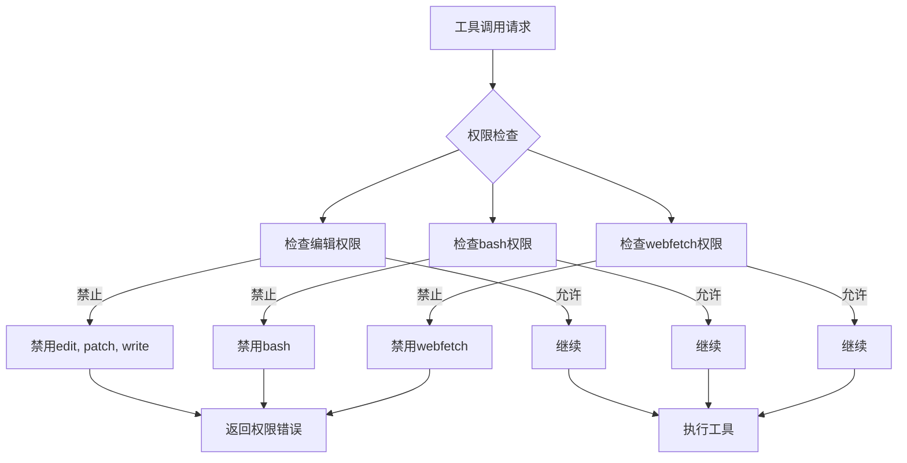

**图示来源**  
- [registry.ts](file://packages/opencode/src/tool/registry.ts#L101-L120)

**本节来源**  
- [registry.ts](file://packages/opencode/src/tool/registry.ts#L101-L120)
- [01-architecture-overview.md](file://doc-agent-context/01-architecture-overview.md#L209-L271)

### 安全策略

系统采用基于策略的权限控制模型，支持灵活的权限管理：

- **默认拒绝**: 未明确允许的操作默认拒绝
- **最小权限**: 只授予完成任务所需的最小权限
- **动态调整**: 权限可根据上下文动态调整
- **审计日志**: 所有权限检查都有详细日志记录

```typescript
// 权限配置示例
{
  "agent": {
    "my-agent": {
      "tools": {
        "read": true,
        "write": false,
        "bash": true,
        "mymcp_*": false
      }
    }
  }
}
```

**本节来源**  
- [04-tool-integration.md](file://doc-agent-context/04-tool-integration.md#L799-L882)
- [registry.ts](file://packages/opencode/src/tool/registry.ts#L101-L120)

## 错误处理与状态管理

### 错误处理机制

系统实现了完善的错误处理机制，确保工具调用的可靠性：

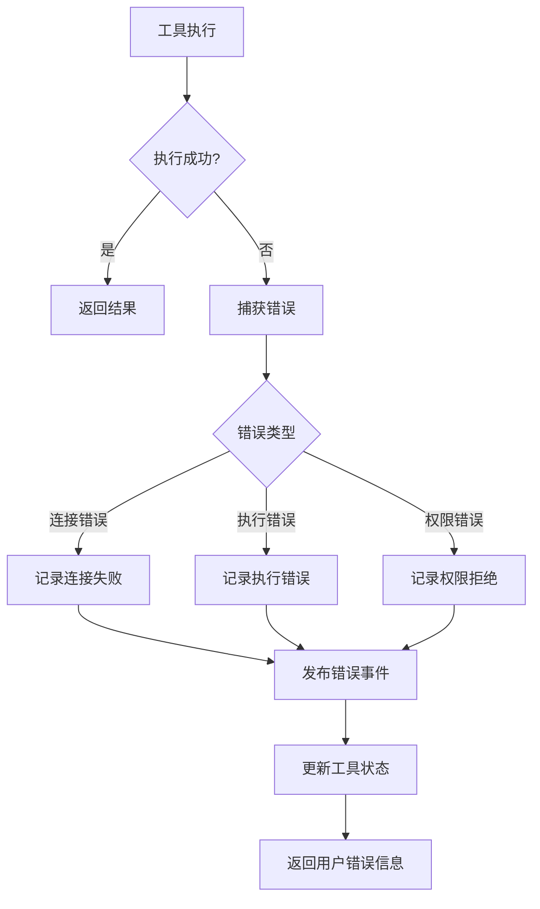

**图示来源**  
- [mcp/index.ts](file://packages/opencode/src/mcp/index.ts#L50-L88)

**本节来源**  
- [mcp/index.ts](file://packages/opencode/src/mcp/index.ts#L50-L88)
- [04-tool-integration.md](file://doc-agent-context/04-tool-integration.md#L799-L882)

### 状态管理

系统通过事件总线实现组件间的松耦合通信，确保状态一致性：

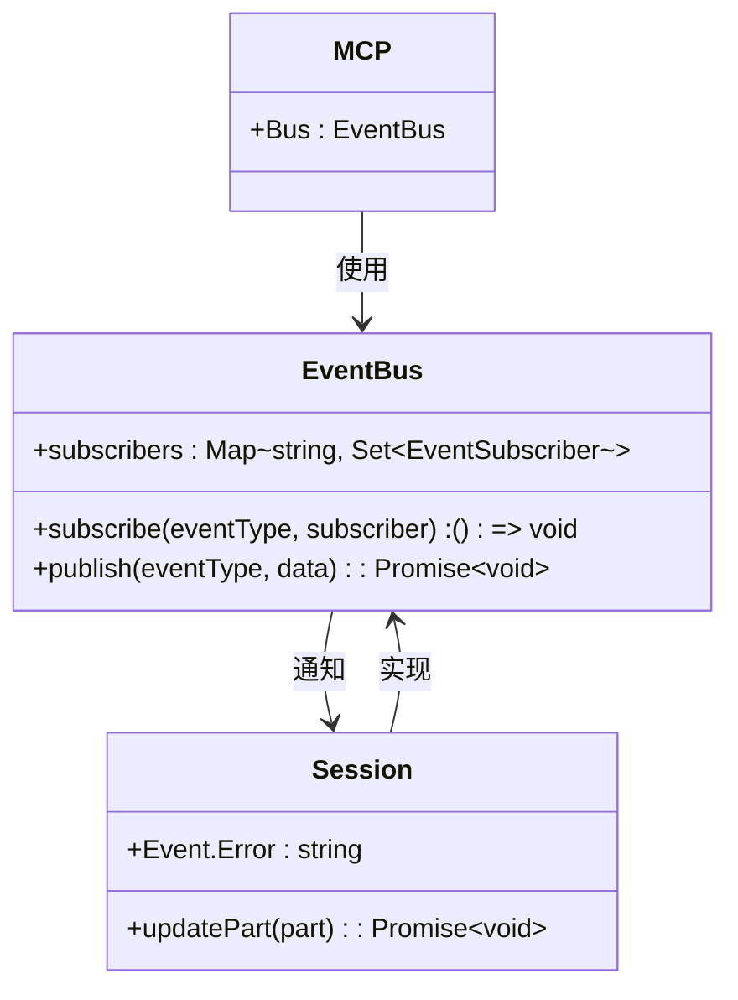

**图示来源**  
- [01-architecture-overview.md](file://doc-agent-context/01-architecture-overview.md#L272-L310)

**本节来源**  
- [01-architecture-overview.md](file://doc-agent-context/01-architecture-overview.md#L272-L310)
- [mcp/index.ts](file://packages/opencode/src/mcp/index.ts#L50-L88)

## 总结

OpenCode系统通过MCP协议实现了强大的工具集成能力，采用注册表模式管理所有可用工具。系统能够自动发现和注册远程MCP服务器提供的工具，通过统一的接口抽象本地和远程工具的调用方式。工具元数据的获取与解析过程确保了工具信息的完整性和一致性，而统一的调用接口设计简化了工具使用。完整的上下文传递机制确保工具执行时能够访问必要的会话状态和用户权限信息，同时细粒度的权限控制和完善的错误处理机制保障了系统的安全性和可靠性。