# 工具调用与执行流程

<cite>
**本文档引用的文件**  
- [index.ts](file://packages/opencode/src/mcp/index.ts)
- [tool.ts](file://packages/opencode/src/tool/tool.ts)
- [index.ts](file://packages/opencode/src/session/index.ts)
- [provider.ts](file://packages/opencode/src/provider/provider.ts)
- [04-tool-integration.md](file://doc-agent-context/04-tool-integration.md)
- [上下文工程管理实践-第4部分-最佳实践.md](file://context-claude-code/上下文工程管理实践-第4部分-最佳实践.md)
- [ErrorHandlingSystem.js](file://context-claude-code/src/error/ErrorHandlingSystem.js)
</cite>

## 目录
1. [引言](#引言)
2. [统一调用接口设计](#统一调用接口设计)
3. [MCP工具集成机制](#mcp工具集成机制)
4. [工具执行流程](#工具执行流程)
5. [参数序列化与上下文注入](#参数序列化与上下文注入)
6. [异步执行与并发控制](#异步执行与并发控制)
7. [结果反序列化与状态管理](#结果反序列化与状态管理)
8. [错误传播与异常处理](#错误传播与异常处理)
9. [超时控制与资源清理](#超时控制与资源清理)
10. [同步与异步调用模式](#同步与异步调用模式)
11. [性能监控与优化建议](#性能监控与优化建议)
12. [结论](#结论)

## 引言

本文档全面解析MCP工具的调用执行流程，从用户发起请求到结果返回的全过程。系统通过统一的工具框架支持多种工具类型和集成方式，包括内置工具、自定义工具和MCP协议工具。文档详细说明了统一调用接口的设计理念，如何抽象本地工具与远程MCP工具的差异，以及参数序列化、上下文注入、异步执行、结果反序列化等关键步骤。同时，文档强调了执行过程中的错误传播机制、超时控制和资源清理策略，确保系统稳定性。

**本文档引用的文件**
- [index.ts](file://packages/opencode/src/mcp/index.ts#L1-L157)
- [tool.ts](file://packages/opencode/src/tool/tool.ts#L1-L45)
- [index.ts](file://packages/opencode/src/session/index.ts#L1-L348)
- [provider.ts](file://packages/opencode/src/provider/provider.ts#L1-L561)

## 统一调用接口设计

### 设计理念

系统采用统一的工具调用接口设计，解决了传统AI系统中工具多样性、权限管理复杂性、集成标准化和扩展性需求等关键问题。通过注册表模式实现动态工具注册和发现，为AI agent提供强大的工具使用能力。

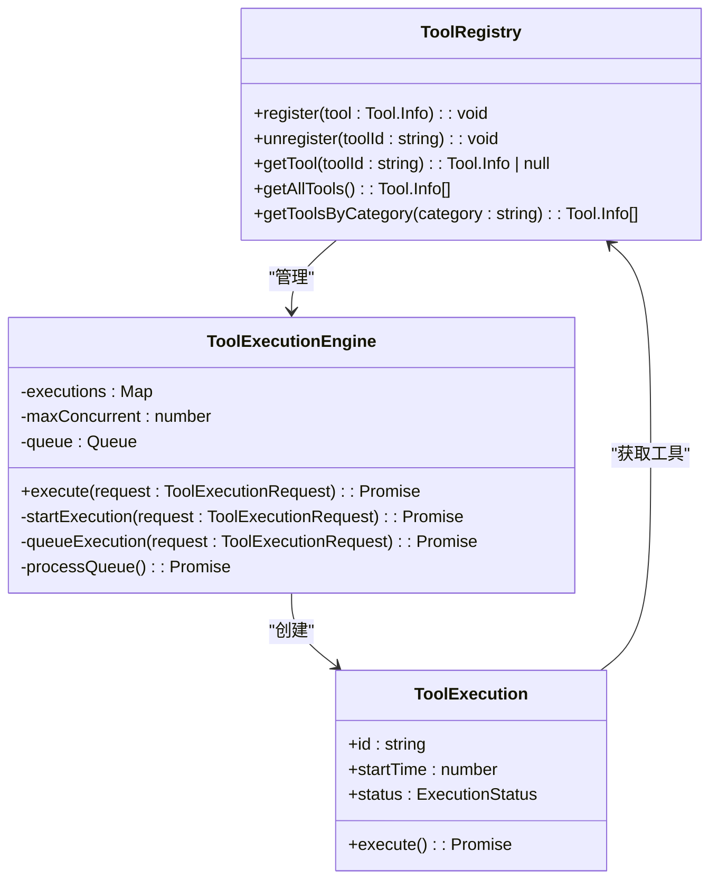
```mermaid
classDiagram
class ToolRegistry {
+register(tool : Tool.Info) : void
+unregister(toolId : string) : void
+getTool(toolId : string) : Tool.Info | null
+getAllTools() : Tool.Info[]
+getToolsByCategory(category : string) : Tool.Info[]
}
class ToolExecutionEngine {
-executions : Map<string, ToolExecution>
-maxConcurrent : number
-queue : Queue<ToolExecutionRequest>
+execute(request : ToolExecutionRequest) : Promise<ToolResult>
-startExecution(request : ToolExecutionRequest) : Promise<ToolResult>
-queueExecution(request : ToolExecutionRequest) : Promise<ToolResult>
-processQueue() : Promise<void>
}
class ToolExecution {
+id : string
+startTime : number
+status : ExecutionStatus
+execute() : Promise<ToolResult>
}
ToolRegistry --> ToolExecutionEngine : "管理"
ToolExecutionEngine --> ToolExecution : "创建"
ToolExecution --> ToolRegistry : "获取工具"
```

**图表来源**
- [04-tool-integration.md](file://doc-agent-context/04-tool-integration.md#L18-L76)

**本节来源**
- [04-tool-integration.md](file://doc-agent-context/04-tool-integration.md#L1-L76)

### 工具定义结构

系统定义了标准化的工具接口，包括工具ID、参数模式、描述和执行函数。通过Zod库进行参数验证，确保工具调用的安全性和可靠性。

```mermaid
classDiagram
class Tool {
+id : string
+init() : Promise<{
parameters : ZodSchema
description : string
execute(args : any, ctx : ToolContext) : Promise<ToolResult>
}>
}
class ToolContext {
+sessionID : string
+messageID : string
+agent : string
+abort : AbortSignal
+callID? : string
+extra? : { [key : string] : any }
+metadata(input : { title? : string; metadata? : M }) : void
}
class ToolResult {
+title : string
+metadata : M
+output : string
}
Tool --> ToolContext : "使用"
Tool --> ToolResult : "返回"
```

**图表来源**
- [tool.ts](file://packages/opencode/src/tool/tool.ts#L1-L45)

**本节来源**
- [tool.ts](file://packages/opencode/src/tool/tool.ts#L1-L45)

## MCP工具集成机制

### MCP客户端管理

系统通过MCP协议实现标准化的工具集成，支持本地和远程MCP服务器。对于远程服务器，系统尝试多种传输协议（StreamableHTTP和SSE）以确保连接成功；对于本地服务器，通过stdio传输启动子进程。

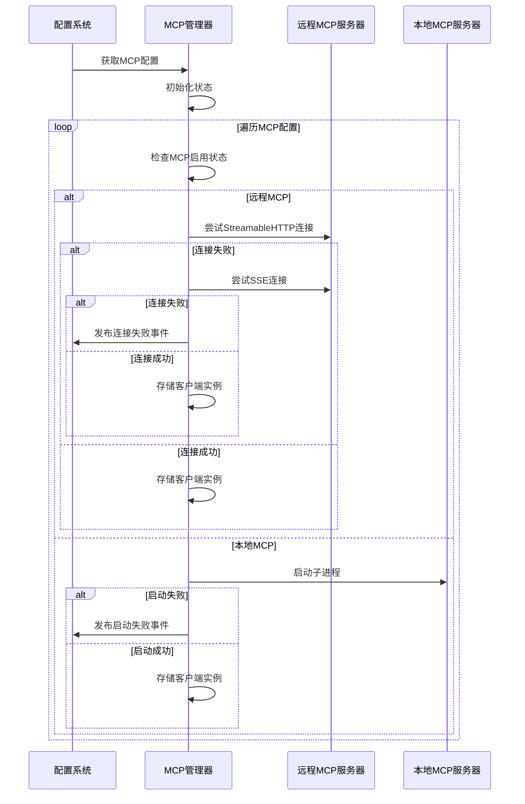
```mermaid
sequenceDiagram
participant Config as 配置系统
participant MCPManager as MCP管理器
participant RemoteMCP as 远程MCP服务器
participant LocalMCP as 本地MCP服务器
Config->>MCPManager : 获取MCP配置
MCPManager->>MCPManager : 初始化状态
loop 遍历MCP配置
MCPManager->>MCPManager : 检查MCP启用状态
alt 远程MCP
MCPManager->>RemoteMCP : 尝试StreamableHTTP连接
alt 连接失败
MCPManager->>RemoteMCP : 尝试SSE连接
alt 连接失败
MCPManager->>Config : 发布连接失败事件
else 连接成功
MCPManager->>MCPManager : 存储客户端实例
end
else 连接成功
MCPManager->>MCPManager : 存储客户端实例
end
else 本地MCP
MCPManager->>LocalMCP : 启动子进程
alt 启动失败
MCPManager->>Config : 发布启动失败事件
else 启动成功
MCPManager->>MCPManager : 存储客户端实例
end
end
end
```

**图表来源**
- [index.ts](file://packages/opencode/src/mcp/index.ts#L1-L157)

**本节来源**
- [index.ts](file://packages/opencode/src/mcp/index.ts#L1-L157)

### 工具抽象与统一

系统通过`tools()`函数将不同来源的MCP工具统一为标准格式，使用下划线替换空格和连字符，确保工具ID的兼容性。这种设计抽象了本地工具与远程工具的差异，为上层提供一致的调用接口。

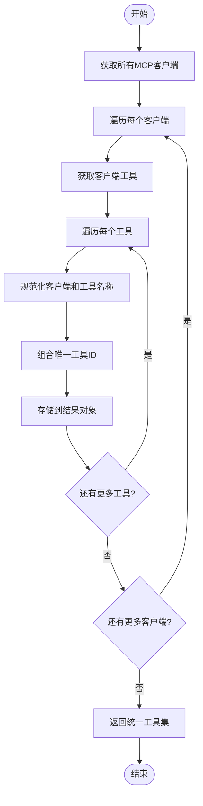
```mermaid
flowchart TD
Start([开始]) --> GetClients["获取所有MCP客户端"]
GetClients --> LoopClients["遍历每个客户端"]
LoopClients --> GetTools["获取客户端工具"]
GetTools --> LoopTools["遍历每个工具"]
LoopTools --> SanitizeName["规范化客户端和工具名称"]
SanitizeName --> CombineID["组合唯一工具ID"]
CombineID --> StoreTool["存储到结果对象"]
StoreTool --> CheckMoreTools{"还有更多工具?"}
CheckMoreTools --> |是| LoopTools
CheckMoreTools --> |否| CheckMoreClients{"还有更多客户端?"}
CheckMoreClients --> |是| LoopClients
CheckMoreClients --> |否| ReturnResult["返回统一工具集"]
ReturnResult --> End([结束])
```

**图表来源**
- [index.ts](file://packages/opencode/src/mcp/index.ts#L130-L157)

**本节来源**
- [index.ts](file://packages/opencode/src/mcp/index.ts#L130-L157)

## 工具执行流程

### 执行引擎架构

系统实现了高性能的工具执行引擎，支持并行执行和状态管理。引擎通过执行队列和并发控制，确保系统资源的合理利用，避免因过多并发执行导致系统过载。

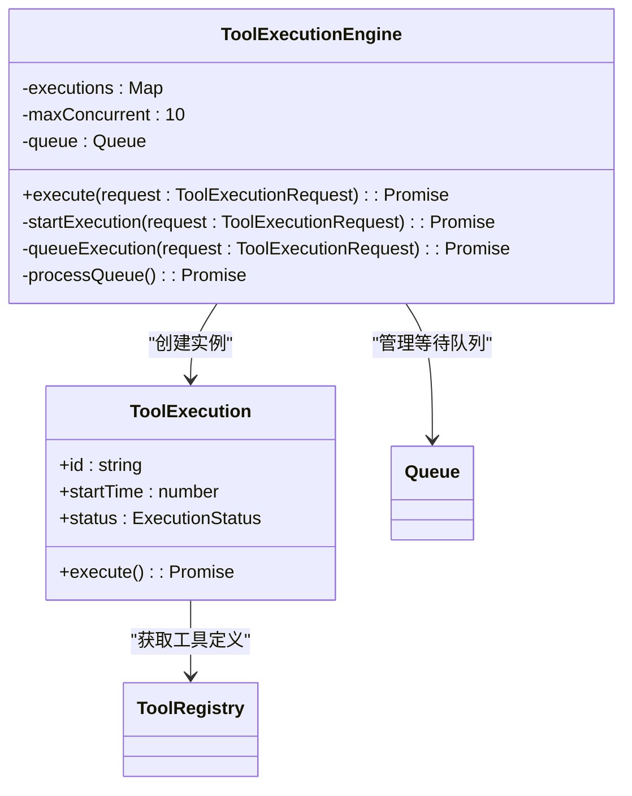
```mermaid
classDiagram
class ToolExecutionEngine {
-executions : Map<string, ToolExecution>
-maxConcurrent : 10
-queue : Queue<ToolExecutionRequest>
+execute(request : ToolExecutionRequest) : Promise<ToolResult>
-startExecution(request : ToolExecutionRequest) : Promise<ToolResult>
-queueExecution(request : ToolExecutionRequest) : Promise<ToolResult>
-processQueue() : Promise<void>
}
class ToolExecution {
+id : string
+startTime : number
+status : ExecutionStatus
+execute() : Promise<ToolResult>
}
ToolExecutionEngine --> ToolExecution : "创建实例"
ToolExecutionEngine --> Queue : "管理等待队列"
ToolExecution --> ToolRegistry : "获取工具定义"
```

**图表来源**
- [04-tool-integration.md](file://doc-agent-context/04-tool-integration.md#L78-L159)

**本节来源**
- [04-tool-integration.md](file://doc-agent-context/04-tool-integration.md#L78-L159)

### 执行流程控制

工具执行流程包括请求接收、并发检查、执行启动、结果返回和资源清理等步骤。当并发数达到上限时，新请求会被放入队列等待；执行完成后，系统会自动处理队列中的等待请求。

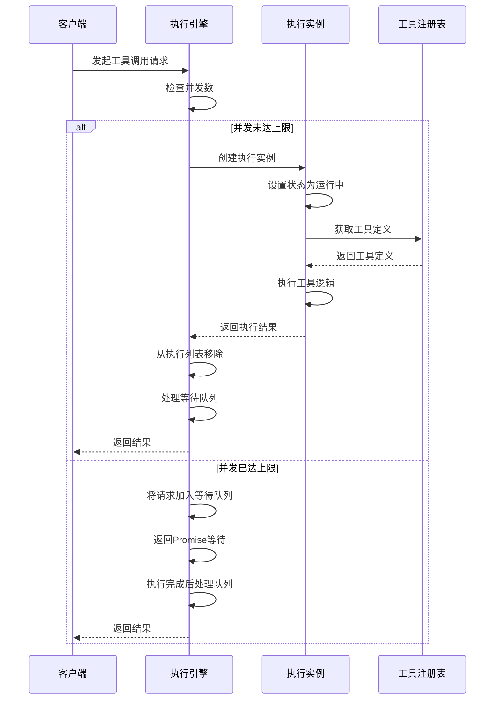
```mermaid
sequenceDiagram
participant Client as 客户端
participant Engine as 执行引擎
participant Execution as 执行实例
participant Registry as 工具注册表
Client->>Engine : 发起工具调用请求
Engine->>Engine : 检查并发数
alt 并发未达上限
Engine->>Execution : 创建执行实例
Execution->>Execution : 设置状态为运行中
Execution->>Registry : 获取工具定义
Registry-->>Execution : 返回工具定义
Execution->>Execution : 执行工具逻辑
Execution-->>Engine : 返回执行结果
Engine->>Engine : 从执行列表移除
Engine->>Engine : 处理等待队列
Engine-->>Client : 返回结果
else 并发已达上限
Engine->>Engine : 将请求加入等待队列
Engine->>Engine : 返回Promise等待
Engine->>Engine : 执行完成后处理队列
Engine-->>Client : 返回结果
end
```

**图表来源**
- [04-tool-integration.md](file://doc-agent-context/04-tool-integration.md#L78-L159)

**本节来源**
- [04-tool-integration.md](file://doc-agent-context/04-tool-integration.md#L78-L159)

## 参数序列化与上下文注入

### 参数序列化机制

系统在工具调用前对参数进行序列化处理，确保不同类型的数据能够正确传输。通过Zod库定义参数模式，实现参数的类型检查和验证，防止无效参数导致工具执行失败。

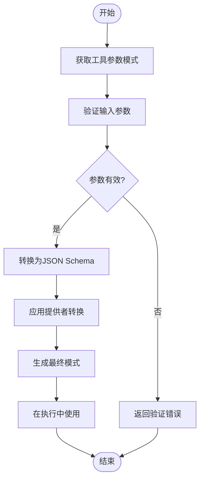
```mermaid
flowchart TD
Start([开始]) --> GetSchema["获取工具参数模式"]
GetSchema --> ValidateInput["验证输入参数"]
ValidateInput --> IsValid{"参数有效?"}
IsValid --> |否| ReturnError["返回验证错误"]
IsValid --> |是| TransformSchema["转换为JSON Schema"]
TransformSchema --> ApplyTransform["应用提供者转换"]
ApplyTransform --> FinalSchema["生成最终模式"]
FinalSchema --> UseInExecution["在执行中使用"]
UseInExecution --> End([结束])
ReturnError --> End
```

**图表来源**
- [04-tool-integration.md](file://doc-agent-context/04-tool-integration.md#L415-L508)

**本节来源**
- [04-tool-integration.md](file://doc-agent-context/04-tool-integration.md#L415-L508)

### 上下文注入

系统在工具执行时注入丰富的上下文信息，包括会话ID、消息ID、代理名称、中止信号等。这些上下文信息使工具能够了解执行环境，实现更智能的行为。

```mermaid
classDiagram
class ToolContext {
+sessionID : string
+messageID : string
+agent : string
+abort : AbortSignal
+callID? : string
+extra? : { [key : string] : any }
+metadata(input : { title? : string; metadata? : M }) : void
}
class ToolExecution {
+request : ToolExecutionRequest
+execute() : Promise<ToolResult>
}
class Session {
+updatePart(part : MessageV2.Part) : Promise<void>
}
ToolExecution --> ToolContext : "创建"
ToolContext --> Session : "更新状态"
ToolExecution --> ToolRegistry : "获取工具"
```

**图表来源**
- [tool.ts](file://packages/opencode/src/tool/tool.ts#L1-L45)

**本节来源**
- [tool.ts](file://packages/opencode/src/tool/tool.ts#L1-L45)

## 异步执行与并发控制

### 并发控制策略

系统通过`maxConcurrent`参数限制最大并发执行数，防止系统资源耗尽。当并发数达到上限时，新请求会被放入队列等待，直到有执行槽位空闲。

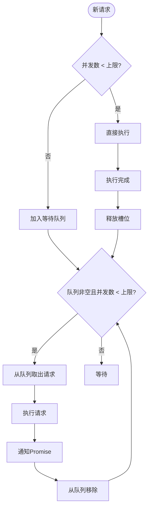
```mermaid
flowchart TD
A([新请求]) --> B{并发数 < 上限?}
B --> |是| C[直接执行]
B --> |否| D[加入等待队列]
C --> E[执行完成]
D --> F{队列非空且并发数 < 上限?}
F --> |是| G[从队列取出请求]
F --> |否| H[等待]
G --> I[执行请求]
I --> J[通知Promise]
J --> K[从队列移除]
K --> F
E --> L[释放槽位]
L --> F
```

**图表来源**
- [04-tool-integration.md](file://doc-agent-context/04-tool-integration.md#L78-L159)

**本节来源**
- [04-tool-integration.md](file://doc-agent-context/04-tool-integration.md#L78-L159)

### 异步执行模式

系统采用Promise-based异步执行模式，确保非阻塞的执行流程。每个工具执行请求返回一个Promise，调用方可以使用async/await语法或then/catch方法处理结果。

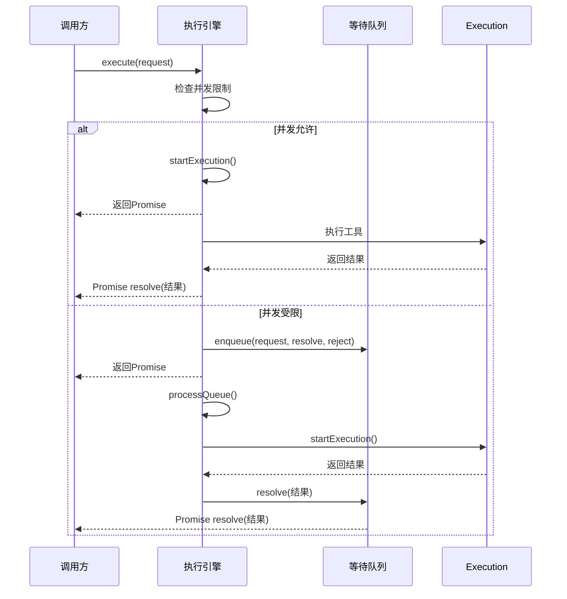
```mermaid
sequenceDiagram
participant Caller as 调用方
participant Engine as 执行引擎
participant Queue as 等待队列
Caller->>Engine : execute(request)
Engine->>Engine : 检查并发限制
alt 并发允许
Engine->>Engine : startExecution()
Engine-->>Caller : 返回Promise
Engine->>Execution : 执行工具
Execution-->>Engine : 返回结果
Engine-->>Caller : Promise resolve(结果)
else 并发受限
Engine->>Queue : enqueue(request, resolve, reject)
Engine-->>Caller : 返回Promise
Engine->>Engine : processQueue()
Engine->>Execution : startExecution()
Execution-->>Engine : 返回结果
Engine->>Queue : resolve(结果)
Queue-->>Caller : Promise resolve(结果)
end
```

**图表来源**
- [04-tool-integration.md](file://doc-agent-context/04-tool-integration.md#L78-L159)

**本节来源**
- [04-tool-integration.md](file://doc-agent-context/04-tool-integration.md#L78-L159)

## 结果反序列化与状态管理

### 状态生命周期

系统实现了完整的工具状态生命周期管理，包括等待、运行、完成和错误四种状态。状态转换与工具执行流程紧密配合，提供清晰的执行进度反馈。

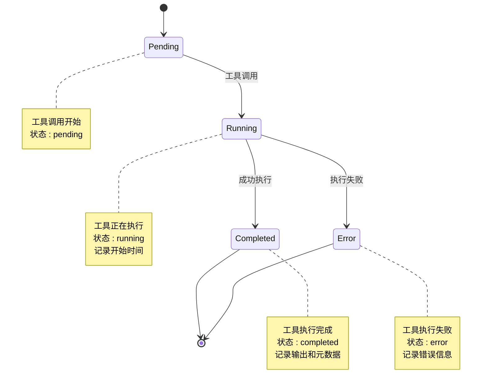
```mermaid
stateDiagram-v2
[*] --> Pending
Pending --> Running : 工具调用
Running --> Completed : 成功执行
Running --> Error : 执行失败
Completed --> [*]
Error --> [*]
note right of Pending
工具调用开始
状态 : pending
end note
note right of Running
工具正在执行
状态 : running
记录开始时间
end note
note right of Completed
工具执行完成
状态 : completed
记录输出和元数据
end note
note right of Error
工具执行失败
状态 : error
记录错误信息
end note
```

**图表来源**
- [04-tool-integration.md](file://doc-agent-context/04-tool-integration.md#L508-L550)

**本节来源**
- [04-tool-integration.md](file://doc-agent-context/04-tool-integration.md#L508-L550)

### 结果处理流程

工具执行结果经过反序列化处理后，更新会话状态并通知相关组件。系统通过事件总线机制实现组件间的松耦合通信。

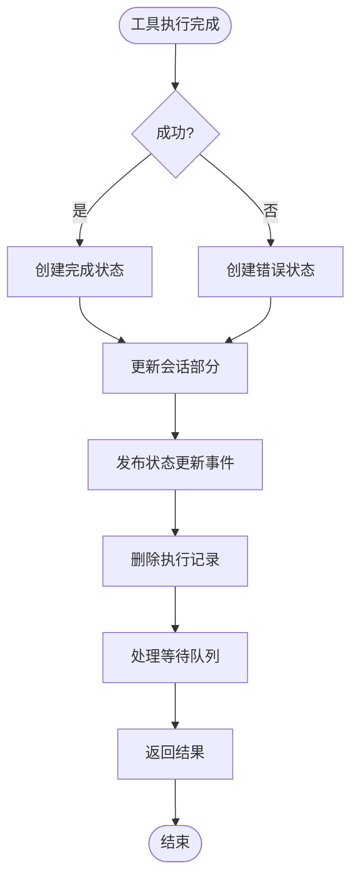
```mermaid
flowchart TD
A([工具执行完成]) --> B{成功?}
B --> |是| C[创建完成状态]
B --> |否| D[创建错误状态]
C --> E[更新会话部分]
D --> E
E --> F[发布状态更新事件]
F --> G[删除执行记录]
G --> H[处理等待队列]
H --> I[返回结果]
I --> J([结束])
```

**图表来源**
- [04-tool-integration.md](file://doc-agent-context/04-tool-integration.md#L661-L722)

**本节来源**
- [04-tool-integration.md](file://doc-agent-context/04-tool-integration.md#L661-L722)

## 错误传播与异常处理

### 错误分类体系

系统建立了完善的错误分类体系，将错误分为模型调用、工具执行、上下文、权限、资源和网络等类型。每种错误类型都有相应的严重等级和恢复策略。

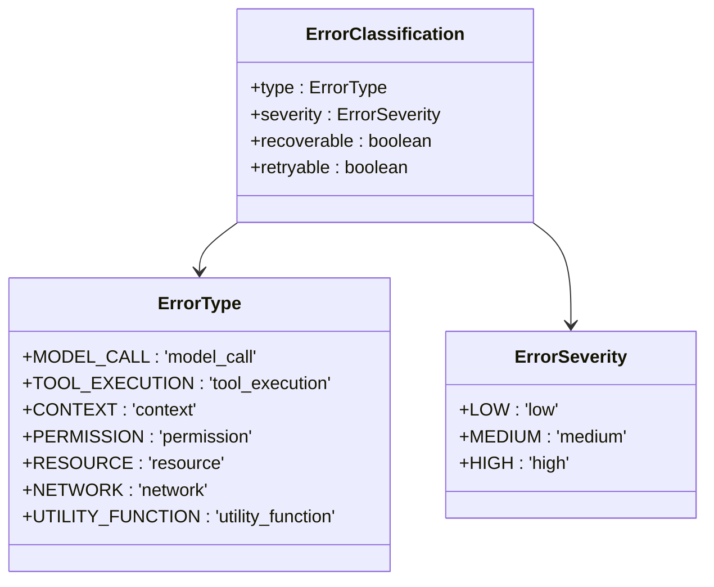
```mermaid
classDiagram
class ErrorType {
+MODEL_CALL : 'model_call'
+TOOL_EXECUTION : 'tool_execution'
+CONTEXT : 'context'
+PERMISSION : 'permission'
+RESOURCE : 'resource'
+NETWORK : 'network'
+UTILITY_FUNCTION : 'utility_function'
}
class ErrorSeverity {
+LOW : 'low'
+MEDIUM : 'medium'
+HIGH : 'high'
}
class ErrorClassification {
+type : ErrorType
+severity : ErrorSeverity
+recoverable : boolean
+retryable : boolean
}
ErrorClassification --> ErrorType
ErrorClassification --> ErrorSeverity
```

**图表来源**
- [ErrorHandlingSystem.js](file://context-claude-code/src/error/ErrorHandlingSystem.js#L57-L128)

**本节来源**
- [ErrorHandlingSystem.js](file://context-claude-code/src/error/ErrorHandlingSystem.js#L57-L128)

### 错误处理流程

系统采用分层错误处理机制，从工具执行层到会话管理层逐级处理错误。权限错误等不可恢复错误会立即终止执行，而网络错误等可恢复错误会尝试重试。

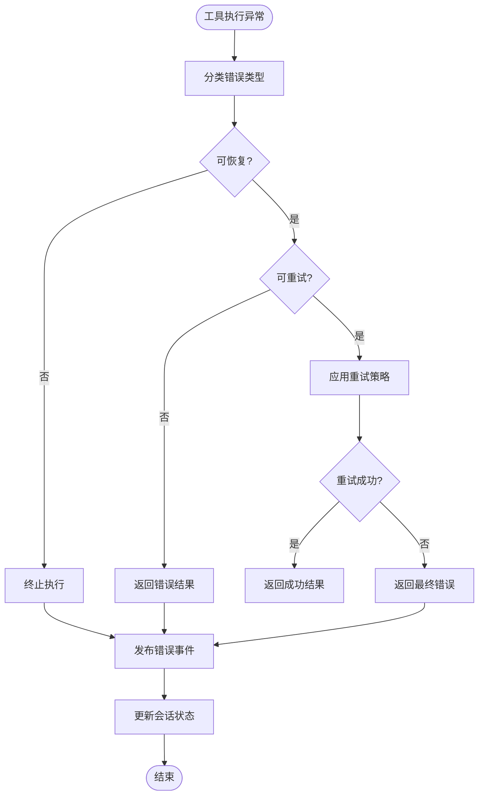
```mermaid
flowchart TD
A([工具执行异常]) --> B[分类错误类型]
B --> C{可恢复?}
C --> |否| D[终止执行]
C --> |是| E{可重试?}
E --> |否| F[返回错误结果]
E --> |是| G[应用重试策略]
G --> H{重试成功?}
H --> |是| I[返回成功结果]
H --> |否| J[返回最终错误]
D --> K[发布错误事件]
F --> K
J --> K
K --> L[更新会话状态]
L --> M([结束])
```

**图表来源**
- [ErrorHandlingSystem.js](file://context-claude-code/src/error/ErrorHandlingSystem.js#L57-L128)

**本节来源**
- [ErrorHandlingSystem.js](file://context-claude-code/src/error/ErrorHandlingSystem.js#L57-L128)

## 超时控制与资源清理

### 超时控制机制

系统通过AbortSignal实现超时控制，确保长时间运行的工具不会阻塞系统。超时设置可以继承自提供者配置或在工具调用时指定。

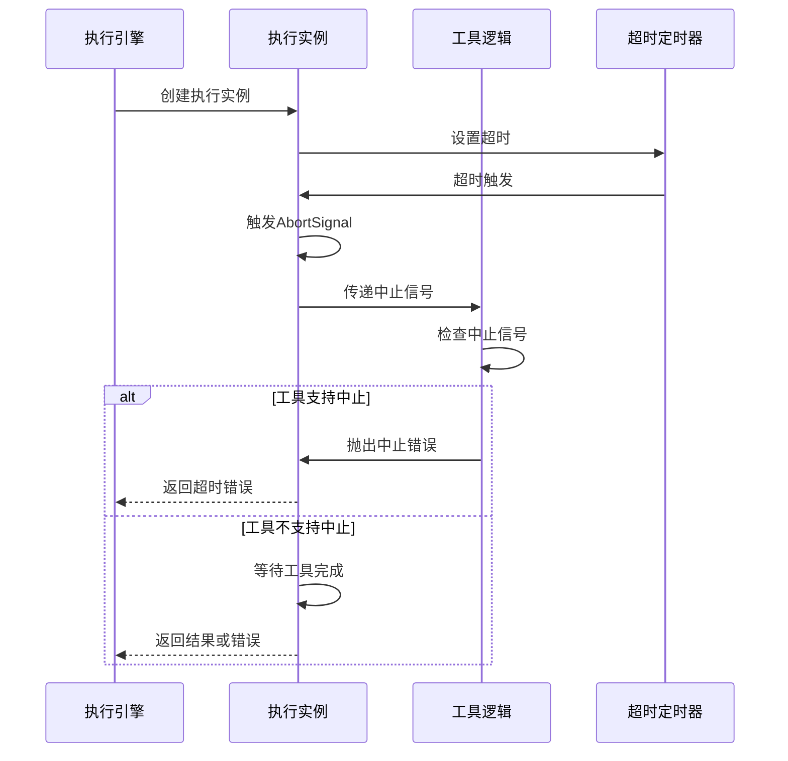
```mermaid
sequenceDiagram
participant Engine as 执行引擎
participant Execution as 执行实例
participant Tool as 工具逻辑
participant Timer as 超时定时器
Engine->>Execution : 创建执行实例
Execution->>Timer : 设置超时
Timer->>Execution : 超时触发
Execution->>Execution : 触发AbortSignal
Execution->>Tool : 传递中止信号
Tool->>Tool : 检查中止信号
alt 工具支持中止
Tool->>Execution : 抛出中止错误
Execution-->>Engine : 返回超时错误
else 工具不支持中止
Execution->>Execution : 等待工具完成
Execution-->>Engine : 返回结果或错误
end
```

**图表来源**
- [provider.ts](file://packages/opencode/src/provider/provider.ts#L200-L220)

**本节来源**
- [provider.ts](file://packages/opencode/src/provider/provider.ts#L200-L220)

### 资源清理策略

系统在工具执行完成后自动清理相关资源，包括从执行列表中移除执行实例、处理等待队列和释放内存。这种自动清理机制确保系统长期运行的稳定性。

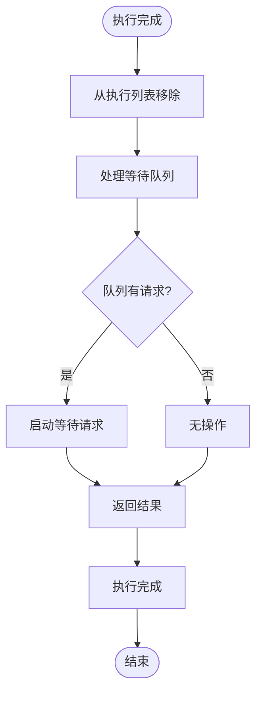
```mermaid
flowchart TD
A([执行完成]) --> B[从执行列表移除]
B --> C[处理等待队列]
C --> D{队列有请求?}
D --> |是| E[启动等待请求]
D --> |否| F[无操作]
E --> G[返回结果]
F --> G
G --> H[执行完成]
H --> I([结束])
```

**图表来源**
- [04-tool-integration.md](file://doc-agent-context/04-tool-integration.md#L78-L159)

**本节来源**
- [04-tool-integration.md](file://doc-agent-context/04-tool-integration.md#L78-L159)

## 同步与异步调用模式

### 同步调用模式

同步调用模式适用于简单、快速的工具操作。调用方会阻塞等待结果返回，适合在非关键路径上使用。

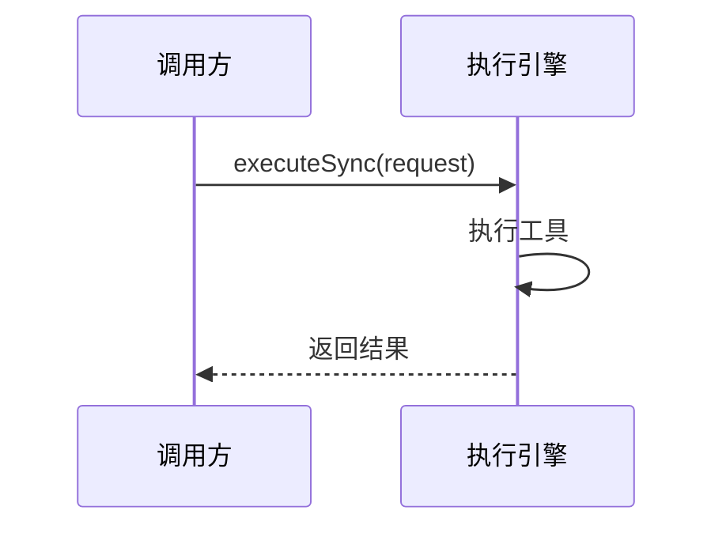
```mermaid
sequenceDiagram
participant Caller as 调用方
participant Engine as 执行引擎
Caller->>Engine : executeSync(request)
Engine->>Engine : 执行工具
Engine-->>Caller : 返回结果
```

**本节来源**
- [04-tool-integration.md](file://doc-agent-context/04-tool-integration.md#L78-L159)

### 异步调用模式

异步调用模式适用于复杂、耗时的工具操作。调用方立即获得Promise，可以在等待结果的同时执行其他任务，提高系统响应性。

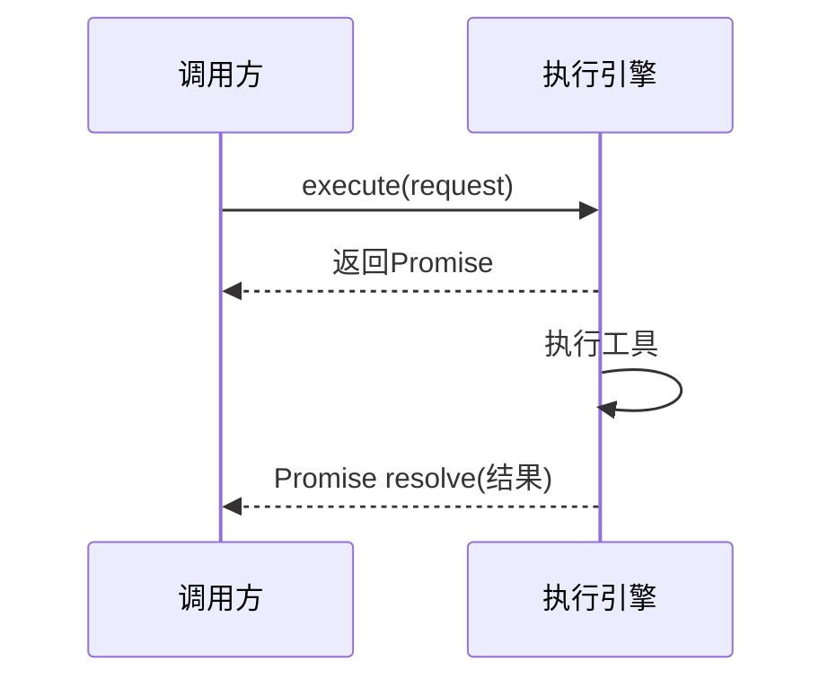
```mermaid
sequenceDiagram
participant Caller as 调用方
participant Engine as 执行引擎
Caller->>Engine : execute(request)
Engine-->>Caller : 返回Promise
Engine->>Engine : 执行工具
Engine-->>Caller : Promise resolve(结果)
```

**本节来源**
- [04-tool-integration.md](file://doc-agent-context/04-tool-integration.md#L78-L159)

### 适用场景对比

| 特性 | 同步调用 | 异步调用 |
|------|----------|----------|
| 阻塞性 | 是 | 否 |
| 响应性 | 低 | 高 |
| 复杂度 | 低 | 高 |
| 适用场景 | 简单快速操作 | 复杂耗时操作 |
| 错误处理 | 直接抛出 | Promise catch |
| 资源利用 | 低效 | 高效 |

**本节来源**
- [04-tool-integration.md](file://doc-agent-context/04-tool-integration.md#L78-L159)

## 性能监控与优化建议

### 性能监控指标

系统监控关键性能指标，包括响应时间、内存使用、压缩效率和工具调用成功率，及时发现和解决性能问题。

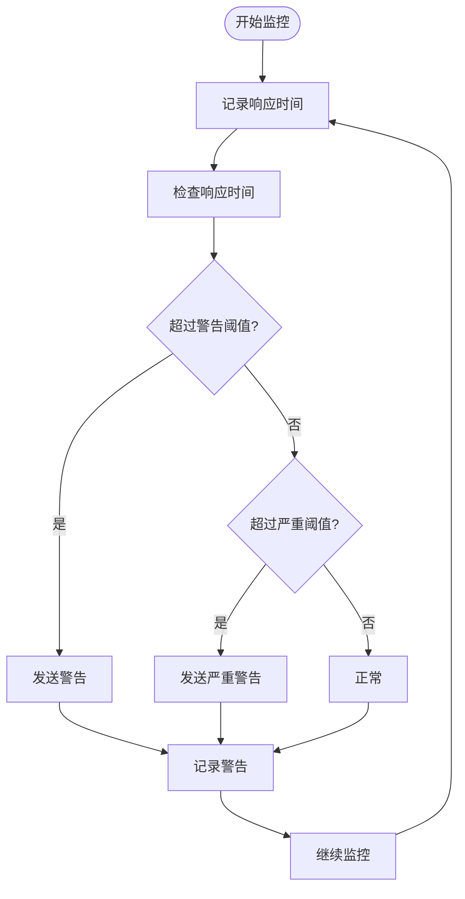
```mermaid
flowchart TD
A([开始监控]) --> B[记录响应时间]
B --> C[检查响应时间]
C --> D{超过警告阈值?}
D --> |是| E[发送警告]
D --> |否| F{超过严重阈值?}
F --> |是| G[发送严重警告]
F --> |否| H[正常]
E --> I[记录警告]
G --> I
H --> I
I --> J[继续监控]
J --> B
```

**图表来源**
- [上下文工程管理实践-第4部分-最佳实践.md](file://context-claude-code/上下文工程管理实践-第4部分-最佳实践.md#L480-L580)

**本节来源**
- [上下文工程管理实践-第4部分-最佳实践.md](file://context-claude-code/上下文工程管理实践-第4部分-最佳实践.md#L480-L580)

### 优化建议

基于性能监控数据，系统提供针对性的优化建议，帮助开发者持续改进系统性能。

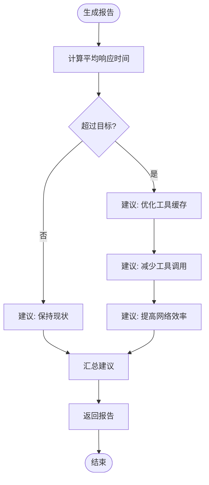
```mermaid
flowchart TD
A([生成报告]) --> B[计算平均响应时间]
B --> C{超过目标?}
C --> |是| D[建议: 优化工具缓存]
C --> |否| E[建议: 保持现状]
D --> F[建议: 减少工具调用]
F --> G[建议: 提高网络效率]
E --> H[汇总建议]
G --> H
H --> I[返回报告]
I --> J([结束])
```

**图表来源**
- [上下文工程管理实践-第4部分-最佳实践.md](file://context-claude-code/上下文工程管理实践-第4部分-最佳实践.md#L580-L650)

**本节来源**
- [上下文工程管理实践-第4部分-最佳实践.md](file://context-claude-code/上下文工程管理实践-第4部分-最佳实践.md#L580-L650)

## 结论

本文档全面解析了MCP工具的调用执行流程，从用户发起请求到结果返回的全过程。系统通过统一的工具框架实现了本地工具与远程MCP工具的抽象，提供了标准化的调用接口。参数序列化、上下文注入、异步执行和结果反序列化等关键步骤确保了工具调用的安全性和可靠性。通过完善的错误传播机制、超时控制和资源清理策略，系统保持了高稳定性。同步与异步调用模式为不同场景提供了灵活的选择。性能监控和优化建议帮助开发者持续改进系统性能。整体设计体现了模块化、可扩展和高可靠性的特点，为AI agent提供了强大的工具使用能力。

**本节来源**
- [index.ts](file://packages/opencode/src/mcp/index.ts#L1-L157)
- [tool.ts](file://packages/opencode/src/tool/tool.ts#L1-L45)
- [04-tool-integration.md](file://doc-agent-context/04-tool-integration.md#L1-L799)
- [上下文工程管理实践-第4部分-最佳实践.md](file://context-claude-code/上下文工程管理实践-第4部分-最佳实践.md#L1-L799)