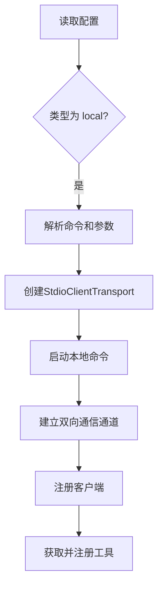
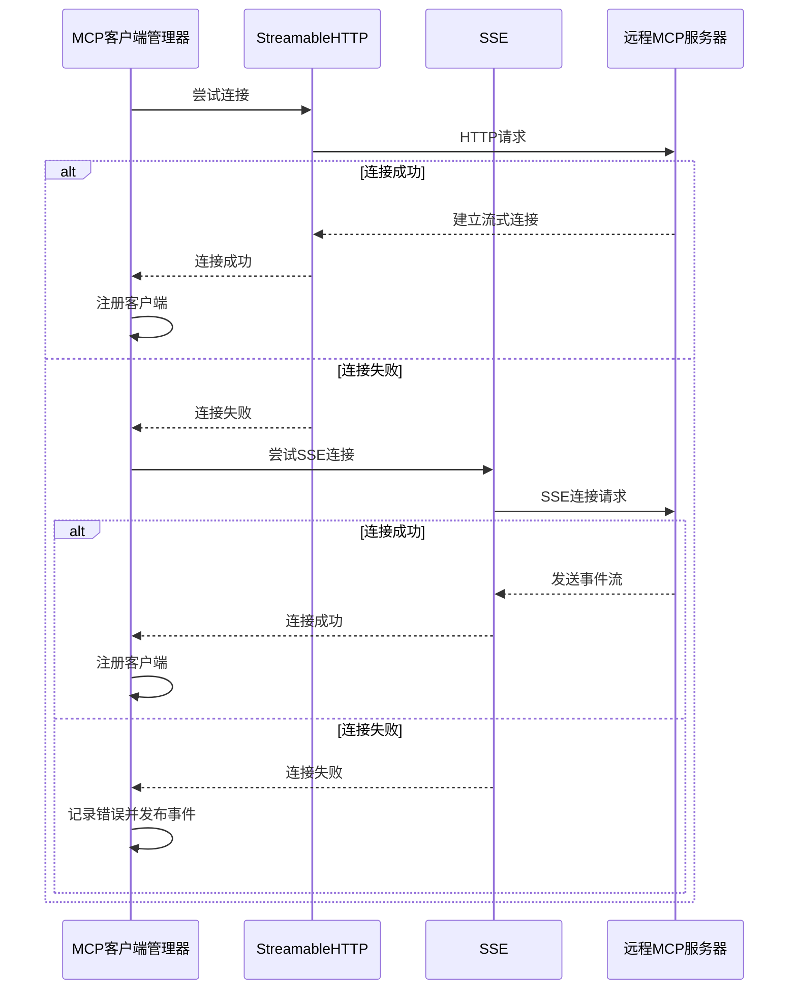
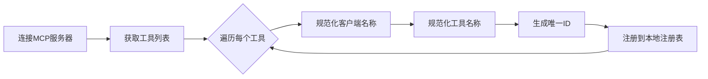

# 工具集成（MCP协议）

<cite>
**本文档中引用的文件**  
- [mcp/index.ts](file://packages/opencode/src/mcp/index.ts)
- [config.ts](file://packages/opencode/src/config/config.ts)
- [mcp.ts](file://packages/opencode/src/cli/cmd/mcp.ts)
- [04-tool-integration.md](file://doc-agent-context/04-tool-integration.md)
- [opencode.json](file://opencode.json)
</cite>

## 目录
1. [简介](#简介)
2. [MCP客户端管理器](#mcp客户端管理器)
3. [本地MCP服务器集成](#本地mcp服务器集成)
4. [远程MCP服务器连接](#远程mcp服务器连接)
5. [工具注册与调用机制](#工具注册与调用机制)
6. [配置示例](#配置示例)
7. [总结](#总结)

## 简介
本文档全面记录基于Model Context Protocol (MCP) 的工具集成系统。该系统支持本地和远程两种类型的MCP服务器连接，为AI agent提供强大的工具使用能力。文档详细阐述了MCP客户端管理器如何管理连接、本地和远程服务器的集成机制、工具的动态注册与调用流程，并提供了实际的配置示例。

## MCP客户端管理器
MCP客户端管理器是整个工具集成系统的核心，负责管理所有MCP服务器的连接生命周期。它根据配置文件中的定义，自动初始化并维护与本地和远程MCP服务器的连接。

管理器采用单例模式，通过`Instance.state`确保在整个应用生命周期内状态的唯一性和一致性。当应用启动时，管理器会读取配置并尝试连接所有启用的MCP服务器。当应用关闭时，`state`的清理函数会确保所有已建立的客户端连接被正确关闭，防止资源泄漏。

**Section sources**
- [mcp/index.ts](file://packages/opencode/src/mcp/index.ts#L22-L157)

## 本地MCP服务器集成
本地MCP服务器集成机制允许系统通过执行本地命令来启动和管理MCP服务。这种模式适用于在本地开发和测试自定义的MCP工具服务器。

### 启动机制
当配置中定义了一个类型为`local`的MCP服务器时，客户端管理器会使用`StdioClientTransport`来启动指定的命令。例如，配置`["bun", "x", "my-mcp-command"]`会通过Bun包管理器执行`my-mcp-command`这个MCP服务器。



**Diagram sources**
- [mcp/index.ts](file://packages/opencode/src/mcp/index.ts#L78-L100)
- [config.ts](file://packages/opencode/src/config/config.ts#L247-L262)

### 环境配置
在启动本地命令时，系统会将当前的环境变量传递给子进程，并允许在配置中指定额外的环境变量。这为本地MCP服务器提供了必要的运行时上下文。

**Section sources**
- [mcp/index.ts](file://packages/opencode/src/mcp/index.ts#L85-L100)
- [config.ts](file://packages/opencode/src/config/config.ts#L252-L257)

## 远程MCP服务器连接
远程MCP服务器连接流程支持通过网络与远程部署的MCP服务进行通信，提供了更高的灵活性和可扩展性。

### 传输协议
系统支持两种传输协议来连接远程MCP服务器：
- **StreamableHTTP**: 基于HTTP的流式传输协议
- **SSE (Server-Sent Events)**: 基于事件的流式传输协议

客户端管理器会按顺序尝试这两种协议，一旦成功建立连接，就会停止后续的尝试，体现了优雅的降级策略。



**Diagram sources**
- [mcp/index.ts](file://packages/opencode/src/mcp/index.ts#L30-L60)
- [config.ts](file://packages/opencode/src/config/config.ts#L264-L278)

### 自动重试与故障转移
系统具备自动重试和故障转移能力。当连接到远程服务器失败时，它会尝试备用的传输协议。如果所有协议都失败，系统会记录详细的错误信息并通过事件总线发布错误事件，通知上层应用。

**Section sources**
- [mcp/index.ts](file://packages/opencode/src/mcp/index.ts#L59-L77)

## 工具注册与调用机制
工具注册与调用机制实现了将远程MCP服务器的工具动态注册到本地工具注册表中，并通过统一的接口进行调用。

### 工具注册流程
1. **发现工具**: 通过`client.tools()`方法从已连接的MCP客户端获取所有可用工具的定义。
2. **命名规范化**: 将服务器名称和工具名称进行规范化处理，替换空格和特殊字符，生成唯一的工具ID。
3. **动态注册**: 将规范化后的工具ID和工具定义存入本地的工具注册表中。



**Diagram sources**
- [mcp/index.ts](file://packages/opencode/src/mcp/index.ts#L135-L157)

### 统一调用接口
所有注册的工具，无论是内置工具还是通过MCP协议集成的工具，都通过统一的`execute`接口进行调用。这为上层应用提供了透明的工具使用体验。

**Section sources**
- [mcp/index.ts](file://packages/opencode/src/mcp/index.ts#L135-L157)
- [04-tool-integration.md](file://doc-agent-context/04-tool-integration.md#L223-L333)

## 配置示例
本节提供实际使用场景的配置示例，展示如何在`opencode.json`中配置MCP服务器。

### opencode.json配置
```json
{
  "mcp": {
    "my-local-mcp-server": {
      "type": "local",
      "command": ["bun", "x", "my-mcp-command"],
      "enabled": true,
      "environment": {
        "MY_ENV_VAR": "my_env_var_value"
      }
    },
    "my-remote-mcp-server": {
      "type": "remote",
      "url": "https://my-mcp-server.com",
      "enabled": true,
      "headers": {
        "Authorization": "Bearer MY_API_KEY"
      }
    }
  }
}
```

### 代码中发现和使用工具
通过`MCP.tools()`方法可以获取所有已注册的工具，并通过统一的接口进行调用。

**Section sources**
- [opencode.json](file://opencode.json)
- [04-tool-integration.md](file://doc-agent-context/04-tool-integration.md#L799-L882)

## 总结
基于MCP协议的工具集成系统提供了一套完整、灵活且可靠的工具管理方案。它通过统一的客户端管理器，无缝集成了本地和远程MCP服务器，支持多种传输协议和故障转移机制。系统实现了工具的动态注册和统一调用，为AI agent提供了强大的扩展能力。通过清晰的配置和API，开发者可以轻松地集成和使用各种工具，极大地提升了系统的功能性和可扩展性。

**Section sources**
- [mcp/index.ts](file://packages/opencode/src/mcp/index.ts)
- [04-tool-integration.md](file://doc-agent-context/04-tool-integration.md)