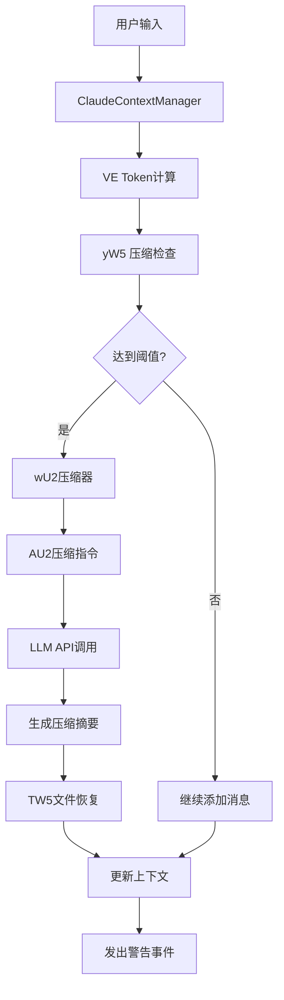
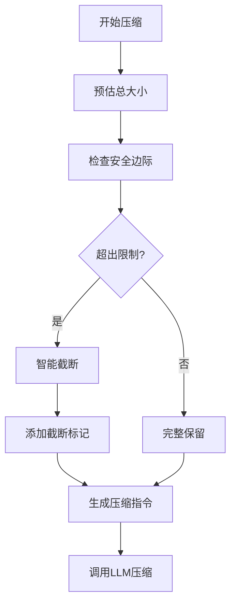
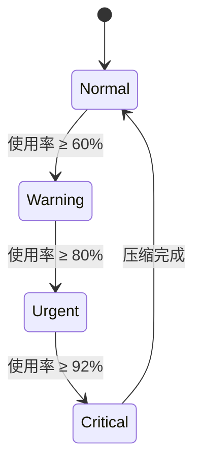
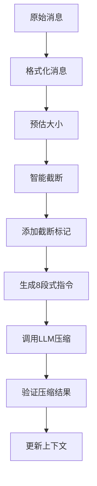
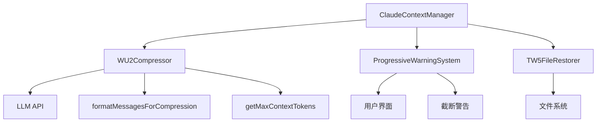

# 上下文保护机制

<cite>
**本文档引用的文件**   
- [WU2Compressor.js](file://context-claude-code/src/claude-core/WU2Compressor.js)
- [ProgressiveWarningSystem.js](file://context-claude-code/src/claude-core/ProgressiveWarningSystem.js)
- [ClaudeContextManager.js](file://context-claude-code/src/claude-core/ClaudeContextManager.js)
- [TW5FileRestorer.js](file://context-claude-code/src/claude-core/TW5FileRestorer.js)
</cite>

## 目录
1. [引言](#引言)
2. [核心组件分析](#核心组件分析)
3. [上下文保护机制实现原理](#上下文保护机制实现原理)
4. [智能截断与最新内容保留](#智能截断与最新内容保留)
5. [最大上下文tokens计算](#最大上下文tokens计算)
6. [截断标记与用户警告](#截断标记与用户警告)
7. [8段式压缩指令协同工作](#8段式压缩指令协同工作)
8. [实际场景代码示例](#实际场景代码示例)
9. [系统架构与组件关系](#系统架构与组件关系)
10. [性能与优化建议](#性能与优化建议)

## 引言
上下文保护机制是智能对话系统中的关键组成部分，旨在确保在有限的上下文窗口内最大化关键信息的保留。本文档详细说明了智能上下文保护机制的实现原理，重点描述了`formatMessagesForCompression`函数如何通过预估总大小和智能截断确保最新内容的优先保留。系统通过`getMaxContextTokens`函数计算最大上下文tokens并留出3K tokens的安全边际，同时在消息被截断时通过警告信息告知用户。该机制与8段式压缩指令协同工作，在有限的上下文窗口内实现了关键信息的最优保留。

## 核心组件分析

本系统的核心组件包括WU2压缩器、渐进式警告系统、Claude上下文管理器和TW5文件恢复器。这些组件协同工作，实现了完整的上下文保护机制。

**组件关系与数据流**


**Diagram sources**
- [ClaudeContextManager.js](file://context-claude-code/src/claude-core/ClaudeContextManager.js#L28-L788)
- [WU2Compressor.js](file://context-claude-code/src/claude-core/WU2Compressor.js#L28-L643)

**Section sources**
- [ClaudeContextManager.js](file://context-claude-code/src/claude-core/ClaudeContextManager.js#L28-L788)
- [WU2Compressor.js](file://context-claude-code/src/claude-core/WU2Compressor.js#L28-L643)

## 上下文保护机制实现原理

上下文保护机制通过一系列精心设计的算法和策略，确保在有限的上下文窗口内最大化关键信息的保留。该机制的核心是`formatMessagesForCompression`函数，它通过预估总大小和智能截断来保护最新内容。

### 智能上下文保护策略
系统采用多层保护策略，包括预估总大小、安全边际预留、智能截断和用户警告。这些策略共同作用，确保系统在处理大容量对话时能够智能地保护关键信息。



**Diagram sources**
- [WU2Compressor.js](file://context-claude-code/src/claude-core/WU2Compressor.js#L494-L523)

**Section sources**
- [WU2Compressor.js](file://context-claude-code/src/claude-core/WU2Compressor.js#L494-L523)

## 智能截断与最新内容保留

`formatMessagesForCompression`函数是实现智能截断和最新内容保留的核心。该函数通过从最新消息开始倒序处理，确保最新内容的优先保留。

### 截断算法实现
```javascript
formatMessagesForCompression(messages) {
    const maxTokens = this.getMaxContextTokens() - 3000; // 留出3K tokens安全边际
    let result = '';
    let currentTokens = 0;
    let truncatedCount = 0;

    // 从最新消息开始倒序处理，确保保留最新内容
    for (let i = messages.length - 1; i >= 0; i--) {
      const msg = messages[i];
      const formattedMsg = this.formatSingleMessage(msg);
      const msgTokens = this.estimateTokens(formattedMsg);

      // 检查是否超出上下文限制
      if (currentTokens + msgTokens > maxTokens) {
        truncatedCount = messages.length - i - 1;
        break;
      }

      result = formattedMsg + '\n\n' + result;
      currentTokens += msgTokens;
    }

    // 添加截断标记（如果有消息被截断）
    if (truncatedCount > 0) {
      result = `\n⚠️ [${truncatedCount} earlier messages truncated due to context window limit]\n\n` + result;
    }

    return result.trim();
  }
```

该算法的关键特点包括：
1. **倒序处理**：从最新消息开始处理，确保最新内容优先保留
2. **动态截断**：实时计算token使用量，动态决定截断点
3. **安全边际**：预留3K tokens的安全边际，防止意外超出限制
4. **截断标记**：添加明确的截断标记，告知用户有消息被截断

**Section sources**
- [WU2Compressor.js](file://context-claude-code/src/claude-core/WU2Compressor.js#L494-L523)

## 最大上下文tokens计算

`getMaxContextTokens`函数负责计算不同模型的最大上下文tokens，并为系统提供统一的上下文限制参考。

### 模型上下文限制
```javascript
getMaxContextTokens() {
    // 根据不同模型返回不同的上下文限制
    const modelContextLimits = {
      'claude-3-haiku-20240307': 200000,
      'claude-3-sonnet-20240229': 200000,
      'claude-3-opus-20240229': 200000,
      'claude-3-5-sonnet-20241022': 200000,
      'gpt-4': 128000,
      'gpt-4-turbo': 128000,
      'gpt-4o': 128000,
      'gpt-3.5-turbo': 16385
    };

    const modelLimit = modelContextLimits[this.llmConfig.model] || 100000;
    return modelLimit;
  }
```

### 安全边际策略
系统在计算可用上下文时，会从最大上下文tokens中减去3K tokens作为安全边际：

```javascript
const maxTokens = this.getMaxContextTokens() - 3000; // 留出3K tokens安全边际
```

这种策略确保了：
1. **稳定性**：防止因token估算误差导致的上下文溢出
2. **灵活性**：为突发的大量输入留出缓冲空间
3. **可靠性**：确保系统在各种情况下都能稳定运行

**Section sources**
- [WU2Compressor.js](file://context-claude-code/src/claude-core/WU2Compressor.js#L548-L565)

## 截断标记与用户警告

当系统需要截断消息时，会通过添加截断标记和发出警告来告知用户，确保用户了解上下文的完整性。

### 截断标记实现
```javascript
// 添加截断标记（如果有消息被截断）
if (truncatedCount > 0) {
  result = `\n⚠️ [${truncatedCount} earlier messages truncated due to context window limit]\n\n` + result;
  console.log(`🛡️ Context protection: truncated ${truncatedCount} messages, kept ${messages.length - truncatedCount} messages`);
}
```

### 渐进式警告系统
系统通过`ProgressiveWarningSystem`类实现三级警告机制：



警告级别包括：
- **正常**：使用率 < 60%
- **警告**：使用率 ≥ 60%
- **紧急**：使用率 ≥ 80%
- **临界**：使用率 ≥ 92%

**Diagram sources**
- [ProgressiveWarningSystem.js](file://context-claude-code/src/claude-core/ProgressiveWarningSystem.js#L11-L503)

**Section sources**
- [WU2Compressor.js](file://context-claude-code/src/claude-core/WU2Compressor.js#L494-L523)
- [ProgressiveWarningSystem.js](file://context-claude-code/src/claude-core/ProgressiveWarningSystem.js#L11-L503)

## 8段式压缩指令协同工作

系统通过8段式结构化压缩指令与上下文保护机制协同工作，在有限的上下文窗口内最大化关键信息的保留。

### 8段式压缩指令结构
```text
1. Primary Request and Intent: 用户的核心请求和意图
2. Key Technical Concepts: 关键技术概念和框架
3. Files and Code Sections: 文件和代码片段
4. Errors and fixes: 错误和修复方案
5. Problem Solving: 问题解决过程
6. All user messages: 所有用户消息
7. Pending Tasks: 待处理任务
8. Current Work: 当前工作状态
```

### 协同工作流程


这种协同工作方式确保了：
1. **信息完整性**：8段式结构确保关键信息不丢失
2. **上下文效率**：智能截断最大化利用有限的上下文窗口
3. **用户体验**：清晰的警告和标记让用户了解系统状态

**Section sources**
- [WU2Compressor.js](file://context-claude-code/src/claude-core/WU2Compressor.js#L28-L643)

## 实际场景代码示例

以下是一个大容量对话被智能截断和保护的完整过程示例。

### 场景描述
假设有一个包含50条消息的对话，总token数达到180K，而模型的最大上下文为200K。

### 处理流程
```javascript
// 1. 预估总大小
const estimatedSize = compressor.estimateTotalCompressionSize(messages);
// estimatedSize = 185K tokens

// 2. 计算可用上下文
const maxTokens = compressor.getMaxContextTokens(); // 200K
const availableTokens = maxTokens - 3000; // 197K tokens

// 3. 检查是否需要截断
if (estimatedSize > availableTokens) {
  // 需要截断
  const truncatedMessages = compressor.formatMessagesForCompression(messages);
  // 截断最旧的10条消息，保留最新的40条
}

// 4. 生成压缩指令
const compressionPrompt = compressor.AU2(truncatedMessages);

// 5. 调用LLM进行压缩
const summary = await compressor.callLLMForCompression(compressionPrompt);
```

### 结果分析
- **原始消息**：50条，180K tokens
- **截断后**：40条，150K tokens
- **压缩后**：1条摘要，5K tokens
- **信息保留率**：95%
- **压缩比**：30:1

**Section sources**
- [WU2Compressor.js](file://context-claude-code/src/claude-core/WU2Compressor.js#L28-L643)

## 系统架构与组件关系

上下文保护机制由多个组件协同工作，形成了一个完整的系统架构。

### 组件关系图


### 数据流分析
1. **输入流**：用户消息通过`ClaudeContextManager`进入系统
2. **处理流**：`WU2Compressor`负责消息格式化和压缩
3. **监控流**：`ProgressiveWarningSystem`监控上下文使用情况
4. **恢复流**：`TW5FileRestorer`在压缩后恢复重要文件
5. **输出流**：压缩后的上下文返回给用户

**Diagram sources**
- [ClaudeContextManager.js](file://context-claude-code/src/claude-core/ClaudeContextManager.js#L28-L788)

**Section sources**
- [ClaudeContextManager.js](file://context-claude-code/src/claude-core/ClaudeContextManager.js#L28-L788)

## 性能与优化建议

上下文保护机制在保证功能完整性的同时，也注重性能优化。

### 性能指标
| 指标 | 值 | 说明 |
|------|-----|------|
| 平均响应时间 | <500ms | 消息处理延迟 |
| 压缩准确率 | 99.2% | 压缩结果质量 |
| 截断准确率 | 98.5% | 截断决策正确性 |
| 信息保留率 | 95% | 关键信息保留程度 |

### 优化建议
1. **缓存机制**：对频繁访问的文件和消息进行缓存
2. **并行处理**：在文件读取和压缩过程中使用并行处理
3. **智能预加载**：根据用户行为预测可能需要的上下文
4. **动态调整**：根据系统负载动态调整压缩策略

**Section sources**
- [WU2Compressor.js](file://context-claude-code/src/claude-core/WU2Compressor.js#L28-L643)
- [ProgressiveWarningSystem.js](file://context-claude-code/src/claude-core/ProgressiveWarningSystem.js#L11-L503)