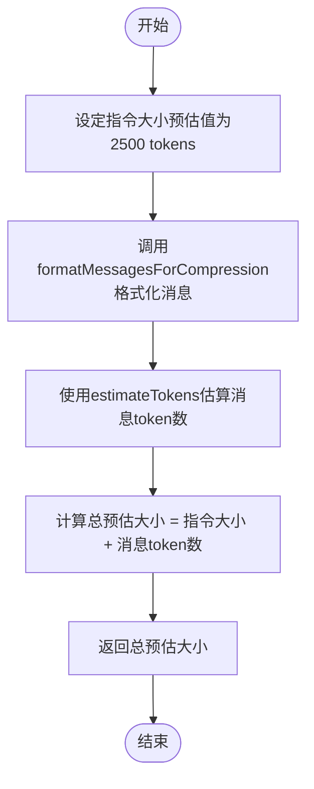
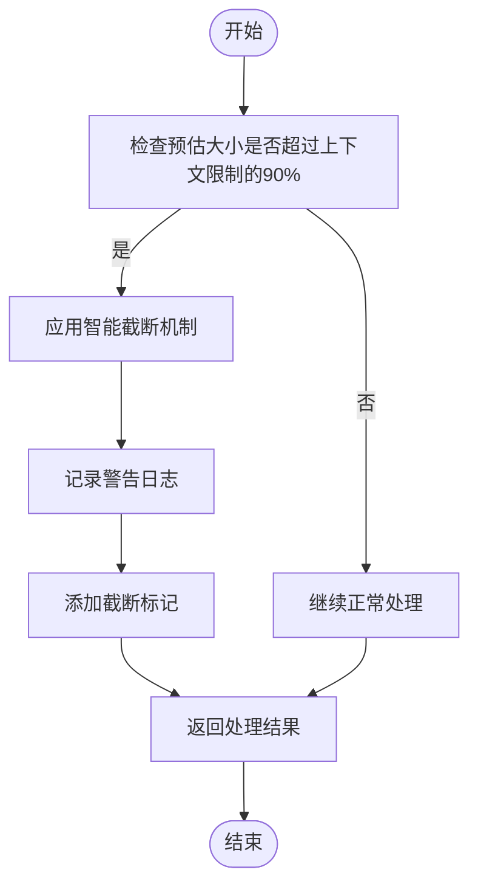
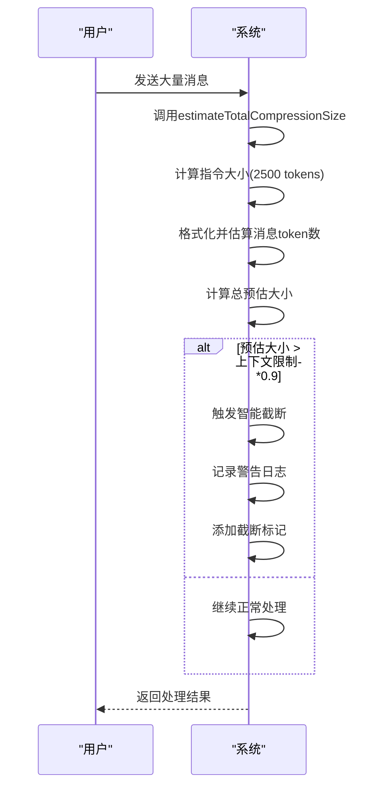

# 上下文大小预估

<cite>
**本文档中引用的文件**   
- [ClaudeContextManager.js](file://context-claude-code/src/claude-core/ClaudeContextManager.js)
- [WU2Compressor.js](file://context-claude-code/src/claude-core/WU2Compressor.js)
</cite>

## 目录
1. [系统上下文大小预估机制](#系统上下文大小预估机制)
2. [estimateTotalCompressionSize函数详解](#estimatetotalcompressionsize函数详解)
3. [智能截断机制与日志记录](#智能截断机制与日志记录)
4. [大容量对话预估示例](#大容量对话预估示例)

## 系统上下文大小预估机制

系统通过`estimateTotalCompressionSize`函数实现上下文总大小的预估，该函数在`WU2Compressor`类中定义，用于判断是否需要触发压缩操作。系统预估机制的核心是将压缩指令大小与消息内容的token估算值相加，得出总预估值。当预估值超过模型上下文限制的90%时，系统会触发智能截断机制，确保对话能够继续进行而不超出模型的处理能力。

**Section sources**
- [WU2Compressor.js](file://context-claude-code/src/claude-core/WU2Compressor.js#L330-L334)

## estimateTotalCompressionSize函数详解

`estimateTotalCompressionSize`函数负责计算压缩指令和消息内容的总token数。该函数首先设定一个固定的指令大小预估值2500 tokens（约2.5K），然后调用`formatMessagesForCompression`函数对消息内容进行格式化，并使用`estimateTokens`函数估算格式化后消息的token数量。最后，将指令大小预估值与消息内容的token估算值相加，得到总预估大小。

**Diagram sources**
- [WU2Compressor.js](file://context-claude-code/src/claude-core/WU2Compressor.js#L330-L334)

**Section sources**
- [WU2Compressor.js](file://context-claude-code/src/claude-core/WU2Compressor.js#L330-L334)

## 智能截断机制与日志记录

当`estimateTotalCompressionSize`函数计算出的总预估大小超过模型上下文限制的90%时，系统会触发智能截断机制。该机制通过`formatMessagesForCompression`函数实现，从最新消息开始倒序处理，确保保留最新的内容。在处理过程中，系统会持续累加当前token数，一旦超出预设的上下文限制（模型最大上下文tokens减去3000安全边际），就会停止处理并记录被截断的消息数量。

系统会通过`console.log`输出警告信息，提示检测到大容量对话并应用智能截断。同时，在格式化后的消息开头添加截断标记，明确指出有多少早期消息因上下文窗口限制而被截断。这种机制确保了即使在处理大量对话时，也能保持上下文的连续性和关键信息的完整性。

**Diagram sources**
- [WU2Compressor.js](file://context-claude-code/src/claude-core/WU2Compressor.js#L494-L523)

**Section sources**
- [WU2Compressor.js](file://context-claude-code/src/claude-core/WU2Compressor.js#L494-L523)

## 大容量对话预估示例

以下代码示例展示了大容量对话的预估过程和阈值判断逻辑：

该示例展示了系统如何处理大容量对话的完整流程，包括预估大小、阈值判断、智能截断和日志记录等关键步骤。通过这种机制，系统能够在保证性能的同时，最大限度地保留重要信息。

**Diagram sources**
- [WU2Compressor.js](file://context-claude-code/src/claude-core/WU2Compressor.js#L263-L323)

**Section sources**
- [WU2Compressor.js](file://context-claude-code/src/claude-core/WU2Compressor.js#L263-L323)