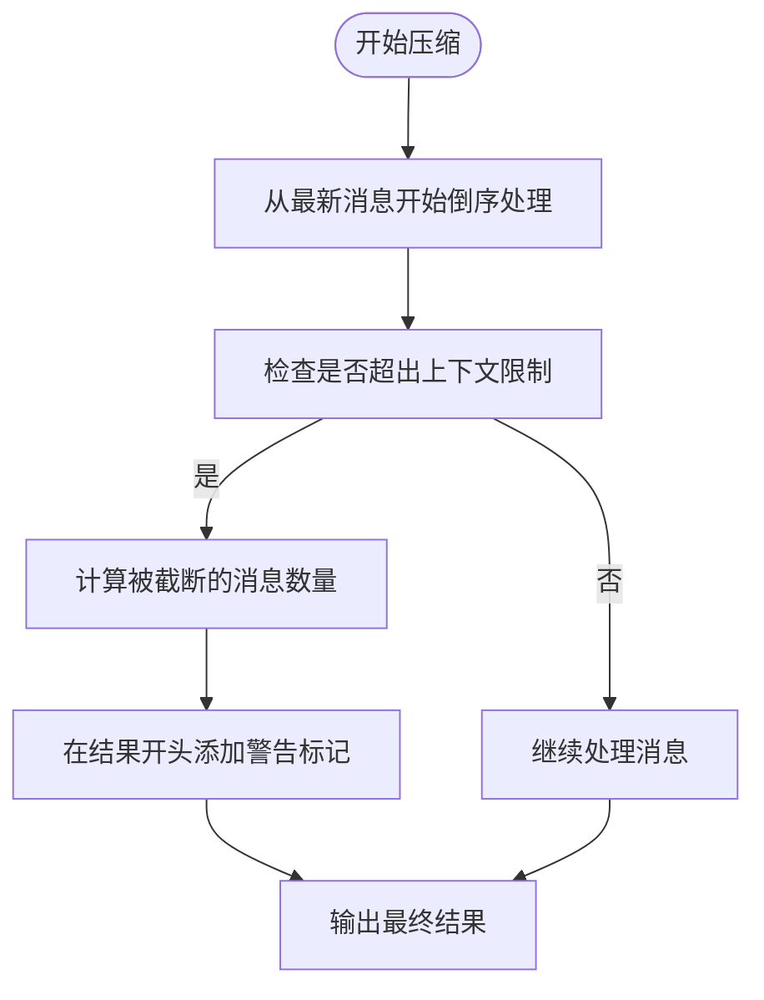
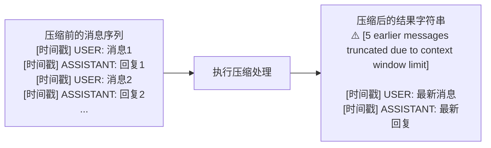

# 截断标记添加

<cite>
**本文档引用的文件**
- [WU2Compressor.js](file://context-claude-code/src/claude-core/WU2Compressor.js)
- [ModelAdapter.js](file://context-claude-code/src/claude-core/ModelAdapter.js)
- [test-context-protection.js](file://context-claude-code/test-context-protection.js)
</cite>

## 目录
1. [引言](#引言)
2. [截断标记添加逻辑](#截断标记添加逻辑)
3. [实现方式](#实现方式)
4. [控制台日志输出](#控制台日志输出)
5. [标记格式设计考虑](#标记格式设计考虑)
6. [代码示例](#代码示例)
7. [结论](#结论)

## 引言
在处理大规模对话上下文时，系统需要确保内容不会超出模型的上下文窗口限制。为此，当消息数量超过限制时，系统会自动截断早期消息，并在结果字符串开头添加特定的警告标记。这种机制不仅保护了系统免受上下文溢出的影响，还向用户透明地传达了上下文限制情况。

## 截断标记添加逻辑
当系统检测到消息数量超出上下文窗口限制时，会计算被截断的消息数量（truncatedCount）。如果truncatedCount大于0，系统会在结果字符串的开头添加一个形如'⚠️ [X earlier messages truncated due to context window limit]'的警告信息。这个标记清晰地告知用户有多少条早期消息被截断，从而保持了上下文的透明性。

**Section sources**
- [WU2Compressor.js](file://context-claude-code/src/claude-core/WU2Compressor.js#L517-L519)

## 实现方式
系统通过WU2Compressor类中的压缩算法实现截断标记的添加。具体实现方式如下：从最新消息开始倒序处理，确保保留最新的对话内容；当累计token数即将超出上下文限制时，记录下被截断的消息数量；如果存在被截断的消息（truncatedCount > 0），则在结果字符串开头添加警告标记。

**Diagram sources**
- [WU2Compressor.js](file://context-claude-code/src/claude-core/WU2Compressor.js#L495-L525)

**Section sources**
- [WU2Compressor.js](file://context-claude-code/src/claude-core/WU2Compressor.js#L495-L525)

## 控制台日志输出
除了在结果字符串中添加用户可见的警告标记外，系统还会在控制台输出详细的日志信息。当日志中显示"🛡️ Context protection: truncated X messages, kept Y messages"时，表明系统已成功保护上下文，截断了X条消息，保留了Y条消息。这些日志信息有助于开发者监控系统的运行状态和性能表现。

**Section sources**
- [WU2Compressor.js](file://context-claude-code/src/claude-core/WU2Compressor.js#L519)

## 标记格式设计考虑
警告标记的格式设计经过精心考虑，包含多个重要元素：使用Unicode警告符号'⚠️'作为视觉提示，能够立即吸引用户注意力；文本说明清晰明确，指出是"earlier messages"被截断，避免混淆；准确显示被截断的消息数量，提供精确的信息；整体格式简洁明了，不会占用过多上下文空间。这种设计既保证了信息的完整性，又最大限度地减少了对主要对话内容的干扰。

**Section sources**
- [WU2Compressor.js](file://context-claude-code/src/claude-core/WU2Compressor.js#L518)

## 代码示例
以下是截断标记添加前后的结果字符串对比示例：

**Diagram sources**
- [WU2Compressor.js](file://context-claude-code/src/claude-core/WU2Compressor.js#L518)

**Section sources**
- [WU2Compressor.js](file://context-claude-code/src/claude-core/WU2Compressor.js#L518)
- [test-context-protection.js](file://context-claude-code/test-context-protection.js#L96-L103)

## 结论
截断标记的添加机制是系统上下文保护的重要组成部分。通过在结果字符串开头添加清晰的警告信息，系统能够在保证功能完整性的同时，向用户透明地传达上下文限制情况。这种设计不仅提高了系统的稳定性，还增强了用户体验，使用户能够更好地理解系统的运行状态和限制条件。