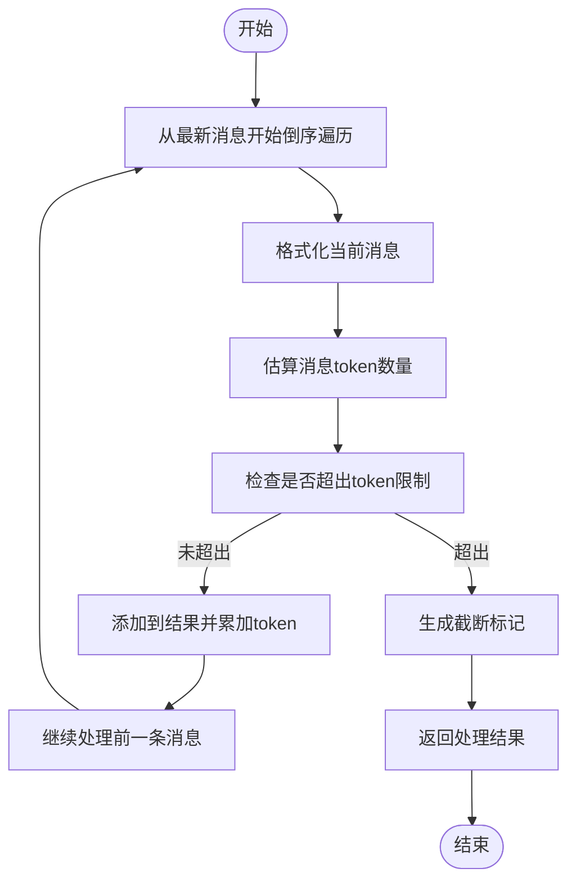
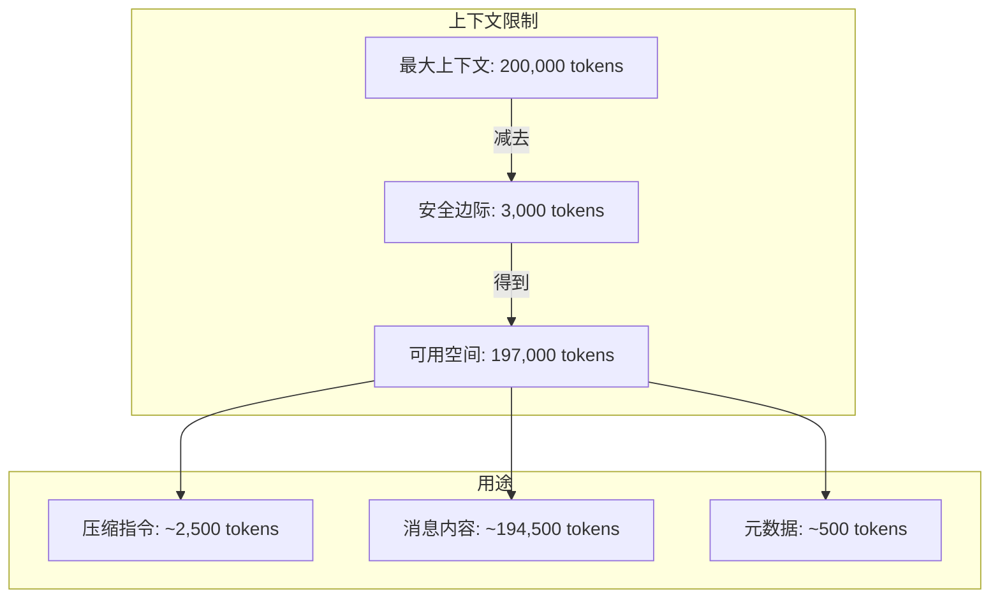
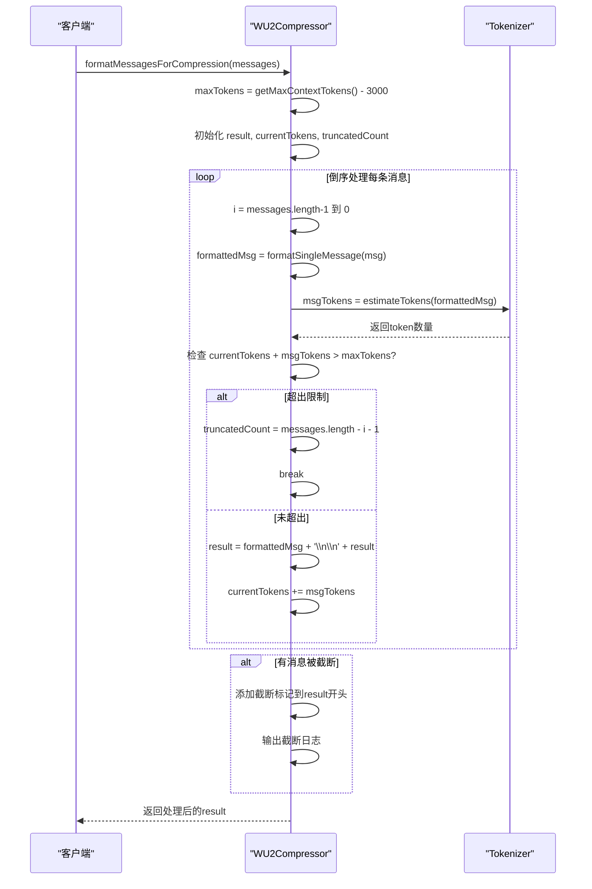

# 智能截断机制

<cite>
**本文档引用文件**   
- [WU2Compressor.js](file://context-claude-code/src/claude-core/WU2Compressor.js)
- [WU2Compressor.js](file://context-claude-code/src/compression/WU2Compressor.js)
- [Claude_Code_Large_File_Handling_Complete_Guide.md](file://context-claude-code/Claude_Code_Large_File_Handling_Complete_Guide.md)
- [上下文工程管理实践-第3部分-压缩触发.md](file://context-claude-code/上下文工程管理实践-第3部分-压缩触发.md)
- [小白专用-三层记忆架构完全指南.md](file://context-claude-code/小白专用-三层记忆架构完全指南.md)
</cite>

## 目录
1. [智能截断机制概述](#智能截断机制概述)
2. [核心实现原理](#核心实现原理)
3. [maxTokens计算与安全边际](#maxtokens计算与安全边际)
4. [truncatedCount变量计算与应用](#truncatedcount变量计算与应用)
5. [完整处理流程示例](#完整处理流程示例)
6. [相关文档参考](#相关文档参考)

## 智能截断机制概述

智能截断机制是上下文管理系统中的关键组件，用于在对话内容接近模型上下文窗口限制时，通过智能方式保留最关键的信息。该机制确保最新、最重要的对话内容优先保留，同时通过精确的token计算和截断标记，维持上下文的完整性和可追溯性。

该机制主要应用于大容量对话场景，当系统检测到上下文使用量接近阈值时，会自动触发截断流程，防止超出模型的上下文窗口限制，确保系统稳定运行。

**本节来源**
- [WU2Compressor.js](file://context-claude-code/src/claude-core/WU2Compressor.js#L494-L523)
- [小白专用-三层记忆架构完全指南.md](file://context-claude-code/小白专用-三层记忆架构完全指南.md#L690-L729)

## 核心实现原理

智能截断机制的核心在于`formatMessagesForCompression`函数，该函数从最新消息开始倒序处理消息数组，确保最新内容优先保留。处理过程采用累加式token计算，当累积token数超过预设限制时立即停止处理。

处理流程如下：
1. 从消息数组末尾开始倒序遍历
2. 对每条消息进行格式化并估算token数量
3. 累加token数并与最大限制比较
4. 超过限制时停止处理并记录截断数量
5. 将已处理的消息按时间顺序重新组合

这种倒序处理策略确保了最近的对话内容被完整保留，因为这些内容通常包含当前正在进行的任务和最新的用户意图，对维持对话连续性至关重要。

**图示来源**
- [WU2Compressor.js](file://context-claude-code/src/claude-core/WU2Compressor.js#L494-L523)

**本节来源**
- [WU2Compressor.js](file://context-claude-code/src/claude-core/WU2Compressor.js#L494-L523)
- [上下文工程管理实践-第3部分-压缩触发.md](file://context-claude-code/上下文工程管理实践-第3部分-压缩触发.md#L218-L232)

## maxTokens计算与安全边际

`maxTokens`的计算基于模型的最大上下文tokens减去3K安全边际，这一设计确保了系统有足够的空间处理压缩指令和其他元数据，防止上下文溢出。

具体计算方式如下：
- 获取模型的最大上下文限制（如Claude 3系列为200K tokens）
- 减去3000 tokens作为安全边际
- 得到实际可用的`maxTokens`值

安全边际的设置考虑了以下因素：
1. 压缩指令本身需要约2.5K tokens
2. 系统元数据和格式化开销
3. 防止因token估算误差导致的溢出
4. 为紧急情况预留缓冲空间

这种设计特别重要，因为不同模型的上下文窗口大小不同（如GPT-4为128K tokens），3K的安全边际确保了在各种模型上的兼容性和稳定性。

**图示来源**
- [WU2Compressor.js](file://context-claude-code/src/claude-core/WU2Compressor.js#L500-L501)

**本节来源**
- [WU2Compressor.js](file://context-claude-code/src/claude-core/WU2Compressor.js#L500-L501)
- [小白专用-三层记忆架构完全指南.md](file://context-claude-code/小白专用-三层记忆架构完全指南.md#L690-L729)

## truncatedCount变量计算与应用

`truncatedCount`变量记录了被截断的早期消息数量，其计算方式为：`messages.length - i - 1`，其中`i`是导致超出限制的那条消息的索引。

该变量的应用主要体现在：
1. **截断标记生成**：将`truncatedCount`嵌入到截断标记中，明确告知用户有多少条早期消息被截断
2. **日志记录**：在系统日志中记录截断详情，便于调试和监控
3. **用户体验**：通过清晰的标记让用户了解上下文的完整性状态

截断标记的格式为：`⚠️ [${truncatedCount} earlier messages truncated due to context window limit]`，这种设计既保持了信息的透明性，又不会干扰主要对话内容。

**图示来源**
- [WU2Compressor.js](file://context-claude-code/src/claude-core/WU2Compressor.js#L514-L515)

**本节来源**
- [WU2Compressor.js](file://context-claude-code/src/claude-core/WU2Compressor.js#L514-L515)
- [WU2Compressor.js](file://context-claude-code/src/claude-core/WU2Compressor.js#L519-L521)

## 完整处理流程示例

以下是智能截断机制的完整处理流程示例，展示了从输入到输出的详细步骤：

处理流程的关键步骤：
1. **初始化参数**：设置`maxTokens`为最大上下文减3K安全边际
2. **倒序遍历**：从最新消息（索引`messages.length-1`）开始向前处理
3. **格式化消息**：使用`formatSingleMessage`统一消息格式
4. **token估算**：使用`estimateTokens`方法估算每条消息的token数量
5. **阈值判断**：实时累加token数，超过`maxTokens`时立即停止
6. **结果构建**：将处理过的消息按时间顺序组合，并添加截断标记

这种设计确保了系统在处理大容量对话时的稳定性和效率，同时最大限度地保留了关键的上下文信息。

**图示来源**
- [WU2Compressor.js](file://context-claude-code/src/claude-core/WU2Compressor.js#L494-L523)

**本节来源**
- [WU2Compressor.js](file://context-claude-code/src/claude-core/WU2Compressor.js#L494-L523)
- [上下文工程管理实践-第3部分-压缩触发.md](file://context-claude-code/上下文工程管理实践-第3部分-压缩触发.md)

## 相关文档参考

智能截断机制的设计和实现参考了多个相关文档，这些文档提供了上下文管理的整体框架和具体实现细节：

1. **[Claude_Code_Large_File_Handling_Complete_Guide.md]**：提供了大文件处理的整体策略，包括2000行截断逻辑和截断标记的使用规范。

2. **[上下文工程管理实践-第3部分-压缩触发.md]**：详细描述了压缩触发的完整流程，包括压缩前状态检查、压缩执行过程和结果验证。

3. **[小白专用-三层记忆架构完全指南.md]**：以通俗易懂的方式解释了三层记忆架构，包括短期、中期和长期记忆的交互机制。

4. **[核心算法详解.md]**：深入分析了Claude Code的核心算法，包括80%官方阈值的设计原理和三段式预警系统。

这些文档共同构成了智能截断机制的理论基础和实践指导，确保了系统设计的完整性和一致性。

**本节来源**
- [Claude_Code_Large_File_Handling_Complete_Guide.md](file://context-claude-code/Claude_Code_Large_File_Handling_Complete_Guide.md)
- [上下文工程管理实践-第3部分-压缩触发.md](file://context-claude-code/上下文工程管理实践-第3部分-压缩触发.md)
- [小白专用-三层记忆架构完全指南.md](file://context-claude-code/小白专用-三层记忆架构完全指南.md)
- [核心算法详解.md](file://context-claude-code/核心算法详解.md)