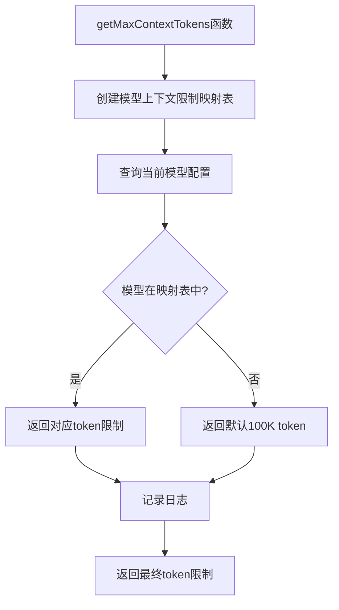
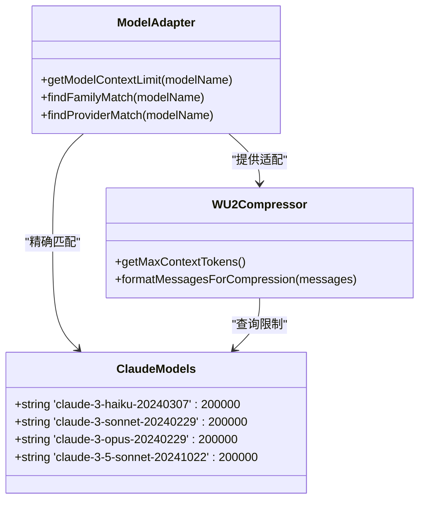
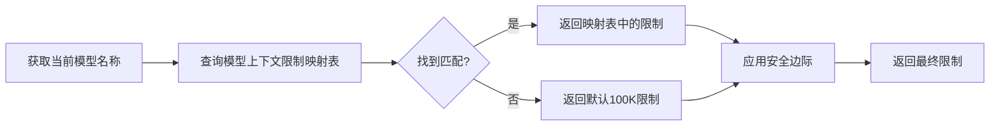
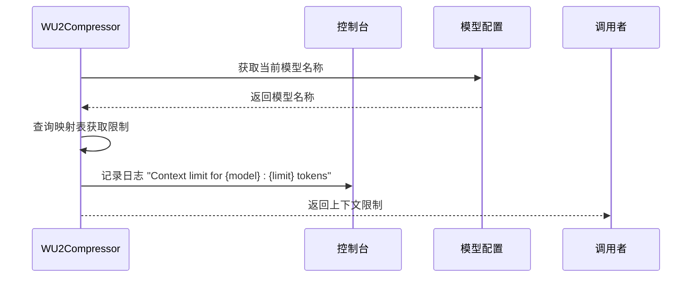
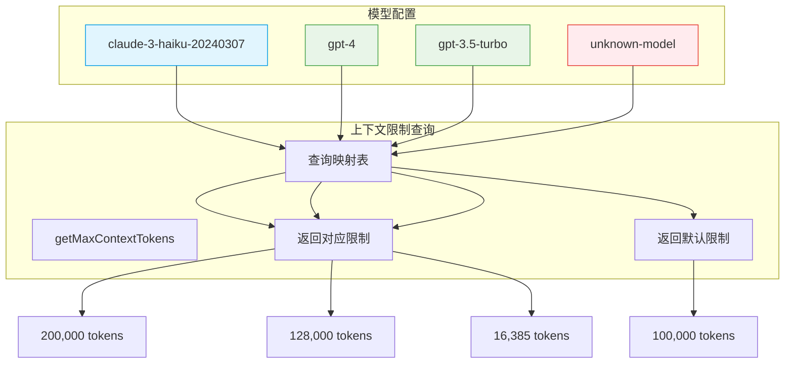

# 模型上下文限制管理

<cite>
**本文档引用的文件**
- [WU2Compressor.js](file://context-claude-code/src/claude-core/WU2Compressor.js)
- [ModelAdapter.js](file://context-claude-code/src/claude-core/ModelAdapter.js)
</cite>

## 目录
1. [简介](#简介)
2. [核心上下文限制映射表](#核心上下文限制映射表)
3. [Claude系列模型配置](#claude系列模型配置)
4. [GPT系列模型配置](#gpt系列模型配置)
5. [默认回退机制](#默认回退机制)
6. [日志记录功能](#日志记录功能)
7. [代码示例](#代码示例)

## 简介
本文档详细介绍了系统如何管理不同AI模型的上下文限制，重点分析了`getMaxContextTokens`函数中预定义的模型上下文限制映射表。系统通过精确的模型识别和自适应配置，为不同AI模型提供最优的上下文窗口管理，确保在各种模型环境下都能高效运行。

## 核心上下文限制映射表
系统在`WU2Compressor`类的`getMaxContextTokens`方法中维护了一个预定义的模型上下文限制映射表，该映射表为不同AI模型指定了具体的上下文限制。映射表的设计考虑了当前主流AI模型的实际能力，为每个模型分配了相应的token限制。



**图表来源**
- [WU2Compressor.js](file://context-claude-code/src/claude-core/WU2Compressor.js#L548-L565)

**本节来源**
- [WU2Compressor.js](file://context-claude-code/src/claude-core/WU2Compressor.js#L548-L565)

## Claude系列模型配置
系统为Claude系列模型配置了统一的200,000 tokens上下文限制，充分利用了Anthropic公司Claude 3系列模型的强大上下文处理能力。这一配置适用于Claude 3系列的所有变体，包括haiku、sonnet、opus和3.5-sonnet等型号。



**图表来源**
- [WU2Compressor.js](file://context-claude-code/src/claude-core/WU2Compressor.js#L548-L565)
- [ModelAdapter.js](file://context-claude-code/src/claude-core/ModelAdapter.js#L4-L25)

**本节来源**
- [WU2Compressor.js](file://context-claude-code/src/claude-core/WU2Compressor.js#L548-L565)
- [ModelAdapter.js](file://context-claude-code/src/claude-core/ModelAdapter.js#L4-L25)

## GPT系列模型配置
系统为GPT系列模型配置了不同的上下文限制，以匹配各型号的实际能力。GPT-4系列模型（包括gpt-4、gpt-4-turbo和gpt-4o）被配置为128,000 tokens的上下文限制，而GPT-3.5-turbo则被配置为16,385 tokens的限制。

```mermaid
erDiagram
MODEL_FAMILY ||--o{ MODEL : "包含"
MODEL_FAMILY {
string family_name
int default_max_tokens
}
MODEL {
string model_name
int max_tokens
string provider
string family
}
MODEL_FAMILY {
"gpt-4" 128000
"gpt-3.5" 16385
}
MODEL {
"gpt-4" 128000 "openai" "gpt-4"
"gpt-4-turbo" 128000 "openai" "gpt-4"
"gpt-4o" 128000 "openai" "gpt-4"
"gpt-3.5-turbo" 16385 "openai" "gpt-3.5"
}
```

**图表来源**
- [WU2Compressor.js](file://context-claude-code/src/claude-core/WU2Compressor.js#L548-L565)
- [ModelAdapter.js](file://context-claude-code/src/claude-core/ModelAdapter.js#L40-L65)

**本节来源**
- [WU2Compressor.js](file://context-claude-code/src/claude-core/WU2Compressor.js#L548-L565)
- [ModelAdapter.js](file://context-claude-code/src/claude-core/ModelAdapter.js#L40-L65)

## 默认回退机制
当系统遇到未知模型时，会启用默认的100,000 tokens回退机制。这一机制确保了系统的健壮性，即使面对未预定义的模型也能提供合理的上下文限制。回退机制通过逻辑或运算符实现，当在预定义映射表中找不到匹配的模型时，自动返回默认值。



**图表来源**
- [WU2Compressor.js](file://context-claude-code/src/claude-core/WU2Compressor.js#L560-L565)
- [ModelAdapter.js](file://context-claude-code/src/claude-core/ModelAdapter.js#L135-L142)

**本节来源**
- [WU2Compressor.js](file://context-claude-code/src/claude-core/WU2Compressor.js#L560-L565)
- [ModelAdapter.js](file://context-claude-code/src/claude-core/ModelAdapter.js#L135-L142)

## 日志记录功能
系统在执行`getMaxContextTokens`函数时会记录详细的日志信息，包括当前模型名称和分配的上下文限制。这一功能对于调试和监控系统行为至关重要，使开发者能够实时了解系统如何处理不同模型的上下文限制。



**图表来源**
- [WU2Compressor.js](file://context-claude-code/src/claude-core/WU2Compressor.js#L562-L565)

**本节来源**
- [WU2Compressor.js](file://context-claude-code/src/claude-core/WU2Compressor.js#L562-L565)

## 代码示例
以下代码示例展示了不同模型配置下的上下文限制查询过程。系统通过`getMaxContextTokens`方法查询预定义的映射表，为不同模型返回相应的上下文限制。



**图表来源**
- [WU2Compressor.js](file://context-claude-code/src/claude-core/WU2Compressor.js#L548-L565)

**本节来源**
- [WU2Compressor.js](file://context-claude-code/src/claude-core/WU2Compressor.js#L548-L565)