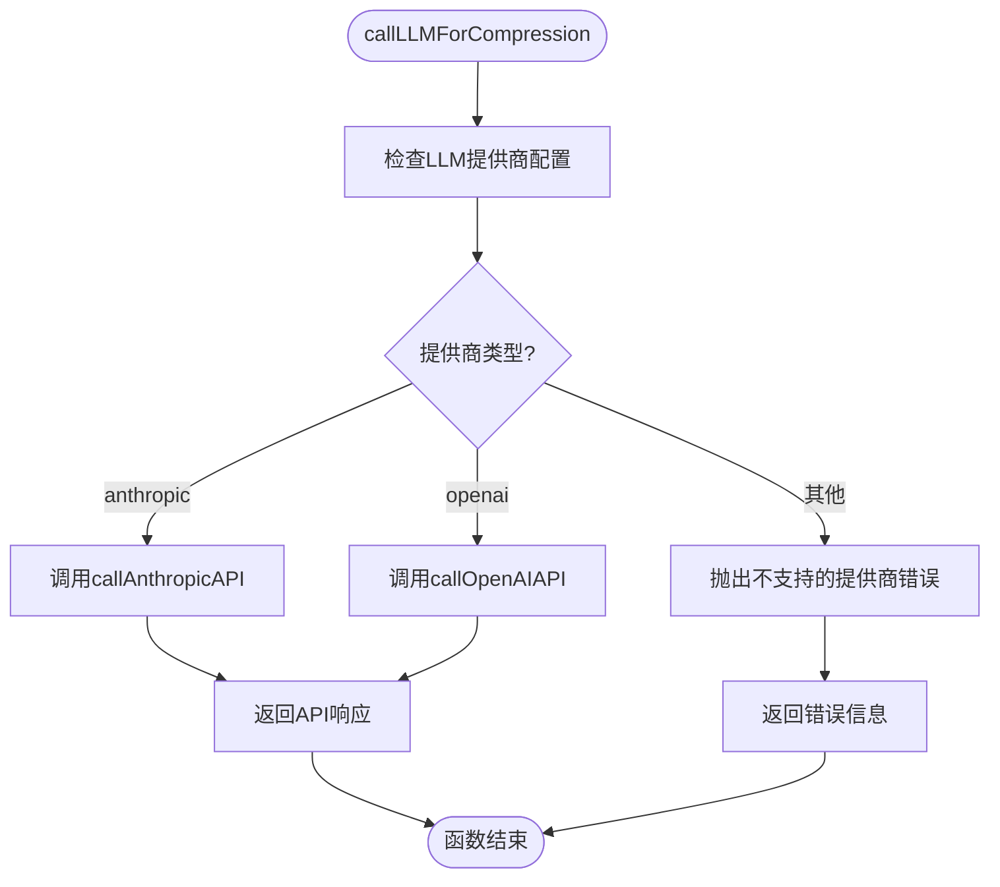
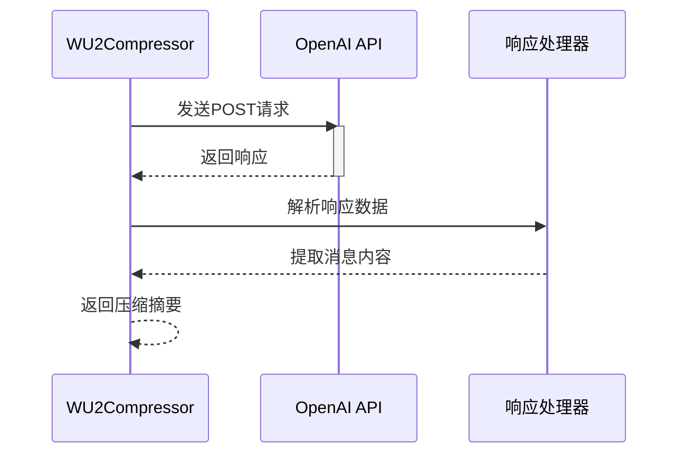
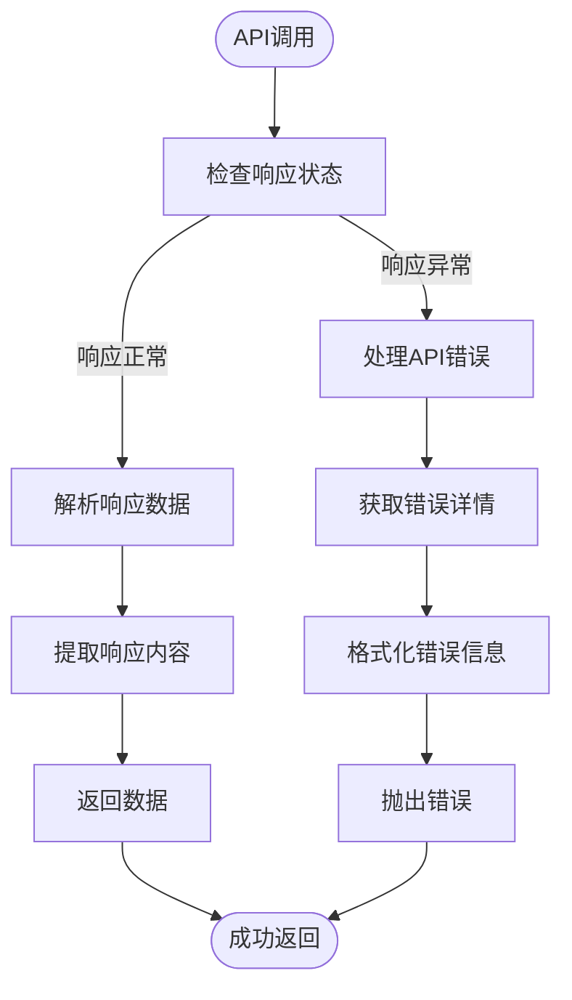
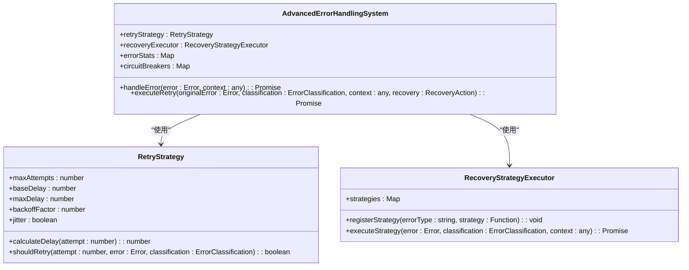
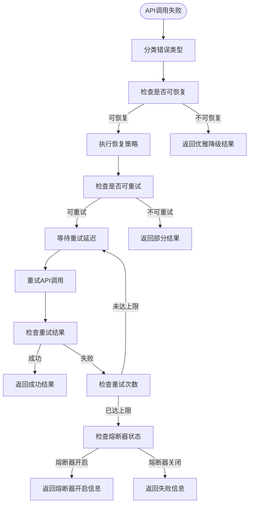
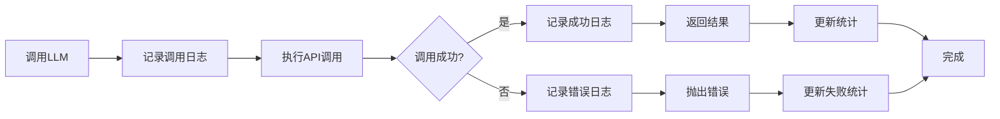
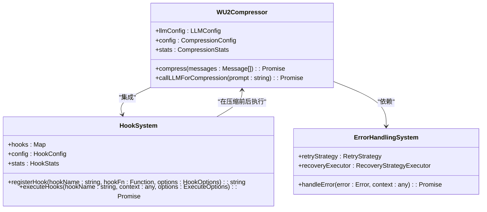
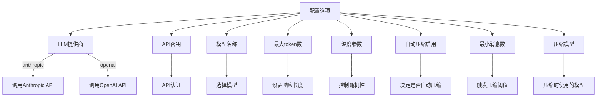

# LLM压缩调用机制

<cite>
**Referenced Files in This Document**   
- [WU2Compressor.js](file://context-claude-code/src/claude-core/WU2Compressor.js)
- [ErrorHandlingSystem.js](file://context-claude-code/src/error/ErrorHandlingSystem.js)
- [HookSystem.js](file://context-claude-code/src/claude-core/HookSystem.js)
</cite>

## 目录
1. [核心调用机制](#核心调用机制)
2. [多提供商支持实现](#多提供商支持实现)
3. [API调用流程与参数构造](#api调用流程与参数构造)
4. [错误处理与恢复策略](#错误处理与恢复策略)
5. [日志记录与调试支持](#日志记录与调试支持)
6. [系统集成与扩展性](#系统集成与扩展性)

## 核心调用机制

`callLLMForCompression`函数是系统中负责调用大型语言模型进行上下文压缩的核心组件。该函数通过动态配置的LLM提供商（Anthropic或OpenAI）来调用相应的API接口，实现灵活的模型调用能力。

该函数位于`WU2Compressor`类中，作为压缩流程的关键环节，它接收由`AU2`函数生成的结构化压缩指令，并根据配置的提供商调用相应的API。函数通过`switch`语句实现多提供商支持，确保系统能够无缝切换不同的LLM服务。

在调用过程中，函数首先记录调用日志，然后根据`llmConfig.provider`配置值选择对应的API调用方法。这种设计模式使得系统具有良好的扩展性，可以轻松添加新的LLM提供商支持。

**Section sources**
- [WU2Compressor.js](file://context-claude-code/src/claude-core/WU2Compressor.js#L341-L358)

## 多提供商支持实现

系统通过`switch`语句实现了对多个LLM提供商的动态支持，这是多提供商架构的核心实现机制。`callLLMForCompression`函数根据`this.llmConfig.provider`配置值来决定调用哪个具体的API接口。

**Diagram sources**
- [WU2Compressor.js](file://context-claude-code/src/claude-core/WU2Compressor.js#L341-L358)

当配置为`anthropic`时，系统调用`callAnthropicAPI`方法；当配置为`openai`时，则调用`callOpenAIAPI`方法。如果配置了不支持的提供商，函数会抛出相应的错误信息，提示"Unsupported LLM provider"。

这种设计模式具有以下优势：
- **灵活性**：可以轻松添加新的LLM提供商支持
- **可维护性**：每个提供商的调用逻辑独立封装
- **可扩展性**：新增提供商只需添加新的`case`分支和对应的调用方法

**Section sources**
- [WU2Compressor.js](file://context-claude-code/src/claude-core/WU2Compressor.js#L341-L358)

## API调用流程与参数构造

### Anthropic API调用流程

`callAnthropicAPI`方法负责与Anthropic的API进行交互，其调用流程如下：

**Diagram sources**
- [WU2Compressor.js](file://context-claude-code/src/claude-core/WU2Compressor.js#L365-L393)

### OpenAI API调用流程

`callOpenAIAPI`方法负责与OpenAI的API进行交互，其调用流程如下：

**Diagram sources**
- [WU2Compressor.js](file://context-claude-code/src/claude-core/WU2Compressor.js#L400-L427)

### 请求参数构造

两个API调用方法都遵循类似的参数构造模式，但根据各自API的要求进行了适配：

**Anthropic API请求参数:**
- **URL**: `https://api.anthropic.com/v1/messages`
- **Headers**:
  - `Content-Type`: `application/json`
  - `x-api-key`: 从`llmConfig.apiKey`获取
  - `anthropic-version`: `2023-06-01`
- **Body**:
  - `model`: 从`llmConfig.model`获取
  - `max_tokens`: 从`llmConfig.maxTokens`获取
  - `temperature`: 从`llmConfig.temperature`获取
  - `messages`: 包含用户角色和压缩指令的数组

**OpenAI API请求参数:**
- **URL**: `https://api.openai.com/v1/chat/completions`
- **Headers**:
  - `Content-Type`: `application/json`
  - `Authorization`: `Bearer` + `llmConfig.apiKey`
- **Body**:
  - `model`: 从`llmConfig.model`获取
  - `max_tokens`: 从`llmConfig.maxTokens`获取
  - `temperature`: 从`llmConfig.temperature`获取
  - `messages`: 包含用户角色和压缩指令的数组

**Section sources**
- [WU2Compressor.js](file://context-claude-code/src/claude-core/WU2Compressor.js#L365-L427)

## 错误处理与恢复策略

### 错误传播模式

系统实现了完善的错误处理机制，确保错误信息能够正确传播和处理：

**Diagram sources**
- [WU2Compressor.js](file://context-claude-code/src/claude-core/WU2Compressor.js#L365-L427)

### 重试策略

系统通过`AdvancedErrorHandlingSystem`实现了智能的重试策略：

**Diagram sources**
- [ErrorHandlingSystem.js](file://context-claude-code/src/error/ErrorHandlingSystem.js#L173-L238)

### 降级方案

系统实现了多层次的降级方案，确保在API服务不可用时仍能提供基本功能：

**Diagram sources**
- [ErrorHandlingSystem.js](file://context-claude-code/src/error/ErrorHandlingSystem.js#L450-L578)

**Section sources**
- [ErrorHandlingSystem.js](file://context-claude-code/src/error/ErrorHandlingSystem.js#L173-L578)

## 日志记录与调试支持

系统通过详细的日志记录机制提升调试效率，每个关键操作都有相应的日志输出：

**Diagram sources**
- [WU2Compressor.js](file://context-claude-code/src/claude-core/WU2Compressor.js#L341-L358)

日志记录包括：
- **调用日志**: 使用`console.log('🤖 Calling LLM for compression...')`记录调用开始
- **成功日志**: 使用`console.log('✅ wU2: Compression completed successfully')`记录成功完成
- **错误日志**: 使用`console.error('❌ LLM call failed:', error)`记录调用失败详情

这些日志信息为调试提供了重要的上下文，帮助开发人员快速定位问题。

**Section sources**
- [WU2Compressor.js](file://context-claude-code/src/claude-core/WU2Compressor.js#L341-L358)

## 系统集成与扩展性

### 钩子系统集成

系统通过`HookSystem`实现了灵活的扩展机制，允许在关键节点插入自定义逻辑：

**Diagram sources**
- [WU2Compressor.js](file://context-claude-code/src/claude-core/WU2Compressor.js#L341-L358)
- [HookSystem.js](file://context-claude-code/src/claude-core/HookSystem.js#L0-L726)

### 配置管理

系统通过灵活的配置管理支持不同环境和需求：

**Diagram sources**
- [WU2Compressor.js](file://context-claude-code/src/claude-core/WU2Compressor.js#L15-L40)

**Section sources**
- [WU2Compressor.js](file://context-claude-code/src/claude-core/WU2Compressor.js#L15-L40)