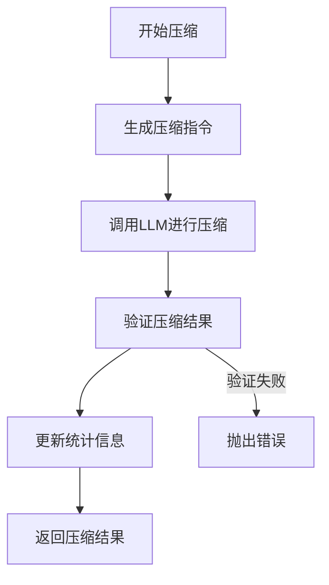
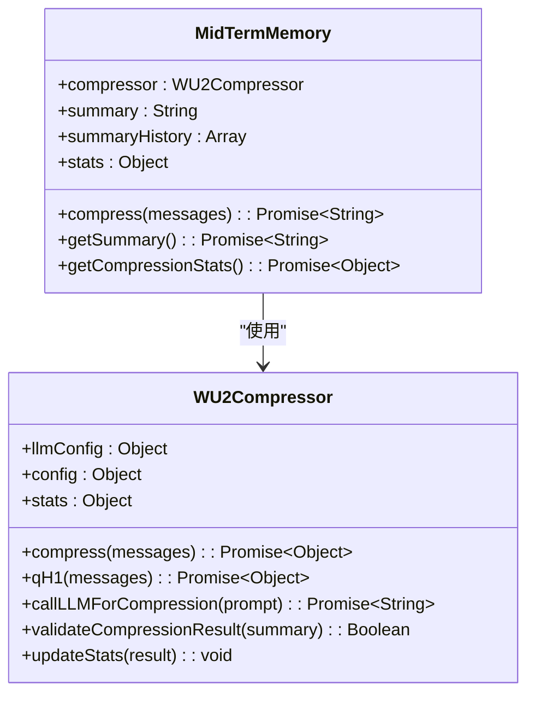
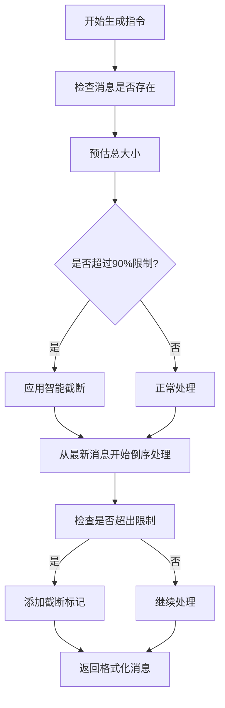
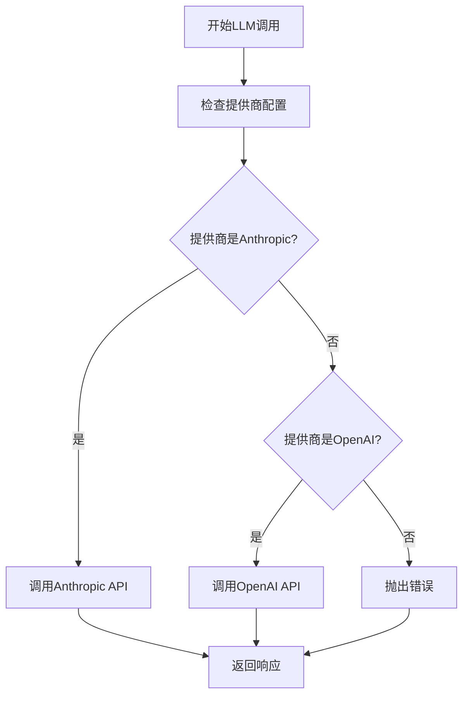
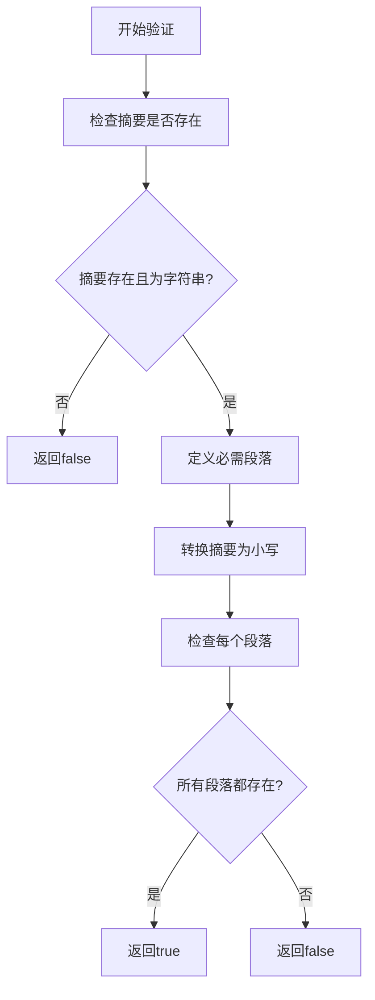
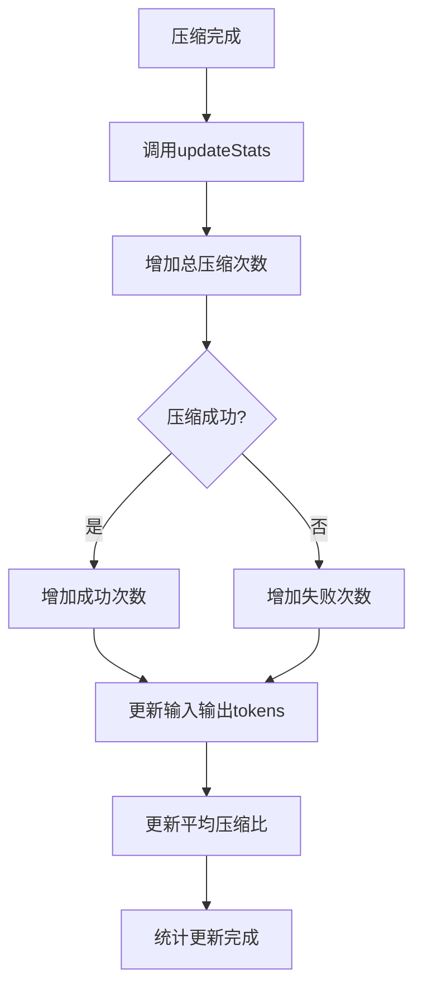
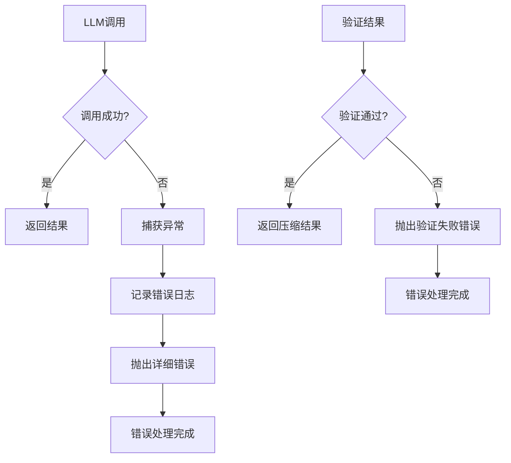

# 压缩执行流程

<cite>
**Referenced Files in This Document**   
- [WU2Compressor.js](file://context-claude-code/src/claude-core/WU2Compressor.js)
- [MidTermMemory.js](file://context-claude-code/src/memory/MidTermMemory.js)
- [Claude_Code_Large_File_Handling_Complete_Guide.md](file://context-claude-code/Claude_Code_Large_File_Handling_Complete_Guide.md)
- [上下文工程管理实践-第3部分-压缩触发.md](file://context-claude-code/上下文工程管理实践-第3部分-压缩触发.md)
</cite>

## 目录
1. [引言](#引言)
2. [压缩执行流程概述](#压缩执行流程概述)
3. [核心组件分析](#核心组件分析)
4. [压缩指令生成](#压缩指令生成)
5. [LLM调用机制](#llm调用机制)
6. [结果验证流程](#结果验证流程)
7. [统计系统](#统计系统)
8. [错误处理与恢复策略](#错误处理与恢复策略)
9. [结论](#结论)

## 引言

本文档详细记录了压缩执行流程（qH1函数）的协调机制，包括压缩指令生成、LLM调用、结果验证和统计更新的全过程。系统通过智能压缩算法，将大量对话历史压缩为结构化摘要，有效管理上下文窗口，确保在大型项目中高效使用AI助手。

## 压缩执行流程概述

压缩执行流程是上下文管理系统的核心功能，旨在解决LLM上下文窗口限制问题。当对话内容增多，达到预设阈值时，系统自动触发压缩机制，将短期记忆中的大量消息压缩为结构化摘要，并存储到中期记忆中。

该流程主要由`WU2Compressor`类协调执行，通过`qH1`函数作为主要执行入口，协调整个压缩过程。压缩流程包括四个关键阶段：压缩指令生成、LLM调用、结果验证和统计更新。

**Diagram sources**
- [WU2Compressor.js](file://context-claude-code/src/claude-core/WU2Compressor.js)

## 核心组件分析

压缩系统由两个核心组件构成：`WU2Compressor`和`MidTermMemory`。`WU2Compressor`负责执行具体的压缩算法，而`MidTermMemory`负责管理压缩后的摘要。

`WU2Compressor`类实现了完整的压缩算法，包括指令生成、LLM调用、结果验证和统计更新。该类通过事件发射器（EventEmitter）机制，实现了组件间的松耦合。

`MidTermMemory`类作为中期记忆层，负责存储和管理压缩后的摘要。它不直接存储原始消息，而是等待`WU2Compressor`完成压缩后，将摘要存储到内部状态中。

**Diagram sources**
- [WU2Compressor.js](file://context-claude-code/src/claude-core/WU2Compressor.js)
- [MidTermMemory.js](file://context-claude-code/src/memory/MidTermMemory.js)

## 压缩指令生成

压缩指令生成是压缩流程的第一步，由`AU2`函数负责执行。该函数生成一个详细的8段式压缩指令模板，指导LLM如何生成结构化的摘要。

指令模板要求LLM按照以下8个部分组织内容：
1. 主要请求和意图
2. 关键技术概念
3. 文件和代码片段
4. 错误和修复
5. 问题解决过程
6. 所有用户消息
7. 待处理任务
8. 当前工作状态

为了防止上下文窗口溢出，系统实现了智能截断机制。`formatMessagesForCompression`函数从最新消息开始倒序处理，确保保留最新内容，并在超出上下文限制时添加截断标记。

**Diagram sources**
- [WU2Compressor.js](file://context-claude-code/src/claude-core/WU2Compressor.js)

## LLM调用机制

系统根据配置的LLM提供商（Anthropic或OpenAI）调用相应的API进行压缩。`callLLMForCompression`函数是LLM调用的核心，它根据`llmConfig.provider`配置值，选择调用Anthropic或OpenAI的API。

当配置为`anthropic`时，系统调用Anthropic API；当配置为`openai`时，系统调用OpenAI API。如果配置了不支持的提供商，系统将抛出错误。

**Diagram sources**
- [WU2Compressor.js](file://context-claude-code/src/claude-core/WU2Compressor.js)

## 结果验证流程

`validateCompressionResult`函数负责验证压缩结果是否包含所有必需的8个段落。验证过程包括以下步骤：

1. 检查摘要是否存在且为字符串类型
2. 定义8个必需段落的名称列表
3. 将摘要转换为小写进行不区分大小写的匹配
4. 检查每个必需段落是否在摘要中存在

如果所有必需段落都存在，验证通过；否则，验证失败，系统将抛出"Compression validation failed"错误。

**Diagram sources**
- [WU2Compressor.js](file://context-claude-code/src/claude-core/WU2Compressor.js)

## 统计系统

统计系统跟踪压缩过程的关键指标，包括总压缩次数、成功/失败次数和平均压缩比。`WU2Compressor`类中的`stats`对象负责存储这些统计信息。

统计信息包括：
- `totalCompressions`: 总压缩次数
- `successfulCompressions`: 成功压缩次数
- `failedCompressions`: 失败压缩次数
- `averageCompressionRatio`: 平均压缩比
- `totalInputTokens`: 总输入tokens
- `totalOutputTokens`: 总输出tokens

每次压缩完成后，`updateStats`函数会更新这些统计信息。系统还提供了`getStats`函数，用于获取格式化的统计信息，包括成功率和总节省的tokens。

**Diagram sources**
- [WU2Compressor.js](file://context-claude-code/src/claude-core/WU2Compressor.js)

## 错误处理与恢复策略

系统实现了完善的错误处理机制，确保在LLM调用失败或验证不通过时能够正确恢复。

当LLM调用失败时，`callLLMForCompression`函数会捕获异常，记录错误日志，并抛出包含详细信息的错误。错误信息包括API错误消息或HTTP状态文本。

当验证不通过时，`qH1`函数会直接抛出"Compression validation failed"错误，阻止无效的压缩结果被使用。

**Diagram sources**
- [WU2Compressor.js](file://context-claude-code/src/claude-core/WU2Compressor.js)

## 结论

压缩执行流程通过`qH1`函数协调整个压缩过程，实现了从指令生成、LLM调用、结果验证到统计更新的完整闭环。系统通过智能的8段式压缩指令，确保生成的摘要包含所有关键信息。

LLM调用机制支持Anthropic和OpenAI两种提供商，通过配置灵活切换。结果验证流程确保压缩结果的完整性和质量，统计系统提供了详细的性能指标。

该压缩机制有效解决了LLM上下文窗口限制问题，为在大型项目中高效使用AI助手提供了可靠的技术支持。