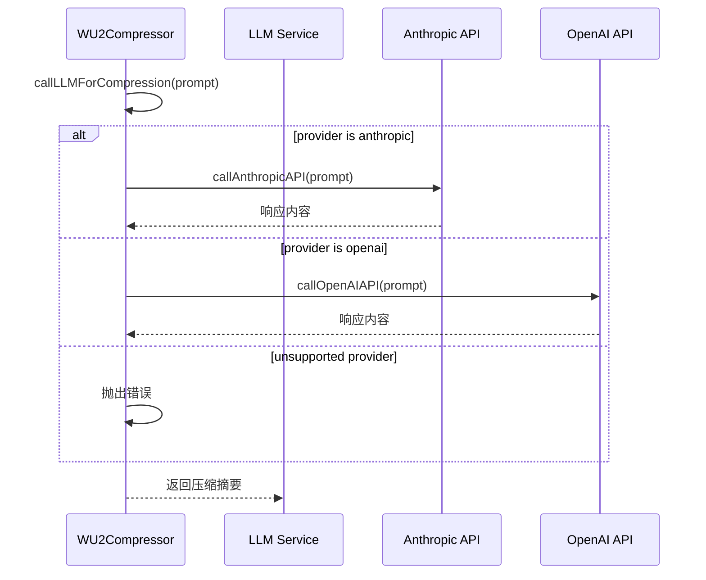
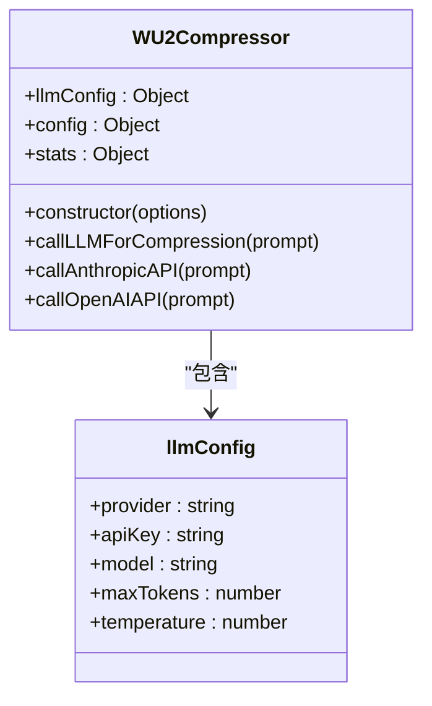
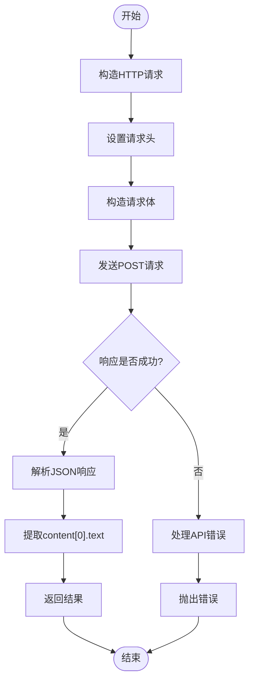
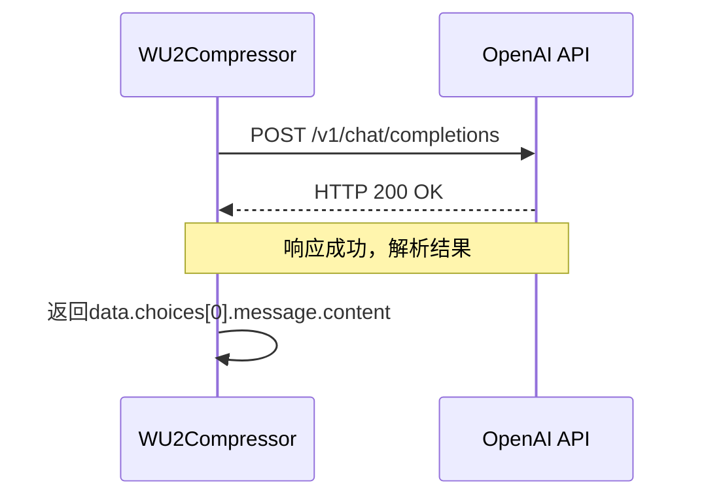
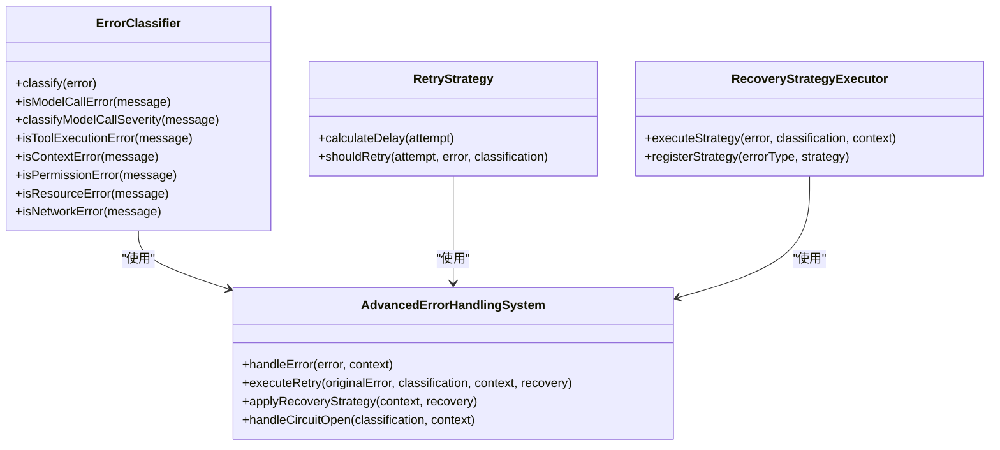
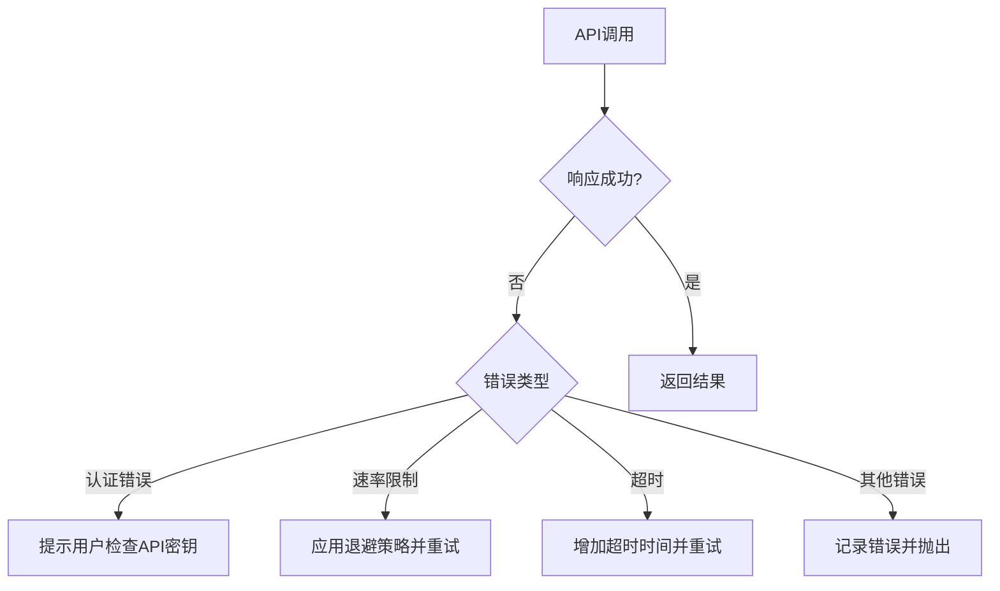

# LLM集成与调用

<cite>
**本文档引用的文件**  
- [WU2Compressor.js](file://context-claude-code/src/claude-core/WU2Compressor.js)
- [ErrorHandlingSystem.js](file://context-claude-code/src/error/ErrorHandlingSystem.js)
</cite>

## 目录
1. [引言](#引言)
2. [核心集成机制](#核心集成机制)
3. [LLM配置系统](#llm配置系统)
4. [API调用实现](#api调用实现)
5. [错误处理策略](#错误处理策略)
6. [实际调用示例](#实际调用示例)
7. [常见问题解决方案](#常见问题解决方案)
8. [性能监控与统计](#性能监控与统计)

## 引言
本文档全面阐述了WU2Compressor与大型语言模型（LLM）服务的集成机制。重点分析了`callLLMForCompression`函数如何根据配置动态调用不同提供商的API，详细说明了`callAnthropicAPI`和`callOpenAIAPI`函数的实现细节，包括HTTP请求构造、认证头设置、请求体序列化以及错误处理策略。同时，文档解释了`llmConfig`配置对象中各个参数的作用，以及系统如何处理API调用失败和网络异常等关键问题。

## 核心集成机制

WU2Compressor通过`callLLMForCompression`函数作为统一入口，根据配置动态调用不同LLM提供商的API。该函数是整个压缩流程的核心，负责协调与外部LLM服务的通信。



**图表来源**  
- [WU2Compressor.js](file://context-claude-code/src/claude-core/WU2Compressor.js#L341-L358)

**章节来源**  
- [WU2Compressor.js](file://context-claude-code/src/claude-core/WU2Compressor.js#L341-L358)

## LLM配置系统

`llmConfig`配置对象是WU2Compressor与LLM服务交互的基础，它定义了与外部API通信所需的所有关键参数。

### 配置参数说明

| 参数 | 类型 | 默认值 | 作用 |
|------|------|--------|------|
| provider | string | 'anthropic' | 指定LLM服务提供商（anthropic/openai） |
| apiKey | string | process.env.ANTHROPIC_API_KEY | API认证密钥 |
| model | string | 'claude-3-haiku-20240307' | 指定使用的模型 |
| maxTokens | number | 4000 | 最大输出token数量 |
| temperature | number | 0.3 | 控制生成文本的随机性 |

配置对象在WU2Compressor构造函数中初始化，支持通过构造函数参数或环境变量进行配置。



**图表来源**  
- [WU2Compressor.js](file://context-claude-code/src/claude-core/WU2Compressor.js#L29-L59)

**章节来源**  
- [WU2Compressor.js](file://context-claude-code/src/claude-core/WU2Compressor.js#L29-L59)

## API调用实现

### callLLMForCompression函数

`callLLMForCompression`函数是LLM调用的主入口，它根据`llmConfig.provider`的值决定调用哪个具体的API实现。

```javascript
async callLLMForCompression(prompt) {
    try {
      console.log('🤖 Calling LLM for compression...');
      switch (this.llmConfig.provider) {
        case 'anthropic':
          return await this.callAnthropicAPI(prompt);
        case 'openai':
          return await this.callOpenAIAPI(prompt);
        default:
          throw new Error(`Unsupported LLM provider: ${this.llmConfig.provider}`);
      }
    } catch (error) {
      console.error('❌ LLM call failed:', error);
      throw new Error(`Compression LLM call failed: ${error.message}`);
    }
}
```

该函数实现了以下关键功能：
- 日志记录：记录LLM调用的开始
- 动态路由：根据provider配置选择相应的API调用函数
- 错误处理：捕获并重新抛出异常，添加上下文信息

**章节来源**  
- [WU2Compressor.js](file://context-claude-code/src/claude-core/WU2Compressor.js#L341-L358)

### callAnthropicAPI函数实现

`callAnthropicAPI`函数负责与Anthropic API进行通信，其主要特点包括：

- **请求URL**: `https://api.anthropic.com/v1/messages`
- **HTTP方法**: POST
- **请求头**:
  - `Content-Type`: application/json
  - `x-api-key`: 从`llmConfig.apiKey`获取
  - `anthropic-version`: 固定为2023-06-01
- **请求体**: 包含模型、最大token数、温度和消息数组的JSON对象



**图表来源**  
- [WU2Compressor.js](file://context-claude-code/src/claude-core/WU2Compressor.js#L365-L393)

**章节来源**  
- [WU2Compressor.js](file://context-claude-code/src/claude-core/WU2Compressor.js#L365-L393)

### callOpenAIAPI函数实现

`callOpenAIAPI`函数负责与OpenAI API进行通信，其主要特点包括：

- **请求URL**: `https://api.openai.com/v1/chat/completions`
- **HTTP方法**: POST
- **请求头**:
  - `Content-Type`: application/json
  - `Authorization`: Bearer + `llmConfig.apiKey`
- **请求体**: 包含模型、最大token数、温度和消息数组的JSON对象

与`callAnthropicAPI`相比，主要区别在于：
- 认证方式：使用Bearer Token而非x-api-key
- API端点：不同的URL路径
- 响应解析：从`choices[0].message.content`提取结果



**图表来源**  
- [WU2Compressor.js](file://context-claude-code/src/claude-core/WU2Compressor.js#L400-L427)

**章节来源**  
- [WU2Compressor.js](file://context-claude-code/src/claude-core/WU2Compressor.js#L400-L427)

## 错误处理策略

系统实现了多层次的错误处理机制，确保在API调用失败时能够优雅地处理。

### 错误分类与处理



**图表来源**  
- [ErrorHandlingSystem.js](file://context-claude-code/src/error/ErrorHandlingSystem.js)

**章节来源**  
- [ErrorHandlingSystem.js](file://context-claude-code/src/error/ErrorHandlingSystem.js)

### 具体错误处理流程

1. **HTTP响应错误处理**:
   - 检查`response.ok`属性
   - 解析错误响应体获取详细信息
   - 抛出包含具体错误信息的异常

2. **网络异常处理**:
   - 捕获fetch调用可能抛出的异常
   - 提供清晰的错误信息
   - 支持重试机制

3. **熔断器模式**:
   - 跟踪特定类型错误的发生频率
   - 当错误达到阈值时开启熔断器
   - 防止系统在故障期间持续尝试失败的操作

## 实际调用示例

### Anthropic API调用示例

**请求**:
```http
POST https://api.anthropic.com/v1/messages
Content-Type: application/json
x-api-key: your-api-key-here
anthropic-version: 2023-06-01

{
  "model": "claude-3-haiku-20240307",
  "max_tokens": 4000,
  "temperature": 0.3,
  "messages": [
    {
      "role": "user",
      "content": "Your task is to create a detailed summary..."
    }
  ]
}
```

**成功响应**:
```json
{
  "content": [
    {
      "type": "text",
      "text": "Primary Request and Intent: 用户请求创建详细摘要..."
    }
  ],
  "model": "claude-3-haiku-20240307",
  "stop_reason": "end_turn",
  "stop_sequence": null,
  "usage": {
    "input_tokens": 1234,
    "output_tokens": 567
  }
}
```

### OpenAI API调用示例

**请求**:
```http
POST https://api.openai.com/v1/chat/completions
Content-Type: application/json
Authorization: Bearer your-api-key-here

{
  "model": "gpt-4",
  "max_tokens": 4000,
  "temperature": 0.3,
  "messages": [
    {
      "role": "user",
      "content": "Your task is to create a detailed summary..."
    }
  ]
}
```

**成功响应**:
```json
{
  "id": "chatcmpl-123",
  "object": "chat.completion",
  "created": 1677652288,
  "model": "gpt-4",
  "choices": [
    {
      "index": 0,
      "message": {
        "role": "assistant",
        "content": "Primary Request and Intent: 用户请求创建详细摘要..."
      },
      "finish_reason": "stop"
    }
  ],
  "usage": {
    "prompt_tokens": 1234,
    "completion_tokens": 567,
    "total_tokens": 1801
  }
}
```

**章节来源**  
- [WU2Compressor.js](file://context-claude-code/src/claude-core/WU2Compressor.js#L365-L427)

## 常见问题解决方案

### 请求超时处理

系统通过以下方式处理请求超时：

1. **重试机制**: 使用`RetryStrategy`类实现指数退避重试
2. **超时配置**: 可通过`llmConfig`调整请求参数
3. **熔断器**: 防止在服务不可用时持续重试

### 速率限制处理

当遇到速率限制时，系统会：

1. 识别`429 Too Many Requests`错误
2. 解析响应头中的重试时间（Retry-After）
3. 在重试策略中应用适当的延迟
4. 如果持续受限，可能切换到备用模型或提供商

### 认证错误处理

对于认证错误（如401 Unauthorized）：

1. 验证API密钥格式和有效性
2. 检查环境变量配置
3. 提供清晰的错误信息指导用户修复
4. 记录错误供后续分析



**图表来源**  
- [ErrorHandlingSystem.js](file://context-claude-code/src/error/ErrorHandlingSystem.js)

**章节来源**  
- [ErrorHandlingSystem.js](file://context-claude-code/src/error/ErrorHandlingSystem.js)

## 性能监控与统计

WU2Compressor内置了详细的性能监控和统计功能，用于跟踪压缩操作的效果。

### 统计指标

| 指标 | 描述 |
|------|------|
| totalCompressions | 总压缩次数 |
| successfulCompressions | 成功压缩次数 |
| failedCompressions | 失败压缩次数 |
| averageCompressionRatio | 平均压缩比 |
| totalInputTokens | 输入总token数 |
| totalOutputTokens | 输出总token数 |
| successRate | 成功率 |
| totalTokensSaved | 节省的总token数 |

### 统计功能实现

```javascript
updateStats(result) {
    this.stats.totalCompressions++;
    if (result.compressed) {
      this.stats.successfulCompressions++;
      this.stats.totalInputTokens += result.inputTokens;
      this.stats.totalOutputTokens += result.outputTokens;
      const totalRatio = this.stats.averageCompressionRatio * 
        (this.stats.successfulCompressions - 1) + result.compressionRatio;
      this.stats.averageCompressionRatio = totalRatio / this.stats.successfulCompressions;
    }
}
```

这些统计信息可用于：
- 监控系统性能
- 优化压缩算法
- 生成使用报告
- 诊断问题

**章节来源**  
- [WU2Compressor.js](file://context-claude-code/src/claude-core/WU2Compressor.js#L50-L103)