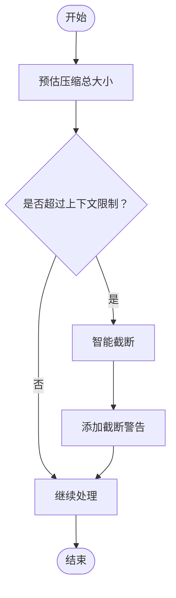
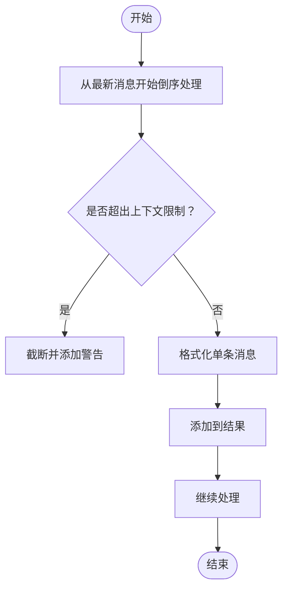

# 压缩指令生成

<cite>
**本文档引用文件**   
- [WU2Compressor.js](file://context-claude-code/src/claude-core/WU2Compressor.js)
- [ClaudeContextManager.js](file://context-claude-code/src/claude-core/ClaudeContextManager.js)
- [上下文工程管理实践-第3部分-压缩触发.md](file://context-claude-code/上下文工程管理实践-第3部分-压缩触发.md)
- [上下文工程管理实践-第4部分-最佳实践.md](file://context-claude-code/上下文工程管理实践-第4部分-最佳实践.md)
</cite>

## 目录
1. [AU2函数与8段式压缩指令](#au2函数与8段式压缩指令)
2. [上下文保护机制](#上下文保护机制)
3. [分析流程与技术准确性](#分析流程与技术准确性)
4. [消息格式化过程](#消息格式化过程)
5. [实际指令示例](#实际指令示例)

## AU2函数与8段式压缩指令

AU2函数是生成8段式结构化压缩指令的核心组件，其设计目的是在大容量对话中提取关键信息并生成高质量的摘要。该函数通过详细的指令模板，确保LLM能够按照预定义的结构组织内容。

指令模板中的每个核心段落都有其特定的设计目的和信息提取策略：

- **Primary Request and Intent（主要请求和意图）**：捕获用户的核心目标和显式请求，确保理解用户的最终目的。
- **Key Technical Concepts（关键技术概念）**：列出对话中涉及的技术框架、算法和库，帮助保留技术决策的关键信息。
- **Files and Code Sections（文件和代码片段）**：枚举所有被提及或修改过的代码和文件路径，确保上下文连续性。
- **Errors and fixes（错误和修复）**：记录遇到的错误信息和最终的解决方案，便于后续问题排查。
- **Problem Solving（问题解决过程）**：文档化解决问题的完整思路和决策路径，提供清晰的逻辑链条。
- **All user messages（所有用户消息）**：保留用户的关键指令和反馈，确保不丢失重要信息。
- **Pending Tasks（待处理任务）**：形成未完成工作项的待办清单，明确下一步行动。
- **Current Work（当前工作状态）**：明确记录当前对话中断时的进度，确保无缝继续。

**Section sources**
- [WU2Compressor.js](file://context-claude-code/src/claude-core/WU2Compressor.js#L263-L323)
- [上下文工程管理实践-第3部分-压缩触发.md](file://context-claude-code/上下文工程管理实践-第3部分-压缩触发.md#L176-L219)

## 上下文保护机制

上下文保护机制通过`estimateTotalCompressionSize`和`getMaxContextTokens`函数实现大容量对话的智能截断。`estimateTotalCompressionSize`函数预估压缩总大小，包括指令和消息的token数，而`getMaxContextTokens`函数根据不同的LLM模型返回相应的上下文限制。

当预估的总大小超过上下文窗口的90%时，系统会应用智能截断策略，优先保留最近的消息和关键的技术细节。这种机制确保了即使在大容量对话中，也能保持上下文的连续性和关键信息的完整性。



**Diagram sources **
- [WU2Compressor.js](file://context-claude-code/src/claude-core/WU2Compressor.js#L330-L334)
- [WU2Compressor.js](file://context-claude-code/src/claude-core/WU2Compressor.js#L548-L565)

## 分析流程与技术准确性

指令中包含的分析流程（`<analysis>`标签内）确保了技术准确性。该流程要求LLM在提供最终摘要之前，先组织其思考过程，确保覆盖所有必要的点。具体步骤如下：

1. 按时间顺序分析每条消息和对话部分，识别用户的显式请求和意图。
2. 详细说明解决用户请求的方法。
3. 记录关键决策、技术概念和代码模式。
4. 特别关注具体的用户反馈，尤其是用户要求改变做法的情况。
5. 双重检查技术准确性和完整性，确保每个必需元素都得到充分处理。

这种分析流程不仅提高了摘要的质量，还确保了技术细节的精确传达。

**Section sources**
- [WU2Compressor.js](file://context-claude-code/src/claude-core/WU2Compressor.js#L263-L323)
- [上下文工程管理实践-第3部分-压缩触发.md](file://context-claude-code/上下文工程管理实践-第3部分-压缩触发.md#L176-L219)

## 消息格式化过程

`formatMessagesForCompression`函数在消息格式化过程中扮演着关键角色。该函数将原始消息数组转换为适合压缩的格式化文本。它从最新消息开始倒序处理，确保保留最新的内容，并在超出上下文限制时进行智能截断。

此外，该函数还会过滤掉过长的工具结果，以避免不必要的信息冗余。通过这种方式，`formatMessagesForCompression`函数确保了压缩指令的高效性和准确性。



**Diagram sources **
- [WU2Compressor.js](file://context-claude-code/src/claude-core/WU2Compressor.js#L494-L523)

## 实际指令示例

以下是一个实际生成的压缩指令示例，展示了系统如何平衡信息完整性与上下文窗口限制：

```
Your task is to create a detailed summary of the conversation so far, paying close attention to the user's explicit requests and your previous actions.
This summary should be thorough in capturing technical details, code patterns, and architectural decisions that would be essential for continuing development work without losing context.

🔥 IMPORTANT CONTEXT NOTES:
- This conversation has been automatically truncated to fit within the AI model's context window
- Focus on the most recent messages and critical technical details
- If you notice truncation markers, prioritize recent content and ongoing work

Before providing your final summary, wrap your analysis in <analysis> tags to organize your thoughts and ensure you've covered all necessary points. In your analysis process:

1. Chronologically analyze each message and section of the conversation. For each section thoroughly identify:
   - The user's explicit requests and intents
   - Your approach to addressing the user's requests
   - Key decisions, technical concepts and code patterns
   - Specific details like:
     - file names
     - full code snippets
     - function signatures
     - file edits
   - Errors that you ran into and how you fixed them
   - Pay special attention to specific user feedback that you received, especially if the user told you to do something differently.
2. Double-check for technical accuracy and completeness, addressing each required element thoroughly.

Your summary should include the following sections:

1. Primary Request and Intent: Capture all of the user's explicit requests and intents in detail
2. Key Technical Concepts: List all important technical concepts, technologies, and frameworks discussed.
3. Files and Code Sections: Enumerate specific files and code sections examined, modified, or created. Pay special attention to the most recent messages and include full code snippets where applicable and include a summary of why this file read or edit is important.
4. Errors and fixes: List all errors that you ran into, and how you fixed them. Pay special attention to specific user feedback that you received, especially if the user told you to do something differently.
5. Problem Solving: Document problems solved and any ongoing troubleshooting efforts.
6. All user messages: List ALL user messages that are not tool results. These are critical for understanding the user's feedback and changing intent.
7. Pending Tasks: Outline any pending tasks that you have explicitly been asked to work on.
8. Current Work: Describe in detail precisely what was being worked on immediately before this summary request, paying special attention to the most recent messages from both user and assistant. Include file names and code snippets where applicable.
9. Optional Next Step: List the next step that you will take that is related to the most recent work you were doing. IMPORTANT: ensure that this step is DIRECTLY in line with the user's explicit requests, and the task you were working on immediately before this summary request. If your last task was concluded, then only list next steps if they are explicitly in line with the user's request. Do not start on tangential requests without confirming with the user first.

🗂️ Conversation context for compression:
[格式化后的消息]

💡 Compression guidelines:
- Prioritize recent messages and ongoing work
- Include complete code snippets for current files being worked on
- Focus on user's explicit requests and feedback
- Maintain technical accuracy while being concise
- If context was truncated, indicate what might be missing

Please provide a comprehensive summary that will allow us to continue this work seamlessly while maintaining all critical context and technical details.
```

**Section sources**
- [WU2Compressor.js](file://context-claude-code/src/claude-core/WU2Compressor.js#L263-L323)
- [上下文工程管理实践-第3部分-压缩触发.md](file://context-claude-code/上下文工程管理实践-第3部分-压缩触发.md#L176-L219)