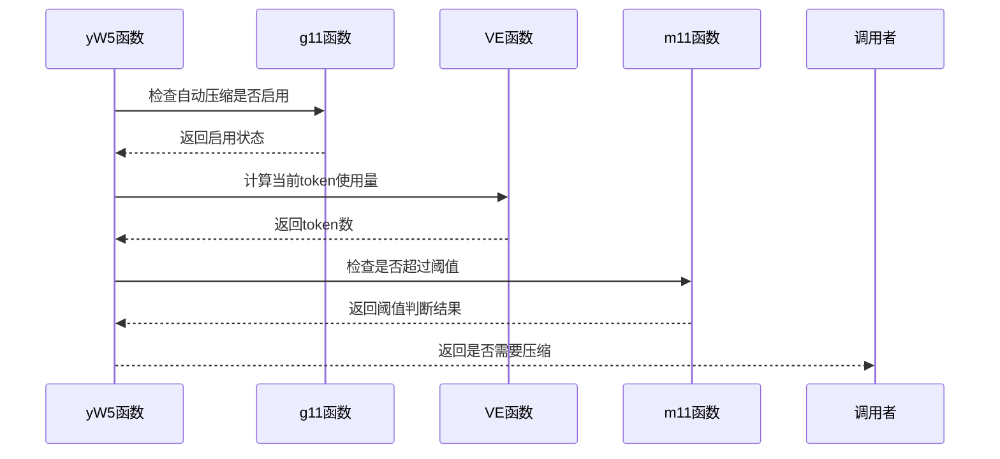
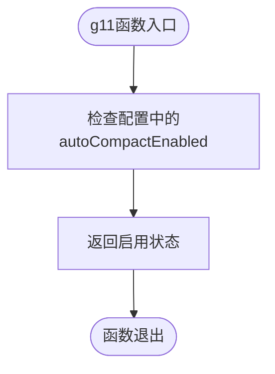
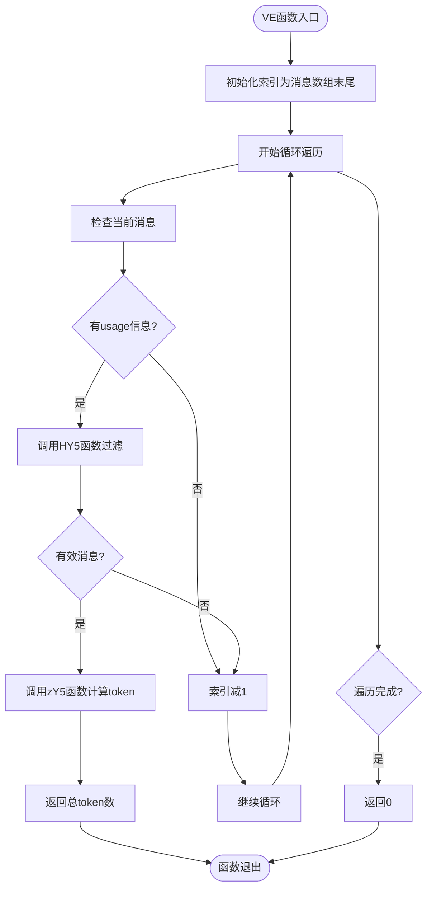
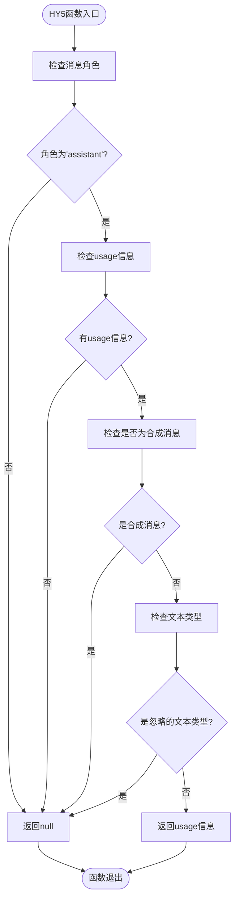
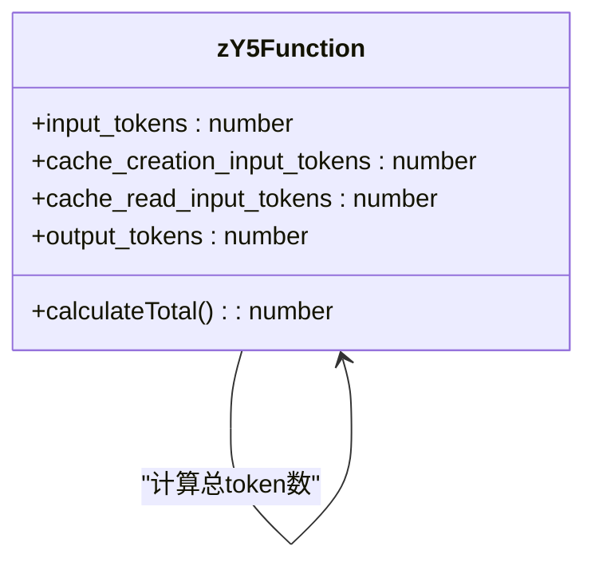
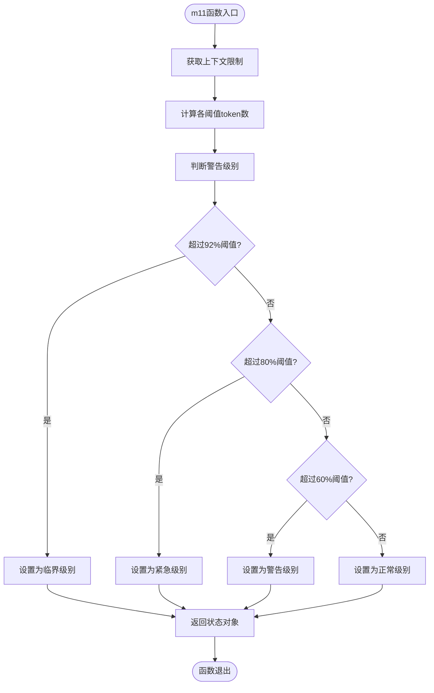
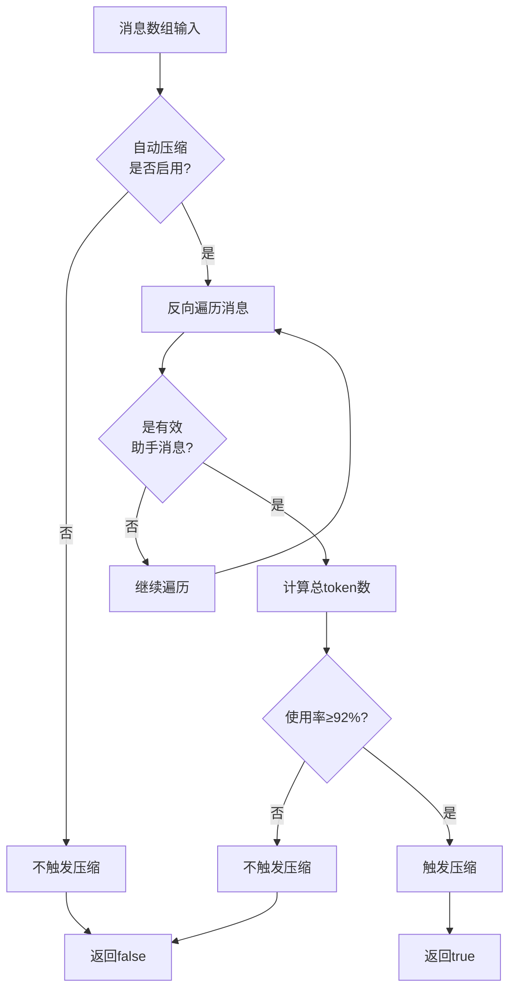

# 压缩触发机制

<cite>
**Referenced Files in This Document**   
- [WU2Compressor.js](file://context-claude-code/src/claude-core/WU2Compressor.js)
- [CLAUDE.md](file://context-claude-code/CLAUDE.md)
- [ShortTermMemory.js](file://context-claude-code/src/memory/ShortTermMemory.js)
- [ProgressiveWarningSystem.js](file://context-claude-code/src/claude-core/ProgressiveWarningSystem.js)
</cite>

## 目录
1. [引言](#引言)
2. [核心组件分析](#核心组件分析)
3. [压缩触发流程](#压缩触发流程)
4. [渐进式警告系统](#渐进式警告系统)
5. [实际触发流程示例](#实际触发流程示例)
6. [防止上下文溢出的关键作用](#防止上下文溢出的关键作用)
7. [结论](#结论)

## 引言

本文档深入解析WU2Compressor中压缩触发机制的实现细节，重点说明yW5函数如何协同g11、VE、HY5、zY5和m11函数实现智能触发决策。系统通过CLAUDE_CONSTANTS常量定义的阈值（如AUTO_COMPACT_THRESHOLD）实现92%上下文窗口使用率的精准判断。该机制在防止上下文溢出方面发挥着关键作用，确保了对话的连续性和上下文的完整性。

**Section sources**
- [WU2Compressor.js](file://context-claude-code/src/claude-core/WU2Compressor.js#L1-L50)

## 核心组件分析

### yW5函数 - 压缩触发检查

yW5函数是压缩触发机制的核心，负责检查是否达到92%的阈值。该函数首先通过g11函数检查自动压缩是否启用，然后调用VE函数计算当前token使用量，最后通过m11函数检查是否超过自动压缩阈值。



**Diagram sources**
- [WU2Compressor.js](file://context-claude-code/src/claude-core/WU2Compressor.js#L99-L117)

**Section sources**
- [WU2Compressor.js](file://context-claude-code/src/claude-core/WU2Compressor.js#L99-L117)

### g11函数 - 自动压缩启用检查

g11函数负责检查自动压缩是否启用。该函数通过读取配置中的autoCompactEnabled属性来判断自动压缩功能是否开启。这是触发压缩的第一道检查，确保系统在配置允许的情况下才进行后续的计算和判断。



**Diagram sources**
- [WU2Compressor.js](file://context-claude-code/src/claude-core/WU2Compressor.js#L461-L463)

**Section sources**
- [WU2Compressor.js](file://context-claude-code/src/claude-core/WU2Compressor.js#L461-L463)

### VE函数 - 反向遍历token计算

VE函数采用反向遍历的优化策略来计算token使用量。该函数从最新消息开始反向遍历消息数组，通过HY5函数过滤出有效的助手消息，一旦找到包含usage信息的消息，立即调用zY5函数计算总token数并返回，避免了不必要的遍历，实现了O(k)的时间复杂度。



**Diagram sources**
- [WU2Compressor.js](file://context-claude-code/src/claude-core/WU2Compressor.js#L125-L143)

**Section sources**
- [WU2Compressor.js](file://context-claude-code/src/claude-core/WU2Compressor.js#L125-L143)

### HY5函数 - 助手消息过滤

HY5函数负责过滤出有效的助手消息。该函数执行三重检查：首先确认消息角色为'assistant'，然后检查是否存在usage信息，最后排除合成消息和特定类型的文本消息。这种智能过滤机制确保了只有包含有效token使用信息的助手消息才会被用于计算。



**Diagram sources**
- [WU2Compressor.js](file://context-claude-code/src/claude-core/WU2Compressor.js#L151-L173)

**Section sources**
- [WU2Compressor.js](file://context-claude-code/src/claude-core/WU2Compressor.js#L151-L173)

### zY5函数 - 精确token累加

zY5函数负责精确计算token总数。该函数不仅计算输入和输出token，还包含了缓存创建和缓存读取的token，确保了token计算的完整性和准确性。这种精确的计算方式为后续的阈值判断提供了可靠的数据基础。



**Diagram sources**
- [WU2Compressor.js](file://context-claude-code/src/claude-core/WU2Compressor.js#L181-L188)
- [ShortTermMemory.js](file://context-claude-code/src/memory/ShortTermMemory.js#L168-L175)

**Section sources**
- [WU2Compressor.js](file://context-claude-code/src/claude-core/WU2Compressor.js#L181-L188)
- [ShortTermMemory.js](file://context-claude-code/src/memory/ShortTermMemory.js#L168-L175)

### m11函数 - 渐进式警告系统

m11函数是渐进式警告系统的核心，负责计算使用率和各层级警告。该函数基于CLAUDE_CONSTANTS常量定义的阈值（60%警告、80%紧急、92%临界）进行判断，为系统提供了多层次的预警机制。



**Diagram sources**
- [WU2Compressor.js](file://context-claude-code/src/claude-core/WU2Compressor.js#L197-L225)

**Section sources**
- [WU2Compressor.js](file://context-claude-code/src/claude-core/WU2Compressor.js#L197-L225)

## 压缩触发流程

### 触发决策工作原理

压缩触发机制的工作流程如下：首先通过g11函数检查自动压缩是否启用，如果未启用则直接返回false；如果启用，则调用VE函数计算当前token使用量；VE函数通过反向遍历消息数组，使用HY5函数过滤出有效的助手消息，并调用zY5函数精确计算token总数；最后，将计算结果传递给m11函数，检查是否超过CLAUDE_CONSTANTS.AUTO_COMPACT_THRESHOLD（92%）的阈值，从而做出触发决策。

```mermaid
sequenceDiagram
participant Client as "客户端"
participant yW5 as "yW5函数"
participant g11 as "g11函数"
participant VE as "VE函数"
participant HY5 as "HY5函数"
participant zY5 as "zY5函数"
participant m11 as "m11函数"
Client->>yW5 : 调用yW5(messages)
yW5->>g11 : 调用g11()
g11-->>yW5 : 返回true
yW5->>VE : 调用VE(messages)
VE->>VE : 初始化索引
loop 反向遍历消息
VE->>HY5 : 调用HY5(message)
HY5-->>VE : 返回usage或null
alt 有有效usage
VE->>zY5 : 调用zY5(usage)
zY5-->>VE : 返回总token数
break 返回token数
end
end
VE-->>yW5 : 返回当前token使用量
yW5->>m11 : 调用m11(currentTokens, AUTO_COMPACT_THRESHOLD)
m11-->>yW5 : 返回阈值判断结果
yW5-->>Client : 返回是否需要压缩
```

**Diagram sources**
- [WU2Compressor.js](file://context-claude-code/src/claude-core/WU2Compressor.js#L99-L117)

**Section sources**
- [WU2Compressor.js](file://context-claude-code/src/claude-core/WU2Compressor.js#L99-L117)

### CLAUDE_CONSTANTS阈值定义

系统通过CLAUDE_CONSTANTS常量对象定义了关键的阈值参数：

- **AUTO_COMPACT_THRESHOLD**: 0.92，即92%的上下文窗口使用率，是自动压缩的触发点
- **WARNING_THRESHOLD**: 0.6，即60%的使用率，作为警告阈值
- **ERROR_THRESHOLD**: 0.8，即80%的使用率，作为紧急阈值

这些阈值的设置基于对上下文窗口使用的深入分析，92%的"魔法阈值"既保证了足够的上下文空间，又避免了过早压缩导致的信息丢失。

**Section sources**
- [WU2Compressor.js](file://context-claude-code/src/claude-core/WU2Compressor.js#L10-L17)

## 渐进式警告系统

### 三级警告机制

渐进式警告系统实现了60%/80%/92%的三级警告机制：

- **60%警告级别**: 当使用率达到60%时，系统发出温和提醒，建议用户注意对话长度
- **80%紧急级别**: 当使用率达到80%时，系统发出强烈提醒，强烈建议整理对话历史
- **92%临界级别**: 当使用率达到92%时，系统将自动触发压缩，防止上下文溢出

这种渐进式的警告机制为用户提供了充分的预警时间，避免了突然的上下文丢失。

```mermaid
erDiagram
WARNING_LEVEL ||--o{ THRESHOLD : "has"
WARNING_LEVEL {
string level PK
string description
string color
string icon
}
THRESHOLD {
string level FK
float threshold_value
int percentage
string description
}
WARNING_LEVEL ||--o{ WARNING_LEVEL : "transitions to"
WARNING_LEVEL {
"normal"
"warning"
"urgent"
"critical"
}
THRESHOLD {
"normal" 0.0 "正常"
"warning" 0.6 "60%警告阈值"
"urgent" 0.8 "80%紧急阈值"
"critical" 0.92 "92%临界阈值"
}
```

**Diagram sources**
- [WU2Compressor.js](file://context-claude-code/src/claude-core/WU2Compressor.js#L197-L225)
- [ProgressiveWarningSystem.js](file://context-claude-code/src/claude-core/ProgressiveWarningSystem.js#L17-L19)

**Section sources**
- [WU2Compressor.js](file://context-claude-code/src/claude-core/WU2Compressor.js#L197-L225)
- [ProgressiveWarningSystem.js](file://context-claude-code/src/claude-core/ProgressiveWarningSystem.js#L17-L19)

## 实际触发流程示例

### 从消息数组到触发决策

以下是一个完整的触发流程示例：

1. 客户端调用yW5函数，传入消息数组
2. yW5函数调用g11函数，确认自动压缩已启用
3. yW5函数调用VE函数，开始计算token使用量
4. VE函数从最新消息开始反向遍历
5. 对每条消息调用HY5函数进行过滤
6. 找到第一条包含usage信息的有效助手消息
7. VE函数调用zY5函数，精确计算该消息的总token数
8. VE函数返回总token使用量给yW5函数
9. yW5函数调用m11函数，传入当前token数和92%阈值
10. m11函数计算使用率，判断是否超过92%阈值
11. m11函数返回阈值判断结果
12. yW5函数根据结果决定是否触发压缩



**Diagram sources**
- [WU2Compressor.js](file://context-claude-code/src/claude-core/WU2Compressor.js#L99-L117)

**Section sources**
- [WU2Compressor.js](file://context-claude-code/src/claude-core/WU2Compressor.js#L99-L117)

## 防止上下文溢出的关键作用

### 上下文保护机制

压缩触发机制在防止上下文溢出方面发挥着关键作用。当系统检测到上下文使用率接近92%的阈值时，会自动触发压缩流程，将历史对话压缩为摘要，从而释放上下文空间。这种机制确保了：

1. **对话连续性**: 通过压缩保留关键上下文，避免了对话的中断
2. **信息完整性**: 8段式压缩指令确保了技术细节、代码模式和架构决策的完整保留
3. **性能优化**: 及时压缩避免了上下文窗口的完全耗尽，保持了系统的响应性能
4. **用户体验**: 渐进式警告系统为用户提供了充分的预警，避免了突然的上下文丢失

该机制与智能文件恢复系统协同工作，在压缩后自动恢复重要文件，进一步增强了上下文的连续性和完整性。

**Section sources**
- [CLAUDE.md](file://context-claude-code/CLAUDE.md#L100-L120)

## 结论

WU2Compressor的压缩触发机制通过yW5、g11、VE、HY5、zY5和m11函数的协同工作，实现了智能、精准的触发决策。系统基于CLAUDE_CONSTANTS常量定义的92%阈值，通过反向遍历、助手消息过滤和精确token累加等优化策略，确保了触发决策的准确性和高效性。渐进式警告系统提供了多层次的预警机制，为防止上下文溢出发挥了关键作用，保证了对话的连续性和上下文的完整性。这一机制是Claude Code上下文管理架构的核心组成部分，体现了其在长对话管理方面的先进设计理念。