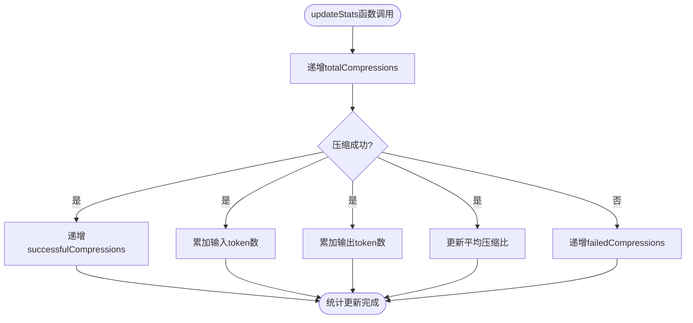
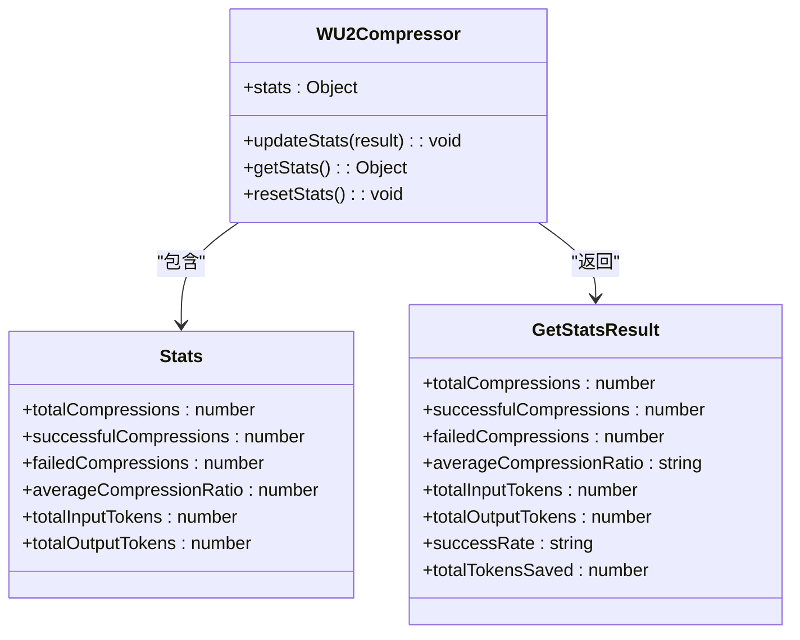
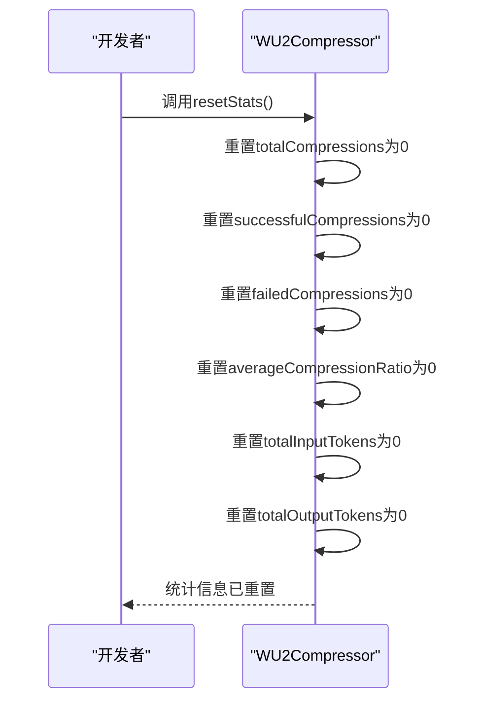

# 性能统计与监控

<cite>
**Referenced Files in This Document**   
- [WU2Compressor.js](file://context-claude-code/src/claude-core/WU2Compressor.js)
</cite>

## 目录
1. [性能统计系统概述](#性能统计系统概述)
2. [核心统计指标解析](#核心统计指标解析)
3. [更新统计信息](#更新统计信息)
4. [获取综合统计](#获取综合统计)
5. [重置统计信息](#重置统计信息)
6. [性能监控应用](#性能监控应用)

## 性能统计系统概述

WU2Compressor内置的性能统计系统是一个全面的监控机制，用于跟踪和评估压缩算法的效率和可靠性。该系统通过`stats`对象收集关键性能指标，并提供了一系列方法来更新、获取和重置这些统计信息。统计系统在压缩流程中扮演着重要角色，不仅记录了压缩操作的基本数据，还计算了复杂的性能指标，为开发者提供了评估算法效率、识别性能瓶颈和指导系统优化的依据。

**Section sources**
- [WU2Compressor.js](file://context-claude-code/src/claude-core/WU2Compressor.js#L45-L55)

## 核心统计指标解析

WU2Compressor的`stats`对象包含了多个核心统计指标，每个指标都有特定的含义和更新时机：

- **totalCompressions**: 记录总的压缩尝试次数，每次调用`compress`方法时都会递增，无论压缩是否成功。
- **successfulCompressions**: 记录成功的压缩次数，仅在压缩成功完成时递增。
- **failedCompressions**: 记录失败的压缩次数，当压缩过程中发生错误时递增。
- **averageCompressionRatio**: 平均压缩比，表示输入token与输出token的平均比率。
- **totalInputTokens**: 累计输入token总数，即压缩前的总token数。
- **totalOutputTokens**: 累计输出token总数，即压缩后的总token数。

这些指标在`WU2Compressor`类的构造函数中初始化，并在压缩流程的不同阶段根据特定条件进行更新。

**Section sources**
- [WU2Compressor.js](file://context-claude-code/src/claude-core/WU2Compressor.js#L45-L55)

## 更新统计信息

`updateStats`函数负责更新压缩统计信息，它在每次压缩操作完成后被调用。该函数不仅更新基本计数器，还计算关键性能数据：

**Diagram sources**
- [WU2Compressor.js](file://context-claude-code/src/claude-core/WU2Compressor.js#L601-L613)

**Section sources**
- [WU2Compressor.js](file://context-claude-code/src/claude-core/WU2Compressor.js#L601-L613)

## 获取综合统计

`getStats`函数提供了一个综合的统计信息视图，它不仅返回原始的统计数据，还计算了衍生的性能指标：

- **successRate**: 压缩成功率，通过成功压缩次数除以总压缩次数计算得出。
- **averageCompressionRatio**: 平均压缩比，以三位小数格式化显示。
- **totalTokensSaved**: 总节省token数，通过输入token总数减去输出token总数计算得出。

这些综合指标为开发者提供了直观的性能评估，无需手动计算即可了解压缩算法的整体表现。

**Diagram sources**
- [WU2Compressor.js](file://context-claude-code/src/claude-core/WU2Compressor.js#L615-L631)

**Section sources**
- [WU2Compressor.js](file://context-claude-code/src/claude-core/WU2Compressor.js#L615-L631)

## 重置统计信息

`resetStats`函数用于重置所有统计信息，在监控周期管理中起着重要作用。当需要开始新的监控周期或清除旧的统计数据时，可以调用此函数将所有计数器和累计值重置为初始状态。

**Diagram sources**
- [WU2Compressor.js](file://context-claude-code/src/claude-core/WU2Compressor.js#L633-L642)

**Section sources**
- [WU2Compressor.js](file://context-claude-code/src/claude-core/WU2Compressor.js#L633-L642)

## 性能监控应用

WU2Compressor的统计指标为开发者提供了强大的性能监控能力。通过分析这些指标，开发者可以：

1. **评估压缩算法效率**：通过成功率、平均压缩比和总节省token数等指标，全面评估压缩算法的有效性。
2. **识别性能瓶颈**：监控失败压缩次数和压缩比的变化，识别可能导致性能问题的特定场景或数据模式。
3. **指导系统优化**：基于统计数据分析，调整压缩策略、优化算法参数或改进错误处理机制。
4. **监控系统健康**：定期检查统计信息，确保压缩系统正常运行，及时发现和解决潜在问题。

这些统计指标构成了一个完整的性能监控体系，帮助开发者持续改进和优化WU2Compressor的性能表现。

**Section sources**
- [WU2Compressor.js](file://context-claude-code/src/claude-core/WU2Compressor.js#L45-L642)