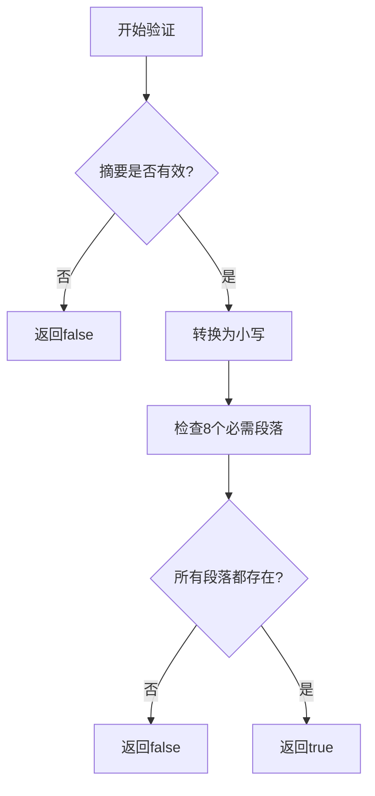
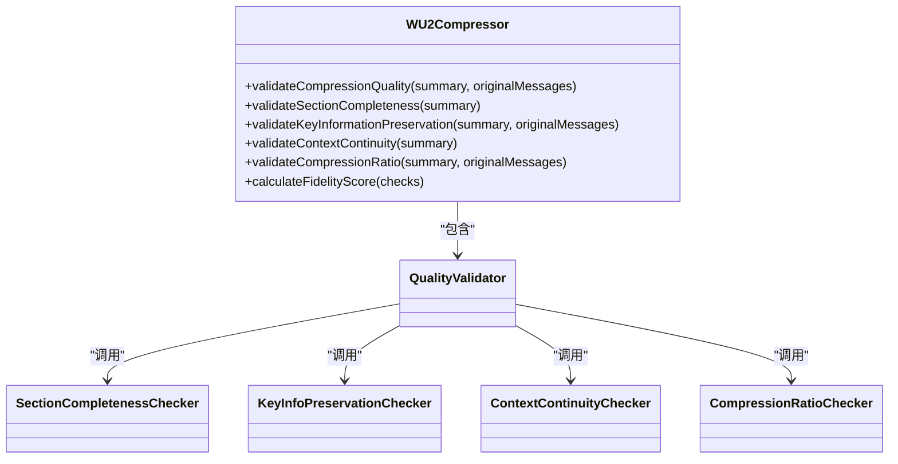
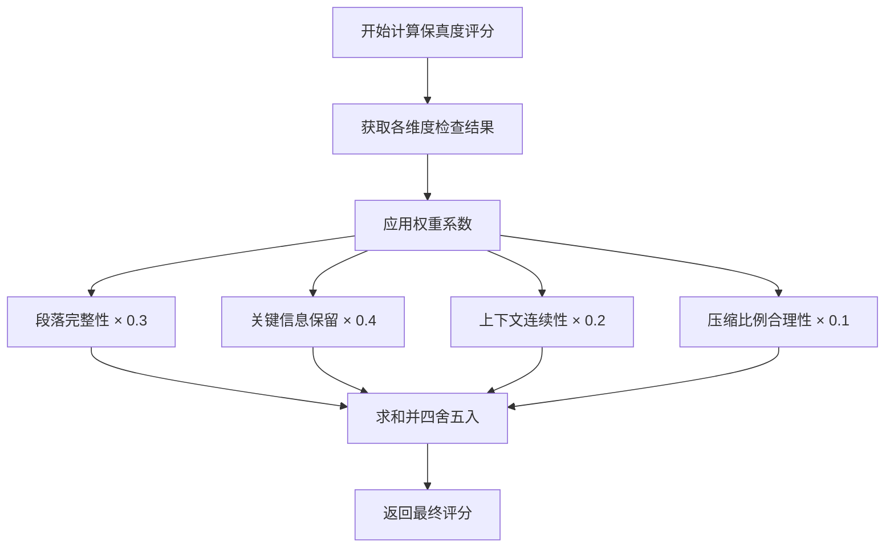
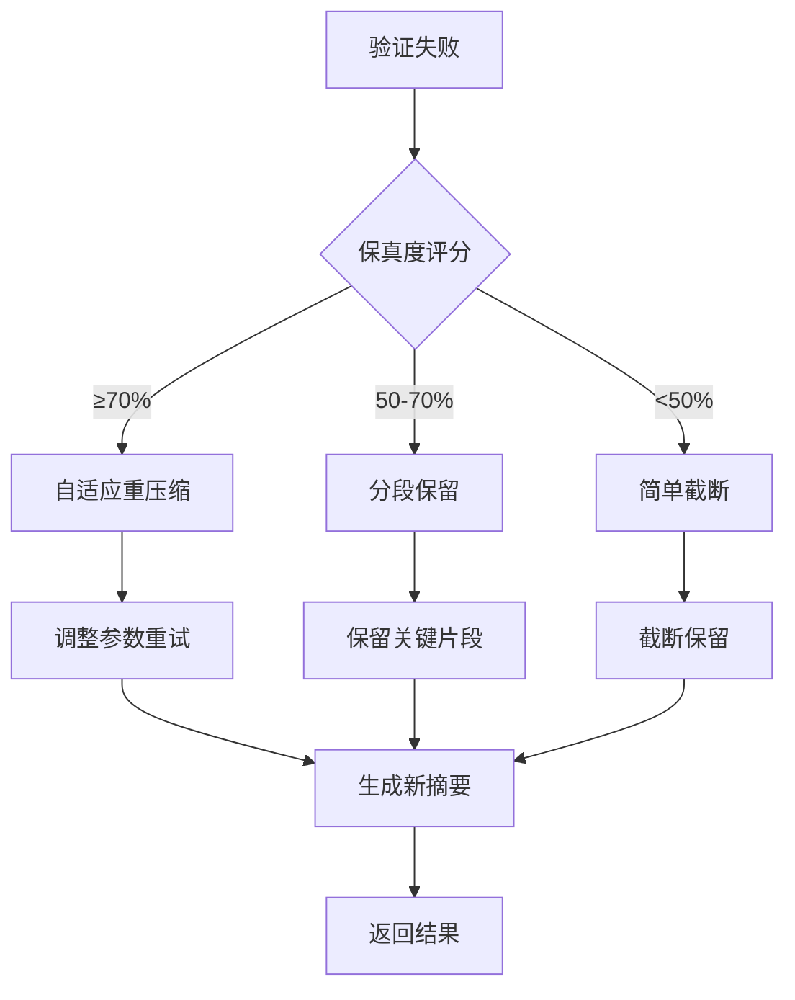

# 结果验证与质量保障

<cite>
**本文档引用文件**   
- [WU2Compressor.js](file://context-claude-code/src/compression/WU2Compressor.js)
- [WU2Compressor.js](file://context-claude-code/src/claude-core/WU2Compressor.js)
- [MidTermMemory.js](file://context-claude-code/src/memory/MidTermMemory.js)
- [上下文工程管理实践-第3部分-压缩触发.md](file://context-claude-code/上下文工程管理实践-第3部分-压缩触发.md)
</cite>

## 目录
1. [双重验证机制概述](#双重验证机制概述)
2. [结构完整性验证](#结构完整性验证)
3. [质量验证体系](#质量验证体系)
4. [保真度评分计算](#保真度评分计算)
5. [系统响应策略](#系统响应策略)

## 双重验证机制概述

系统采用双重验证机制确保压缩结果的质量。首先通过`validateCompressionResult`函数验证结构化摘要的格式正确性，其次通过`validateCompressionQuality`函数进行多维度质量评估。该机制确保压缩后的摘要既能满足结构要求，又能保持关键信息的完整性。

**Section sources**
- [WU2Compressor.js](file://context-claude-code/src/claude-core/WU2Compressor.js#L434-L455)
- [WU2Compressor.js](file://context-claude-code/src/compression/WU2Compressor.js#L255-L284)

## 结构完整性验证

`validateCompressionResult`函数负责检查压缩结果是否包含8个必需段落，确保结构化摘要的格式正确性。这8个段落包括：

- 主要请求和意图 (Primary Request and Intent)
- 关键技术概念 (Key Technical Concepts)
- 文件和代码片段 (Files and Code Sections)
- 错误和修复 (Errors and fixes)
- 问题解决过程 (Problem Solving)
- 所有用户消息 (All user messages)
- 待处理任务 (Pending Tasks)
- 当前工作状态 (Current Work)

验证过程将摘要内容转换为小写后，检查是否包含所有必需段落的关键词。只有当所有段落都存在时，验证才会通过。



**Diagram sources**
- [WU2Compressor.js](file://context-claude-code/src/claude-core/WU2Compressor.js#L434-L455)

**Section sources**
- [WU2Compressor.js](file://context-claude-code/src/claude-core/WU2Compressor.js#L434-L455)

## 质量验证体系

`validateCompressionQuality`函数实现多维度质量检查体系，包括四个核心检查维度：

### 段落完整性检查
验证8个必需段落的完整性，使用`validateSectionCompleteness`方法。系统不仅检查段落标题，还通过关键词匹配来识别内容。

### 关键信息保留度检查
通过`validateKeyInformationPreservation`方法评估关键信息的保留情况，包括：
- 文件名保留率
- 错误信息保留率
- 用户命令保留率
- 技术术语保留率

### 上下文连续性检查
使用`validateContextContinuity`方法评估摘要的上下文连续性，通过检测连续性指示词（如"首先"、"然后"、"接下来"）的数量来评分。

### 压缩比例合理性检查
通过`validateCompressionRatio`方法验证压缩比例是否在合理范围内，确保不会过度压缩导致信息丢失。



**Diagram sources**
- [WU2Compressor.js](file://context-claude-code/src/compression/WU2Compressor.js#L255-L284)

**Section sources**
- [WU2Compressor.js](file://context-claude-code/src/compression/WU2Compressor.js#L255-L284)

## 保真度评分计算

系统通过`calculateFidelityScore`方法计算综合保真度评分，采用加权评分模型：

### 评分权重分配
- 段落完整性：30%
- 关键信息保留：40%
- 上下文连续性：20%
- 压缩比例合理性：10%

### 评分计算公式
```
保真度评分 = 
  段落完整性得分 × 0.3 +
  关键信息保留得分 × 0.4 +
  上下文连续性得分 × 0.2 +
  (压缩比例合理 ? 100 : 50) × 0.1
```

系统根据`minFidelityScore`配置参数（默认80%）决定是否接受压缩结果。如果评分低于阈值，系统将触发优雅降级策略。



**Diagram sources**
- [WU2Compressor.js](file://context-claude-code/src/compression/WU2Compressor.js#L527-L541)

**Section sources**
- [WU2Compressor.js](file://context-claude-code/src/compression/WU2Compressor.js#L527-L541)

## 系统响应策略

当验证失败时，系统根据保真度评分采取不同的响应策略：

### 验证失败典型案例
1. **段落缺失**：摘要缺少"待处理任务"或"当前工作状态"等必需段落
2. **信息丢失**：关键文件名、错误信息或用户命令未被保留
3. **连续性差**：摘要缺乏逻辑连接词，上下文不连贯
4. **过度压缩**：压缩比例超过15%的阈值

### 优雅降级策略
系统提供三级降级策略：

#### 自适应重压缩
当保真度评分在70-80%之间时，调整压缩参数进行重压缩，放宽压缩比例限制。

#### 分段保留
当保真度评分在50-70%之间时，保留最近的关键消息片段，生成分段摘要。

#### 简单截断
当保真度评分低于50%时，采用简单截断策略，保留最近30%的消息。

系统还提供改进建议，帮助优化压缩结果，包括补充缺失内容、增强上下文连续性等。



**Section sources**
- [WU2Compressor.js](file://context-claude-code/src/compression/WU2Compressor.js#L255-L284)
- [WU2Compressor.js](file://context-claude-code/src/compression/WU2Compressor.js#L543-L564)