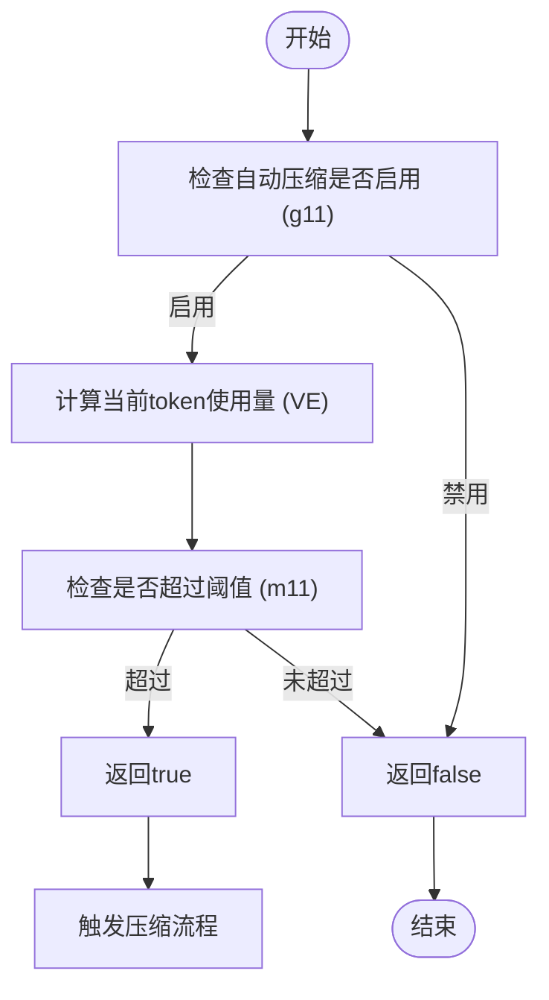
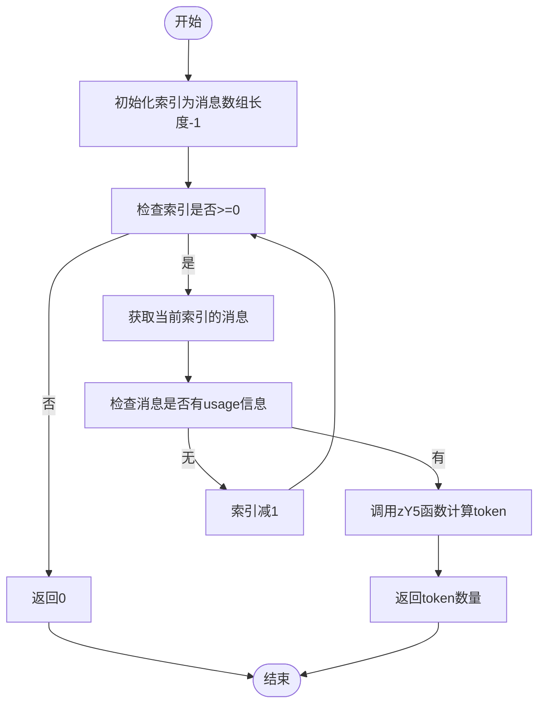
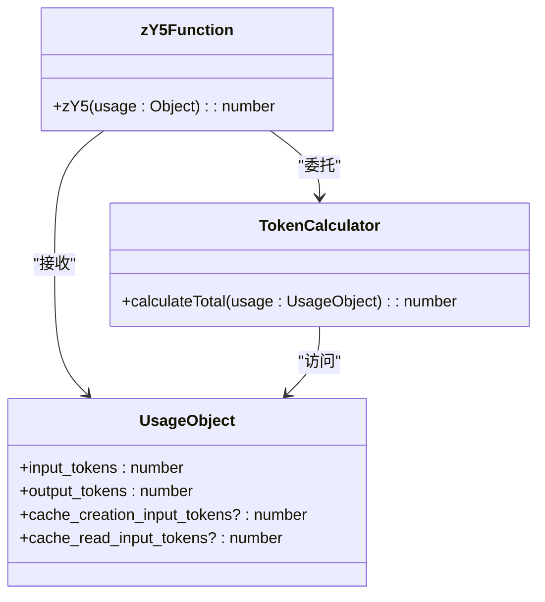
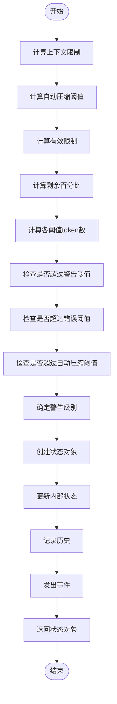
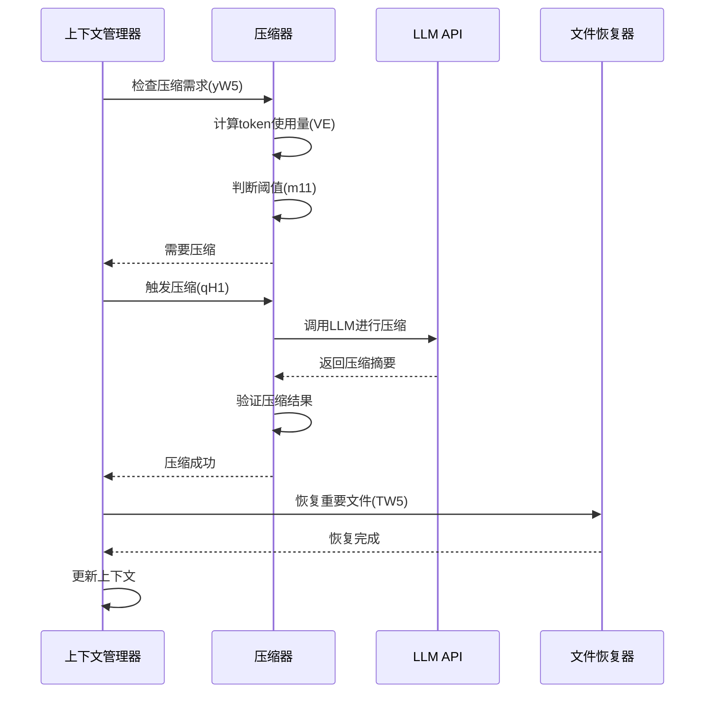

# 压缩触发机制

<cite>
**本文档引用的文件**
- [WU2Compressor.js](file://context-claude-code/src/claude-core/WU2Compressor.js)
- [ProgressiveWarningSystem.js](file://context-claude-code/src/claude-core/ProgressiveWarningSystem.js)
- [ShortTermMemory.js](file://context-claude-code/src/memory/ShortTermMemory.js)
- [ClaudeContextManager.js](file://context-claude-code/src/claude-core/ClaudeContextManager.js)
- [CLAUDE.md](file://context-claude-code/CLAUDE.md)
</cite>

## 目录
1. [引言](#引言)
2. [自动压缩触发机制](#自动压缩触发机制)
3. [反向遍历token计算](#反向遍历token计算)
4. [精确token计算](#精确token计算)
5. [渐进式警告系统](#渐进式警告系统)
6. [上下文保护系统协同](#上下文保护系统协同)
7. [配置与代码示例](#配置与代码示例)
8. [结论](#结论)

## 引言
本文档全面记录了基于92% token使用阈值的自动压缩触发机制的实现。该机制是Claude Code上下文管理系统的核心组成部分，旨在通过智能算法防止上下文窗口溢出，确保对话的连续性和完整性。系统通过yW5函数实现自动压缩触发，结合VE函数进行反向遍历token计算，以及zY5函数进行精确token统计，形成了一套完整的上下文管理解决方案。渐进式警告系统（m11函数）提供了多层级的使用率监控，确保用户能够及时了解上下文使用情况。

**Section sources**
- [CLAUDE.md](file://context-claude-code/CLAUDE.md#L1-L145)

## 自动压缩触发机制
自动压缩触发机制的核心是yW5函数，该函数负责检查是否达到预设的token使用阈值。当系统检测到token使用量达到或超过92%的阈值时，将自动触发压缩流程。这一机制通过调用g11函数检查自动压缩是否启用，然后使用VE函数计算当前token使用量，最后通过m11函数判断是否超过自动压缩阈值。

yW5函数的实现采用了事件驱动架构，当检测到需要压缩时，会返回true，从而触发后续的压缩流程。该函数在WU2Compressor类中实现，是整个压缩流程的入口点。通过这种设计，系统能够在不影响用户体验的情况下，自动管理上下文大小，确保对话的持续进行。



**Diagram sources**
- [WU2Compressor.js](file://context-claude-code/src/claude-core/WU2Compressor.js#L99-L117)

**Section sources**
- [WU2Compressor.js](file://context-claude-code/src/claude-core/WU2Compressor.js#L99-L117)

## 反向遍历token计算
反向遍历token计算是通过VE函数实现的，该函数从最新消息开始查找usage信息。这种设计基于一个关键观察：usage信息通常存在于最近的AI回复中，因此从最新消息开始反向遍历可以显著提高计算效率。VE函数通过从消息数组的末尾开始遍历，逐个检查每条消息的usage属性，一旦找到有效的usage信息，立即返回计算结果。

这种反向遍历策略实现了O(k)的时间复杂度，其中k是找到有效usage信息所需遍历的消息数量，远优于O(n)的全量遍历。在实际应用中，由于usage信息通常位于最近的几条消息中，因此k值通常很小，使得该算法具有很高的效率。VE函数在找到有效usage后，会调用zY5函数进行精确的token计算。



**Diagram sources**
- [WU2Compressor.js](file://context-claude-code/src/claude-core/WU2Compressor.js#L125-L143)

**Section sources**
- [WU2Compressor.js](file://context-claude-code/src/claude-core/WU2Compressor.js#L125-L143)

## 精确token计算
精确token计算由zY5函数实现，该函数负责计算包含输入、输出和缓存token的完整统计。zY5函数接收usage对象作为参数，返回所有相关token的总和。计算包括四个部分：input_tokens（输入token）、cache_creation_input_tokens（缓存创建输入token）、cache_read_input_tokens（缓存读取输入token）和output_tokens（输出token）。

zY5函数在不同文件中有相似的实现，如在WU2Compressor.js和ShortTermMemory.js中。这些实现都采用了相同的计算逻辑，确保了token统计的一致性。通过使用空值合并操作符（??），函数能够安全地处理可能不存在的缓存token字段，避免了潜在的运行时错误。这种精确的token计算是确保压缩阈值判断准确性的关键。



**Diagram sources**
- [WU2Compressor.js](file://context-claude-code/src/claude-core/WU2Compressor.js#L181-L188)
- [ShortTermMemory.js](file://context-claude-code/src/memory/ShortTermMemory.js#L168-L175)

**Section sources**
- [WU2Compressor.js](file://context-claude-code/src/claude-core/WU2Compressor.js#L181-L188)
- [ShortTermMemory.js](file://context-claude-code/src/memory/ShortTermMemory.js#L168-L175)

## 渐进式警告系统
渐进式警告系统由m11函数实现，该函数计算各层级阈值并判断是否超过自动压缩阈值。系统采用三级警告机制：60%为警告阈值（_W5），80%为错误阈值（jW5），92%为自动压缩阈值（h11）。m11函数接收当前使用量和阈值倍数作为参数，返回包含详细状态信息的对象。

该函数首先计算上下文限制，然后根据阈值倍数计算自动压缩阈值token数。接着计算有效限制，如果启用了自动压缩，则有效限制为自动压缩阈值，否则为上下文限制。函数还计算剩余百分比，并判断是否超过各层级阈值。基于这些判断，系统确定警告级别，从正常（normal）到警告（warning）、紧急（urgent）直至关键（critical）。



**Diagram sources**
- [WU2Compressor.js](file://context-claude-code/src/claude-core/WU2Compressor.js#L197-L225)
- [ProgressiveWarningSystem.js](file://context-claude-code/src/claude-core/ProgressiveWarningSystem.js#L64-L155)

**Section sources**
- [WU2Compressor.js](file://context-claude-code/src/claude-core/WU2Compressor.js#L197-L225)
- [ProgressiveWarningSystem.js](file://context-claude-code/src/claude-core/ProgressiveWarningSystem.js#L64-L155)

## 上下文保护系统协同
触发机制与上下文保护系统协同工作，在达到阈值时自动启动压缩流程。当yW5函数检测到需要压缩时，会触发整个压缩流程，包括调用LLM进行智能压缩、验证压缩结果、执行文件恢复等步骤。这种协同工作确保了上下文管理的完整性和可靠性。

上下文保护系统通过多种机制防止上下文溢出，包括智能截断、上下文窗口保护和文件恢复。当系统检测到即将达到上下文限制时，会优先保留最近的内容，同时添加截断标记以指示被截断的消息数量。这种设计确保了关键信息的保留，同时提供了上下文完整性的提示。



**Diagram sources**
- [ClaudeContextManager.js](file://context-claude-code/src/claude-core/ClaudeContextManager.js#L1-L788)

**Section sources**
- [ClaudeContextManager.js](file://context-claude-code/src/claude-core/ClaudeContextManager.js#L1-L788)

## 配置与代码示例
配置自动压缩参数可以通过修改配置对象实现。以下代码示例展示了如何调整阈值和启用/禁用自动压缩功能：

```javascript
// 创建Claude上下文管理器时配置自动压缩参数
const manager = new ClaudeContextManager({
  maxTokens: 200000,
  autoCompactThreshold: 0.92, // 设置自动压缩阈值为92%
  enableAutoCompact: true, // 启用自动压缩
  // 其他配置项...
});
```

通过设置`enableAutoCompact`为`false`可以禁用自动压缩功能，而`autoCompactThreshold`参数允许调整触发压缩的阈值。这些配置使得系统具有很高的灵活性，可以根据具体需求进行定制。

**Section sources**
- [WU2Compressor.js](file://context-claude-code/src/claude-core/WU2Compressor.js#L28-L643)
- [ClaudeContextManager.js](file://context-claude-code/src/claude-core/ClaudeContextManager.js#L19-L786)

## 结论
本文档详细阐述了基于92% token使用阈值的自动压缩触发机制的实现。通过yW5函数、VE函数、zY5函数和m11函数的协同工作，系统实现了高效、准确的上下文管理。反向遍历token计算和精确token统计确保了阈值判断的准确性，而渐进式警告系统提供了多层级的使用率监控。与上下文保护系统的协同工作确保了在达到阈值时能够自动启动压缩流程，维护了对话的连续性和完整性。通过灵活的配置选项，用户可以根据具体需求调整自动压缩参数，实现个性化的上下文管理策略。