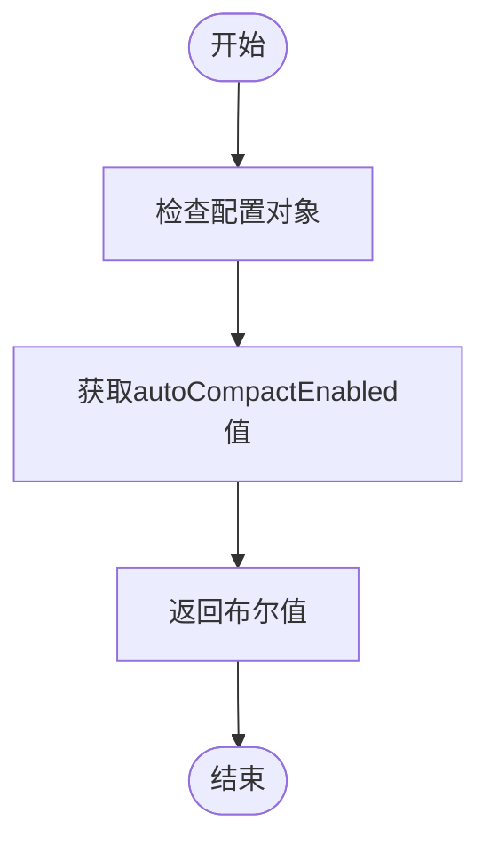
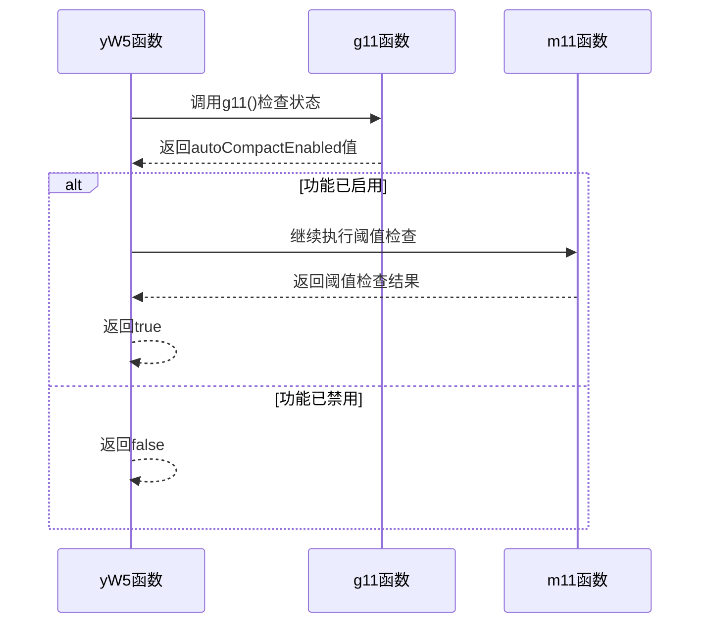
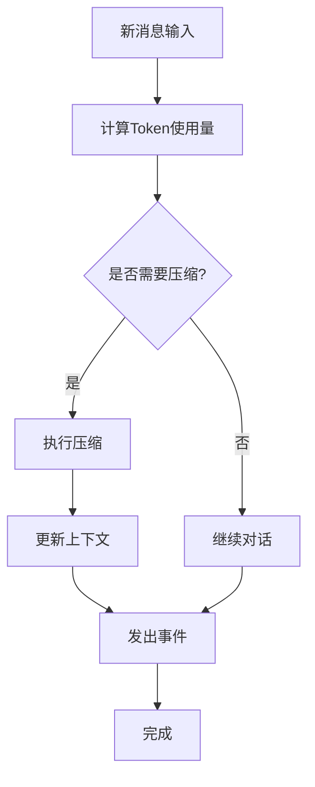

# 自动压缩控制

<cite>
**本文档引用的文件**  
- [WU2Compressor.js](file://context-claude-code/src/claude-core/WU2Compressor.js)
- [ClaudeContextManager.js](file://context-claude-code/src/claude-core/ClaudeContextManager.js)
- [ProgressiveWarningSystem.js](file://context-claude-code/src/claude-core/ProgressiveWarningSystem.js)
- [上下文工程管理实践-第3部分-压缩触发.md](file://context-claude-code/上下文工程管理实践-第3部分-压缩触发.md)
- [核心算法详解.md](file://context-claude-code/核心算法详解.md)
</cite>

## 目录
1. [引言](#引言)
2. [自动压缩控制机制](#自动压缩控制机制)
3. [配置检查与状态验证](#配置检查与状态验证)
4. [压缩触发流程集成](#压缩触发流程集成)
5. [参数配置与代码示例](#参数配置与代码示例)
6. [系统性能与用户控制平衡](#系统性能与用户控制平衡)
7. [最佳实践](#最佳实践)
8. [总结](#总结)

## 引言
本文档全面记录自动压缩功能的启用/禁用控制机制，重点分析`g11`函数的实现原理。文档详细说明如何通过配置检查自动压缩功能状态，阐述该控制机制如何与压缩触发流程集成，并在触发检查时首先验证功能状态。同时提供配置自动压缩参数的代码示例，展示如何通过修改配置来启用或禁用此功能，以及如何调整自动压缩阈值。最后，文档将阐述控制机制在系统性能优化和用户控制权之间的平衡作用，以及在不同使用场景下的最佳实践。

## 自动压缩控制机制

### g11函数实现原理
`g11`函数是自动压缩控制的核心，负责检查自动压缩功能是否启用。该函数通过读取配置对象中的`autoCompactEnabled`属性来确定功能状态。



**Diagram sources**  
- [WU2Compressor.js](file://context-claude-code/src/claude-core/WU2Compressor.js#L461-L463)

**Section sources**  
- [WU2Compressor.js](file://context-claude-code/src/claude-core/WU2Compressor.js#L461-L463)

### 控制机制设计原则
自动压缩控制机制的设计遵循以下原则：
- **用户优先**：默认启用自动压缩，但允许用户通过配置完全控制
- **性能优化**：在保证系统稳定性的前提下最大化上下文利用率
- **安全边际**：保留足够的缓冲空间应对突发情况
- **可配置性**：所有关键参数均可通过配置进行调整

## 配置检查与状态验证

### 配置结构分析
自动压缩功能的配置结构包含多个关键参数：

| 配置项 | 类型 | 默认值 | 说明 |
|--------|------|--------|------|
| autoCompactEnabled | boolean | true | 是否启用自动压缩 |
| autoCompactThreshold | number | 0.8 | 自动压缩触发阈值 |
| enableAutoCompact | boolean | true | 是否允许自动压缩 |
| minMessagesForCompression | number | 5 | 触发压缩所需的最小消息数 |

**Section sources**  
- [WU2Compressor.js](file://context-claude-code/src/claude-core/WU2Compressor.js#L35-L45)
- [ClaudeContextManager.js](file://context-claude-code/src/claude-core/ClaudeContextManager.js#L338-L345)

### 状态验证流程
状态验证流程确保在执行压缩前正确检查功能状态：



**Diagram sources**  
- [WU2Compressor.js](file://context-claude-code/src/claude-core/WU2Compressor.js#L99-L117)

**Section sources**  
- [WU2Compressor.js](file://context-claude-code/src/claude-core/WU2Compressor.js#L99-L117)

## 压缩触发流程集成

### 触发检查流程
压缩触发检查流程在系统中扮演关键角色，确保在适当时机执行压缩操作：



**Diagram sources**  
- [核心算法详解.md](file://context-claude-code/核心算法详解.md)

### 集成点分析
自动压缩控制机制与系统其他组件的集成点包括：

1. **消息添加时**：在`addMessage`方法中调用`checkCompressionNeeded`
2. **状态检查时**：在`assessWarningStatus`中集成压缩状态
3. **手动触发时**：通过`manualCompression`方法提供手动控制
4. **配置更新时**：通过`updateConfig`方法动态调整设置

**Section sources**  
- [ClaudeContextManager.js](file://context-claude-code/src/claude-core/ClaudeContextManager.js#L338-L345)

## 参数配置与代码示例

### 配置自动压缩参数
可以通过以下方式配置自动压缩参数：

```javascript
// 创建上下文管理器时配置
const contextManager = new ClaudeContextManager({
  enableAutoCompact: true,           // 启用自动压缩
  autoCompactThreshold: 0.8,         // 设置80%阈值
  minMessagesForCompression: 5       // 最小消息数
});

// 动态更新配置
contextManager.updateConfig({
  enableAutoCompact: false,          // 禁用自动压缩
  autoCompactThreshold: 0.9          // 提高阈值到90%
});
```

**Section sources**  
- [ClaudeContextManager.js](file://context-claude-code/src/claude-core/ClaudeContextManager.js#L525-L542)

### 启用/禁用功能示例
启用和禁用自动压缩功能的代码示例：

```javascript
// 启用自动压缩
contextManager.updateConfig({ enableAutoCompact: true });

// 禁用自动压缩
contextManager.updateConfig({ enableAutoCompact: false });

// 检查当前状态
const isAutoCompactEnabled = contextManager.getConfig().enableAutoCompact;
console.log(`自动压缩状态: ${isAutoCompactEnabled ? '启用' : '禁用'}`);
```

**Section sources**  
- [ClaudeContextManager.js](file://context-claude-code/src/claude-core/ClaudeContextManager.js#L525-L542)

### 调整阈值示例
调整自动压缩阈值的代码示例：

```javascript
// 设置不同的阈值策略
const strategies = {
  // 保守策略：较早压缩，保留更多空间
  conservative: 0.7,
  
  // 平衡策略：默认设置
  balanced: 0.8,
  
  // 激进策略：最大化上下文利用率
  aggressive: 0.9
};

// 应用平衡策略
contextManager.updateConfig({ 
  autoCompactThreshold: strategies.balanced 
});
```

**Section sources**  
- [ClaudeContextManager.js](file://context-claude-code/src/claude-core/ClaudeContextManager.js#L525-L542)

## 系统性能与用户控制平衡

### 性能优化考量
自动压缩控制机制在性能优化方面考虑了多个因素：

- **内存使用**：通过及时压缩避免内存溢出
- **响应速度**：在压缩时机和系统响应之间取得平衡
- **资源消耗**：避免频繁压缩带来的额外开销
- **用户体验**：确保对话流畅性不受影响

### 用户控制权设计
系统设计充分考虑用户控制权，提供多层次的控制选项：

1. **全局开关**：通过`enableAutoCompact`控制整体功能
2. **阈值调整**：允许用户根据需求调整触发阈值
3. **手动控制**：提供手动压缩选项
4. **状态监控**：实时显示压缩状态和建议

**Section sources**  
- [ProgressiveWarningSystem.js](file://context-claude-code/src/claude-core/ProgressiveWarningSystem.js#L468-L474)

## 最佳实践

### 不同使用场景下的配置建议

| 场景 | 建议配置 | 说明 |
|------|--------|------|
| 开发调试 | enableAutoCompact: false | 禁用自动压缩，便于调试 |
| 生产环境 | enableAutoCompact: true, threshold: 0.8 | 启用自动压缩，保持系统稳定 |
| 长对话 | enableAutoCompact: true, threshold: 0.7 | 更早触发压缩，避免内存问题 |
| 短对话 | enableAutoCompact: false | 避免不必要的压缩开销 |

### 监控与调优建议
- **定期检查**：监控压缩频率和效果
- **性能测试**：在不同配置下进行性能测试
- **用户反馈**：收集用户对压缩效果的反馈
- **动态调整**：根据实际使用情况调整配置

**Section sources**  
- [核心算法详解.md](file://context-claude-code/核心算法详解.md)

## 总结
自动压缩控制机制通过`g11`函数实现了对自动压缩功能的精细控制。该机制与压缩触发流程紧密集成，在触发检查时首先验证功能状态，确保系统行为符合用户预期。通过灵活的配置选项，用户可以完全控制自动压缩的启用/禁用状态和触发阈值，从而在系统性能优化和用户控制权之间取得平衡。在不同使用场景下，建议采用相应的配置策略，以达到最佳的使用效果。