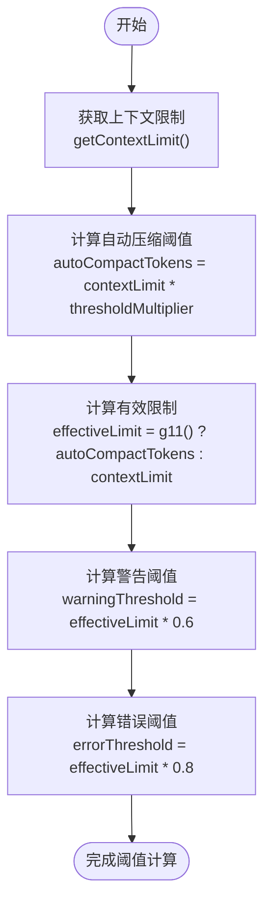
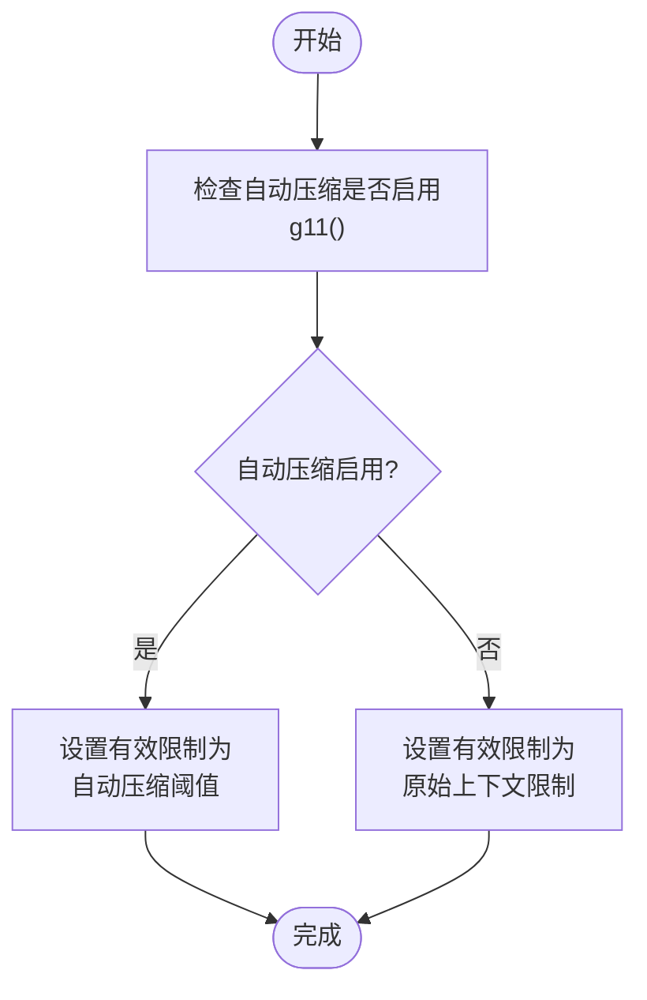
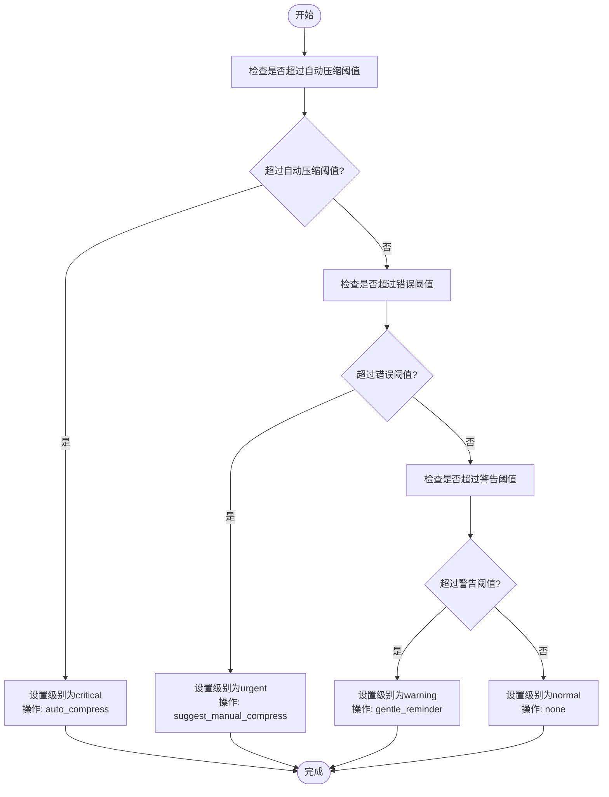
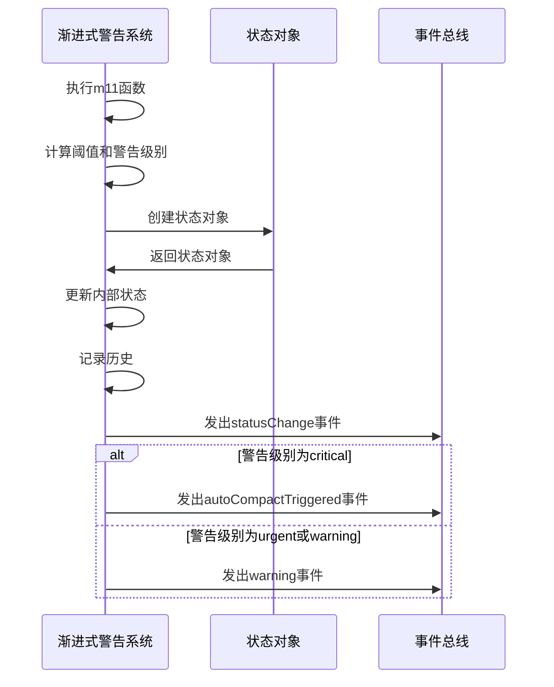
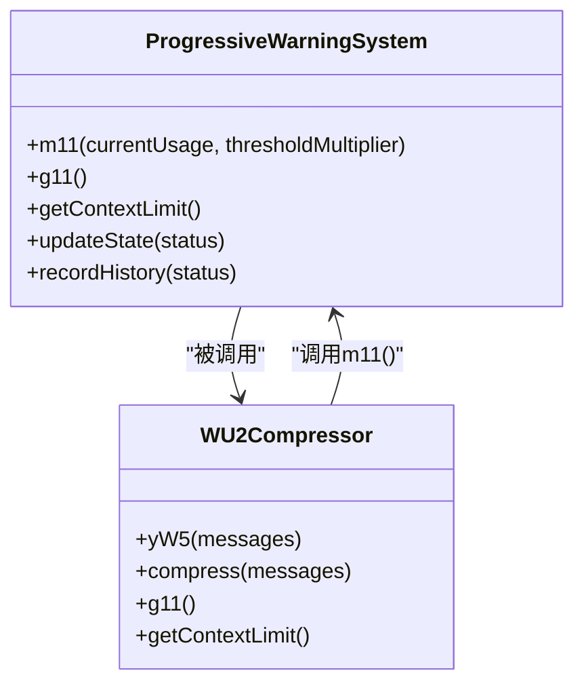

# 阈值判断逻辑

<cite>
**Referenced Files in This Document**   
- [ProgressiveWarningSystem.js](file://context-claude-code/src/claude-core/ProgressiveWarningSystem.js)
- [WU2Compressor.js](file://context-claude-code/src/claude-core/WU2Compressor.js)
</cite>

## 目录
1. [引言](#引言)
2. [核心阈值计算机制](#核心阈值计算机制)
3. [有效限制计算逻辑](#有效限制计算逻辑)
4. [警告级别判断流程](#警告级别判断流程)
5. [状态通知与事件机制](#状态通知与事件机制)
6. [代码调用示例](#代码调用示例)
7. [系统集成与依赖关系](#系统集成与依赖关系)

## 引言
渐进式警告系统（m11函数）是Claude Code核心架构中的关键组件，负责监控上下文使用情况并根据预设阈值触发相应的警告和操作。该系统实现了60%警告阈值、80%错误阈值和自动压缩阈值的三级判断机制，通过精确的计算和状态管理，确保系统在不同使用量场景下能够做出恰当的响应。本文档深入分析该系统的阈值判断机制，详细说明其计算逻辑、判断流程和事件通知机制。

## 核心阈值计算机制
渐进式警告系统的核心是m11函数，该函数基于上下文限制和配置的阈值倍数计算各种阈值。系统首先获取上下文限制（contextLimit），然后根据该限制计算自动压缩阈值（autoCompactTokens）、警告阈值（warningThreshold）和错误阈值（errorThreshold）。

**Diagram sources**
- [ProgressiveWarningSystem.js](file://context-claude-code/src/claude-core/ProgressiveWarningSystem.js#L64-L155)

**Section sources**
- [ProgressiveWarningSystem.js](file://context-claude-code/src/claude-core/ProgressiveWarningSystem.js#L64-L155)

## 有效限制计算逻辑
系统的有效限制（effectiveLimit）计算逻辑根据自动压缩功能的启用状态而有所不同。当自动压缩启用时（g11()返回true），有效限制等于自动压缩阈值；否则，有效限制等于原始上下文限制。这种设计允许系统在不同配置下灵活调整阈值判断基准。

**Diagram sources**
- [ProgressiveWarningSystem.js](file://context-claude-code/src/claude-core/ProgressiveWarningSystem.js#L64-L155)

**Section sources**
- [ProgressiveWarningSystem.js](file://context-claude-code/src/claude-core/ProgressiveWarningSystem.js#L64-L155)

## 警告级别判断流程
系统通过比较当前使用量与各阈值来确定警告级别。判断流程遵循严格的优先级顺序：首先检查是否超过自动压缩阈值（critical级别），然后检查是否超过错误阈值（urgent级别），最后检查是否超过警告阈值（warning级别）。每个级别都关联特定的操作建议，如自动压缩、建议手动压缩或温和提醒。

**Diagram sources**
- [ProgressiveWarningSystem.js](file://context-claude-code/src/claude-core/ProgressiveWarningSystem.js#L64-L155)

**Section sources**
- [ProgressiveWarningSystem.js](file://context-claude-code/src/claude-core/ProgressiveWarningSystem.js#L64-L155)

## 状态通知与事件机制
系统通过事件机制通知状态变化，确保各个组件能够及时响应上下文使用情况的变化。当m11函数执行完毕后，系统会发出'statusChange'事件，携带完整的状态对象。此外，还会根据警告级别发出特定事件，如'warning'、'urgent'、'critical'和'autoCompactTriggered'，允许监听器执行相应的处理逻辑。

**Diagram sources**
- [ProgressiveWarningSystem.js](file://context-claude-code/src/claude-core/ProgressiveWarningSystem.js#L64-L155)

**Section sources**
- [ProgressiveWarningSystem.js](file://context-claude-code/src/claude-core/ProgressiveWarningSystem.js#L64-L155)

## 代码调用示例
以下示例展示了在不同使用量场景下m11函数的调用和返回状态：

**Diagram sources**
- [ProgressiveWarningSystem.js](file://context-claude-code/src/claude-core/ProgressiveWarningSystem.js#L64-L155)

**Section sources**
- [ProgressiveWarningSystem.js](file://context-claude-code/src/claude-core/ProgressiveWarningSystem.js#L64-L155)

## 系统集成与依赖关系
渐进式警告系统与其他核心组件紧密集成，特别是与WU2Compressor压缩器的集成。WU2Compressor通过yW5函数调用m11函数来检查是否需要执行压缩操作，实现了上下文管理的自动化。这种集成确保了系统能够在达到阈值时自动触发压缩，维持上下文的健康状态。

**Diagram sources**
- [ProgressiveWarningSystem.js](file://context-claude-code/src/claude-core/ProgressiveWarningSystem.js#L64-L155)
- [WU2Compressor.js](file://context-claude-code/src/claude-core/WU2Compressor.js#L99-L117)

**Section sources**
- [ProgressiveWarningSystem.js](file://context-claude-code/src/claude-core/ProgressiveWarningSystem.js#L64-L155)
- [WU2Compressor.js](file://context-claude-code/src/claude-core/WU2Compressor.js#L99-L117)