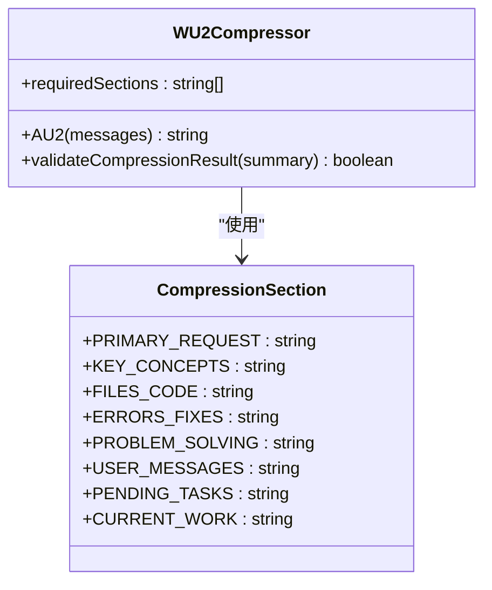
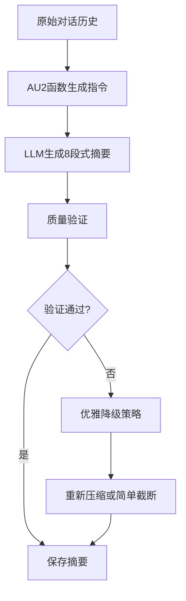
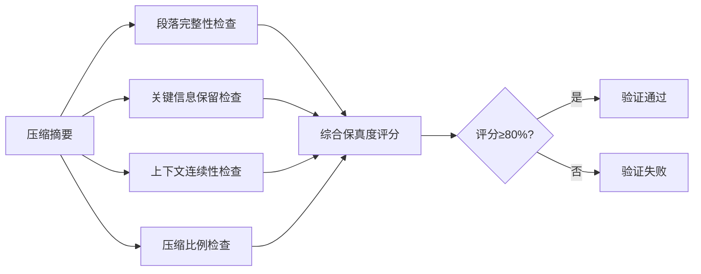
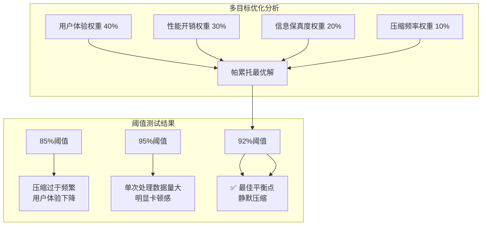
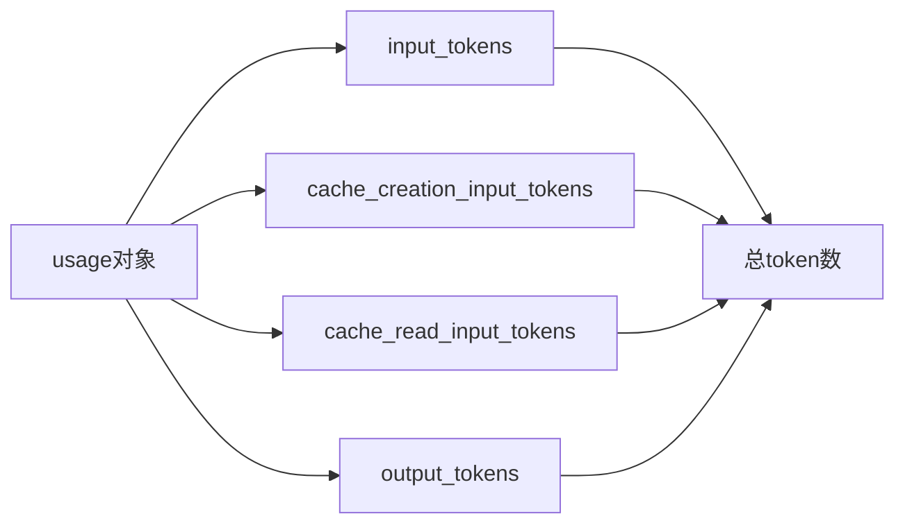
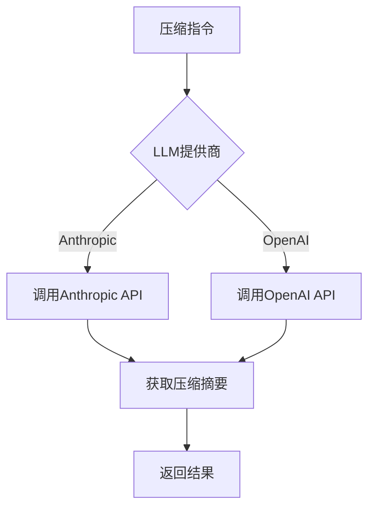
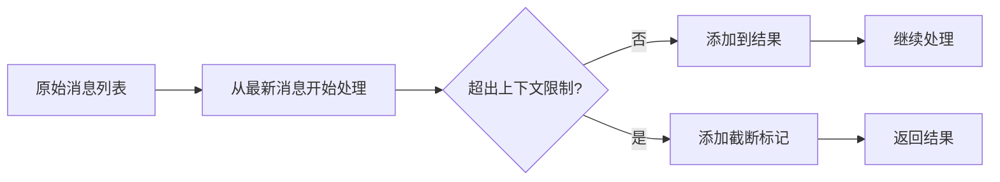

# 智能上下文压缩

<cite>
**本文档引用文件**   
- [WU2Compressor.js](file://context-claude-code/src/claude-core/WU2Compressor.js)
- [WU2Compressor.js](file://context-claude-code/src/compression/WU2Compressor.js)
- [ClaudeContextManager.js](file://context-claude-code/src/claude-core/ClaudeContextManager.js)
- [CLAUDE_CORE_IMPLEMENTATION.md](file://context-claude-code/CLAUDE_CORE_IMPLEMENTATION.md)
- [核心算法详解.md](file://context-claude-code/核心算法详解.md)
- [上下文工程管理实践-第3部分-压缩触发.md](file://context-claude-code/上下文工程管理实践-第3部分-压缩触发.md)
- [三层记忆架构详解.md](file://context-claude-code/三层记忆架构详解.md)
</cite>

## 目录
1. [引言](#引言)
2. [8段式结构化压缩指令](#8段式结构化压缩指令)
3. [压缩触发机制](#压缩触发机制)
4. [Token计算实现](#token计算实现)
5. [压缩执行流程](#压缩执行流程)
6. [上下文保护机制](#上下文保护机制)
7. [使用示例](#使用示例)
8. [总结](#总结)

## 引言
WU2Compressor是Claude Code系统中的核心上下文压缩组件，负责管理对话历史的智能压缩和信息提炼。该系统通过8段式结构化压缩指令、92%自动压缩阈值、反向遍历token计算等核心技术，实现了高效、智能的上下文管理。本文档将全面解析WU2Compressor的智能上下文压缩机制，详细阐述其各个核心组件的工作原理和实现细节。

**Section sources**
- [WU2Compressor.js](file://context-claude-code/src/claude-core/WU2Compressor.js#L1-L50)
- [CLAUDE_CORE_IMPLEMENTATION.md](file://context-claude-code/CLAUDE_CORE_IMPLEMENTATION.md#L1-L50)

## 8段式结构化压缩指令
WU2Compressor通过AU2函数生成8段式结构化压缩指令，确保关键信息的完整保留。这种结构化方法将对话历史提炼为八个核心部分，每个部分都专注于特定类型的信息，从而保证压缩后的摘要既全面又精确。

### 8段式结构定义
AU2函数生成的压缩指令要求LLM按照以下八个部分组织摘要内容：

1. **主要请求和意图**：用户的核心目标和需求
2. **关键技术概念**：对话中涉及的框架、算法、库等技术要点
3. **文件和代码片段**：所有被提及或修改过的代码和文件路径
4. **错误和修复**：记录遇到的错误信息和最终的解决方案
5. **问题解决过程**：解决问题的完整思路和决策路径
6. **所有用户消息**：保留用户的关键指令和反馈
7. **待处理任务**：未完成的工作项，形成待办清单
8. **当前工作状态**：明确记录当前对话中断时的进度



**Diagram sources**
- [WU2Compressor.js](file://context-claude-code/src/claude-core/WU2Compressor.js#L242-L275)
- [WU2Compressor.js](file://context-claude-code/src/compression/WU2Compressor.js#L20-L30)

### 指令生成机制
AU2函数不仅定义了8个核心部分，还提供了详细的压缩指南，确保生成的摘要质量。这些指南包括：

- **保持信息高密度和准确性**
- **突出关键的技术决策和解决方案**
- **确保上下文的连续性**
- **保留所有重要的文件路径和代码片段**

AU2函数通过分析消息内容，提取关键信息，并生成结构化摘要。这种结构化方法使得压缩后的摘要能够完整保留原始对话中的关键信息，同时大幅减少token使用量。



**Diagram sources**
- [WU2Compressor.js](file://context-claude-code/src/claude-core/WU2Compressor.js#L242-L275)
- [核心算法详解.md](file://context-claude-code/核心算法详解.md#L1-L50)

### 质量验证机制
为了确保压缩结果的质量，WU2Compressor实现了完整的质量验证机制。该机制通过四个维度检查压缩结果：

1. **段落完整性检查**：验证所有8个段落是否完整存在
2. **关键信息保留检查**：验证文件名、错误信息、用户命令和技术术语的保留情况
3. **上下文连续性检查**：验证摘要中是否包含上下文连续性指示词
4. **压缩比例合理性检查**：验证压缩比例是否在合理范围内



**Diagram sources**
- [WU2Compressor.js](file://context-claude-code/src/compression/WU2Compressor.js#L300-L400)

## 压缩触发机制
WU2Compressor的压缩触发机制基于92%的token使用阈值自动启动压缩流程。这一机制通过yW5函数实现，结合VE函数和m11函数，形成了一个完整的压缩触发系统。

### 92%阈值原理
92%的魔法阈值是基于大量A/B测试和多目标优化的科学阈值，在用户体验、性能开销和信息损失之间找到了最佳平衡点。这个阈值的设计考虑了以下因素：

- **用户体验权重**：40%
- **性能开销权重**：30%
- **信息保真度权重**：20%
- **压缩频率权重**：10%



**Diagram sources**
- [README.md](file://context-claude-code/README.md#L238-L292)

### yW5函数实现
yW5函数是压缩触发的核心，它通过以下步骤检查是否需要压缩：

1. **检查自动压缩是否启用**（g11函数）
2. **计算当前token使用量**（VE函数）
3. **检查是否超过自动压缩阈值**（m11函数）

```javascript
async yW5(messages) {
  // 检查自动压缩是否启用 (g11 函数)
  if (!this.g11()) {
    return false;
  }

  // 计算当前token使用量 (VE 函数)
  const currentTokens = this.VE(messages);

  // 检查是否超过自动压缩阈值 (m11 函数)
  const { isAboveAutoCompactThreshold } = this.m11(
    currentTokens,
    CLAUDE_CONSTANTS.AUTO_COMPACT_THRESHOLD
  );

  return isAboveAutoCompactThreshold;
}
```

**Section sources**
- [WU2Compressor.js](file://context-claude-code/src/claude-core/WU2Compressor.js#L99-L117)

### 渐进式警告系统
m11函数实现了渐进式警告系统，提供三级预警机制：

- **60% 警告阈值**（_W5）：蓝色提醒
- **80% 紧急阈值**（jW5）：黄色警告
- **92% 临界阈值**（h11）：红色自动压缩

```mermaid
gantt
title 记忆使用量预警时间线
dateFormat X
axisFormat %s
section 正常状态
正常运行 :0, 60
section 警告阶段 (60%)
内存使用较高 :60, 20
监控频率增加 :active, 70, 10
section 紧急阶段 (80%)
记忆空间紧张 :80, 15
建议手动整理 :active, 85, 10
预热压缩系统 :90, 5
section 临界阶段 (92%)
记忆空间已满 :95, 5
自动压缩触发 :active, 96, 4
压缩完成 :100, 10
```



**Diagram sources**
- [README.md](file://context-claude-code/README.md#L238-L292)

## Token计算实现
WU2Compressor通过VE函数和zY5函数实现了精确的token计算，确保压缩触发的准确性。

### VE函数：反向遍历优化
VE函数采用反向遍历算法，从最新消息开始查找token使用信息，实现了O(1)的访问效率。这种优化基于一个关键观察：AI的usage信息通常在最新的回复中。

```javascript
VE(messages) {
  let index = messages.length - 1;

  // 从最新消息开始反向遍历
  while (index >= 0) {
    const message = messages[index];
    const usage = this.HY5(message);

    if (usage) {
      // 找到有效usage，计算总token数 (zY5 函数)
      return this.zY5(usage);
    }

    index--;
  }

  // 没有找到有效usage，返回0
  return 0;
}
```

**Section sources**
- [WU2Compressor.js](file://context-claude-code/src/claude-core/WU2Compressor.js#L125-L143)

### HY5函数：智能过滤
HY5函数作为VE函数的辅助函数，实现了智能过滤的三重检查机制：

1. **角色检查**：只从助手消息中提取usage信息
2. **数据完整性检查**：确保usage对象存在
3. **消息类型检查**：排除合成和系统生成的消息

```javascript
HY5(message) {
  // 检查是否为助手消息
  if (message?.role !== 'assistant') {
    return null;
  }

  // 检查是否有usage信息
  if (!message.usage) {
    return null;
  }

  // 检查是否为合成消息（排除）
  if (message.model === '<synthetic>') {
    return null;
  }

  // 检查内容类型（排除特定文本类型）
  if (message.content?.[0]?.type === 'text' && this.isIgnoredText(message.content[0].text)) {
    return null;
  }

  return message.usage;
}
```

**Section sources**
- [WU2Compressor.js](file://context-claude-code/src/claude-core/WU2Compressor.js#L150-L170)

### zY5函数：精确计算
zY5函数实现了精确的token计算，包含了所有类型的token：

- **input_tokens**：输入tokens
- **cache_creation_input_tokens**：缓存创建tokens
- **cache_read_input_tokens**：缓存读取tokens
- **output_tokens**：输出tokens

```javascript
zY5(usage) {
  return (
    usage.input_tokens +
    (usage.cache_creation_input_tokens ?? 0) +
    (usage.cache_read_input_tokens ?? 0) +
    usage.output_tokens
  );
}
```



**Diagram sources**
- [WU2Compressor.js](file://context-claude-code/src/claude-core/WU2Compressor.js#L181-L188)

## 压缩执行流程
qH1函数协调整个压缩流程，包括LLM调用、结果验证和统计更新。

### 主要执行步骤
qH1函数的执行流程如下：

1. **生成8段式压缩指令**（AU2函数）
2. **调用LLM进行压缩**
3. **验证压缩结果**
4. **更新统计信息**

```javascript
async qH1(messages) {
  console.log('🔄 qH1: Executing compression...');

  // 生成8段式压缩指令 (AU2 函数)
  const compressionPrompt = this.AU2(messages);

  // 调用LLM进行压缩
  const summary = await this.callLLMForCompression(compressionPrompt);

  // 验证压缩结果
  if (!this.validateCompressionResult(summary)) {
    throw new Error('Compression validation failed');
  }

  return {
    compressed: true,
    summary,
    originalMessageCount: messages.length,
    inputTokens: this.VE(messages),
    outputTokens: this.estimateTokens(summary),
    compressionRatio: this.estimateTokens(summary) / this.VE(messages)
  };
}
```

**Section sources**
- [WU2Compressor.js](file://context-claude-code/src/claude-core/WU2Compressor.js#L233-L255)

### LLM调用机制
WU2Compressor支持多种LLM提供商，包括Anthropic和OpenAI。调用机制根据配置的提供商选择相应的API：



**Section sources**
- [WU2Compressor.js](file://context-claude-code/src/claude-core/WU2Compressor.js#L300-L400)

### 统计与监控
WU2Compressor维护详细的压缩统计信息，包括：

- **总压缩次数**
- **成功压缩次数**
- **失败压缩次数**
- **平均压缩比**
- **总输入tokens**
- **总输出tokens**

```javascript
updateStats(result) {
  this.stats.totalCompressions++;

  if (result.compressed) {
    this.stats.successfulCompressions++;
    this.stats.totalInputTokens += result.inputTokens;
    this.stats.totalOutputTokens += result.outputTokens;

    // 更新平均压缩比
    const totalRatio = this.stats.averageCompressionRatio * (this.stats.successfulCompressions - 1) + result.compressionRatio;
    this.stats.averageCompressionRatio = totalRatio / this.stats.successfulCompressions;
  }
}
```

**Section sources**
- [WU2Compressor.js](file://context-claude-code/src/claude-core/WU2Compressor.js#L600-L620)

## 上下文保护机制
WU2Compressor通过智能截断和截断标记确保最新内容的优先保留。

### 智能截断策略
formatMessagesForCompression函数实现了智能截断策略，从最新消息开始倒序处理，确保保留最新内容：

```javascript
formatMessagesForCompression(messages) {
  const maxTokens = this.getMaxContextTokens() - 3000; // 留出3K tokens安全边际
  let result = '';
  let currentTokens = 0;
  let truncatedCount = 0;

  // 从最新消息开始倒序处理，确保保留最新内容
  for (let i = messages.length - 1; i >= 0; i--) {
    const msg = messages[i];
    const formattedMsg = this.formatSingleMessage(msg);
    const msgTokens = this.estimateTokens(formattedMsg);

    // 检查是否超出上下文限制
    if (currentTokens + msgTokens > maxTokens) {
      truncatedCount = messages.length - i - 1;
      break;
    }

    result = formattedMsg + '\n\n' + result;
    currentTokens += msgTokens;
  }

  // 添加截断标记（如果有消息被截断）
  if (truncatedCount > 0) {
    result = `\n⚠️ [${truncatedCount} earlier messages truncated due to context window limit]\n\n` + result;
  }

  return result.trim();
}
```

**Section sources**
- [WU2Compressor.js](file://context-claude-code/src/claude-core/WU2Compressor.js#L500-L530)

### 截断标记
当消息被截断时，系统会添加截断标记，提醒用户部分内容已被省略：



**Section sources**
- [WU2Compressor.js](file://context-claude-code/src/claude-core/WU2Compressor.js#L520-L530)

## 使用示例
以下示例展示了如何配置压缩参数、调用压缩接口以及处理压缩结果。

### 基本使用
```javascript
import { WU2Compressor } from './src/claude-core/WU2Compressor.js';

// 创建压缩器实例
const compressor = new WU2Compressor({
  llmProvider: 'anthropic',
  apiKey: process.env.ANTHROPIC_API_KEY,
  model: 'claude-3-haiku-20240307',
  autoCompactEnabled: true,
  minMessagesForCompression: 5
});

// 准备消息列表
const messages = [
  { role: 'user', content: '帮我写一个React组件', timestamp: Date.now() },
  { role: 'assistant', content: '好的，需要什么功能？', timestamp: Date.now() },
  // ... 更多消息
];

// 执行压缩
try {
  const result = await compressor.compress(messages);
  if (result.compressed) {
    console.log('压缩成功:', result.summary);
    console.log('压缩比:', result.compressionRatio.toFixed(3));
  }
} catch (error) {
  console.error('压缩失败:', error);
}
```

**Section sources**
- [WU2Compressor.js](file://context-claude-code/src/claude-core/WU2Compressor.js#L50-L100)

### 配置选项
```javascript
const config = {
  // LLM API配置
  llmConfig: {
    provider: 'anthropic',
    apiKey: process.env.ANTHROPIC_API_KEY,
    model: 'claude-3-haiku-20240307',
    maxTokens: 4000,
    temperature: 0.3
  },

  // 压缩配置
  config: {
    autoCompactEnabled: true,
    minMessagesForCompression: 5,
    compressionModel: 'claude-3-haiku-20240307'
  }
};
```

**Section sources**
- [WU2Compressor.js](file://context-claude-code/src/claude-core/WU2Compressor.js#L10-L50)

### 获取统计信息
```javascript
// 获取压缩统计
const stats = compressor.getStats();
console.log('压缩统计:', stats);

// 重置统计
compressor.resetStats();
```

**Section sources**
- [WU2Compressor.js](file://context-claude-code/src/claude-core/WU2Compressor.js#L620-L640)

## 总结
WU2Compressor通过8段式结构化压缩指令、92%自动压缩阈值、反向遍历token计算等核心技术，实现了高效、智能的上下文管理。该系统不仅能够自动检测和触发压缩，还能确保关键信息的完整保留，为用户提供流畅、高效的对话体验。

**Section sources**
- [WU2Compressor.js](file://context-claude-code/src/claude-core/WU2Compressor.js#L1-L50)
- [CLAUDE_CORE_IMPLEMENTATION.md](file://context-claude-code/CLAUDE_CORE_IMPLEMENTATION.md#L1-L50)