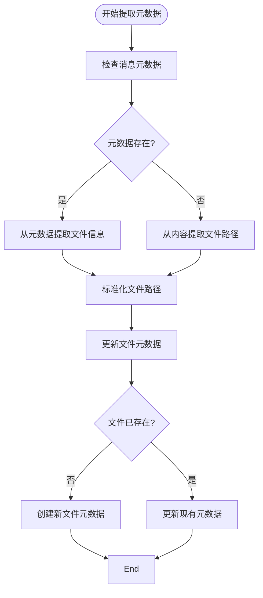
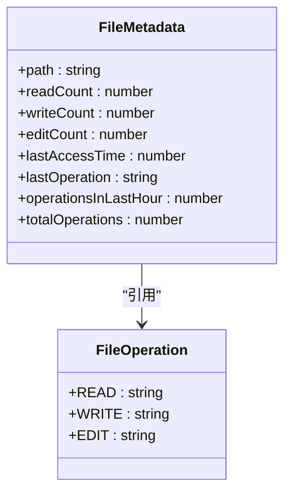
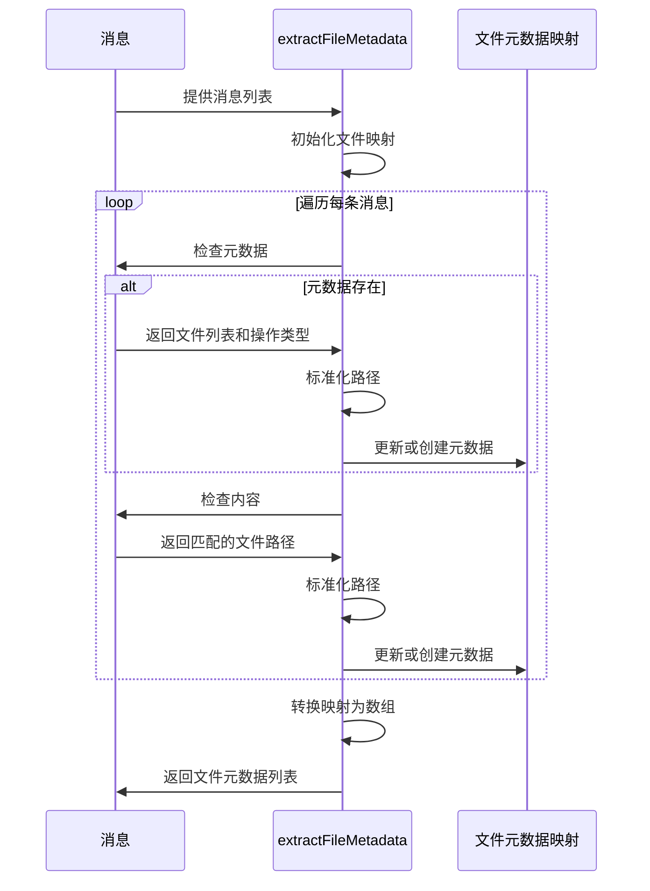

# 文件元数据提取

<cite>
**Referenced Files in This Document**   
- [IntelligentFileRestorer.js](file://context-claude-code/src/restoration/IntelligentFileRestorer.js)
- [index.js](file://context-claude-code/src/types/index.js)
</cite>

## 目录
1. [引言](#引言)
2. [核心功能概述](#核心功能概述)
3. [文件元数据提取机制](#文件元数据提取机制)
4. [文件操作记录识别与统计](#文件操作记录识别与统计)
5. [文件路径识别与标准化](#文件路径识别与标准化)
6. [元数据收集与更新逻辑](#元数据收集与更新逻辑)
7. [文件元数据对象构建](#文件元数据对象构建)
8. [异常处理机制](#异常处理机制)
9. [总结](#总结)

## 引言

在智能文件恢复系统中，`extractFileMetadata`函数扮演着至关重要的角色。该函数负责从消息的元数据字段中提取关键的文件操作记录，为后续的文件恢复决策提供基础数据支持。通过分析消息中的文件访问模式、操作频率和时间特征，系统能够智能地判断哪些文件对当前上下文最为重要，从而在资源受限的情况下优先恢复这些关键文件。

本文档将深入剖析`extractFileMetadata`函数的实现机制，详细解释其如何从复杂的消息流中提取、识别和处理文件元数据，以及如何构建统一的文件元数据对象，为智能文件恢复系统提供可靠的数据基础。

## 核心功能概述

`extractFileMetadata`函数是`IntelligentFileRestorer`类中的核心方法之一，其主要职责是从一系列消息中提取文件操作的元数据信息。该函数通过双重机制来识别文件操作：首先从消息的`metadata`字段中直接提取已记录的文件操作，然后通过正则表达式从消息内容中识别潜在的文件路径引用。

该函数的输入是一组消息对象，每个消息包含角色、内容、时间戳和元数据等信息。输出则是一个包含所有识别到的文件元数据的数组，每个文件元数据对象包含了路径、访问时间、操作计数等关键信息。这些信息随后被用于计算文件的重要性评分，指导文件恢复的优先级决策。

**Section sources**
- [IntelligentFileRestorer.js](file://context-claude-code/src/restoration/IntelligentFileRestorer.js#L95-L174)

## 文件元数据提取机制

`extractFileMetadata`函数采用Map数据结构来高效地管理和去重文件元数据。函数遍历每条消息，首先检查消息的`metadata`字段是否存在，并从中提取文件操作信息。如果`metadata`包含`files`数组，则说明该消息明确记录了文件操作。



**Diagram sources**
- [IntelligentFileRestorer.js](file://context-claude-code/src/restoration/IntelligentFileRestorer.js#L95-L174)

**Section sources**
- [IntelligentFileRestorer.js](file://context-claude-code/src/restoration/IntelligentFileRestorer.js#L95-L174)

## 文件操作记录识别与统计

函数通过分析消息元数据中的`operation`字段来识别文件操作类型，支持三种基本操作：读取（read）、写入（write）和编辑（edit）。这些操作类型定义在`FileOperation`枚举中，确保了操作类型的统一和可维护性。

对于每种操作类型，函数都会维护相应的计数器：
- `readCount`：记录文件被读取的次数
- `writeCount`：记录文件被写入的次数
- `editCount`：记录文件被编辑的次数



**Diagram sources**
- [IntelligentFileRestorer.js](file://context-claude-code/src/restoration/IntelligentFileRestorer.js#L95-L174)
- [index.js](file://context-claude-code/src/types/index.js#L40-L44)

**Section sources**
- [IntelligentFileRestorer.js](file://context-claude-code/src/restoration/IntelligentFileRestorer.js#L95-L174)
- [index.js](file://context-claude-code/src/types/index.js#L40-L44)

## 文件路径识别与标准化

除了从元数据中提取文件信息外，`extractFileMetadata`函数还通过正则表达式从消息内容中识别潜在的文件路径引用。这一机制能够捕捉到用户在对话中提及的文件，即使这些文件没有被明确记录在元数据中。

使用的正则表达式模式为：
```
["']?([^\s"'`]+\.(js|ts|jsx|tsx|py|java|cpp|c|go|rs|json|yaml|yml|md|html|css|vue|jsx|tsx))["']?
```

该模式能够匹配常见的编程语言、配置文件和文档文件的扩展名。匹配到的文件路径会经过`path.normalize()`函数进行标准化处理，确保不同操作系统下的路径分隔符被统一处理，避免因路径格式差异导致的重复记录。

**Section sources**
- [IntelligentFileRestorer.js](file://context-claude-code/src/restoration/IntelligentFileRestorer.js#L95-L174)

## 元数据收集与更新逻辑

函数维护了多个维度的元数据来全面描述文件的访问特征：

1. **时间相关元数据**：
   - `lastAccessTime`：记录文件最后一次被访问的时间戳
   - `operationsInLastHour`：统计最近一小时内对该文件的操作次数

2. **频率相关元数据**：
   - `totalOperations`：记录文件的总操作次数
   - 各类操作的独立计数器

3. **操作类型元数据**：
   - `lastOperation`：记录最后一次对文件执行的操作类型

这些元数据的更新遵循特定的逻辑规则。例如，`lastAccessTime`总是取最大值，确保记录的是最新的访问时间；`operationsInLastHour`仅在当前时间戳位于最近一小时范围内时才递增。



**Diagram sources**
- [IntelligentFileRestorer.js](file://context-claude-code/src/restoration/IntelligentFileRestorer.js#L95-L174)

**Section sources**
- [IntelligentFileRestorer.js](file://context-claude-code/src/restoration/IntelligentFileRestorer.js#L95-L174)

## 文件元数据对象构建

函数最终构建的文件元数据对象是一个结构化的JavaScript对象，包含了所有收集到的信息。每个文件元数据对象具有以下属性：

```json
{
  "path": "string",
  "readCount": 0,
  "writeCount": 0,
  "editCount": 0,
  "lastAccessTime": 0,
  "lastOperation": "string",
  "operationsInLastHour": 0,
  "totalOperations": 0
}
```

这些对象被存储在Map数据结构中，以标准化后的文件路径作为键，确保了文件的唯一性。最后，函数通过`Array.from(fileMap.values())`将Map转换为数组，便于后续处理。

**Section sources**
- [IntelligentFileRestorer.js](file://context-claude-code/src/restoration/IntelligentFileRestorer.js#L95-L174)

## 异常处理机制

`extractFileMetadata`函数在设计上具有良好的健壮性，能够处理各种异常情况：

1. **元数据缺失处理**：当消息的`metadata`字段不存在或不包含`files`数组时，函数会优雅地跳过该部分的处理，转而检查消息内容。

2. **操作类型默认值**：当`metadata.operation`字段缺失时，函数默认使用'read'作为操作类型，确保了数据的完整性。

3. **时间边界处理**：在计算最近一小时内的操作次数时，函数会正确处理时间边界，避免因时区或系统时间差异导致的问题。

4. **路径标准化**：通过`path.normalize()`函数处理不同操作系统下的路径格式差异，确保了跨平台的兼容性。

这些异常处理机制确保了函数在面对不完整或格式不规范的数据时仍能正常工作，提高了系统的整体稳定性和可靠性。

**Section sources**
- [IntelligentFileRestorer.js](file://context-claude-code/src/restoration/IntelligentFileRestorer.js#L95-L174)

## 总结

`extractFileMetadata`函数通过双重机制（元数据提取和内容分析）全面收集文件操作信息，构建了丰富的文件元数据对象。这些元数据不仅包括基本的文件路径和操作类型，还涵盖了时间、频率等多个维度的访问特征，为后续的文件重要性评分和恢复决策提供了坚实的数据基础。

该函数的设计体现了高内聚、低耦合的原则，专注于元数据提取这一单一职责，与其他组件（如评分系统、文件加载器）通过清晰的接口进行交互。其健壮的异常处理机制和高效的Map数据结构使用，确保了在各种场景下的性能和可靠性。