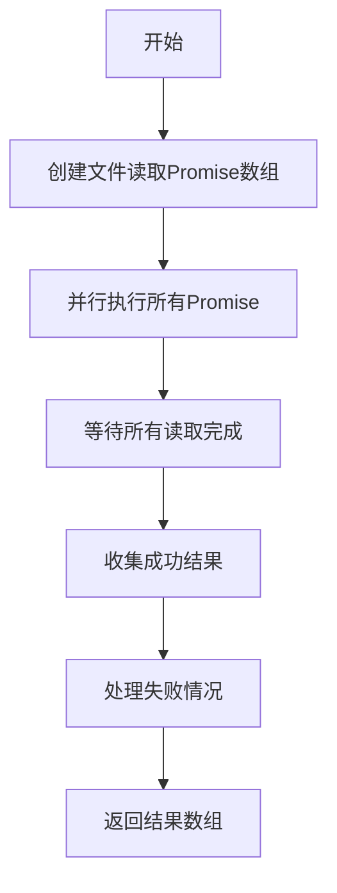
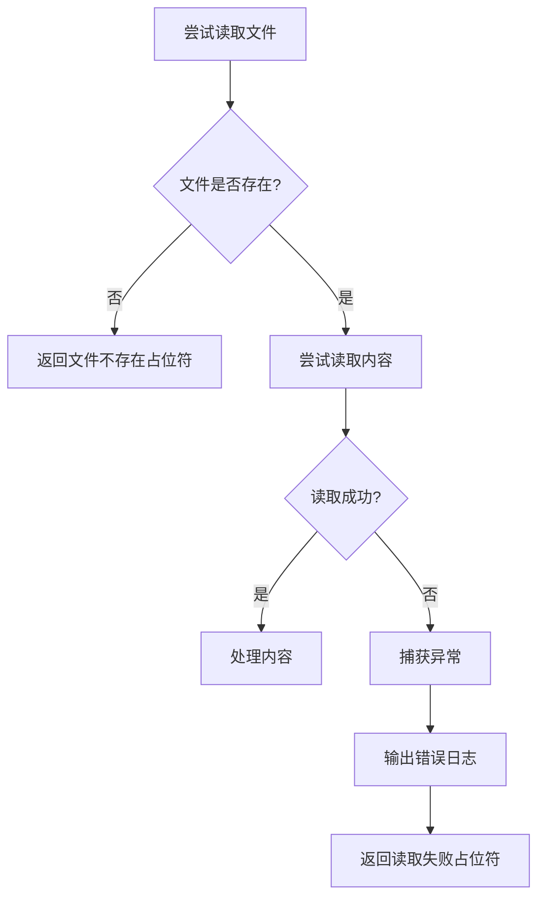
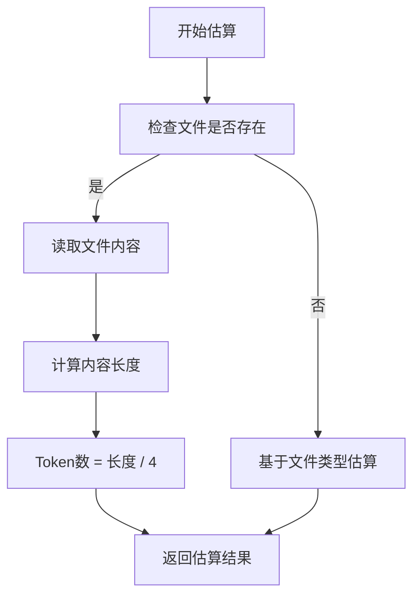
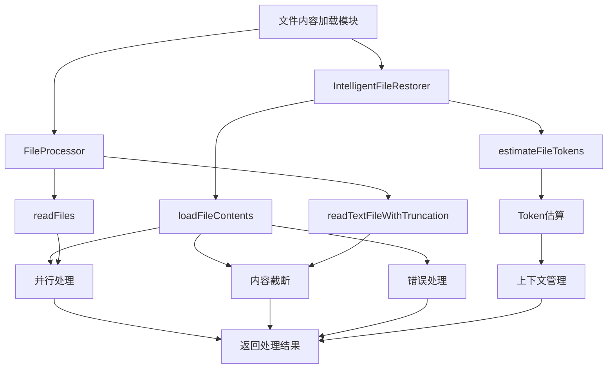

# 文件内容加载

<cite>
**Referenced Files in This Document**   
- [IntelligentFileRestorer.js](file://context-claude-code/src/restoration/IntelligentFileRestorer.js)
- [FileProcessor.js](file://context-claude-code/src/claude-core/FileProcessor.js)
- [Claude_Code_Large_File_Handling_Complete_Guide.md](file://context-claude-code/Claude_Code_Large_File_Handling_Complete_Guide.md)
</cite>

## 目录
1. [简介](#简介)
2. [核心实现](#核心实现)
3. [并行处理机制](#并行处理机制)
4. [内容截断策略](#内容截断策略)
5. [错误处理机制](#错误处理机制)
6. [Token估算与上下文管理](#token估算与上下文管理)
7. [架构关系图](#架构关系图)

## 简介

文件内容加载模块是系统中负责读取和处理文件的核心组件。该模块实现了智能的文件加载机制，能够并行处理多个文件，对超长文件进行智能截断，并妥善处理各种异常情况。模块通过精确的Token估算确保加载结果符合上下文大小约束，为后续的AI处理提供可靠的数据支持。

## 核心实现

文件内容加载功能主要由`IntelligentFileRestorer`类的`loadFileContents`方法实现。该方法接收一个选中的文件列表作为输入，逐个处理每个文件，读取其内容并根据配置进行相应的处理。

**Section sources**
- [IntelligentFileRestorer.js](file://context-claude-code/src/restoration/IntelligentFileRestorer.js#L472-L522)

## 并行处理机制

虽然`loadFileContents`方法本身采用同步循环处理文件，但系统提供了`readFiles`方法来实现真正的并行处理。`readFiles`方法使用`Promise.all`和`map`函数创建多个读取文件的Promise，并同时执行它们，从而实现并行读取多个文件。



**Diagram sources**
- [FileProcessor.js](file://context-claude-code/src/claude-core/FileProcessor.js#L363-L405)

**Section sources**
- [FileProcessor.js](file://context-claude-code/src/claude-core/FileProcessor.js#L363-L405)

## 内容截断策略

当文件实际长度超过单文件Token限制时，系统会按字符数进行截断。具体实现中，使用`maxTokensPerFile * 4`作为字符数限制（基于4字符约等于1个Token的估算），并添加`[content truncated]`标记以提示内容已被截断。

```mermaid
flowchart TD
A[检查文件是否存在] --> B{文件内容长度 > maxTokensPerFile * 4?}
B --> |是| C[截取前maxTokensPerFile * 4个字符]
C --> D[添加"[content truncated]"标记]
D --> E[返回截断后内容]
B --> |否| F[返回完整内容]
F --> E
```

**Diagram sources**
- [IntelligentFileRestorer.js](file://context-claude-code/src/restoration/IntelligentFileRestorer.js#L479-L485)

**Section sources**
- [IntelligentFileRestorer.js](file://context-claude-code/src/restoration/IntelligentFileRestorer.js#L479-L485)

## 错误处理机制

系统对文件不存在或读取失败等异常情况有完善的错误处理策略。当文件不存在时，返回包含`[File does not exist: ${file.path}]`的占位符内容；当读取失败时，捕获异常并返回包含`[Failed to read file: ${error.message}]`的占位符内容，同时输出错误日志。



**Diagram sources**
- [IntelligentFileRestorer.js](file://context-claude-code/src/restoration/IntelligentFileRestorer.js#L486-L522)

**Section sources**
- [IntelligentFileRestorer.js](file://context-claude-code/src/restoration/IntelligentFileRestorer.js#L486-L522)

## Token估算与上下文管理

加载过程中使用Token估算来确保结果符合上下文大小约束。系统通过`estimateFileTokens`方法估算文件Token数量，该方法基于"4字符≈1个Token"的简化规则进行估算。Token估算主要用于在加载前判断文件是否需要截断，以及在恢复文件时进行智能选择。



**Diagram sources**
- [IntelligentFileRestorer.js](file://context-claude-code/src/restoration/IntelligentFileRestorer.js#L426-L469)

**Section sources**
- [IntelligentFileRestorer.js](file://context-claude-code/src/restoration/IntelligentFileRestorer.js#L426-L469)

## 架构关系图



**Diagram sources**
- [IntelligentFileRestorer.js](file://context-claude-code/src/restoration/IntelligentFileRestorer.js)
- [FileProcessor.js](file://context-claude-code/src/claude-core/FileProcessor.js)