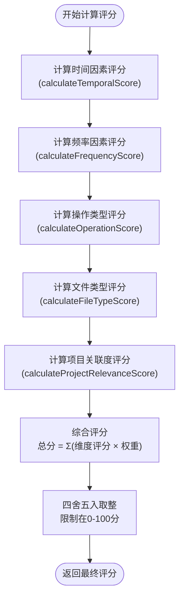
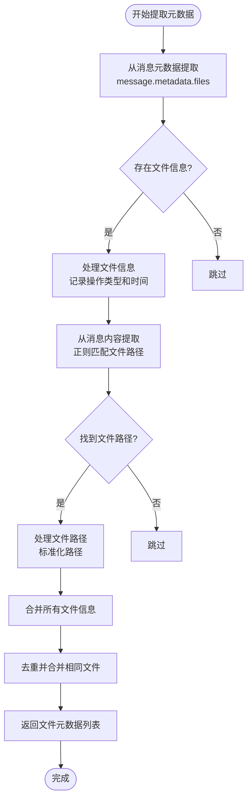
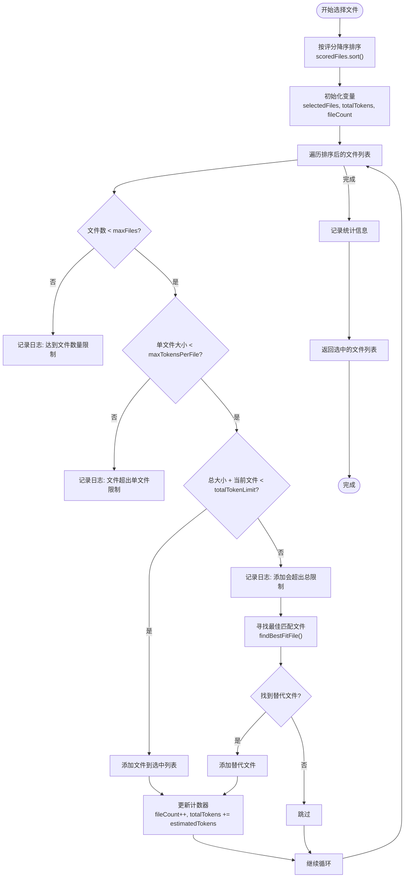
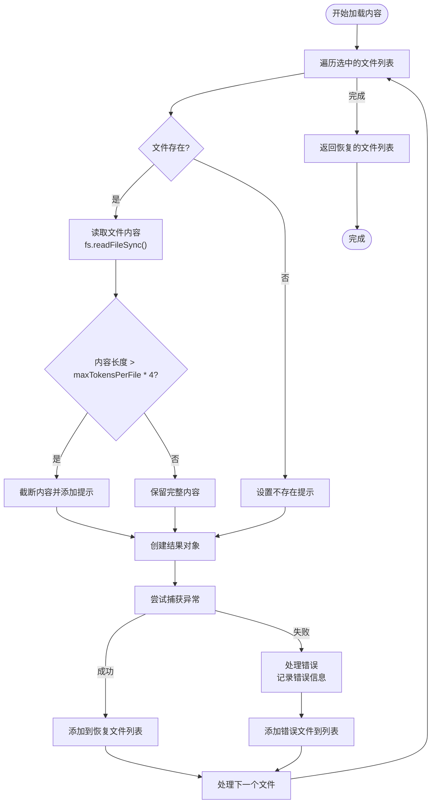

# 智能文件恢复

<cite>
**Referenced Files in This Document**   
- [IntelligentFileRestorer.js](file://context-claude-code/src/restoration/IntelligentFileRestorer.js)
- [index.js](file://context-claude-code/src/types/index.js)
- [TW5文件恢复的详细实现流程.md](file://context-claude-code/TW5文件恢复的详细实现流程.md)
- [demo.js](file://context-claude-code/examples/demo.js)
</cite>

## 目录
1. [智能文件恢复系统概述](#智能文件恢复系统概述)
2. [核心评分算法](#核心评分算法)
3. [文件元数据提取](#文件元数据提取)
4. [智能文件选择算法](#智能文件选择算法)
5. [文件内容加载](#文件内容加载)
6. [实际使用场景](#实际使用场景)

## 智能文件恢复系统概述

智能文件恢复系统（IntelligentFileRestorer）是TW5函数的核心实现，负责在上下文压缩后智能恢复重要文件内容。该系统通过五维评分算法综合评估文件的重要性，并在多重约束下选择最优文件组合进行恢复。

**Section sources**
- [IntelligentFileRestorer.js](file://context-claude-code/src/restoration/IntelligentFileRestorer.js#L13-L644)

## 核心评分算法

智能文件恢复系统采用五维评分算法来计算文件重要性评分，各维度权重分配如下：
- 时间因素：35%
- 操作频率：25%
- 操作类型：20%
- 文件类型：15%
- 项目关联度：5%

### 评分算法实现



**Diagram sources **
- [IntelligentFileRestorer.js](file://context-claude-code/src/restoration/IntelligentFileRestorer.js#L280-L380)

#### 时间因素评分

时间因素评分基于文件的最后访问时间，采用指数衰减模型：
- 1小时内访问：100分
- 6小时内访问：90分
- 24小时内访问：75分
- 24小时后：75 × e^(-0.1 × (小时数 - 24))，最低10分

#### 频率因素评分

频率因素评分综合考虑总操作次数和最近一小时操作频率：
- 基于总操作次数的评分：最高80分（操作数 × 5）
- 最近一小时操作加成：最高20分（最近一小时操作数 × 10）

#### 操作类型评分

操作类型评分根据操作类型和权重计算：
- 写操作：15分/次
- 编辑操作：10分/次
- 读操作：3分/次
- 最后一次操作为写操作：额外+25分
- 最后一次操作为编辑操作：额外+15分

#### 文件类型评分

文件类型评分根据文件扩展名确定优先级：
- 代码文件（.js, .ts, .py等）：70-100分
- 配置文件（.json, .yaml等）：50-70分
- 文档文件（.md, .txt等）：20-40分

#### 项目关联度评分

项目关联度评分基于文件路径和名称：
- 在/src/目录下：+30分
- 在/components/或/modules/目录下：+20分
- 为关键文件（package.json, README.md等）：+25分

**Section sources**
- [IntelligentFileRestorer.js](file://context-claude-code/src/restoration/IntelligentFileRestorer.js#L280-L380)

## 文件元数据提取

`extractFileMetadata`方法负责从消息中提取文件操作元数据，通过两个主要来源收集信息：



**Diagram sources **
- [IntelligentFileRestorer.js](file://context-claude-code/src/restoration/IntelligentFileRestorer.js#L176-L278)

### 提取来源

1. **消息元数据**：从`message.metadata.files`数组中提取文件路径，同时记录操作类型（读/写/编辑）和时间戳。
2. **消息内容**：使用正则表达式`/["']?([^\s"'`]+\.(js|ts|py|json|md|html|css|vue|jsx|tsx))["']?/g`从消息内容中匹配文件路径。

### 元数据结构

提取的文件元数据包含以下属性：
- `path`: 标准化后的文件路径
- `readCount`: 读取操作次数
- `writeCount`: 写入操作次数
- `editCount`: 编辑操作次数
- `lastAccessTime`: 最后访问时间戳
- `lastOperation`: 最后一次操作类型
- `operationsInLastHour`: 最近一小时内操作次数
- `totalOperations`: 总操作次数

**Section sources**
- [IntelligentFileRestorer.js](file://context-claude-code/src/restoration/IntelligentFileRestorer.js#L176-L278)
- [index.js](file://context-claude-code/src/types/index.js#L40-L44)

## 智能文件选择算法

`selectOptimalFileSet`方法在多重约束下选择最优文件组合，采用贪心算法结合背包问题优化策略。



**Diagram sources **
- [IntelligentFileRestorer.js](file://context-claude-code/src/restoration/IntelligentFileRestorer.js#L396-L445)

### 三重约束条件

1. **文件数量约束**（qW5）：最多恢复20个文件
2. **单文件Token约束**（LW5）：每个文件不超过8192个Token
3. **总Token约束**（MW5）：所有恢复文件总Token数不超过32768

### 背包问题优化

当添加当前文件会超出总Token限制时，系统会调用`findBestFitFile`方法寻找最佳匹配文件：
- 在剩余文件中寻找满足Token限制的最高分文件
- 采用贪心策略，选择在剩余Token额度内评分最高的文件

**Section sources**
- [IntelligentFileRestorer.js](file://context-claude-code/src/restoration/IntelligentFileRestorer.js#L396-L445)

## 文件内容加载

`loadFileContents`方法负责加载选中文件的实际内容，包含内容截断和错误处理机制。



**Diagram sources **
- [IntelligentFileRestorer.js](file://context-claude-code/src/restoration/IntelligentFileRestorer.js#L472-L522)

### 实现细节

1. **内容截断**：当文件内容超过单文件Token限制时，保留前80%的内容，并在中间添加`...[content truncated]`提示。
2. **错误处理**：使用try-catch捕获文件读取异常，对于读取失败的文件，记录错误信息并添加到结果列表中。
3. **文件不存在处理**：检查文件是否存在，对于不存在的文件，添加`[File does not exist: ${file.path}]`提示。

**Section sources**
- [IntelligentFileRestorer.js](file://context-claude-code/src/restoration/IntelligentFileRestorer.js#L472-L522)

## 实际使用场景

### 配置恢复参数

可以通过构造函数配置智能文件恢复系统的参数：

```javascript
const restorer = new IntelligentFileRestorer({
  maxFiles: 15,           // 最大恢复文件数
  maxTokensPerFile: 4096, // 单文件最大Token数
  totalTokenLimit: 16384  // 总Token限制
});
```

### 调用恢复接口

调用`restoreFiles`方法进行文件恢复：

```javascript
// 从压缩前的消息列表中恢复文件
const restoredFiles = await restorer.restoreFiles(messages);

// 获取恢复统计信息
const stats = restorer.getStats();
console.log(`成功恢复 ${stats.successfulRestorations} 次，平均每次 ${stats.averageTokensPerFile} 个Token`);
```

### 获取恢复结果

恢复结果包含详细的文件信息：

```javascript
// 恢复的文件结构
{
  path: '/path/to/file.js',
  content: '文件内容...',
  score: 95, // 重要性评分
  tokens: 1200, // 实际Token数
  metadata: {
    readCount: 3,
    writeCount: 1,
    editCount: 2,
    lastAccessTime: 1698425234567,
    lastOperation: 'edit'
  }
}
```

### 统计信息

系统提供详细的统计信息：

```javascript
// 获取统计信息
const stats = restorer.getStats();
console.log(`总恢复次数: ${stats.totalRestorations}`);
console.log(`成功恢复次数: ${stats.successfulRestorations}`);
console.log(`失败恢复次数: ${stats.failedRestorations}`);
console.log(`缓存文件数: ${stats.cachedFiles}`);
console.log(`当前总Token数: ${stats.currentTotalTokens}`);
```

**Section sources**
- [demo.js](file://context-claude-code/examples/demo.js#L1-L273)
- [IntelligentFileRestorer.js](file://context-claude-code/src/restoration/IntelligentFileRestorer.js#L89-L644)