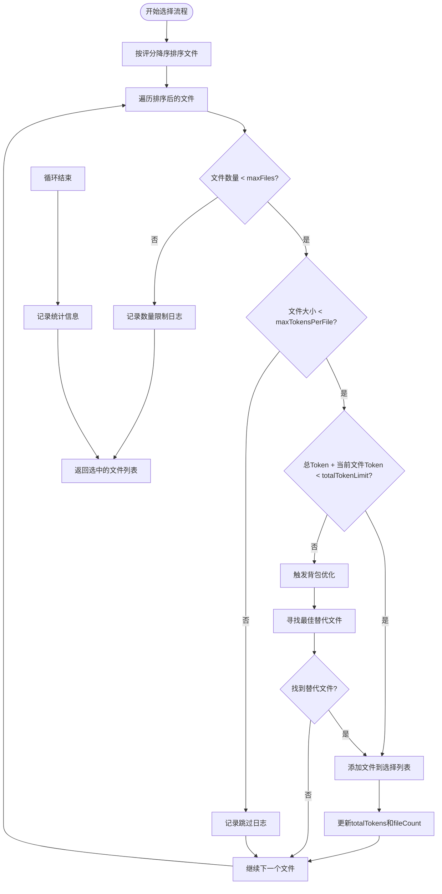
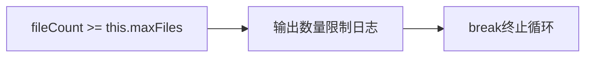
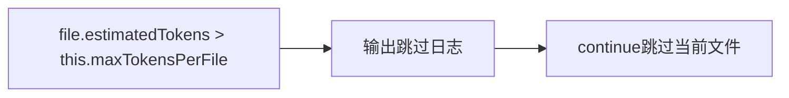
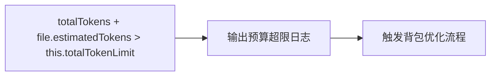
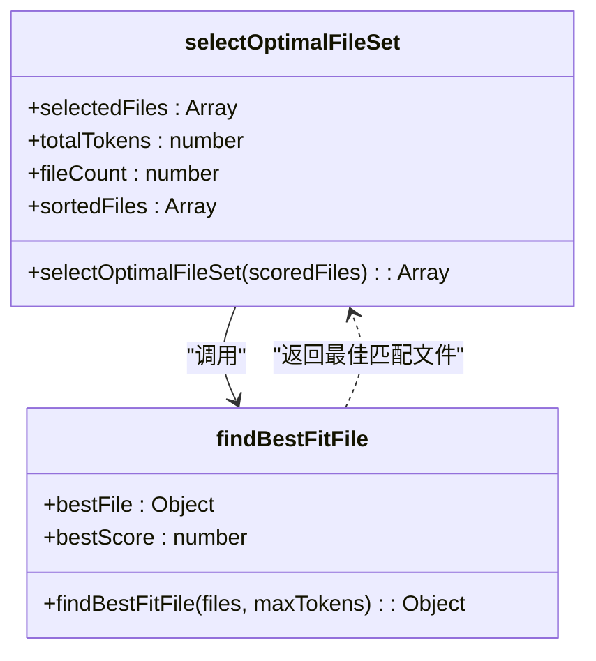
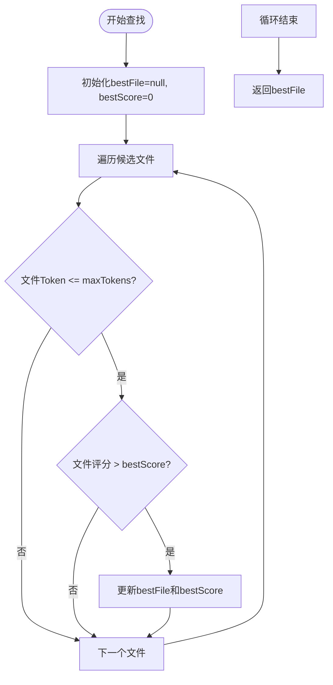

# 主选择逻辑

<cite>
**Referenced Files in This Document**   
- [IntelligentFileRestorer.js](file://context-claude-code/src/restoration/IntelligentFileRestorer.js)
</cite>

## Table of Contents
1. [主选择逻辑概述](#主选择逻辑概述)
2. [核心选择流程](#核心选择流程)
3. [约束条件处理](#约束条件处理)
4. [背包优化机制](#背包优化机制)
5. [执行路径分析](#执行路径分析)
6. [日志输出说明](#日志输出说明)

## 主选择逻辑概述

`selectOptimalFileSet` 方法是智能文件恢复系统中的核心选择算法，负责在多重约束条件下选择最优的文件组合。该方法实现了基于评分的贪心算法，并结合背包问题优化策略，在文件数量、单文件大小和总Token预算等限制下，最大化恢复文件的重要性和价值。

**Section sources**
- [IntelligentFileRestorer.js](file://context-claude-code/src/restoration/IntelligentFileRestorer.js#L385-L427)

## 核心选择流程

主选择逻辑的执行流程始于对评分后文件列表的降序排序，确保高分文件优先被考虑。算法通过迭代处理排序后的文件列表，逐个评估每个文件是否满足各项约束条件。

选择流程的核心是三个关键变量的维护：`selectedFiles`（已选文件列表）、`totalTokens`（已选文件总Token数）和`fileCount`（已选文件数量）。这些变量在迭代过程中动态更新，确保选择过程始终符合约束条件。



**Diagram sources**
- [IntelligentFileRestorer.js](file://context-claude-code/src/restoration/IntelligentFileRestorer.js#L385-L427)

**Section sources**
- [IntelligentFileRestorer.js](file://context-claude-code/src/restoration/IntelligentFileRestorer.js#L385-L445)

## 约束条件处理

主选择逻辑实现了三层约束条件的精细化处理，确保选择的文件组合既满足系统限制，又最大化恢复价值。

### 最大文件数量约束

当已选文件数量达到配置的`maxFiles`限制时，算法会立即终止选择过程，实现提前终止机制。这一机制通过简单的计数比较实现，避免了不必要的后续评估。



**Diagram sources**
- [IntelligentFileRestorer.js](file://context-claude-code/src/restoration/IntelligentFileRestorer.js#L396-L400)

### 单文件Token上限约束

对于单个文件的Token大小超过`maxTokensPerFile`限制的情况，算法采用跳过处理策略。这种处理方式确保了单个大文件不会影响整体选择流程，同时通过日志记录为开发者提供调试信息。



**Diagram sources**
- [IntelligentFileRestorer.js](file://context-claude-code/src/restoration/IntelligentFileRestorer.js#L402-L405)

### 总Token预算约束

总Token预算约束是选择流程中最复杂的部分，它不仅涉及简单的加法比较，还触发了后续的背包优化流程。当添加当前文件会导致总Token超出`totalTokenLimit`时，算法不会简单跳过，而是尝试寻找更优的替代方案。



**Diagram sources**
- [IntelligentFileRestorer.js](file://context-claude-code/src/restoration/IntelligentFileRestorer.js#L407-L411)

**Section sources**
- [IntelligentFileRestorer.js](file://context-claude-code/src/restoration/IntelligentFileRestorer.js#L396-L415)

## 背包优化机制

当面临总Token即将超限的情况时，主选择逻辑会触发背包优化流程，这是算法的精华所在。该机制通过调用`findBestFitFile`方法，在剩余文件中寻找能够在剩余Token预算内提供最高评分的替代文件。

### 背包优化流程

背包优化流程的核心思想是：与其完全跳过一个高分但较大的文件，不如寻找一个评分较高但体积更小的替代文件，从而更有效地利用剩余的Token预算。



**Diagram sources**
- [IntelligentFileRestorer.js](file://context-claude-code/src/restoration/IntelligentFileRestorer.js#L412-L427)
- [IntelligentFileRestorer.js](file://context-claude-code/src/restoration/IntelligentFileRestorer.js#L453-L465)

### 最佳匹配文件查找

`findBestFitFile`方法实现了简单的贪心策略：在满足Token限制的文件中，选择评分最高的文件。该方法通过遍历候选文件列表，维护当前最佳文件和其评分，最终返回最优选择。



**Diagram sources**
- [IntelligentFileRestorer.js](file://context-claude-code/src/restoration/IntelligentFileRestorer.js#L453-L465)

**Section sources**
- [IntelligentFileRestorer.js](file://context-claude-code/src/restoration/IntelligentFileRestorer.js#L412-L427)
- [IntelligentFileRestorer.js](file://context-claude-code/src/restoration/IntelligentFileRestorer.js#L453-L465)

## 执行路径分析

主选择逻辑的执行路径可以分为几个关键阶段，每个阶段都有明确的条件判断和处理逻辑。

### 主要执行路径

1. **初始化阶段**：创建空的选择列表，初始化计数器
2. **排序阶段**：按评分对文件进行降序排序
3. **迭代评估阶段**：逐个评估每个文件的约束条件
4. **决策阶段**：根据约束条件决定添加、跳过或优化
5. **终止阶段**：达到数量限制或完成所有文件评估
6. **统计输出阶段**：记录最终选择结果的统计信息

```mermaid
sequenceDiagram
    participant Algorithm as "选择算法"
    participant File as "当前文件"
    participant Constraints as "约束检查"
    participant Backpack as "背包优化"
    participant Caller as "Caller"
    
    Algorithm->>Algorithm: "初始化变量"
    Algorithm->>Algorithm: "排序文件列表"
    
    loop "遍历每个文件"
        Algorithm->>Constraints: "检查文件数量限制"
        Constraints-->>Algorithm: "返回检查结果"
        
        alt "数量未超限"
            Algorithm->>Constraints: "检查单文件大小限制"
            Constraints-->>Algorithm: "返回检查结果"
            
            alt "大小未超限"
                Algorithm->>Constraints: "检查总Token预算"
                Constraints-->>Algorithm: "返回检查结果"
                
                alt "预算未超限"
                    Algorithm->>Algorithm: "添加文件到选择列表"
                else "预算将超限"
                    Algorithm->>Backpack: "触发背包优化"
                    Backpack->>Backpack: "寻找最佳替代文件"
                    Backpack-->>Algorithm: "返回替代文件"
                    
                    alt "找到替代文件"
                        Algorithm->>Algorithm: "添加替代文件"
                    else "未找到替代文件"
                        Algorithm->>Algorithm: "跳过当前文件"
                    end
                end
            else "大小超限"
                Algorithm->>Algorithm: "跳过当前文件"
            end
        else "数量超限"
            Algorithm->>Algorithm: "终止选择流程"
            break
        end
    end
    
    Algorithm->>Algorithm: "输出统计信息"
    Algorithm-->>Caller: "返回选中的文件列表"
```

**Diagram sources**
- [IntelligentFileRestorer.js](file://context-claude-code/src/restoration/IntelligentFileRestorer.js#L385-L445)

**Section sources**
- [IntelligentFileRestorer.js](file://context-claude-code/src/restoration/IntelligentFileRestorer.js#L385-L445)

## 日志输出说明

主选择逻辑通过精心设计的日志输出，为开发者提供了丰富的运行时行为信息。所有日志均使用英文输出，确保在不同语言环境下的一致性。

### 日志类型与含义

| 日志类型 | 触发条件 | 输出内容 | 用途 |
|---------|---------|---------|------|
| 数量限制日志 | `fileCount >= maxFiles` | `📊 Reached file count limit: ${maxFiles}` | 表明选择流程因达到文件数量上限而终止 |
| 文件跳过日志 | `file.estimatedTokens > maxTokensPerFile` | `⚠️ File ${file.path} exceeds single file limit, skipping` | 记录因单文件过大而被跳过的文件 |
| 预算超限日志 | `totalTokens + file.estimatedTokens > totalTokenLimit` | `📊 Adding ${file.path} would exceed total token limit` | 表明添加当前文件会导致总Token超限，触发背包优化 |
| 统计信息日志 | 选择流程结束 | `📊 File restoration statistics: ${fileCount} files, ${totalTokens} tokens` | 提供最终选择结果的汇总统计信息 |

这些日志不仅帮助开发者理解算法的运行时行为，还为性能调优和问题排查提供了重要线索。通过分析日志输出，可以了解算法在不同场景下的决策过程，进而优化配置参数以获得更好的选择效果。

**Section sources**
- [IntelligentFileRestorer.js](file://context-claude-code/src/restoration/IntelligentFileRestorer.js#L396-L445)