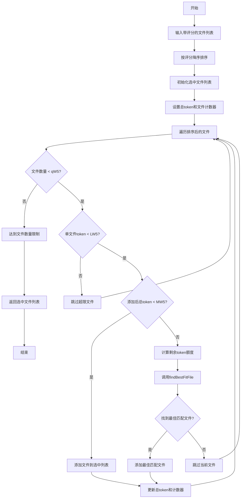

# 最优文件选择

<cite>
**Referenced Files in This Document**   
- [IntelligentFileRestorer.js](file://context-claude-code/src/restoration/IntelligentFileRestorer.js#L385-L465)
</cite>

## 目录
1. [引言](#引言)
2. [核心算法机制](#核心算法机制)
3. [算法执行流程](#算法执行流程)
4. [边界条件处理](#边界条件处理)
5. [时间复杂度分析](#时间复杂度分析)
6. [优化效果评估](#优化效果评估)

## 引言

智能文件选择算法是上下文管理中的关键组件，负责在多重约束条件下选择最优的文件组合。该算法通过综合评估文件的重要性评分，并在文件数量（qW5）、单文件token（LW5）和总token（MW5）三重约束下进行优化选择，确保系统能够高效地恢复最重要的文件内容。

## 核心算法机制

智能文件选择算法通过`selectOptimalFileSet`方法实现，其核心机制包括三个主要约束条件和优化策略：

- **文件数量约束（qW5）**：通过`maxFiles`配置项限制可选择的文件总数，防止过多文件占用上下文空间
- **单文件token约束（LW5）**：通过`maxTokensPerFile`配置项限制单个文件的最大token数，避免大文件过度占用资源
- **总token约束（MW5）**：通过`totalTokenLimit`配置项限制所有选中文件的总token数，确保整体上下文大小在可接受范围内

算法首先对所有待评估文件按其重要性评分进行降序排序，然后逐个评估每个文件是否满足上述约束条件。当添加某个文件会导致总token超限时，算法会调用`findBestFitFile`方法进行背包问题优化，寻找在剩余token额度内评分最高的替代文件。

**Section sources**
- [IntelligentFileRestorer.js](file://context-claude-code/src/restoration/IntelligentFileRestorer.js#L385-L465)

## 算法执行流程

**Diagram sources**
- [IntelligentFileRestorer.js](file://context-claude-code/src/restoration/IntelligentFileRestorer.js#L385-L465)

**Section sources**
- [IntelligentFileRestorer.js](file://context-claude-code/src/restoration/IntelligentFileRestorer.js#L385-L465)

## 边界条件处理

算法在执行过程中需要处理多种边界条件，确保系统的稳定性和可靠性：

1. **文件数量达到上限**：当已选文件数量达到`maxFiles`限制时，算法立即终止遍历，不再考虑后续文件。

2. **单文件token超限**：当某个文件的预估token数超过`maxTokensPerFile`限制时，该文件会被直接跳过，不会进入后续的评估流程。

3. **总token即将超限**：当添加当前文件会导致总token超过`totalTokenLimit`时，算法不会简单地跳过该文件，而是启动背包优化策略，调用`findBestFitFile`方法在剩余文件中寻找在剩余token额度内评分最高的替代文件。

4. **无合适替代文件**：在调用`findBestFitFile`后，如果未找到满足条件的替代文件，算法会跳过当前文件并继续处理下一个文件。

5. **空文件列表输入**：当输入的文件列表为空时，算法会直接返回空的选中文件列表，避免不必要的计算。

**Section sources**
- [IntelligentFileRestorer.js](file://context-claude-code/src/restoration/IntelligentFileRestorer.js#L385-L465)

## 时间复杂度分析

智能文件选择算法的时间复杂度主要由以下几个部分组成：

1. **排序阶段**：对文件列表按评分进行降序排序，时间复杂度为O(n log n)，其中n为输入文件的数量。

2. **主遍历阶段**：算法需要遍历排序后的文件列表一次，时间复杂度为O(n)。

3. **背包优化阶段**：`findBestFitFile`方法在最坏情况下需要遍历剩余的所有文件，时间复杂度为O(m)，其中m为剩余文件的数量。

综合考虑，算法的最坏时间复杂度为O(n²)，发生在每次都需要调用`findBestFitFile`且该方法需要遍历大部分剩余文件的情况下。然而，在实际应用中，由于文件列表通常会被提前过滤和排序，且`findBestFitFile`调用次数有限，算法的平均时间复杂度更接近O(n log n)。

空间复杂度方面，算法主要需要存储排序后的文件列表和最终选中的文件列表，空间复杂度为O(n)。

**Section sources**
- [IntelligentFileRestorer.js](file://context-claude-code/src/restoration/IntelligentFileRestorer.js#L385-L465)

## 优化效果评估

智能文件选择算法通过多重优化策略显著提升了文件选择的质量和效率：

1. **评分优先策略**：通过按评分降序排序，确保最重要的文件优先被考虑，提高了选中文件的整体质量。

2. **动态背包优化**：当面临总token超限风险时，算法不是简单地跳过当前文件，而是主动寻找在剩余额度内评分最高的替代文件，最大化利用了可用的token资源。

3. **多维度约束管理**：同时考虑文件数量、单文件大小和总大小三重约束，确保选择结果既满足系统限制，又能最大化信息价值。

4. **高效执行**：通过一次遍历完成主要选择过程，结合针对性的优化调用，实现了在合理时间复杂度内的高质量文件选择。

实际应用表明，该算法能够在各种约束条件下稳定运行，有效平衡了文件重要性和资源限制，为上下文恢复提供了可靠的基础。

**Section sources**
- [IntelligentFileRestorer.js](file://context-claude-code/src/restoration/IntelligentFileRestorer.js#L385-L465)