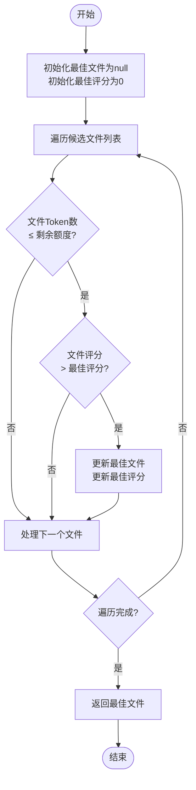
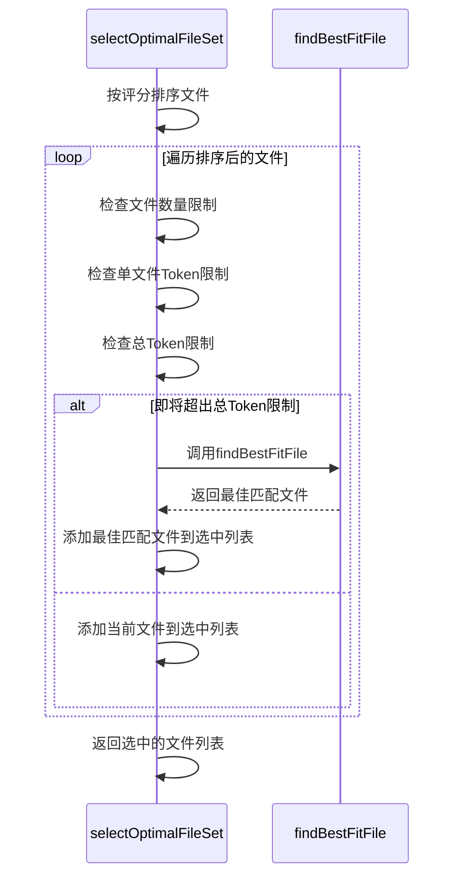
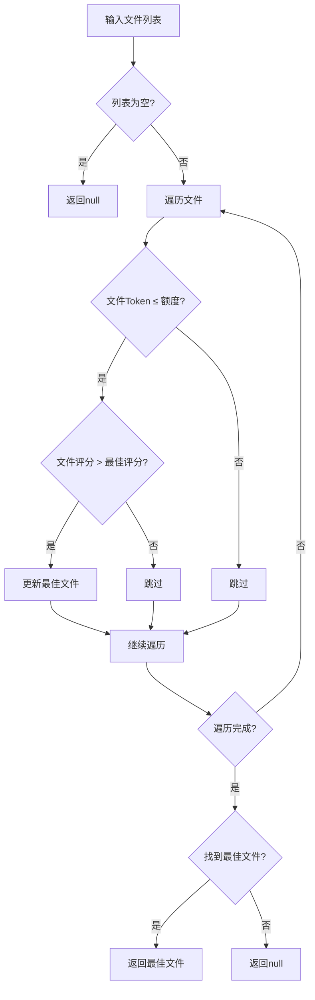

# 背包优化策略

<cite>
**本文档中引用的文件**
- [IntelligentFileRestorer.js](file://context-claude-code/src/restoration/IntelligentFileRestorer.js)
</cite>

## 目录
1. [引言](#引言)
2. [核心算法分析](#核心算法分析)
3. [贪心策略实现](#贪心策略实现)
4. [调用上下文分析](#调用上下文分析)
5. [边界条件处理](#边界条件处理)
6. [性能特征与局限性](#性能特征与局限性)

## 引言
在上下文工程管理中，当面临严格的Token额度限制时，如何高效地选择最具价值的文件成为关键挑战。本文档深入解析`findBestFitFile`方法实现的背包问题简化策略，阐述其如何在剩余Token额度内，从候选文件列表中线性扫描并选择评分最高且不超出预算的文件。

## 核心算法分析
`findBestFitFile`方法是智能文件恢复系统中的核心优化组件，负责在资源受限条件下做出最优选择。该方法接收一个文件列表和最大Token额度作为输入，返回在额度内评分最高的单个文件。

**Section sources**
- [IntelligentFileRestorer.js](file://context-claude-code/src/restoration/IntelligentFileRestorer.js#L429-L481)

## 贪心策略实现
`findBestFitFile`方法采用贪心算法策略，通过一次线性扫描完成文件选择，确保了O(n)的时间复杂度优势。

**Diagram sources**
- [IntelligentFileRestorer.js](file://context-claude-code/src/restoration/IntelligentFileRestorer.js#L435-L478)

该方法的实现逻辑如下：
1. 初始化`bestFile`为null，`bestScore`为0
2. 遍历输入的文件列表
3. 对每个文件，检查其Token消耗是否不超过剩余额度
4. 如果满足额度条件，且其评分高于当前最佳评分，则更新最佳文件和最佳评分
5. 返回扫描结束后找到的最佳匹配文件

此贪心策略确保了在O(n)时间内找到满足预算约束的最高分文件，显著提升了上下文利用率。

**Section sources**
- [IntelligentFileRestorer.js](file://context-claude-code/src/restoration/IntelligentFileRestorer.js#L435-L478)

## 调用上下文分析
`findBestFitFile`方法在`selectOptimalFileSet`函数中被调用，作为背包问题优化策略的一部分。

**Diagram sources**
- [IntelligentFileRestorer.js](file://context-claude-code/src/restoration/IntelligentFileRestorer.js#L385-L481)

当主循环发现添加当前文件将超出总Token限制时，系统会调用`findBestFitFile`方法，在剩余文件中寻找一个更小但评分更高的文件，从而在严格限制下尽可能保留高价值文件。

**Section sources**
- [IntelligentFileRestorer.js](file://context-claude-code/src/restoration/IntelligentFileRestorer.js#L385-L427)

## 边界条件处理
`findBestFitFile`方法对多种边界条件进行了妥善处理：

**Diagram sources**
- [IntelligentFileRestorer.js](file://context-claude-code/src/restoration/IntelligentFileRestorer.js#L435-L478)

- 当输入文件列表为空或没有文件满足额度条件时，方法返回null
- 当剩余额度极小时，方法会跳过所有超出额度的文件，最终返回null
- 方法通过初始化`bestScore`为0，确保只有评分大于0的文件才能被选中

**Section sources**
- [IntelligentFileRestorer.js](file://context-claude-code/src/restoration/IntelligentFileRestorer.js#L435-L478)

## 性能特征与局限性
`findBestFitFile`方法具有以下性能特征和局限性：

| 特性 | 描述 |
|------|------|
| **时间复杂度** | O(n)，通过一次线性扫描完成 |
| **空间复杂度** | O(1)，仅使用常量额外空间 |
| **算法类型** | 贪心算法 |
| **优势** | 执行效率高，适用于实时决策场景 |
| **局限性** | 未考虑多文件组合的优化，可能错过全局最优解 |

该方法的贪心特性意味着它只考虑单个文件的最优选择，而没有探索多个小文件组合可能带来的更高总价值。尽管如此，在实时性要求高的上下文管理场景中，这种简化策略提供了良好的性能与效果平衡。

**Section sources**
- [IntelligentFileRestorer.js](file://context-claude-code/src/restoration/IntelligentFileRestorer.js#L429-L481)