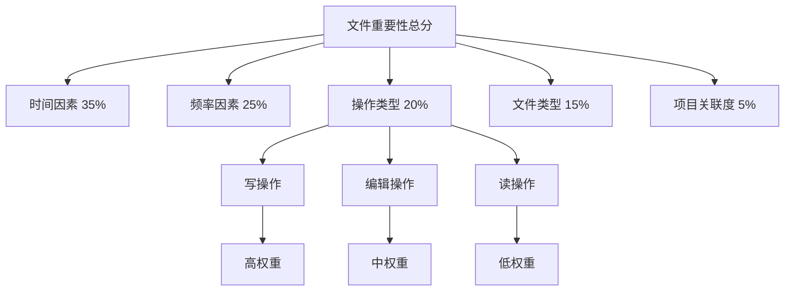
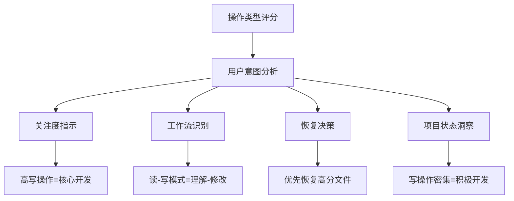

# 操作类型评分

<cite>
**Referenced Files in This Document**   
- [TW5FileRestorer.js](file://context-claude-code/src/claude-core/TW5FileRestorer.js)
- [IntelligentFileRestorer.js](file://context-claude-code/src/restoration/IntelligentFileRestorer.js)
- [index.js](file://context-claude-code/src/types/index.js)
</cite>

## 目录
1. [操作类型评分概述](#操作类型评分概述)
2. [核心评分机制](#核心评分机制)
3. [操作类型与评分映射表](#操作类型与评分映射表)
4. [关键操作识别机制](#关键操作识别机制)
5. [评分在用户意图分析中的作用](#评分在用户意图分析中的作用)

## 操作类型评分概述

操作类型评分是智能文件恢复系统中的核心组件，用于评估不同文件操作的重要性。该系统通过分析用户的文件操作行为（如读取、写入、编辑等），为每种操作赋予不同的权重分数，从而判断文件的重要性和用户的关注程度。

系统中存在两个主要的 `calculateOperationScore` 函数实现，分别位于 `TW5FileRestorer.js` 和 `IntelligentFileRestorer.js` 文件中。这两个实现虽然逻辑略有不同，但都遵循相同的设计原则：写操作 > 编辑操作 > 读操作。

**Section sources**
- [TW5FileRestorer.js](file://context-claude-code/src/claude-core/TW5FileRestorer.js#L326-L339)
- [IntelligentFileRestorer.js](file://context-claude-code/src/restoration/IntelligentFileRestorer.js#L265-L285)

## 核心评分机制

操作类型评分机制通过量化不同操作类型的重要性来反映用户对文件的关注程度。系统根据操作的性质和对文件内容的影响程度来分配权重。

### TW5FileRestorer 实现

在 `TW5FileRestorer` 类中，`calculateOperationScore` 函数采用简单的开关（switch）逻辑，为每种操作类型分配固定的分数：

```javascript
calculateOperationScore(fileData) {
    const operation = fileData.operation || 'read';

    switch (operation) {
      case 'write':
        return 100; // 写操作权重最高
      case 'edit':
        return 85;  // 编辑操作权重中等
      case 'read':
        return 60;  // 读操作权重较低
      default:
        return 30;
    }
}
```

这种实现方式简单直接，为写操作分配最高分（100分），编辑操作次之（85分），读操作较低（60分），其他未知操作默认30分。

### IntelligentFileRestorer 实现

在 `IntelligentFileRestorer` 类中，`calculateOperationScore` 函数采用更复杂的加权计算方式，考虑了操作的频率和最后一次操作的类型：

```javascript
calculateOperationScore(file) {
    let score = 0;

    // 写操作权重最高
    score += file.writeCount * 15;

    // 编辑操作权重中等
    score += file.editCount * 10;

    // 读操作权重较低
    score += file.readCount * 3;

    // 如果最后一次操作是写操作，额外加分
    if (file.lastOperation === FileOperation.WRITE) {
      score += 25;
    } else if (file.lastOperation === FileOperation.EDIT) {
      score += 15;
    }

    return Math.min(100, score);
}
```

这种实现方式更加精细，不仅考虑了操作的类型，还考虑了操作的频率（计数）和最近的操作行为，使得评分更能反映用户的实际使用模式。

**Section sources**
- [TW5FileRestorer.js](file://context-claude-code/src/claude-core/TW5FileRestorer.js#L326-L339)
- [IntelligentFileRestorer.js](file://context-claude-code/src/restoration/IntelligentFileRestorer.js#L265-L285)

## 操作类型与评分映射表

以下是系统中定义的操作类型及其对应的评分标准：

**操作类型与评分映射表**

| 操作类型 | 操作描述 | 评分标准 | 评分值 |
| :--- | :--- | :--- | :--- |
| **写入 (WRITE)** | 创建新文件或完全覆盖现有文件内容 | 在 `TW5FileRestorer` 中为固定100分；在 `IntelligentFileRestorer` 中按每次15分累加，并在最后一次操作时额外加25分 | 100 / 动态计算 |
| **编辑 (EDIT)** | 修改现有文件的部分内容 | 在 `TW5FileRestorer` 中为固定85分；在 `IntelligentFileRestorer` 中按每次10分累加，并在最后一次操作时额外加15分 | 85 / 动态计算 |
| **读取 (READ)** | 访问或查看文件内容 | 在 `TW5FileRestorer` 中为固定60分；在 `IntelligentFileRestorer` 中按每次3分累加 | 60 / 动态计算 |
| **其他** | 未定义的操作类型 | 默认评分 | 30 |

这些操作类型通过 `FileOperation` 枚举在系统中统一定义：

```javascript
export const FileOperation = {
  READ: 'read',
  WRITE: 'write',
  EDIT: 'edit'
};
```

**Section sources**
- [index.js](file://context-claude-code/src/types/index.js#L40-L44)
- [TW5FileRestorer.js](file://context-claude-code/src/claude-core/TW5FileRestorer.js#L326-L339)
- [IntelligentFileRestorer.js](file://context-claude-code/src/restoration/IntelligentFileRestorer.js#L265-L285)

## 关键操作识别机制

系统通过多种机制来识别和评估关键操作，这些机制共同构成了完整的操作重要性评估体系。

### 操作频率跟踪

系统通过 `fileOperations` 映射和 `fileOperationHistory` 来跟踪每个文件的各种操作次数。在 `IntelligentFileRestorer` 中，文件元数据包含 `readCount`、`writeCount` 和 `editCount` 字段，用于记录不同操作的频率。

### 最近操作优先

系统特别重视最后一次操作的类型，为最近的写操作或编辑操作提供额外加分。这种设计基于一个重要的用户行为假设：用户最近进行的操作最能反映其当前的关注点和意图。

### 多维度评分整合

操作类型评分只是文件重要性评估的一个维度。在完整的评分系统中，操作类型评分与其他维度的评分相结合：



**Diagram sources**
- [IntelligentFileRestorer.js](file://context-claude-code/src/restoration/IntelligentFileRestorer.js#L100-L115)

这种多维度的评分机制确保了评估结果的全面性和准确性，避免了单一维度评估可能带来的偏差。

**Section sources**
- [IntelligentFileRestorer.js](file://context-claude-code/src/restoration/IntelligentFileRestorer.js#L100-L115)
- [TW5FileRestorer.js](file://context-claude-code/src/claude-core/TW5FileRestorer.js#L250-L265)

## 评分在用户意图分析中的作用

操作类型评分在反映用户意图方面发挥着至关重要的作用，它是理解用户行为模式和项目关注点的关键指标。

### 用户关注度指示器

操作类型评分直接反映了用户对特定文件的关注程度。高分值表明用户正在积极修改或创建该文件，暗示这是当前开发工作的核心部分。例如，频繁的写操作表明用户正在开发新功能或重构代码。

### 工作流模式识别

通过分析操作类型的时间序列，系统可以识别出用户的典型工作流模式。例如，连续的读操作后跟写操作可能表示"理解-修改"的工作模式，而频繁的编辑操作可能表示代码重构过程。

### 智能恢复决策支持

在文件恢复场景中，操作类型评分帮助系统优先恢复最重要的文件。当需要在有限的token预算下选择恢复哪些文件时，高操作评分的文件会被优先考虑，确保上下文的相关性和完整性。

### 项目状态洞察

操作类型分布可以提供关于项目状态的宝贵洞察。例如，大量读操作可能表示项目处于调研或学习阶段，而密集的写操作则表明项目处于积极开发阶段。



**Diagram sources**
- [TW5FileRestorer.js](file://context-claude-code/src/claude-core/TW5FileRestorer.js#L250-L265)
- [IntelligentFileRestorer.js](file://context-claude-code/src/restoration/IntelligentFileRestorer.js#L265-L285)

**Section sources**
- [TW5FileRestorer.js](file://context-claude-code/src/claude-core/TW5FileRestorer.js#L250-L265)
- [IntelligentFileRestorer.js](file://context-claude-code/src/restoration/IntelligentFileRestorer.js#L265-L285)