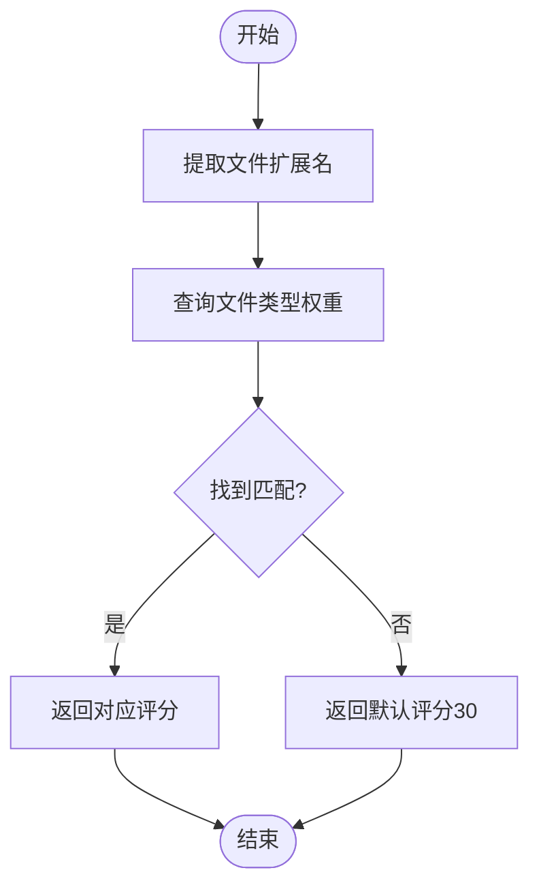
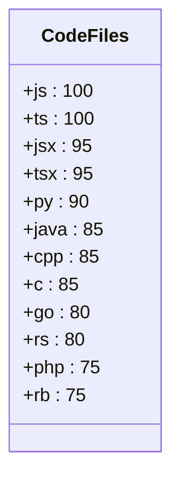
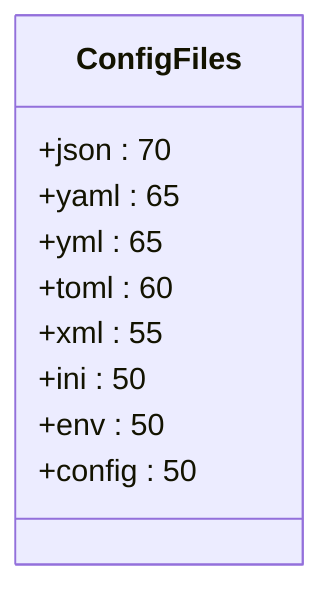
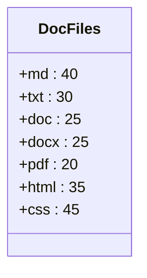
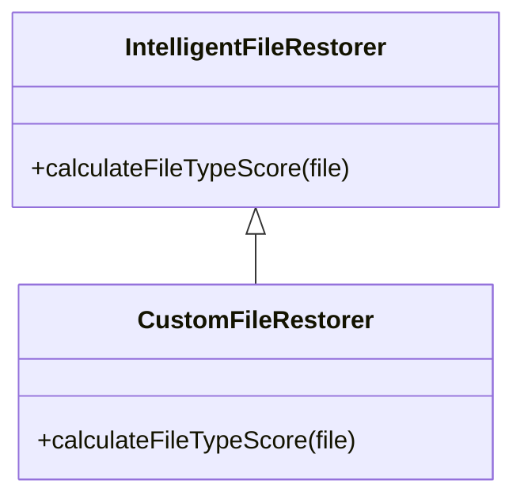

# 文件类型评分

<cite>
**本文档引用的文件**  
- [TW5FileRestorer.js](file://context-claude-code/src/claude-core/TW5FileRestorer.js)
- [IntelligentFileRestorer.js](file://context-claude-code/src/restoration/IntelligentFileRestorer.js)
- [CLAUDE.md](file://context-claude-code/CLAUDE.md)
- [核心算法详解.md](file://context-claude-code/核心算法详解.md)
</cite>

## 目录
1. [文件类型评分机制概述](#文件类型评分机制概述)
2. [文件类型评分实现方式](#文件类型评分实现方式)
3. [文件类型评分等级](#文件类型评分等级)
4. [高评分文件类型优先级依据](#高评分文件类型优先级依据)
5. [文件类型分类规则配置方法](#文件类型分类规则配置方法)
6. [自定义文件类型评分扩展机制](#自定义文件类型评分扩展机制)
7. [总结](#总结)

## 文件类型评分机制概述

文件类型评分是智能文件恢复系统中的核心组件，用于评估文件的重要性并决定其在上下文压缩后的恢复优先级。该机制通过分析文件扩展名或MIME类型来分配评分，确保关键文件在资源受限的情况下优先保留。评分系统综合考虑了文件类型、访问频率、操作类型、时间因素和项目相关性等多个维度，其中文件类型权重占总评分的15%。

**本节来源**  
- [CLAUDE.md](file://context-claude-code/CLAUDE.md#L1-L145)
- [核心算法详解.md](file://context-claude-code/核心算法详解.md#L1-L674)

## 文件类型评分实现方式

文件类型评分主要通过`calculateFileTypeScore`函数实现，该函数存在于两个核心类中：`TW5FileRestorer`和`IntelligentFileRestorer`。这两个实现虽然位于不同文件中，但遵循相似的设计原则和评分逻辑。

在`TW5FileRestorer`类中，`calculateFileTypeScore`函数通过查询预定义的`FILE_TYPE_WEIGHTS`常量来获取文件扩展名对应的评分。该常量定义在`CLAUDE_CONSTANTS`对象中，包含了代码文件、配置文件和文档文件三类的评分权重。对于未知文件类型，默认评分为30分。



**图表来源**  
- [TW5FileRestorer.js](file://context-claude-code/src/claude-core/TW5FileRestorer.js#L346-L349)

在`IntelligentFileRestorer`类中，`calculateFileTypeScore`函数采用了更为动态的实现方式。它通过三个独立的对象字面量（`codeExtensions`、`configExtensions`、`docExtensions`）来分别存储编程语言文件、配置文件和文档文件的评分。函数首先提取文件路径的扩展名，然后依次在三个字面量中查找匹配项，返回相应的评分。这种实现方式提供了更好的可读性和维护性。

**本节来源**  
- [TW5FileRestorer.js](file://context-claude-code/src/claude-core/TW5FileRestorer.js#L12-L33)
- [IntelligentFileRestorer.js](file://context-claude-code/src/restoration/IntelligentFileRestorer.js#L292-L323)

## 文件类型评分等级

文件类型评分系统将文件分为三大类别：代码文件、配置文件和文档文件，每类都有明确的评分范围和具体文件类型的评分标准。

### 代码文件（最高优先级）

代码文件被赋予最高优先级，因为它们直接关系到项目的核心功能和业务逻辑。这类文件的评分范围为75-100分。



**图表来源**  
- [TW5FileRestorer.js](file://context-claude-code/src/claude-core/TW5FileRestorer.js#L18-L25)

### 配置文件（中等优先级）

配置文件包含项目的重要设置和环境信息，因此被赋予中等优先级。这类文件的评分范围为50-70分。



**图表来源**  
- [TW5FileRestorer.js](file://context-claude-code/src/claude-core/TW5FileRestorer.js#L27-L32)

### 文档文件（较低优先级）

文档文件主要用于说明和记录，虽然重要但不直接影响代码执行，因此被赋予较低优先级。这类文件的评分范围为20-45分。



**图表来源**  
- [TW5FileRestorer.js](file://context-claude-code/src/claude-core/TW5FileRestorer.js#L34-L39)

**本节来源**  
- [TW5FileRestorer.js](file://context-claude-code/src/claude-core/TW5FileRestorer.js#L12-L39)
- [IntelligentFileRestorer.js](file://context-claude-code/src/restoration/IntelligentFileRestorer.js#L292-L323)

## 高评分文件类型优先级依据

高评分文件类型（如.ts、.js、.py）的优先级依据主要基于它们在软件开发过程中的核心地位和不可替代性。这些文件直接包含了应用程序的业务逻辑和功能实现，一旦丢失将严重影响开发进度和项目完整性。

TypeScript（.ts）和JavaScript（.js）文件被赋予最高评分100分，因为它们是现代Web开发的核心技术栈。React组件文件（.jsx、.tsx）紧随其后，评分为95分，反映了前端框架在现代应用开发中的重要性。

Python（.py）文件评分为90分，体现了其在数据科学、机器学习和后端开发中的广泛应用。Java、C++和C等传统编程语言文件评分为85分，保持了它们在企业级应用和系统编程中的重要地位。

Go（.go）和Rust（.rs）文件评分为80分，反映了新兴系统编程语言的快速崛起。PHP和Ruby（.rb）文件评分为75分，虽然在现代开发中地位有所下降，但仍被广泛用于现有项目的维护和更新。

这些评分标准不仅考虑了文件类型的技术重要性，还反映了当前软件开发行业的主流趋势和技术偏好。通过赋予高评分，系统确保这些关键代码文件在上下文压缩和恢复过程中得到优先处理，最大限度地保持开发工作的连续性和完整性。

**本节来源**  
- [TW5FileRestorer.js](file://context-claude-code/src/claude-core/TW5FileRestorer.js#L18-L25)
- [核心算法详解.md](file://context-claude-code/核心算法详解.md#L1-L674)

## 文件类型分类规则配置方法

文件类型分类规则主要通过`CLAUDE_CONSTANTS`常量对象进行配置。该对象定义在`TW5FileRestorer.js`文件中，包含了`FILE_TYPE_WEIGHTS`属性，用于存储各种文件扩展名的评分权重。

配置方法非常直观，只需在相应的类别中添加新的文件扩展名及其评分即可。例如，要为新的编程语言文件添加支持，可以在代码文件类别中添加相应的条目：

```javascript
FILE_TYPE_WEIGHTS: {
  // 代码文件 (最高优先级)
  '.js': 100, '.ts': 100, '.jsx': 95, '.tsx': 95,
  '.py': 90, '.java': 85, '.cpp': 85, '.c': 85,
  '.go': 80, '.rs': 80, '.php': 75, '.rb': 75,
  '.newlang': 85  // 新增的新编程语言支持
}
```

对于`IntelligentFileRestorer`类，配置方法类似，但需要在三个独立的对象字面量中分别进行修改。这种设计提供了更好的组织性和可维护性，使得不同类别的文件配置更加清晰。

除了直接修改源代码，系统还支持通过构造函数参数进行配置。`IntelligentFileRestorer`类的构造函数接受一个`config`参数，允许在实例化时覆盖默认的评分权重。这种方法提供了更大的灵活性，使得不同的项目可以根据其特定需求调整文件类型评分规则。

**本节来源**  
- [TW5FileRestorer.js](file://context-claude-code/src/claude-core/TW5FileRestorer.js#L12-L39)
- [IntelligentFileRestorer.js](file://context-claude-code/src/restoration/IntelligentFileRestorer.js#L292-L323)

## 自定义文件类型评分扩展机制

自定义文件类型评分扩展机制提供了两种主要方式：静态配置和动态配置。静态配置通过修改`CLAUDE_CONSTANTS`常量对象实现，适用于全局性的、项目范围的评分规则调整。动态配置则通过类的构造函数参数实现，适用于特定实例的个性化配置。

对于需要更复杂逻辑的扩展场景，系统支持继承和重写机制。开发者可以创建`IntelligentFileRestorer`的子类，并重写`calculateFileTypeScore`方法，以实现自定义的评分算法。例如，可以根据文件内容而非仅仅扩展名来决定评分，或者引入机器学习模型来预测文件的重要性。



**图表来源**  
- [IntelligentFileRestorer.js](file://context-claude-code/src/restoration/IntelligentFileRestorer.js#L292-L323)

此外，系统还支持通过插件机制进行扩展。开发者可以创建独立的评分模块，并在运行时动态加载。这种方式提供了最大的灵活性和可扩展性，允许第三方开发者为特定领域或技术栈提供专门的文件类型评分支持。

这些扩展机制共同构成了一个灵活、可定制的文件类型评分系统，能够适应不同项目和开发团队的特定需求，确保智能文件恢复功能在各种应用场景下都能发挥最佳效果。

**本节来源**  
- [IntelligentFileRestorer.js](file://context-claude-code/src/restoration/IntelligentFileRestorer.js#L292-L323)
- [核心算法详解.md](file://context-claude-code/核心算法详解.md#L1-L674)

## 总结

文件类型评分系统是智能文件恢复机制的核心组成部分，通过科学的评分规则确保关键文件在上下文管理过程中得到优先处理。该系统基于文件扩展名或MIME类型对文件进行分类和评分，将文件分为代码文件、配置文件和文档文件三大类别，分别赋予不同的优先级。

高评分文件类型（如.ts、.js、.py）的优先级依据其在软件开发中的核心地位和不可替代性。系统提供了灵活的配置方法，允许开发者通过修改常量对象或构造函数参数来调整评分规则。同时，强大的扩展机制支持继承、重写和插件化开发，使得文件类型评分系统能够适应各种复杂的应用场景。

通过这一系列精心设计的机制，文件类型评分系统有效地平衡了资源限制和开发需求，为智能上下文管理提供了坚实的基础，确保了开发工作的连续性和高效性。