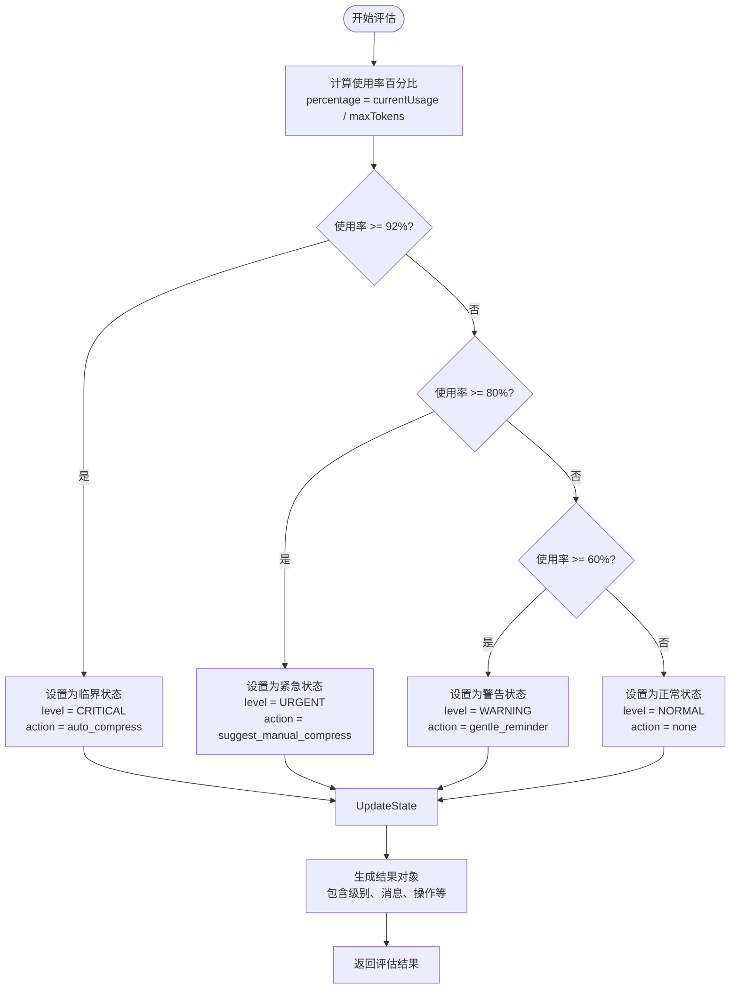
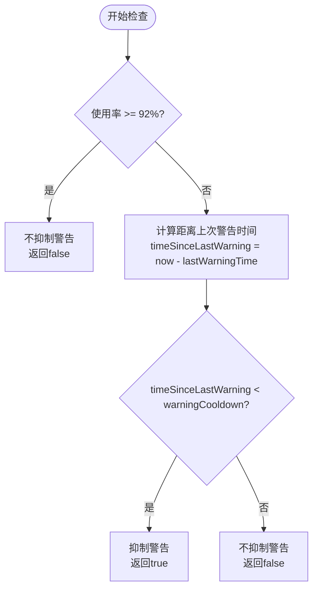
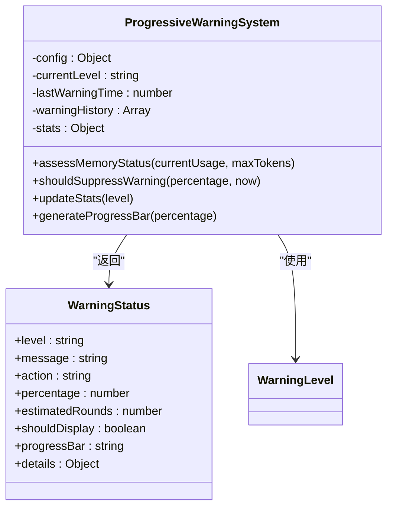
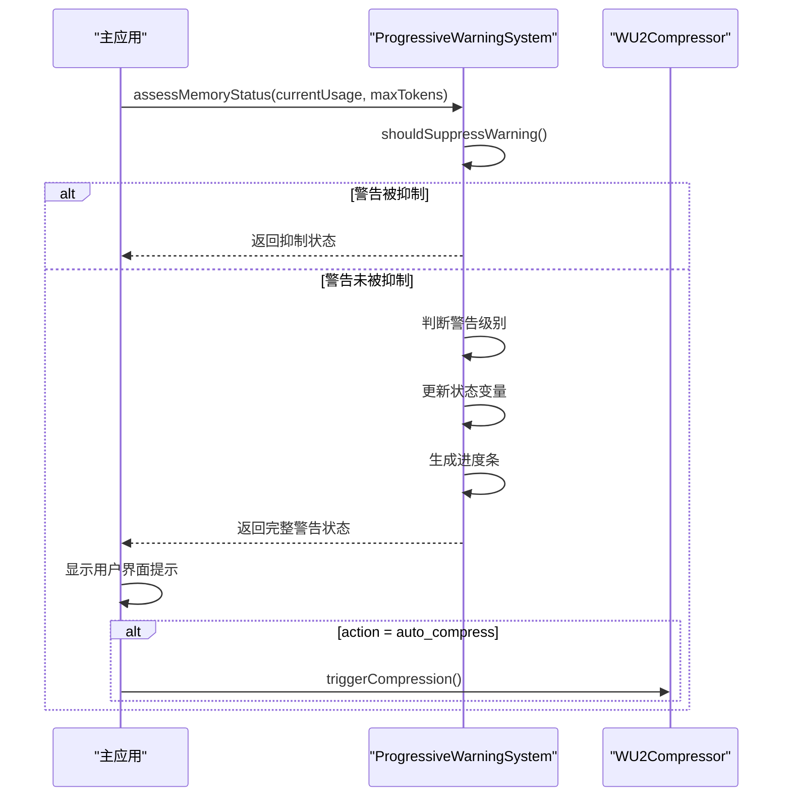

# 内存状态评估

<cite>
**Referenced Files in This Document**   
- [ProgressiveWarningSystem.js](file://context-claude-code/src/warning/ProgressiveWarningSystem.js)
- [ProgressiveWarningSystem.js](file://context-claude-code/src/claude-core/ProgressiveWarningSystem.js)
- [WU2Compressor.js](file://context-claude-code/src/claude-core/WU2Compressor.js)
- [index.js](file://context-claude-code/src/types/index.js)
</cite>

## 目录
1. [内存状态评估机制](#内存状态评估机制)
2. [警告冷却机制](#警告冷却机制)
3. [状态变量维护](#状态变量维护)
4. [实际调用示例](#实际调用示例)

## 内存状态评估机制

系统通过`assessMemoryStatus`和`m11`函数实现了一套完整的内存状态评估机制。该机制结合当前使用率、最大token数和有效限制来计算内存压力等级，采用三级预警系统：警告(60%)、紧急(80%)和临界(92%)。

`assessMemoryStatus`函数首先计算当前使用率百分比，然后根据预设的阈值配置判断当前所处的警告级别。系统定义了三个关键阈值：警告阈值(60%)、紧急阈值(80%)和临界阈值(92%)，分别对应不同的用户提示和操作建议。

**Diagram sources**
- [ProgressiveWarningSystem.js](file://context-claude-code/src/warning/ProgressiveWarningSystem.js#L55-L147)

**Section sources**
- [ProgressiveWarningSystem.js](file://context-claude-code/src/warning/ProgressiveWarningSystem.js#L55-L147)

## 警告冷却机制

系统通过`warningCooldown`机制防止频繁提醒用户，确保用户体验的流畅性。该机制的核心是`shouldSuppressWarning`函数，它检查距离上次警告的时间间隔是否小于预设的冷却时间。

当系统检测到内存使用率超过阈值时，会先检查是否应该抑制警告。对于临界状态(92%以上)，系统不会抑制警告，确保用户能及时了解系统正在自动压缩。而对于警告和紧急状态，则会检查冷却时间，只有当距离上次同级别警告的时间超过5分钟(300000毫秒)时才会显示新的警告。

**Diagram sources**
- [ProgressiveWarningSystem.js](file://context-claude-code/src/warning/ProgressiveWarningSystem.js#L155-L164)

**Section sources**
- [ProgressiveWarningSystem.js](file://context-claude-code/src/warning/ProgressiveWarningSystem.js#L155-L164)

## 状态变量维护

系统通过维护一系列状态变量来跟踪内存警告的历史和当前状态。核心状态变量包括`lastWarningTime`、`currentLevel`和`warningHistory`。

`lastWarningTime`记录了最后一次警告的时间戳，用于冷却机制的计算。`currentLevel`保存当前的警告级别，当级别发生变化时会更新此变量。`warningHistory`是一个数组，记录了最近的警告历史，系统会限制其长度不超过50条，确保不会占用过多内存。

当警告级别发生变化时，系统会更新这些状态变量，并记录到警告历史中。同时，系统还会更新统计信息，如总警告次数、各级别警告次数等，为后续的趋势分析提供数据支持。

**Diagram sources**
- [ProgressiveWarningSystem.js](file://context-claude-code/src/warning/ProgressiveWarningSystem.js#L1-L480)

**Section sources**
- [ProgressiveWarningSystem.js](file://context-claude-code/src/warning/ProgressiveWarningSystem.js#L1-L480)

## 实际调用示例

以下是一个集成内存状态评估功能到主应用循环中的实际调用示例。系统通过`assessMemoryStatus`方法获取当前内存状态，并根据返回的警告状态对象采取相应行动。

**Diagram sources**
- [ProgressiveWarningSystem.js](file://context-claude-code/src/warning/ProgressiveWarningSystem.js#L55-L147)
- [WU2Compressor.js](file://context-claude-code/src/claude-core/WU2Compressor.js#L197-L225)

**Section sources**
- [ProgressiveWarningSystem.js](file://context-claude-code/src/warning/ProgressiveWarningSystem.js#L55-L147)