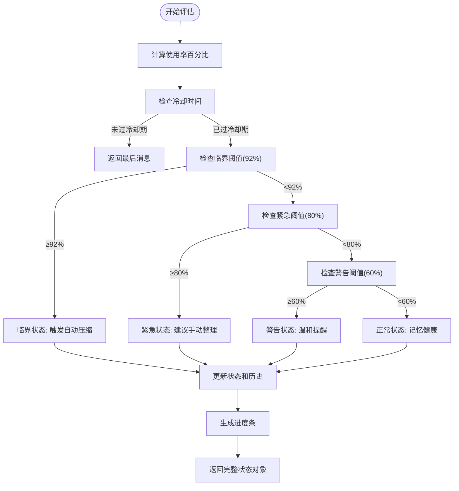
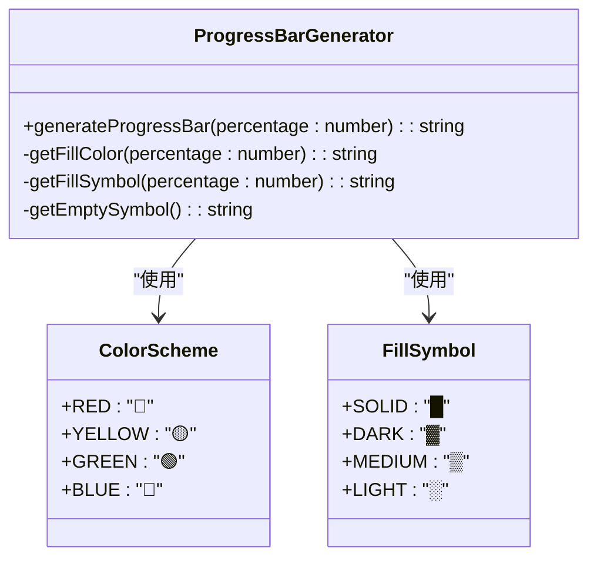
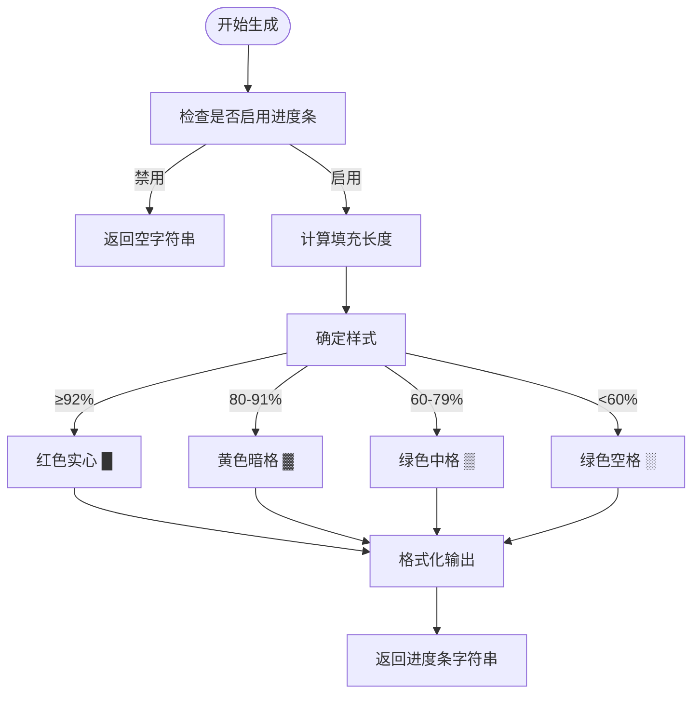
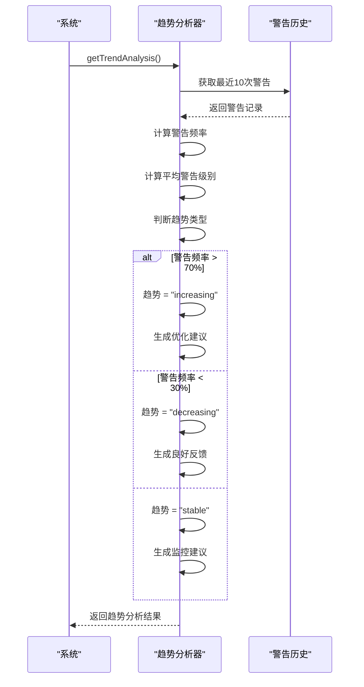
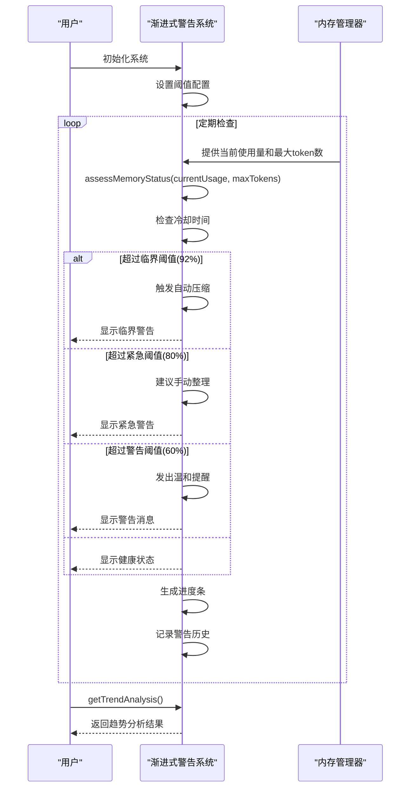

# 渐进式警告系统

<cite>
**Referenced Files in This Document**   
- [ProgressiveWarningSystem.js](file://context-claude-code/src/warning/ProgressiveWarningSystem.js)
- [ProgressiveWarningSystem.js](file://context-claude-code/src/claude-core/ProgressiveWarningSystem.js)
- [index.js](file://context-claude-code/src/types/index.js)
</cite>

## 目录
1. [简介](#简介)
2. [三级警告体系](#三级警告体系)
3. [内存状态评估](#内存状态评估)
4. [进度条生成](#进度条生成)
5. [警告趋势分析](#警告趋势分析)
6. [配置与使用](#配置与使用)

## 简介

渐进式警告系统（Progressive Warning System）是一个智能内存管理机制，旨在通过三级预警体系监控和管理系统的记忆使用情况。该系统基于内存使用率、冷却时间和警告历史等多维度因素，提供从温和提醒到自动压缩的渐进式响应策略。系统通过`assessMemoryStatus`函数评估当前内存状态，利用`generateProgressBar`函数生成直观的可视化进度条，并通过`getTrendAnalysis`函数分析警告趋势，为用户提供全面的内存使用洞察。

**Section sources**
- [ProgressiveWarningSystem.js](file://context-claude-code/src/warning/ProgressiveWarningSystem.js#L11-L480)
- [ProgressiveWarningSystem.js](file://context-claude-code/src/claude-core/ProgressiveWarningSystem.js#L11-L505)

## 三级警告体系

渐进式警告系统采用三级预警机制，根据内存使用率的不同阈值触发相应的警告级别和操作建议。该体系由三个核心函数构成：`_W5`函数（60%警告阈值）、`jW5`函数（80%紧急阈值）和`h11`函数（92%临界阈值）。

```mermaid
graph TD
A[正常状态] --> |使用率 ≥ 60%| B[警告状态]
B --> |使用率 ≥ 80%| C[紧急状态]
C --> |使用率 ≥ 92%| D[临界状态]
subgraph "警告级别"
A --> |0-59%| Normal["正常 (NORMAL)"]
B --> |60-79%| Warning["警告 (WARNING)"]
C --> |80-91%| Urgent["紧急 (URGENT)"]
D --> |≥92%| Critical["临界 (CRITICAL)"]
end
subgraph "用户响应"
Warning --> |温和提醒| Gentle["温和提醒"]
Urgent --> |建议手动整理| Manual["建议手动整理"]
Critical --> |自动压缩| Auto["触发自动压缩"]
end
```



**Diagram sources**
- [ProgressiveWarningSystem.js](file://context-claude-code/src/warning/ProgressiveWarningSystem.js#L11-L480)

**Section sources**
- [ProgressiveWarningSystem.js](file://context-claude-code/src/warning/ProgressiveWarningSystem.js#L11-L480)

## 内存状态评估

`assessMemoryStatus`函数是渐进式警告系统的核心，负责评估当前内存状态并生成相应的警告级别和用户消息。该函数结合内存使用率、冷却时间和警告历史等多维度因素，提供精准的内存状态评估。

### 评估流程



### 警告级别定义

| 警告级别 | 阈值 | 触发函数 | 用户消息 | 建议操作 |
|---------|------|---------|---------|---------|
| **正常** | 0-59% | - | ✅ 记忆健康 | 继续对话 |
| **警告** | 60-79% | _W5 | 💡 记忆使用量较高 | 温和提醒 |
| **紧急** | 80-91% | jW5 | ⚠️ 记忆空间紧张，建议手动整理 | 建议手动整理 |
| **临界** | ≥92% | h11 | 🚨 记忆空间已满，正在整理... | 触发自动压缩 |

**Section sources**
- [ProgressiveWarningSystem.js](file://context-claude-code/src/warning/ProgressiveWarningSystem.js#L55-L147)

## 进度条生成

`generateProgressBar`函数负责生成直观的可视化进度条，使用不同颜色和填充符号展示内存压力。进度条通过颜色、填充符号和百分比数字的组合，为用户提供清晰的内存使用情况可视化。

### 进度条样式



### 进度条生成逻辑



**Diagram sources**
- [ProgressiveWarningSystem.js](file://context-claude-code/src/warning/ProgressiveWarningSystem.js#L198-L226)

**Section sources**
- [ProgressiveWarningSystem.js](file://context-claude-code/src/warning/ProgressiveWarningSystem.js#L198-L226)

## 警告趋势分析

`getTrendAnalysis`函数基于历史记录分析警告频率的趋势，判断警告频率是增加、减少还是稳定。该函数通过分析最近的警告历史，为用户提供长期的内存使用模式洞察。

### 趋势分析算法



### 趋势判断标准

| 趋势类型 | 频率范围 | 平均级别 | 用户建议 |
|---------|---------|---------|---------|
| **增加** | >70% | 高 | 优化使用模式，增加压缩频率，检查内存泄漏 |
| **稳定** | 30%-70% | 中 | 继续监控使用情况，保持当前模式 |
| **减少** | <30% | 低 | 内存使用模式良好，继续保持 |

**Diagram sources**
- [ProgressiveWarningSystem.js](file://context-claude-code/src/warning/ProgressiveWarningSystem.js#L365-L420)

**Section sources**
- [ProgressiveWarningSystem.js](file://context-claude-code/src/warning/ProgressiveWarningSystem.js#L365-L420)

## 配置与使用

渐进式警告系统提供了灵活的配置选项和使用方法，允许用户根据具体需求调整阈值、获取当前状态以及处理系统发出的警告事件。

### 配置选项

```mermaid
erDiagram
CONFIG ||--o{ THRESHOLDS : "包含"
CONFIG ||--o{ WARNING : "包含"
CONFIG {
json config JSON
number warningCooldown
boolean enableProgressBars
boolean enableEstimates
}
THRESHOLDS {
number normal
number warning
number urgent
number critical
}
WARNING {
string level
string message
string action
number percentage
number estimatedRounds
boolean shouldDisplay
}
```

### 使用示例



**Section sources**
- [ProgressiveWarningSystem.js](file://context-claude-code/src/warning/ProgressiveWarningSystem.js#L11-L480)
- [index.js](file://context-claude-code/src/types/index.js#L29-L34)