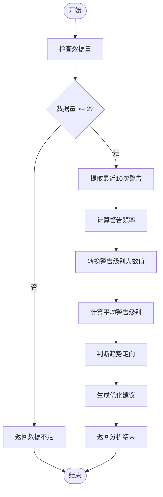
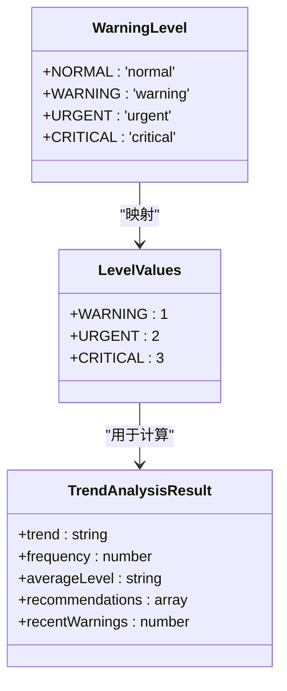
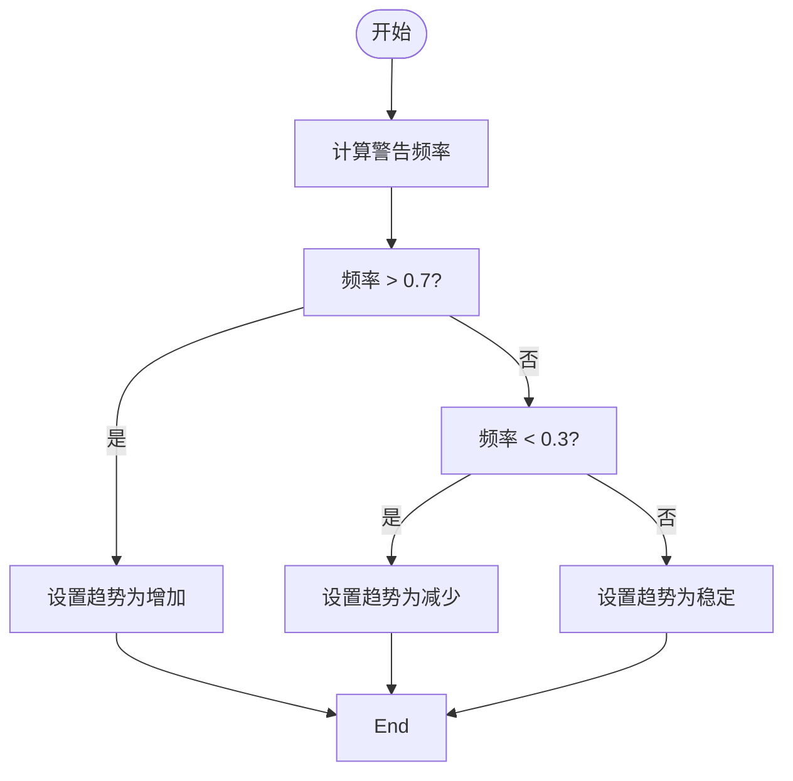
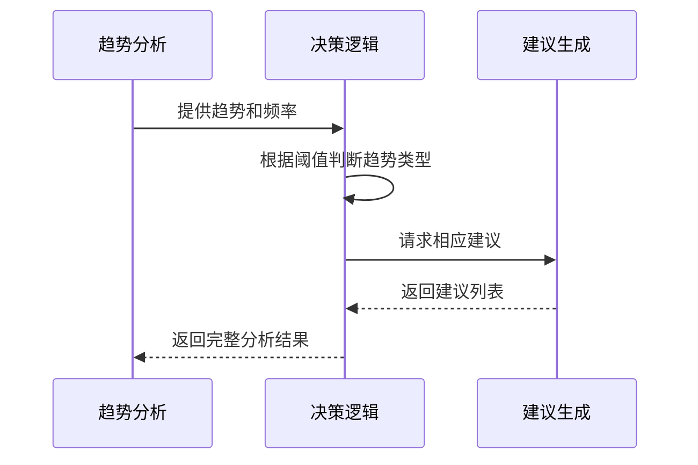
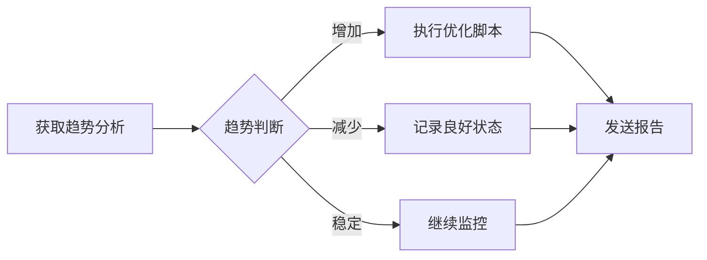

# 警告趋势分析

<cite>
**Referenced Files in This Document**   
- [ProgressiveWarningSystem.js](file://context-claude-code/src/warning/ProgressiveWarningSystem.js)
- [index.js](file://context-claude-code/src/types/index.js)
</cite>

## 目录
1. [简介](#简介)
2. [核心功能分析](#核心功能分析)
3. [警告趋势分析算法](#警告趋势分析算法)
4. [数据结构与映射表](#数据结构与映射表)
5. [趋势决策逻辑](#趋势决策逻辑)
6. [优化建议生成机制](#优化建议生成机制)
7. [使用示例与应用场景](#使用示例与应用场景)
8. [结论](#结论)

## 简介
本文档全面记录了`getTrendAnalysis`函数实现的警告趋势分析功能。该功能是渐进式警告系统的重要组成部分，用于评估系统健康状况并提供优化建议。通过分析最近的警告历史记录，系统能够识别警告模式的趋势走向，为自动化运维决策提供数据支持。

## 核心功能分析

`getTrendAnalysis`函数是`ProgressiveWarningSystem`类中的一个核心方法，负责对系统的警告历史进行趋势分析。该函数通过分析最近的警告数据，计算警告频率、平均警告级别，并判断趋势走向（增加、减少或稳定）。

**Section sources**
- [ProgressiveWarningSystem.js](file://context-claude-code/src/warning/ProgressiveWarningSystem.js#L365-L420)

## 警告趋势分析算法

### 算法流程
警告趋势分析算法遵循以下步骤：

1. **数据准备**：从警告历史记录中提取最近10次警告
2. **频率计算**：计算警告发生的频率
3. **级别转换**：将警告级别转换为数值进行统计
4. **平均级别计算**：计算平均警告级别
5. **趋势判断**：基于频率阈值判断趋势走向
6. **结果生成**：返回包含所有分析结果的对象

### 数据处理
当警告历史记录少于2次时，系统返回"insufficient_data"状态，表示数据不足无法进行有效分析。对于有足够数据的情况，系统会处理最近10次警告记录。



**Diagram sources**
- [ProgressiveWarningSystem.js](file://context-claude-code/src/warning/ProgressiveWarningSystem.js#L365-L420)

**Section sources**
- [ProgressiveWarningSystem.js](file://context-claude-code/src/warning/ProgressiveWarningSystem.js#L365-L420)

## 数据结构与映射表

### 警告级别枚举
系统定义了四种警告级别，存储在`WarningLevel`枚举中：

```javascript
export const WarningLevel = {
  NORMAL: 'normal',
  WARNING: 'warning',
  URGENT: 'urgent',
  CRITICAL: 'critical'
};
```

### 级别数值映射表
`levelValues`映射表将字符串形式的警告级别转换为数值，以便进行数学计算：

```javascript
const levelValues = {
  [WarningLevel.WARNING]: 1,
  [WarningLevel.URGENT]: 2,
  [WarningLevel.CRITICAL]: 3
};
```

这种映射使得系统能够对警告级别进行量化分析，通过计算平均值来确定整体警告严重程度。



**Diagram sources**
- [index.js](file://context-claude-code/src/types/index.js#L29-L34)
- [ProgressiveWarningSystem.js](file://context-claude-code/src/warning/ProgressiveWarningSystem.js#L365-L420)

**Section sources**
- [index.js](file://context-claude-code/src/types/index.js#L29-L34)
- [ProgressiveWarningSystem.js](file://context-claude-code/src/warning/ProgressiveWarningSystem.js#L365-L420)

## 趋势决策逻辑

### 频率阈值设定
系统使用两个关键阈值来判断趋势走向：
- **增加趋势**：警告频率 > 0.7
- **减少趋势**：警告频率 < 0.3
- **稳定趋势**：0.3 ≤ 警告频率 ≤ 0.7

### 趋势判断流程


**Diagram sources**
- [ProgressiveWarningSystem.js](file://context-claude-code/src/warning/ProgressiveWarningSystem.js#L365-L420)

**Section sources**
- [ProgressiveWarningSystem.js](file://context-claude-code/src/warning/ProgressiveWarningSystem.js#L365-L420)

## 优化建议生成机制

### 建议生成策略
`recommendations`字段根据分析结果提供相应的优化建议。不同趋势走向对应不同的建议集合：

| 趋势走向 | 优化建议 |
|---------|---------|
| 增加 | "警告频率过高，建议优化使用模式", "考虑增加压缩频率", "检查是否有内存泄漏" |
| 减少 | "警告频率正常", "内存使用模式良好" |
| 稳定 | "警告频率稳定", "继续监控使用情况" |

### 建议生成逻辑


**Diagram sources**
- [ProgressiveWarningSystem.js](file://context-claude-code/src/warning/ProgressiveWarningSystem.js#L365-L420)

**Section sources**
- [ProgressiveWarningSystem.js](file://context-claude-code/src/warning/ProgressiveWarningSystem.js#L365-L420)

## 使用示例与应用场景

### 定期系统健康度评估
系统可以定期调用`getTrendAnalysis`函数进行健康度评估：

```javascript
// 每小时执行一次健康检查
setInterval(() => {
  const analysis = warningSystem.getTrendAnalysis();
  console.log(`系统健康度: ${analysis.trend}`);
  console.log(`警告频率: ${analysis.frequency}%`);
  console.log(`平均级别: ${analysis.averageLevel}`);
  
  // 根据分析结果采取相应措施
  if (analysis.trend === 'increasing') {
    // 执行优化操作
    performOptimization();
  }
}, 3600000); // 每小时
```

### 自动化运维决策
分析结果可用于自动化运维决策：



**Section sources**
- [ProgressiveWarningSystem.js](file://context-claude-code/src/warning/ProgressiveWarningSystem.js#L365-L420)

## 结论
`getTrendAnalysis`函数通过系统化的数据分析方法，为系统健康状况提供了有价值的洞察。该功能不仅能够量化警告模式，还能根据分析结果提供具体的优化建议，实现了从被动响应到主动预防的转变。通过定期调用此功能，可以有效监控系统状态，及时发现潜在问题，并采取相应的优化措施，确保系统的稳定运行。